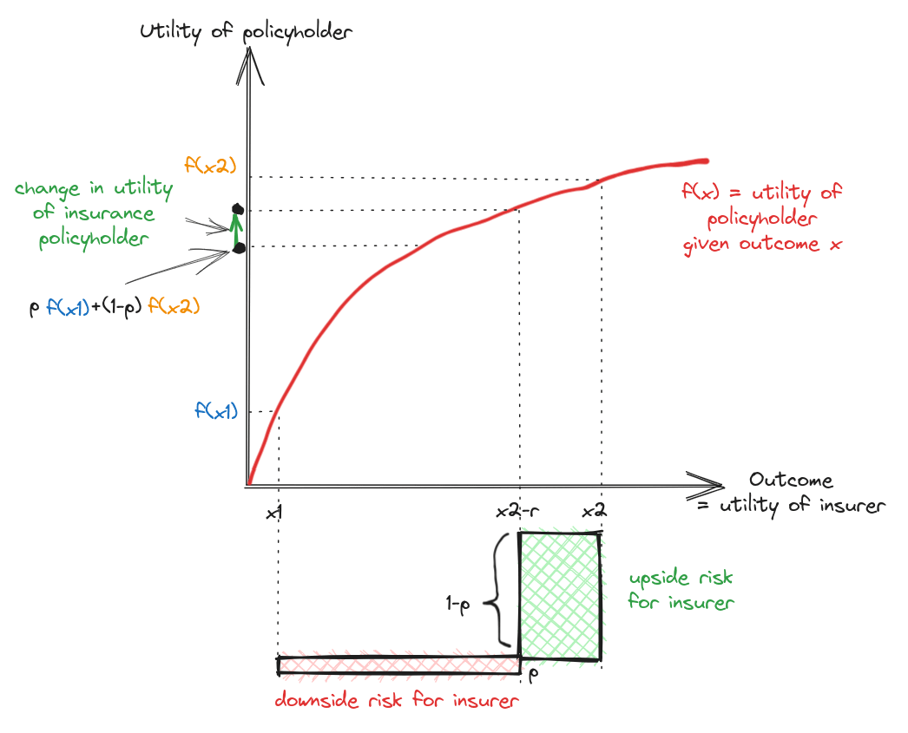
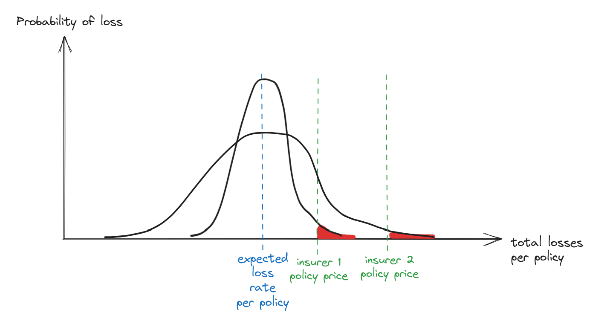
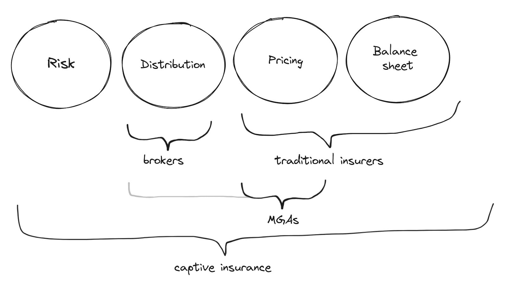

*We ([Flo](https://www.florencehinder.com/) & [Rudolf](https://www.lesswrong.com/users/l-rudolf-l)) spent a month fleshing out the idea of an insurance-for-AI company. We talked to 15 people in the insurance industry, and did 20 customer interviews. We decided not to continue, but we think it’s still a very promising idea and that maybe someone else should do this. This post describes our findings.*

# The idea

## Theory of change

To reduce AI risks, it would be good if we understood risks well, and if some organisation existed that could incentivise the use of safer AI practices. An insurance company that sells insurance policies for AI use cases has a financial incentive to understand concrete AI risks & harms well, because this feeds into its pricing. This company would also be incentivised to encourage companies to adopt safer AI practices, and could incentivise this by offering lower premiums in return. Like many cyber-insurance companies, it could also provide more general advice & consulting on AI-related risk reduction.

## Concrete path

TL;DR: Currently, professionals (e.g. lawyers) have professional indemnity (PI) insurance. Right now, most AI tools involve the human being in the loop. But eventually, the AI will do the work end-to-end, and then the AI will be the one whose mistakes need to be insured. Currently, this insurance does not exist. We would start with law, but then expand to all other forms of professional indemnity insurance (i.e. insurance against harms caused by a professional’s mistakes or malpractice in their work).

Frontier labs are not good customers for insurance, since their size means they mostly do not need external insurance, and have a big information advantage in understanding the risk.

Instead, we would target companies using LLMs (e.g. large companies that use specific potentially-risky AI workflows internally), or companies building LLM products for a specific industry.

We focused on the latter, since startups are easier to sell to. Specifically, we wanted a case where:

- LLMs were being used in a high-stakes industry like medicine or law
- there were startups building LLM products in this industry
- there is some reason why the AI might cause legal liability, for example:
- the LLM tools are sufficiently automating the work that the liability is plausibly on them rather than the humans
- AI exceptions in existing insurance policies exist (or will soon exist)
    

The best example we found was legal LLM tools. Law involves important decisions and large amounts of money, and lawyers can be found liable in legal malpractice lawsuits. LLMs are close to being able to do much legal work end-to-end; in particular, if the work is not checked by a human before being shipped, it is uncertain if existing professional indemnity (PI) insurance applies. People who work in law and law tech are also, naturally, very liability-aware.

Therefore, our plan was:

1. Become a managing general agent (MGA), a type of insurance company that does not pay claims out of its own capital (but instead finds a reinsurer to agree to pay them, and earns a cut of the premiums).
2. Design PI policies for AI legal work, and sell these policies to legal AI startups (to help them sell to their law firm customers), or directly to law firms buying end-to-end legal AI tools.
3. As more and more legal work is done end-to-end by AI, more and more of the legal PI insurance market is AI insurance policies.
4. As AI advances and AI insurance issues become relevant in other industries, expand to those industries (e.g. medicine, finance, etc.).
5. Eventually, most of the world’s professional indemnity insurance market (on the order of $10B-100B/year) has switched from insuring against human mistakes to insuring against AI mistakes.
6. Along the way, provide consulting services for countless businesses switching to AI-based work, helping them reduce the chance of harm, and incentivising this with lowered premiums.
7. Stay up-to-date on concrete AI risks, likely funding research focused on measuring it in the real-world. Also, for example the claims history that results will be an automatic, high-quality database of AI harms.
    

We thought this could be a multi-billion dollar company, a natural for-profit home for concrete AI risk research, and a reducer of existential risk from AI. 

# How insurance works

## Why insurance

Insurance is about cash-flow management. Sometimes, a low-probability accident happens, that either bankrupts the company or just puts an annoying dent in their accounting. If the expected value of such losses exceeded the company’s ability to pay, (competent) insurers would not be willing to sell the policy. But if it’s less, the company can benefit (by e.g. better weathering sudden shocks) by having insurance, and the insurer can make a profit in expectation.

Another way of describing the core function of insurance is as arbitrage between differently-locally-concave utility functions. Assume the policyholder faces a gamble between a good outcome $x_2$ and a bad outcome $x_1$. If the policyholder’s utility function is more concave than the insurer’s (for example, if it’s the red line below, while the insurer’s is just linear), then the policyholder cares less than the insurer about the difference between $x_2$ and $x_2$ minus the insurance premium rate $r$. If the policyholder's utility function is $f$, the policyholder’s utility change given insurance is a rise frmo $p f(x_1) + (1-p) f(x_2)$ (where $p$ is the chance of the bad outcome) to just always being $f(x_2 - r)$, while the insurer is exposed to upside risk $(1-p)r$ (green rectangle) and downside risk $p(x2-x1-r)$ (red rectangle). The flatter the policyholder’s utility function $f$ is around the $x_2-r$ to $x_2$ region compared to the region before that, the better this trade can be.

There are other benefits of insurance too:

- Contracts sometimes require one party to have insurance, usually so that the other party knows they can sue and recover damages if necessary.
- Reputational benefits (“you can trust us because we managed to get an insurer to!”)
- Infrastructure for handling claims/losses (insurance companies may have non-financial advantages in processing or evaluating claims, so it can be good to contract such functions out)
- Credible loss prevention advice (“we’re not just a consultancy - our money is also on the line here, and therefore trust us when we tell you to do X”)
- Credible pricing of harms (similar to the above)
    

## Capital efficiency in insurance comes from scale

Insurance depends on scale because of the [central limit theorem](https://en.wikipedia.org/wiki/Central_limit_theorem). As a simplified example, let’s say you’re an insurance company selling flood insurance. Assume you sell flood insurance policies for £100, and there’s a 10% chance that a flood happens and you need to pay out £600 (so the expected risk is £60). In expectation, you make £40 per policy. However, if you sell 10 policies, and suddenly 2 or more of them trigger, you’ve made revenue of £1000 but a loss of £1200 and you’re bankrupt (assume you don’t have cash reserves). There’s a ~26% chance of this happening ($\sum_{i=0}^{1} [\text{binomial pdf}_{p=0.1, n=10}(i)] \approx 0.26$). However, if you sold 100 policies, the probability that 2 or more in every set of 10 triggers is only 0.2% ($\sum_{i=0}^{19} [\text{binomial pdf}_{p=0.1,n=100}(i)] \approx 0.002$).

Therefore, even if the expected loss is the same between two insurers, assuming the same risk tolerance (a red area), the insurer with more policies is exposed to less variance in expected loss per policy and can set a lower price:

Therefore, the way you achieve good capital efficiency in insurance is to sell many policies across many different types of risk (ideally uncorrelated ones - so not just flood policies, which might all trigger in the case of rising seas, but diverse types of risks). 

However, in practice the balance sheets and the actual selling of the insurance products are not very tightly coupled in the insurance industry. You do not have to be a company with huge policy scale, you just have to work with such a company (for example, by becoming an MGA - see below).

## The insurance industry is complicated and allows for startups

The straightforward consequence of the above incentive is that you get monopoly effects in insurance, where one firm achieves the largest balance sheet and then beats everyone else on price (or pushes everyone else into a daredevil game where they’re more likely to blow up than the big one is).

To some extent, this has happened. However, there’s a separate dynamic too. To quote from a [blog post](https://www.felixstocker.com/blog/broking) by Felix Stocker:

> “Most businesses, especially SMEs, buy their insurance from someone they know personally. Because it’s low on the list of priorities, but important to get right, the CEOs or CFOs responsible stick with people they trust - brokers that can answer questions, and be relied upon to bail them out in a tough spot. Personalities, not brands, are key. Because of this, the concept that best explains the structure of the insurance broking market is Dunbar’s Number - the idea that any one person can only hold a limited number of personal relationships. So each broker has up to about a hundred relationships - but no more than that. And since the end-customer relationship is owned by an individual broker, then the challenge becomes aggregating brokers, rather than the customers themselves.”

There are also many ways to bundle and unbundle the different components of insurance. Felix Stocker writes about this [here](https://www.felixstocker.com/blog/bundling). In brief:

A common starting point for insurance startups is to be MGAs (managing general agents), that handle pricing (and, sometimes, distribution - i.e. selling), but are backed by the balance sheet of a reinsurer. This would’ve been our approach too.

## General liability exceptions are key for new insurance products

There isn’t an insurance product for every niche risk, because companies often hold general liability insurance that covers basically anything.

However, general liability insurance often comes with exceptions. For example, professional liability (also called errors & omissions) is often left to a separate policy, and terrorism & war -related harms are excluded. Also, complicated new risks like cybersecurity have increasingly tended to get exceptions, and be left to specialised cyber policies.

Based on talking to insurance industry experts, we expect AI-related exceptions to general liability and professional indemnity insurance to be coming. In the meantime, the need for them seems somewhat complex and subtle.

# Our ideas for pricing risk

We were loosely inspired by [Epoch’s “Direct Approach”](https://www.lesswrong.com/posts/hqDfsYTftQGr4eM4H/now-this-is-forecasting-understanding-epoch-s-direct) for forecasting human-level AI. Specifically, we’d make an argument of the form: if we can show that the outputs of the human and the AI are indistinguishable regarding some property (e.g. mistake rate as assessed by humans), then we should treat them as practically the same regarding related properties (e.g. the probability of causing a malpractice lawsuit).

Specifically, our guess for how to price legal professional indemnity insurance for an AI model/scaffold is:

1. Collect a bunch of legal documents created by the AI, and comparable documents created by the human.
2. Hire legal experts to assess the potentially-claim-causing mistake rate in the AIs’ and the humans’ work. (Note: legal experts cost over ~$10^2 per hour, so this would be fairly expensive)
3. Apply a fudge factor to the number of AI mistakes caught, on the assumption that humans are better (having had more practice) at catching human mistakes, and to account for unknown unknowns.
4. If the fudge factor times the AI claim-relevant mistake rate is lower than the humans’, offer the AI model’s outputs PI cover with the same rates as the relevant human PI for the same firm. If it’s higher, then either don’t offer it, or offer it at a fairly steep additional price, and probably with lower cover. Basically - price in the risk.

We would likely only go through this process if we had first done a more checkbox-style check of the AI workflow, including:

- Whether reasonable evaluations have been run
- Whether the AI’s access to protected information is reasonable (e.g. probably the AI should have zero access to customer X’s info while doing work for customer Y)
- The extent to which humans are in the loop or could intervene
- Susceptibility to prompt injection attacks (e.g. we might require companies to use something like [Lakera Guard](https://www.lakera.ai/lakera-guard))
- Vulnerability to model updates (e.g. if OpenAI drops a new version of GPT-4 that is worse at specific things, does your workflow switch to it immediately without checks, or have you hardcoded the GPT version number?)
    

We expect there is room for fancier technical solutions to evaluate risk probabilities. However, we caution that the size of a loss is almost entirely not about the AI, but instead about the context of the case: what legal work was being done, what harm the legal error resulted in in the real world, what the judge’s mood was when they were deciding the case (if it went to court), and so on. Even the probability of risk is only partly about the AI; it also depends, for example, on whether the client who received the bad advice decides to sue in the first place. This is why the core of our approach is side-stepping the problem of evaluating legal malpractice harms from scratch, and instead creating an argument for why the AI lawyer does not have more risk (or has some specific factor more risk) than the human lawyer. We effectively want to import the human lawyer claims history used for existing insurance pricing to the AI case.

We did not prioritise thinking of technical approaches to risk evaluation, because we thought much more of the risk was on the market size (thinking the opposite is perhaps the most common failure mode of tech-focused entrepreneurs). However, having a “magical” tech demo would probably be a good way to get your foot in the door. Showing you could’ve accurately predicted past failure rates might be the type of evidence that insurers care a lot about.

## Notes on professional indemnity insurance for law

- There isn’t a set of “cookie-cutter” templates that most claims fall into; it’s a diverse set.
- The split is roughly (taking a rough average over several sources):
	- 50% substantive claims (e.g. filing a motion in the wrong court, failing to raise a critical defense point, misapplying rules of evidence)
	- 30% administrative errors (e.g. missing a statute of limitations or court-ordered discovery deadline, forgetting to renew a client’s trademark, typos, filing documents for the wrong client, losing important documents, sending an email with confidential info to the wrong person, leaving sensitive documents visible on a desk, failing to properly redact info in public filings)
		- in particular, missing deadlines is a common one
		- many of these (e.g. missing deadlines, typos, and losing documents) seem like ones where AIs would be much lower
	- 10% client relation issues (e.g. settling a case without client approval, failing to disclose a past representation of an adverse party or a gift, not keeping the client informed, not explaining risks, failing to return calls or emails)
		- apart from some instruction-following or bad explanation -related harms, most of these seem far less applicable to AIs
	- 10% intentional wrongs (e.g. overbilling for work not performed, submitting false evidence, severe COI, selling information to a competitor, using confidentional info to benefit another client)
		- again, most of these are far less applicable to AIs

It seems reasonable that AI legal PI would therefore be even more tilted towards the substantive errors category than human lawyer PI.

# Relevant Stakeholders

Munich Re has an AI insurance team. [Here](https://www.munichre.com/content/dam/munichre/contentlounge/website-pieces/documents/MR_AI-Whitepaper-Insuring-Generative-AI.pdf/_jcr_content/renditions/original./MR_AI-Whitepaper-Insuring-Generative-AI.pdf) is their thinking on the state of the AI insurance market.

Orbital Witness, which accelerates legal due diligence in real estate, [built their own custom AI insurance product](https://tech.eu/2024/06/24/uk-legaltech-startup-orbital-witness-offers-world-first-ai-reliance-insurance-for-accuracy/) with a real estate insurer called First Title. 

We won’t share details about the situations of specific startups that we talked to.

# Findings

## Customer demand

Common reasons for customers not needing insurance for their AI use cases included:

- not working in a regulated or high-stakes domain
- there is a human in the loop all the time, so the AI is just a tool and existing PI will probably cover it - for now

We did find several AI-for-law companies that did want an AI-specific insurance policy. Notably, one of them had seen the need to [build their own custom insurance product](https://tech.eu/2024/06/24/uk-legaltech-startup-orbital-witness-offers-world-first-ai-reliance-insurance-for-accuracy/), working with a specialist insurer in their area (real estate law). Several complained about not finding an off-the-shelf solution, and were willing to pay immediately for an insurance policy that addressed their problem. However, in at least one case this was more of a formality required by a contract.

One theme in many customer conversations was that being financially compensated by insurance is not sufficient to make up for damages, because the real damage is to the reputation of the company in question. This is much harder to insure against. Insurance could help indirectly here (e.g. the fact that you were able to get insurance for your product is some evidence that whatever you’re selling doesn’t blow up too often).

Another theme in many customer conversations that people just aren’t thinking that much about AI risks or harms yet. We think this is a consequence of AIs not being deployed in high-stakes use cases. Many organisations are conservative in their applications of AI and choose to start implementing in low stakes domains, such as internal products and answering simple FAQ questions. Nobody wants to be the first company to have AI publicly fail. 

## Findings about insurance

The insurance industry is complicated. The legal industry is also complicated. Neither of us had any background in either. The lack of knowledge was generally fixable (thanks to Claude in particular), but the lack of relevant connections significantly slowed our momentum. Early-stage startup exploration is mostly driven by talking to potential customers. This was helped by the fact that we were mostly talking to AI product companies in these spaces, but still was slow going compared to both of our previous experiences getting customer interviews.

An MGA requires a reinsurer, and this takes a lot of time. This meant that, to get started, we would’ve needed not just customers, but a reinsurer. We did not find a reinsurer who was willing to work with us. If we had kept doing this, we would’ve talked to more reinsurers (perhaps starting with Allianz, who have previously reinsured a drone insurance product). The normal time for a new insuretech startup to get a reinsurer is on the order of 6-24 months.

The insurance industry moves slowly and carefully. This makes sense, since insurance companies that make rash and risky moves probably wouldn’t exist for very long. But it is still a very important cultural difference to, for example, the tech world.

Insurance is overwhelmingly about inductive, not deductive, evidence. Claims histories are the gold standard of evidence in the insurance world. If you don’t have a claims history, you will have a hard time.

Insurance is often reactive, and changes are driven by new types of big losses. The industry perks up and starts paying attention and figuring out how to deal with a given risk when a big loss happens related to that risk. In particular, once a big loss happens, lots of insurance actors will want to know how exposed they are to that type of risk, and either reduce exposure to that risk or make money by insuring against it.

Insurance for AI might only become something reinsurers care a lot about after a big event happens and causes harm.

The insurance industry is financially very large but does not have high valuations. Many insurance companies have extremely large revenues, but insurance companies are often valued at only a 1-3x multiple of their revenues (compared to 20x for tech companies). Allianz makes more revenue than Meta and has almost 10x the assets, but as of writing is valued at 1/10th of Meta.

Also, some vague things about insurance that struck us:

- Insurance is fundamentally on the financialization side of the financialization-v-building axis. Financialization is necessary in a complex world, but it’s perhaps harder to feel the hacker building ethos when that’s what you’re doing.
- At the claims stage, insurance is fundamentally adversarial: the claimant wants money, and the company is incentivised to not pay.
- Reducing someone’s exposure to risk [can lead](https://en.wikipedia.org/wiki/Moral_hazard) to them taking more risk.
    

# Cruxes

Our rough standard was that if we saw a path to getting a reinsurer onboard in clearly less than 6 months, we would start this company. We had several reasons for wanting to move fast:

- Moving fast is the key to building big impactful things.
- We felt our opportunity cost was high; in, say, a year of talking to reinsurers before being able to sign our first customer, we could’ve gotten far building something impactful that isn’t an insurance product.
- The rate of AI progress is high enough that things that move slowly might not have time to matter.
    

We also were bottlenecked by not having insurance industry connections. Insurance, as mentioned above, is a very network-based field. It is true that many insuretech founders do not have insurance backgrounds, but it is still critical that some industry expert is involved very early on in advisory capacity, and probably the first hire needs to be someone with deep insurance connections.

In summary, we think that insurance for AI is a great idea for a team that is less impatient, and has either more insurance connections or great willingness to find networks in insurance.

Former AIG (American Insurance Group) CEO Hank Greenberg once said: “All I want in life is an unfair advantage”. Someone who - unlike us - does have an unfair advantage in insurance may be able to run with this idea, build a great company, and reduce AI risk.

# Alternative approaches

## Labs / Big Tech as reinsurers

Insurance requires a large balance sheet to pay out claims from. The standard way to solve this is with a reinsurer. However, who else has a lot of capital, and (unlike reinsurers) a specific interest in AI? Foundation model labs (FMLs) and their Big Tech backers.

This could also simultaneously align FML incentives. Incentive-wise, the natural place to park AI risk is at the AI companies themselves. There are two levels of this:

1. When there are claims, an FML is involved in paying them out (directly or indirectly)
2. When there are claims, all FMLs are at least partly on the hook, because the claims are at least partly paid out from a shared pool of capital that all FMLs are involved in. (This creates an incentive among FMLs to care about the safety of the others, making safety tech sharing more likely, and making it easier for the industry to negotiate a slowdown if needed.)
    

Why might FMLs want to do this? It spreads the risk of things going wrong and incentivises finding errors in other companies’ models early on. It could increase public trust in AI as a whole, which will make adoption easier. In particular, most people don’t know the difference between the top FMLs and so see them as “AI companies.” If one AI company causes a large harm, the public is likely to associate it with AI companies in general. It also seems good, incentive-wise, that the companies driving a technology are the ones who are involved in insuring the risk.

Why might FMLs not want to do this? There are lots of incredibly good reasons. 

- There are many better uses of capital than parking it in some risk-free place where it can only be used as backing for an insurance product. This includes paying the employee salaries and compute costs that may enable these labs to build AGI and take over the entire economy and then the world - potentially a much higher-margin business than insurance.
- (If going for the more ambitious version, where all FMLs participate in paying out claims:) By increasing the trust in all FMLs, pooled insurance might reduce a given FML’s competitive edge. For example, that OpenAI and Microsoft offer their Copyright Shield product is a specific advantage for them.
- If it looks like insurance, or smells like insurance, or quacks like insurance, a horde of regulatory requirements immediately descend upon you. This makes a lot of sense; insurance is a very natural “picking up pennies in front of the steam roller” business. But FMLs understandably would prefer to not deal with this.
- It’s not their core competency, and companies generally do better when they stick to their core competency.
    

To try to get around these issues, we explored options for FML backing, including:

- FMLs / Big Tech simply partner with us, giving us credibility when we go to reinsurers.
- FMLs / Big Tech become reinsurers.
- FMLs / Big Tech create a captive insurance body. Captive insurance is when companies in a given industry get together to pool risks, allowing them some regulatory benefits over a normal reinsurer that deals with arbitrary risks, but also some limitations.
- FMLs / Big Tech enter into some complicated deals with reinsurers that makes it a better deal for them.

We soon reached the point where, with Claude-3.5 serving as our legal team, we were doodling increasingly complicated legal structure diagrams on whiteboards. Some of them were starting to look vaguely pyramid-shaped. That was a good place to leave it.

## Selling a risk model rather than an insurance policy

Why not leave the entire insurance industry to the existing insurance companies, and focus on what we really care about: modelling concrete AI risks?

An example of a company that sells risk models to insurance companies is [RMS](https://www.rms.com/) (now part of Moody’s, after changing ownership a few times). They were started in the late 1980s and specialised in natural catastrophe (“nat cat”) risk modelling. They had a technical moat: they were better at modelling things like synthetic hurricane populations than others.

The main disadvantage of such a route is that selling to insurance companies is very painful: they have slow procurement processes, mostly don’t understand technical details, and generally need to see a long track record of correct predictions before they buy. Venture capitalists are also unlikely to be interested in supporting such a company, since their growth rates are usually not stratospheric. For example, [RMS was sold](https://www.reuters.com/business/media-telecom/daily-mail-publisher-sell-insurance-unit-rms-moodys-2-bln-2021-08-05/) to Moody’s in 2021 for $2 billion, but only after almost 30 years in existence, and after already having been sold to Daily Mail along the way.

Might there be a market apart from insurance companies for a risk modelling product? Maybe, but this is unlikely. For natural catastrophe risks at least, insurance companies dominate risk modelling demand by sheer volume - they want updates all the time, whereas governments might want an update for planning purposes once every decade. Given how fast AI changes, though, there may be more actors who have a high rate of demand for risk models and updates on them.

## Should AI evaluation / auditing orgs do this?

We haven’t thought about this much, but an org with an AI evaluation/auditing background might be well-placed to move into the insurance (or risk-modelling) space.

# Acknowledgements

We’d like to thank Felix Stocker for lots of great advice on how things work in insuretech, Ed Leon Klinger for sharing his insurtech journey, Robert Muir-Woods for a very helpful chat about RMS, Otto Beyer for a valuable initial conversation about the insurance space, Jawad Koradia for helping us get initial momentum and introductions, Will Urquhart for talking with us about underwriting niche risks, the team at Entrepreneur First (in particular Kitty Mayo, Dominik Diak, and Jack Wiseman) for hosting much of our exploration and offering advice & introductions, and various people scattered across AI startups and the insurance industry for taking time to meet with us.