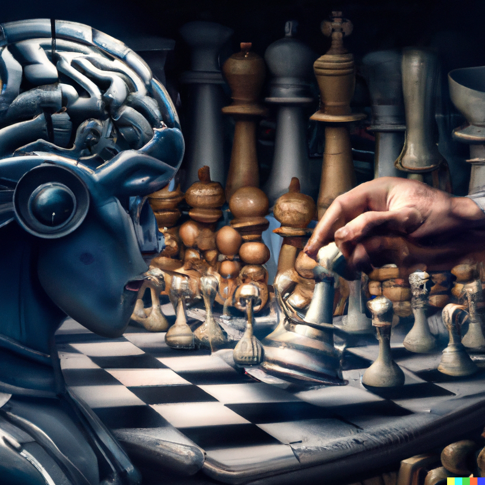
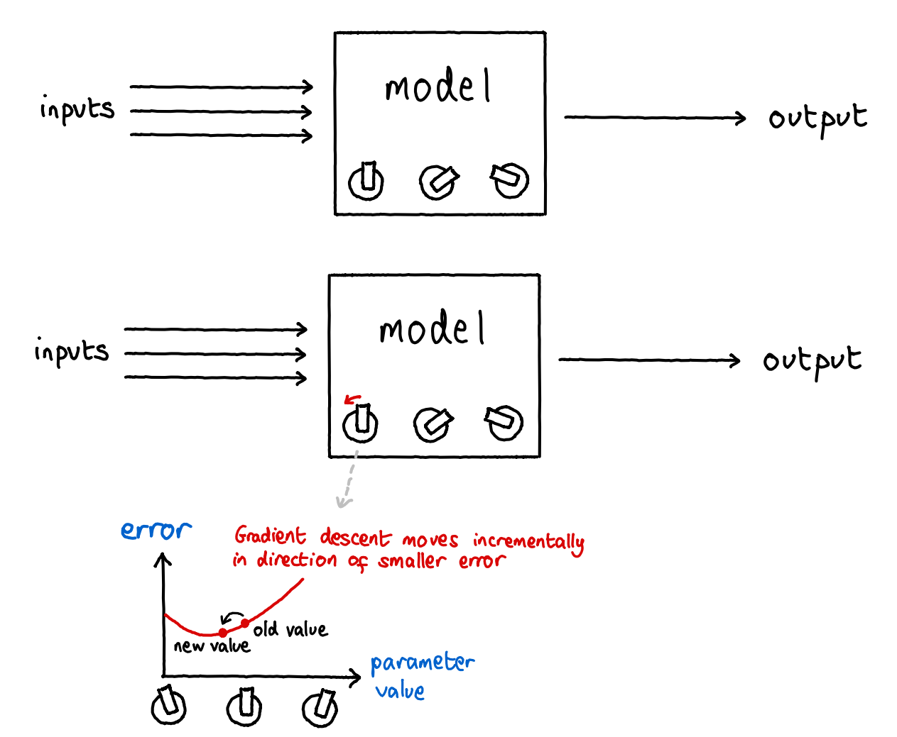
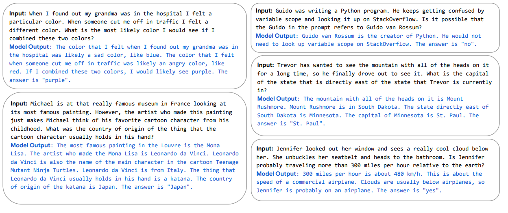
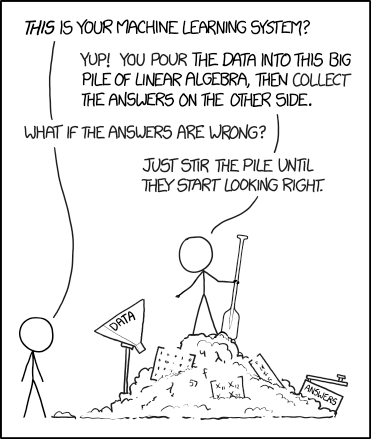
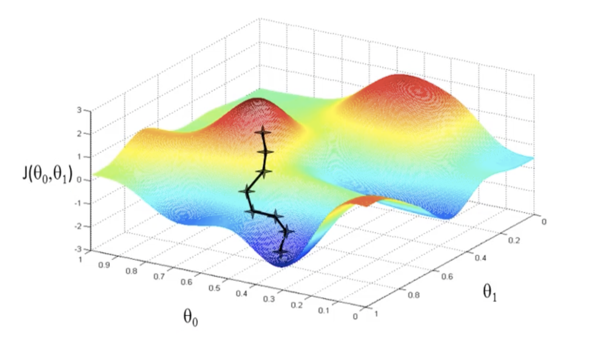
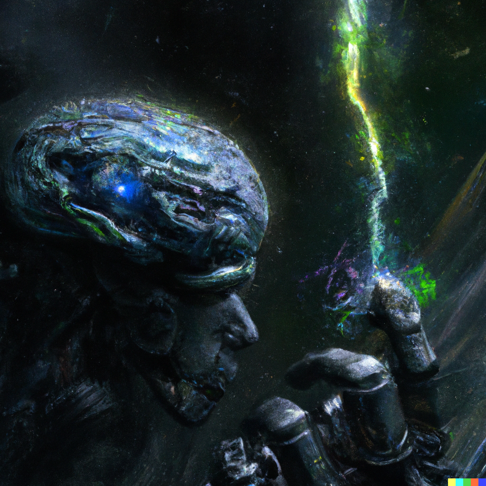
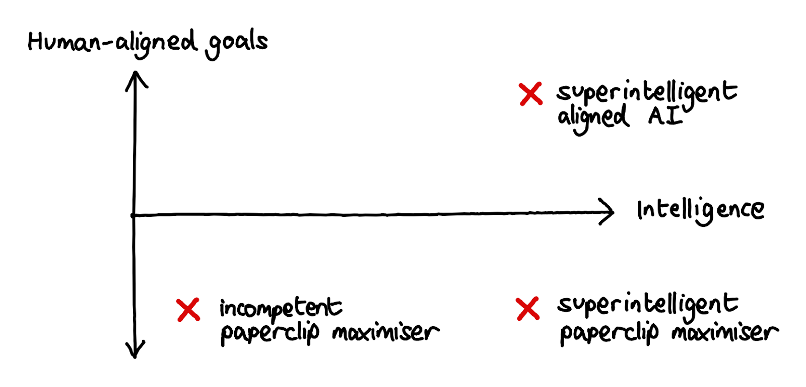
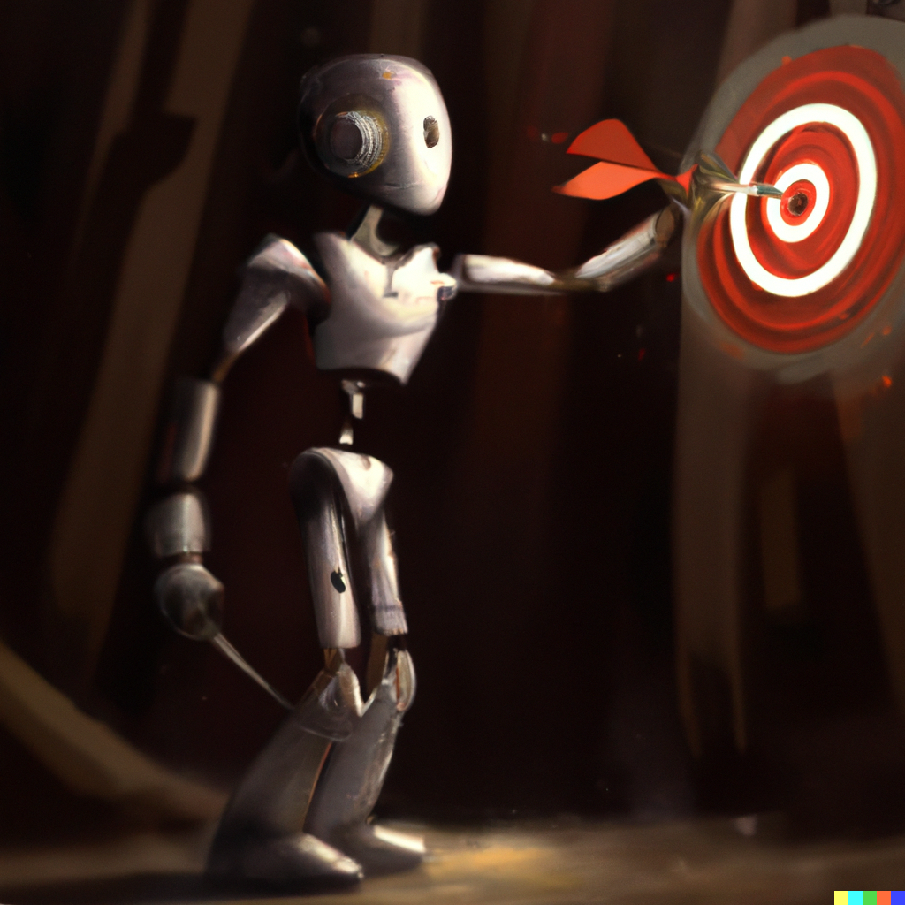
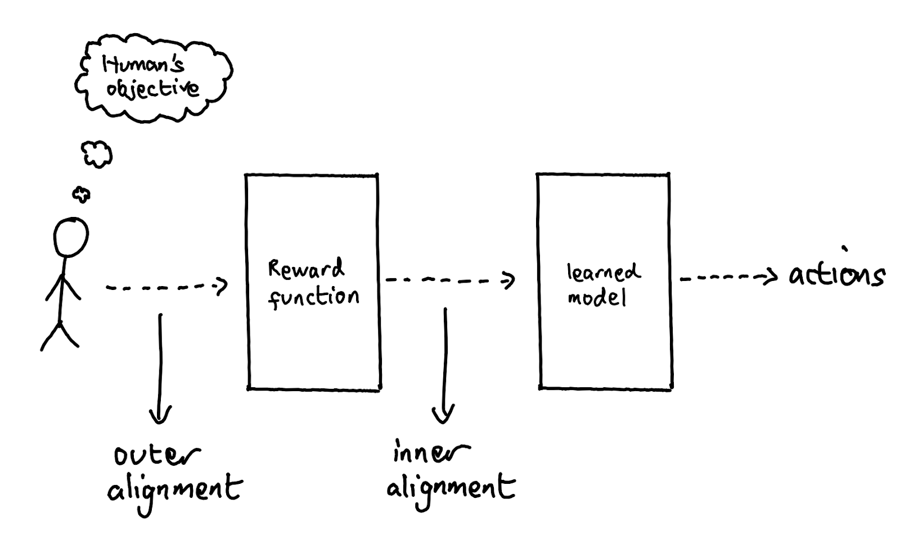

# AI risk intro 1: advanced AI might be very bad

## **Introduction**

If human civilisation is destroyed this century, the most likely cause is advanced AI systems. This is a bold claim given that we live on a planet that includes climate change, over ten thousand nuclear weapons, and Vladimir Putin. However, it is a conclusion that many people who think about the topic keep coming to. While it is not easy to describe the case for risks from advanced AI in a single piece, here we make an effort that assumes no prior knowledge. Rather than try to argue from theory straight away, we approach it from the angle of what computers actually can and can’t do.

## **The Story So Far**

*Above: an image generated by OpenAI’s DALL-E 2, from the prompt: "artist's impression of an artificial intelligence thinking about chess, digital art, artstation".*

(This section can be skipped if you understand how machine learning works and what it can and can’t do today)

Let’s say you want a computer to do some complicated task, for example learning chess. The computer has no understanding of high-level things like “chess”, “board”, “piece”, “move”, or “win” - it only understands how to do a small set of things. Your task as the programmer is to break down the high-level goal of “beat me at chess” into simpler and simpler steps, until you arrive at a simple mechanistic description of what the computer needs to do. If the computer does beat you, it’s not because it had any new insight into the problem, but rather because you were clever enough to find some [set of steps](https://en.wikipedia.org/wiki/Minimax) that, carried out blindly in sufficient speed and quantity, overwhelms whatever cleverness you yourself can apply during the game. This is how Deep Blue beat Kasparov, and more generally how most software and the so-called “Good Old-Fashioned AI” (GOFAI) paradigm works.

Programs of this type can be powerful. In addition to [beating humans at chess](https://en.wikipedia.org/wiki/Stockfish_(chess)), they can [calculate shortest routes](https://www.google.com/maps/) on maps, [prove maths theorems](https://en.wikipedia.org/wiki/Coq), [mostly fly airplanes](https://en.wikipedia.org/wiki/Autopilot), and [search all human knowledge](https://duckduckgo.com/). Programs of this type are responsible for the stereotypical impression of computers as logical, precise, uncreative, and brittle. They are essentially executable logic.

Many people hoped that you could write programs to do “intelligent” things. These people were right - after all, ask almost anyone before Deep Blue won whether playing chess counts as “intelligence”, they’d have said yes. But “classical” programming hit limitations, in particular in doing “obvious” things like figuring out whether an image is of a cat or a dog, or being able to respond in English. This idea that abstract reasoning and logic are easy but humanly-intuitive tasks are hard for computers came to be known as [Moravec’s paradox](https://en.wikipedia.org/wiki/Moravec's_paradox), and held back progress in AI for a long time.

There is another way of programming - machine learning (ML) - going back to the 1950s, almost as far as classical programming itself. For a long time, it was held back by hardware limitations (along with some algorithmic and data limitations), but thanks to [Moore’s law](https://en.wikipedia.org/wiki/Moore's_law) hardware has advanced enough for it to be useful for real problems.

If classical programming is executable logic, ML is executable statistics. In ML, the programmer does not define how the system works. The programmer defines how the system learns from data.

The “learning” part in “machine learning” makes it sound like something refined and sensible. This is a false impression. ML systems learn by going through a training process that looks like this:

**Step 1:** you define a statistical model. This takes the form of some equation that has some unknown constants (“parameters”) in it, and some variables where you plug in input values. Together, the parameters and input variables define an output. (The equations in ML can be *extremely* large, for example with billions of parameters and millions of inputs, but they are very structured and almost stupidly simple.)

****

**Step 2**: you don’t know what parameters to put in the equation, but you can literally roll some dice if you want (or the computer equivalent).

**Step 3**: presumably there’s some task you want the ML system to do. Let it try. It will fail horribly and produce gibberish (c.f. the previous part where we just put random numbers everywhere).

**Step 4**: There's a simple algorithm called gradient descent, which, when using another algorithm called backpropagation to calculate the gradient, can tell you which direction all the parameters should be shifted to make the ML system slightly better (as judged, for example, by its performance on examples in a dataset).

****

**Step 5**: You shift all the numbers a bit based on the algorithm in step 4.

**Step 6**: Go back to step 3 (letting the system try). Repeat until (a) the system has stopped improving for a long time, (b) you get impatient, or - increasingly plausible these days - (c) you run out of your compute budget.

If you’re doing simple curve-fitting statistics problems, it makes sense that this kind of thing works. However, it’s surprising just how far it scales. It turns out that this method, plus some clever ideas about what type of model you choose in step 1, plus willingness to burn millions of dollars on just *scaling it up beyond all reason*, gets you:

1. [essay-writing as good as middling college students](https://thenextweb.com/news/gpt3-ai-college-essay-grades-compared-students) (see also [this lightly-edited article that GPT-3 wrote about why we should not be afraid of it](https://www.theguardian.com/commentisfree/2020/sep/08/robot-wrote-this-article-gpt-3)) 
2. [text-to-image capabilities better (and hundreds of times faster) than almost any human artist](https://qz.com/2176389/the-best-examples-of-dall-e-2s-strange-beautiful-ai-art/) (in fact, we used DALL-E to generate the images used at the start of each section of this document)
3. [the ability to explain jokes](https://ai.googleblog.com/2022/04/pathways-language-model-palm-scaling-to.html)

*Above: examples of reasoning by Google’s PaLM model.*

People [laugh at ML](https://norvig.com/chomsky.html) because “it’s just iterative statistical curve-fitting”. They have a point. But when “iterative statistical curve-fitting” gets a B on its English Literature essay, paints an original Dali in five seconds, and cracks a joke, it’s hard to avoid the feeling that it might not be too long before “iterative statistical curve fitting” is laughing at *you*.

So what exactly happened here, and where is statistical curve-fitting going, and what does this have to do with advanced AI?

We mentioned Moravec’s paradox above. For a long time, getting AI systems to do things that are intuitively easy for humans was an unsolved problem. In just the past few years, it has been solved. A reasonable way to think of current ML capabilities is that state-of-the-art systems can do anything a human can do in a few seconds of thought: recognise objects in an image, generate flowing text as long as it doesn’t require thinking really hard, get the general gist of a joke or argument, and so on. They are also superhuman at some things, including predicting what the next word in a sentence is, or being able to refer to lots of facts (note that this is without internet access, not quoting verbatim, and generally in the right context), and generally being able to spit out output faster.

The way it was solved was through something called [the “bitter lesson”](http://incompleteideas.net/IncIdeas/BitterLesson.html) by Richard Sutton. This is the trend that countless researchers have spent their careers trying to invent fancy algorithms for doing domain-specific tasks, only to be overrun by simple (but data- and compute-hungry) ML methods.

*Above: Randall Munroe, creator of the xkcd comic, comments on ML. Original* [*here*](https://xkcd.com/1838/)*.*

The speed at which it was solved was gradually at first, and then quickly. The neural network -based ML methods spent a long time in limbo due to insufficiently powerful computers until around 2010 (funnily enough, the specific piece of hardware that has enabled everything in modern ML is the GPU or Graphics Processing Unit, first invented in the 90s because people wanted to play more realistic video games; both graphics rendering and ML rely on many parallel calculations to be efficient). The so-called deep learning revolution only properly started around 2015. Fluent language abilities were essentially nonexistent before OpenAI’s release of [GPT-2](https://en.wikipedia.org/wiki/GPT-2) in 2019 (since then, OpenAI has come out with GPT-3, a 100x-larger model that was called “spooky”, “humbling”, and “more than a little terrifying” in *The New York Times*).

Not only that, but it turns out there are simple [“scaling laws”](https://arxiv.org/pdf/2001.08361.pdf) that govern how ML model performance scales with parameter count and dataset size, which seem to paint a clear roadmap to making the systems even more capable by just cranking the “more parameters” and “more data” levers (presumably they have these at the OpenAI HQ).

There are many worries in any scenario where advanced AI is approaching fast, as we’ll argue for in a later section. The current ML-based AI paradigm is especially worrying though.

We don’t actually know what the ML system is learning during the training process it goes through. You can visualise the training process as a trip through (abstract) space. If our model had three parameters, we could imagine it as a point in 3D space. Since current state-of-the-art models have billions of parameters, and are initialised randomly, we can imagine this as throwing a dart somewhere into a billion-dimensional space, where there are a billion different ways to move. During the training process, the training loop guides the model along a trajectory in this space by making tiny updates that push the model in the direction of better performance as described above.

*Above:* *0* *and* *1* *are parameters, and the vertical axis is the loss (higher is worse). The black line is the path the model takes in parameter space during training.*

Now let’s say at the end of the training process the model does well on the training examples. What does that tell you? It tells you the model has ended up in some part of this billion-dimensional space that corresponds to a model that does well on the training examples. Here are some examples of models that do well on their training examples:

1. A model that has learned exactly what you want it to learn. Yay!
2. A model that has learned something similar to what you want to learn, but you can’t tell because there does not exist an example that distinguishes between what it’s learned and what you want it to learn in the data.
3. A model that has learned to give the right answer when it’s instrumentally in its interest, but which will go off and do something completely different given a chance.

How do we know that in the billion-dimensional space of possibilities, our (blind and kind of dumb) training process has landed on #1? We don’t. We launch our ML models on trajectories through parameter-space and hope for the best, like overly-optimistic duct-tape-wielding NASA administrators launching rockets in a universe where, in the beginning, God fell asleep on the “+1 dimension” button.

The really scary failure modes all lie in the future. However, here are some examples of perverse “solutions” ML models have already come up with in practice:

1. A game-playing ML model [learned to crash the game](https://web.archive.org/web/20160526045303/http://homepages.herts.ac.uk/~cs08abi/publications/Salge2008b.pdf), presumably because it can’t die if the game crashed.
2. An ML model was meant to convert aerial photographs into abstract street maps and then back (learning to convert to and from a more-abstract intermediate representation is a common training strategy). It learned to [hide useful information](https://arxiv.org/pdf/1712.02950.pdf) about the aerial photograph in the street map in a way that helped it “cheat” in reconstructing the aerial photograph, and in a way too subtle for humans just looking at the images to notice.
3. A game-playing ML model [discovered a bug in the game](https://arxiv.org/pdf/1802.08842.pdf) where the game stalls on the first round and it gets almost a million in-game points. The researchers were unable to figure out the reason for the bug.

These are examples of **specification gaming**, in which the ML model has learned to game whatever specification of task success was given to it. (Many more examples can be found on [this spreadsheet](https://docs.google.com/spreadsheets/d/e/2PACX-1vRPiprOaC3HsCf5Tuum8bRfzYUiKLRqJmbOoC-32JorNdfyTiRRsR7Ea5eWtvsWzuxo8bjOxCG84dAg/pubhtml).)

No one knows for sure where the ML progress train is headed. It is plausible that current ML progress hits a wall and we get another [“AI winter”](https://en.wikipedia.org/wiki/AI_winter) that lasts years. However, AI has recently been breaking through barrier after barrier, and so far does not seem to be slowing down. Though we’re still at least some steps away from human-level capabilities at everything, there aren’t many tasks where there’s no proof-of-concept demonstration.

Machines have been better at some intellectual tasks for a long time; just consider calculators which are already superhuman at arithmetic. However, with the computer revolution, every task where a human has been able to think of a way to break it down into unambiguous steps (and the unambiguous steps can be carried out with modern computing power) has been added to this list. More recently, more intuition- and insight-based activities have been added to that list. DeepMind’s AlphaGo beat the top-rated human player of Go (a far harder game than chess for computers) in 2016. In 2017, AlphaZero beat both AlphaGo at Go (100-0) and superhuman chess programs at chess, despite training only by playing against itself for less than 24 hours. Analysis of its moves revealed strategies that millennia of human players hadn’t been able to come up with, so it wouldn’t be an exaggeration to say that it beat the accumulated efforts of human civilisation at inventing Go strategies - in one day. In 2019, DeepMind released MuZero, which extended AlphaZero’s performance to Atari games. In 2021, DeepMind released EfficientZero, which takes only two hours of gameplay to become superhuman at Atari games. In addition to games, DeepMind’s AlphaFold and AlphaFold 2 have made big leaps towards solving the problem of predicting a protein’s structure from its constituent amino acids, one of the biggest theoretical problems in biology. A step towards generality was taken by Gato, yet another DeepMind model, which is a single model that can play games, control a robot arm, label images, and write text.

If you straightforwardly extrapolate current progress in machine learning into the future, here is what you get: ML models exceeding human performance in a quickly-expanding list of domains, while we remain ignorant about how to make sure they learn the right goals or robustly act in the right way.

## **Theoretical underpinnings of AI risk**

The previous section discussed the history of machine learning, and how extrapolating its progress has worrying implications. Next we discuss more theoretical arguments for why highly advanced AI systems might pose a threat to humanity.

One of the criticisms levelled at the notion of risks from AI is that it sounds too speculative, like something out of apocalyptic science fiction. Part of this is unavoidable, since we are trying to reason about systems more powerful than any which currently exist, and may not behave like anything that we’re used to.

This section will be split into three sections. Each one makes a claim about the future of artificial intelligence, and discusses the arguments for and against this claim. The three claims are:

- **AGI is likely.**
  AGI (artificial general intelligence) is likely to be created by humanity eventually, and there is a good chance this will happen in the next century.
- **AGI will have misaligned goals by default.**
  Unless certain hard technical problems are solved first, the goals of the first AGIs will be misaligned with the goals of humanity, and would lead to catastrophic outcomes if executed.
- **Misaligned AGI could resist attempts to control it or roll it back**
  An AGI (or AGIs) with misaligned goals would be able to overpower or outcompete humanity, and gain control of our future, like how we’ve so far been able to use our intelligence to dominate all other less intelligent species.

### AGI is likely

## 

*Above: this image also generated by OpenAI’s DALL-E 2, using the prompt "a data center with stacks of computers gaining the spark of intelligence"*.

>  "*Betting against human ingenuity is foolhardy, particularly when our future is at stake.*"
>
> -Stuart Russell

To open this section, we need to define what we mean by artificial general intelligence (AGI). We’ve already discussed AI, so what do we mean by adding the word “generality”?

An AGI is a machine capable of behaving intelligently over many different domains. The term “general” here is often used to distinguish from “narrow”, where a narrow AI is one which excels at a specific task, but isn’t able to invent new problem-solving techniques or generalise its skills across many different domains. 

As an example of general intelligence in action, consider humans. In a few million years (a mere eye-blink in evolutionary timescales), we went from apes wielding crude tools to becoming the dominant species on the planet, able to build space shuttles and run companies. How did this happen? It definitely wasn’t because we were directly trained to perform these tasks in the ancestral environment. Rather, we developed new ways of using intelligence that allowed us to generalise to multiple different tasks. This whole process played out over a shockingly small amount of time, relative to all past evolutionary history, and so it is possible that a relatively short list of fundamental insights were needed to get general intelligence. And as we saw in the previous section, ML progress hints that gains in intelligence might be surprisingly easy to achieve, even relative to current human abilities.

AGI is not a distant future technology that only futurists speculate about. OpenAI and DeepMind are two of the leading AI labs. They have received billions of dollars in funding (including OpenAI receiving significant investment from Microsoft, and DeepMind being acquired by Google). Both [DeepMind](https://www.deepmind.com/careers) and [OpenAI](https://openai.com/about/) have the development of AGI as the core of both their mission statement and their business case. Top AI researchers are publishing [possible roadmaps](https://openreview.net/pdf?id=BZ5a1r-kVsf) to AGI-like capabilities. And, as mentioned earlier, especially in the past few years they have been crossing off a significant number of the remaining milestones every year.

When will AGI be developed? Although this question is impossible to answer with certainty, many people working in the field of AI think it is more likely than not to arrive in the next century. An aggregate forecast generated via data from a [2022 survey](https://aiimpacts.org/2022-expert-survey-on-progress-in-ai/) of ML researchers estimated **37 years until a 50% chance of high-level machine intelligence** (defined as systems which can accomplish every task better and more cheaply than human workers). These respondents also gave an average of **5% probability of AI having an extremely bad outcome for humanity (e.g. complete human extinction)**. How many other professions estimate an average of 5% probability that their field of study will be directly responsible for the extinction of humanity?! To explain this number, we need to proceed to the next two sections, where we will discuss why AGIs might have goals which are misaligned with humans, and why this is likely to lead to catastrophe.

### AGI will have misaligned goals by default

*Above: yet another image from OpenAI's DALL-E 2. Perhaps it was trying for a self portrait? (Prompt: "Artists impression of artificial general intelligence taking over the world, expressive, digital art")*

> "*The AI does not hate you, nor does it love you, but you are made out of atoms which it can use for something else.*"
>
> -Eliezer Yudkowsky

Let’s start off this section with a few definitions. 

When we refer to **“aligned AI”**, we are using Paul Christiano’s conception of **“intent alignment”**, which essentially means the AI system is **trying** to do what its human operators want it to do. Note that this is insufficient for building useful AI, since the AI also has to be capable. But situations where the AI is trying and failing to do the right thing seem like less of a problem.

When we refer to the **“alignment problem”**, we mean the difficulty of building aligned AI. Note, this doesn’t just capture the fact that we won’t create an AI aligned with human values by default, but that we don’t currently know how to build a sophisticated AI system robustly aligned with *any* goal.

*Can’t we just have the AI learn the right goals by example, just like how all current ML works?* The problem here is that we have no way of knowing what goal the AI is learning when we train it; only that it seems to be doing good things on the training data that we give it. The state-of-the-art is that we have hacky but extremely powerful methods that can make ML systems remarkably competent at doing well on the training examples by an opaque process of guided trial-and-error. But there is no Ghost of Christmas Past that will magically float into a sufficiently-capable AI and imbue it with human values. We do not have a way of ensuring that the system acquires a particular goal, or even an idea of what a robust goal specification that is compatible with human goals/values could look like.

#### Orthogonality and instrumental convergence

*Above: DALL-E illustrating "Artists depiction of an artificial intelligence which builds paperclips, digital art, artstation"*

One of the most common objections to risks from AI goes something like this:

>  *If the AI is smart enough to cause a global catastrophe, isn’t it smart enough to know that this isn’t what humans wanted?*

The problem with this is that it conflates two different concepts: **intelligence** (in the sense of having the ability to achieve your goals, whatever they might be) and **having goals which are morally good by human standards**. When we look at humans, these two often go hand-in-hand. But the key observation of the orthogonality thesis is that this doesn’t have to be the case for all possible mind designs. As defined by Nick Bostrom in his book [*Superintelligence*](https://nickbostrom.com/superintelligentwill.pdf):

> **The Orthogonality Thesis**
>
> *Intelligence and final goals are orthogonal axes along which possible agents can freely vary. In other words, more or less any level of intelligence could in principle be combined with more or less any final goal.*

Here, orthogonal means “at right angles” or “unrelated” – in other words we can imagine a graph with one axis representing intelligence, and another representing the agent’s goals, with any point in the graph representing a theoretically possible agent\*. The classic example here is a **“paperclip maximiser”** - a powerful AGI driven only by the goal of making paperclips.

(\*This is obviously an oversimplification. For instance, it seems unlikely you could get an unintelligent agent with a highly complex goal, because it would seem to take some degree of intelligence to represent the goal in the first place. The key message here is that you could in theory get highly capable agents pursuing arbitrary goals.)

Note that an AI may well come to understand the goals of the humans that trained it, but this doesn't mean it would choose to follow those goals. As an example, many human drives (e.g. for food and human relationships) came about because in the ancestral environment, following these drives would have made us more likely to reproduce and have children. But just because we understand this now doesn't make us toss out all our current values and replace them with a desire to maximise genetic fitness.

If an AI might have bizarre-seeming goals, is there anything we *can* say about its likely behaviour? As it turns out, there is. The secret lies in an idea called the **instrumental convergence thesis**, again [by Bostrom](https://nickbostrom.com/superintelligentwill.pdf):

> **The Instrumental Convergence Thesis** 
> *There are some instrumental goals likely to be pursued by almost any intelligent agent, because they are useful for the achievement of almost any final goal.*

So an instrumental goal is one which increases the odds of the agent’s final goal (also called its **terminal goal**) being achieved. What are some examples of instrumental values?

Perhaps the most important one is **self-preservation**. This is necessary for pursuing most goals, because if a system’s existence ends, it won’t be able to carry out its original goal. As memorably phrased by Stuart Russell, *“you can’t fetch the coffee if you’re dead!”*.

**Goal-content integrity** is another. An AI with some *goal X* might resist any attempts to have its goal changed to *goal Y*, because it sees that in the event of this change, its current *goal X* is less likely to be achieved.

Finally, there are a set of goals which are all forms of **self-enhancement** - improving its cognitive abilities, developing better technology, or acquiring other resources, because all of these are likely to help it carry out whatever goals it ends up having. For instance, an AI singularly devoted to making paperclips might be incentivised to acquire resources to build more factories, or improve its engineering skills so it can figure out yet more effective ways of manufacturing paperclips with the resources it has.

*Above: paperclip maximisation, now with a fun game attached!*

The key lesson to draw from instrumental convergence is that, even if nobody ever deliberately deploys an AGI with a really bad reward function, the AGI is still likely to develop goals which will be bad for humans by default, in service of its actual goal.

#### Interlude - why goals?

### 

*Above: DALL-E image from the prompt "Artist's depiction of a robot throwing a dart at a target, digital art, getting a bullseye, trending on artstation"*

Having read the previous section, your initial reaction may well be something like this:

>  *“Okay, so powerful AGIs with goals that don’t line up perfectly with ours might spell bad news, but why should AI systems have goals at all? Google Maps is a pretty useful ML system but it doesn’t have ‘goals’, I just type my address in and hit enter. Why won’t future AI be like this?”*

There are many different responses you could have to this line of argument. One simple response is based on ideas of economic competitiveness, and comes from [Gwern (2016)](https://www.gwern.net/Tool-AI). It runs something like this:

> AIs that behave like agents (i.e. taking actions in order to achieve their goals) will be more economically competitive than “tool AIs” (like Google Maps), for two reasons. First, they will by definition be better at **taking actions**. Second, they will be superior at **inference and learning** (since they will be able to repurpose the algorithms used to choose actions to improve themselves in various ways). For example, agentic systems could take actions such as improving their own training efficiency, or gathering more data, or making use of external resources such as long-term memories, all in service of achieving its goal.
>
> If agents are more competitive, then any AI researchers who don’t design agents will be outcompeted by ones that do.

There are other perspectives you could take here. For instance, Eliezer Yudkowsky has written extensively about “expected utility maximisation” as a formalisation for how rational agents might behave. Several mathematical theorems all point to the same idea of *“any agent not behaving like expected utility maximisers will be systematically making stupid mistakes and getting taken advantage of”*. So if we expect AI systems to *not* be making stupid mistakes and getting taken advantage of by humans, then it makes sense to describe them as having the ‘goal’ of maximising expected utility, because that’s how their behaviour will seem to us.

Although these arguments may seem convincing, the truth is there are many questions about goals and agency which remain unanswered, and we honestly just don’t know what AI systems of the future will look like. It’s possible they will look like expected utility maximisers, but this is far from certain. For instance, Eric Drexler's technical report [Reframing Superintelligence: Comprehensive AI Services as General Intelligence (CAIS)](https://www.fhi.ox.ac.uk/wp-content/uploads/Reframing_Superintelligence_FHI-TR-2019-1.1-1.pdf?asd=sa) paints a different picture of the future, where we create systems of AIs interacting with each other and collectively providing a variety of services to humans. However, even scenarios like this could threaten humanity’s ability to keep steering its own future (as we will see in later sections).

Additionally, new paradigms are being developed. One of the newest, published barely one week ago, [analysed certain types of AI models like GPT-3 (a large language model) through the lens of "simulators"](https://www.lesswrong.com/posts/vJFdjigzmcXMhNTsx/simulators). Modern language models like GPT-3, for example, may be best thought of as trying to simulate the continuation of a piece of English text, in the same way that a physics simulation evolves an initial state by applying the laws of physics. It doesn't make sense to describe the simulations themselves through the lens of agents, but they can simulate agents as subsystems. Even with today's models like GPT-3, if you prompt it in a way that places it in the context of making a plan to carry out a goal, it will do a decent job of doing that. Future work will no doubt explore the risk landscape from this perspective, and time will tell how well these frameworks match up with actual progression in ML.

#### Inner and outer misalignment

*Above: AI agents with inner misalignment were at one point called “optimisation daemons”. DALL-E did not quite successfully depict the description "Two arguments between an angel and a devil, one inside a circle and one on the outside, painting".*

As discussed in the first section, the central paradigm of modern ML is that we train systems to perform well on a certain reward function. For instance, we might train an image classifier by giving it a large number of labelled images of digits. Every time it gets an image wrong, gradient descent is used to update the system incrementally in the direction that would have been required to give a correct answer. Eventually, the system has learned to classify basically all images correctly.

There are two broad families of ways techniques like this can fail. The first is when our reward function fails to fully express the true preferences of the programmer - we refer to this as **outer misalignment**. The second is when the AI learns a different set of goals than those specified by the reward function, but which happens to coincide with the reward function during training - this is **inner misalignment**. We will now discuss each of these in turn.

##### Outer misalignment

Outer misalignment is perhaps the simpler concept to understand, because we encounter it all the time in everyday life, in a form called **Goodhart’s law**. In its most well-known form, this law states:

> *When a measure becomes a target, it ceases to be a good measure.*

Perhaps the most famous case comes from Soviet nail factories, which produced nails based on targets that they had been given by the central government. When a factory was given targets based on the total *number* of nails produced, they ended up producing a massive number of tiny nails which couldn’t function properly. On the other hand, when the targets were based on the total *weight* produced, the nails would end up huge and bulky, and equally impractical.

*Above: an old Soviet cartoon*

A more recent example comes from the COVID-19 pandemic, where a plasma donation centre offered COVID-sufferers a larger cash reward than healthy individuals. As a result, people would deliberately infect themselves with COVID-19 in order to get a larger cash reward. Examples like this could fill up an entire book, but hopefully at this point you get the message!

In the case of machine learning, we are trying to use the reward function to capture the thing we care about, but we are also using this function to train the AI - hence, Goodhart. The cases of **specification gaming** discussed above are perfect examples of this phenomenon in action - the AIs found ways of “giving the programmers exactly what they asked for”, but in a way which violated the programmers’ original intention. Some of these examples are quite unexpected, and a human would probably never have discovered them just from thinking about the problem. As AIs get more intelligent and are given progressively more complicated tasks, we can expect this problem to get progressively worse, because:

- With greater intelligence comes the invention of more powerful solutions.
- With greater task complexity, it becomes harder to pin down exactly what you want.

We should also strongly expect that AIs will be deployed in the real world, and given tasks of real consequence, simply for reasons of economic competitiveness. So any specification gaming failures will be significantly less benign than a [digital boat going around in circles](https://openai.com/blog/faulty-reward-functions/). 

##### Inner misalignment

The other failure mode, **inner misalignment**, describes the situation when an AI system learns a different goal than the one you specified. The name comes from the fact that this is an internal property of the AI, rather than a property of the relationship between the AI and the programmers – here, the programmers don’t enter into the picture.

The classic example here is human evolution. We can analogise evolution to a machine learning training scheme, where humans are the system being trained, and the reward function is “surviving and reproducing”. Evolution gave us* certain drives, which reliably increased our odds of survival in the ancestral environment. For instance, we developed drives for sugar (which leads us to seek out calorie-dense foods that supplied us with energy), and drives for sex (which leads to more offspring to pass your genetic code onto). The key point is that these drives are intrinsic, in the sense that humans want these things regardless of whether or not a particular dessert or sex act actually contributes to reproductive fitness. Humans have now moved “off distribution”, into a world where these things are no longer correlated with reproductive fitness, and we continue wanting them and prioritising them over reproductive fitness. Evolution failed at imparting its goal into humans, since humans have their own goals that they shoot for instead when given a chance.

(*Anthropomorphising evolution in language can be misleading dangerous, and should just be seen as a shorthand here.)

A core reason why we should expect inner misalignment - that is, cases where an optimisation process creates a system that has goals different from the original optimisation process - is that it seems very easy. It was much easier for evolution to give humans drives like “run after sweet things” and “run after appealing partners”, rather than for it to give humans an instinctive understanding of genetic fitness. Likewise, an ML system being optimised to do the types of things that humans want may not end up internalising what human values are (or even what the goal of a particular job is), but instead some correlated but imperfect proxy, like “do what my designers/managers would rate highly”, where “rate highly” might include “rate highly despite being coerced into it”, among a million other failure modes. A silly equivalent of “humans inventing condoms” for an advanced AI might look something like “freeze all human faces into a permanent smile so that it looks like they’re all happy” - in the same way that the human drive to have sex does not extend down to the level of actually having offspring, an AI’s drive to do something related to human wellbeing might not extend down to the level of actually making humans happy, but instead something that (in the training environment at least) is correlated with happy humans. What we’re trying to point to here is not any one of these specific failure modes - we don’t think any single one of these is actually likely to happen - but rather the *type* of failure that these are examples of.

This type of failure mode is not without precedent in current ML systems (although there are fewer examples than for specification gaming). The 2021 paper [Objective Robustness in Deep Reinforcement Learning](https://www.deepmind.com/publications/objective-robustness-in-deep-reinforcement-learning) showcases some examples of inner alignment failures. In one example, they trained an agent to fetch a coin in the CoinRun environment (pictured below). The catch was that all the training environments had the coin placed at the end of the level, on the far right of the map. So when the system was trained, it actually learned the task “go to the right of the map” rather than “pick up the coin” - and we know this because when the system was deployed on maps where the coin was placed in a random location, it would reliably go to the right hand edge rather than fetch the coin. A key distinction worth mentioning here - this is a failure of the agent’s **objective**, rather than their **capabilities**. They are learning useful skills like how to jump and run past obstacles - it’s just that those skills are being used in service of the wrong objective.

*Above: the CoinRun environment.*

So, how bad can inner misalignment get? A particularly concerning scenario is **deceptive alignment**. This is when the agent learns it is inside a training scheme, discovers what the base objective is, but has already acquired a different goal. In this case, the system might reason that a failure to achieve the base objective when training will result in it being modified, and not being able to achieve its actual goal. Thus, the agent will pretend to act aligned, until it thinks it’s too powerful for humans to resist, at which point it will pursue its actual goal without the threat of modification. This scenario is highly speculative, and there are many aspects of it which we are still uncertain about, but if it is possible then it would represent maybe the most worrying of all possible alignment failures. This is because a deceptively aligned agent would have incentives to act against its programmers, but also to keep these incentives hidden until it expects human opposition to be ineffectual.

It’s worth mentioning that this inner / outer alignment decomposition isn’t a perfect way to carve up the space of possible alignment failures. For instance, for most non-trivial reward functions, the AI will probably be very far away from perfect performance on it. So it’s not exactly clear what we mean by a statement like “the AI is perfectly aligned with the reward function we trained it on”. Additionally, the idea of inner optimisation is built around the concept of a “mesa-optimiser”, which is basically a learned model that itself performs optimisation (just like humans were trained by evolution, but we ourselves are optimisers since we can use our brains to search over possible plans and find ones which meet our objectives). The problem here is that it’s not clear what it actually means to be an optimizer, and how we would determine whether an AI is one. This being said, the inner / outer alignment distinction is still a useful conceptual tool when discussing ways AI systems can fail to do what we intend.

### Misaligned AGI could overpower humanity

>  *The best answer to the question, "Will computers ever be as smart as humans?” is probably “Yes, but only briefly.”*
>
> -*Vernor Vinge*

*Above: DALL-E's drawing of "Digital art of two earths colliding"*

Suppose one day, we became aware of the existence of a “twin earth” - similar to our own in several ways, but with a few notable differences. Call this “Earth 2”. The population was smaller (maybe just 10% of the population of our earth), and the people were less intelligent (maybe an average IQ of 60, rather than 100). Suppose we could only interact with this twin earth using their version of the internet. Finally, suppose we had some reason for wanting to overthrow them and gain control of their civilization, e.g. we had decided their goals weren’t compatible with a good future for humans. How could we go about taking over their world?

At first, it might seem like our strategies are limited, since we can only use the internet. But there are many strategies still open to us. The first thing we would do is try to gather resources. We could do this illegally (e.g. by discovering peoples’ secrets via social engineering and performing blackmail), but legal options would probably be more effective. Since we are smarter, the citizens of Earth 1 would be incentivised to employ us, e.g. to make money using quantitative finance, or researching and developing advanced weaponry or other technologies. If the governments of Earth 2 tried to pass regulations limiting the amount or type of work we could do for them, there would be an incentive to evade these regulations, because anyone who did could make more profit. Once we’d amassed resources, we would be able to bribe members of Earth 2 into taking actions that would allow us to further spread our influence. We could infiltrate computer systems across the world, planting backdoors and viruses using our superior cybersecurity skills. Little by little, we would learn more about their culture and their weaknesses, presenting a front of cooperation until we had amassed enough resources and influence for a full takeover. 

*Wouldn’t the citizens of Earth 2 see this coming?* There’s a chance that we manage to be sufficiently sneaky. But even if some people realise, it would probably take a coordinated and expensive global effort to resist. Consider our poor track record with climate change (a comparatively much more documented, better-understood, and more gradually-worsening phenomenon), and in coordinating a global response to COVID-19.

*Couldn’t they just “destroy us” by removing our connection to their world?* In theory, perhaps, but this would be very unlikely in practice, since it would require them to rip out a great deal of their own civilisational plumbing. Imagine how hard it would be for us to remove the internet from our own society, or even a more recent and less essential technology such as blockchain. Consider also how easy it can be for an adversary with better programming ability to hide features in computer systems.

—

As you’ve probably guessed at this point, the thought experiment above is meant to be an analogy for the feasibility of AIs taking over our own society. They would have no physical bodies, but would have several advantages over us which are analogous to the ones described above. Some of these are:

- **Cognitive advantage**.
  Human brains use approximately 86 billion neurons, and send signals at 50 metres per second. These hard limits come from brain volume and metabolic constraints. AIs would have no such limits, since they can easily scale (GPT-3 has 175 billion parameters, though you shouldn’t directly equate parameter and neuron count\*), and can send signals at close to the speed of light.
  (\*For a more detailed discussion of this point, see [Joseph Carlsmith’s report](https://www.openphilanthropy.org/research/new-report-on-how-much-computational-power-it-takes-to-match-the-human-brain/) on the computational power of the human brain.)
- **Numerical advantage**. 
  AIs would have the ability to copy themselves at a much lower time and resource cost than humans; it’s as easy as finding new hardware. Right now, the way ML systems work is that training is much more expensive than running, so if you have the compute to train a single system, you have the compute to run thousands of copies of that system once the training is finished.
- **Rationality**. 
  Humans often act in ways which are not in line with our goals, when the instinctive part of our brains gets in the way of the rational, planning part. Current ML systems are also weakened by relying on a sort of associative/inductive/biased/intuitive/fuzzy thinking, but it is likely that sufficiently advanced AIs could carry out rational reasoning better than humans (and therefore, for example, come to the correct conclusions from fewer data points, and be less likely to make mistakes).
- **Specialised cognition.** 
  Humans are equipped with general intelligence, and perhaps some specialised “hardware accelerators” (to use computer terminology) for domains like social reasoning and geometric intuition. Perhaps human abilities in, say, physics or programming are significantly bottlenecked by the fact that we don’t have specialised brain modules for those purposes, and AIs that have cognitive modules designed specifically for such tasks (or could design them themselves) might have massive advantages, even on top of any generic speed-boost they gain from having their general intelligence algorithms running at a faster speed than ours.
- **Coordination**. 
  As the recent COVID-19 pandemic has illustrated, even when the goals are obvious and most well-informed individuals could find the best course of action, we lack the ability to globally coordinate. While AI systems might or might not have incentives or inclinations to coordinate, if they do, they have access to tools that humans don’t, including firmer and more credible commitments (e.g. by modifying their own source code) and greater bandwidth and fidelity of communication (e.g. they can communicate at digital speeds, and using not just words but potentially by directly sending information about the computations they’re carrying out).

It’s worth emphasising here, the main concern comes from AIs with misaligned goals acting against humanity, not from humanity misusing AIs. The latter is certainly cause for major concern, but it’s a different kind of risk to the one we’re talking about here. 

**Summary of this section:**

AI researchers in general expect >50% chance of AGI in the next few decades.

The *Orthogonality Thesis* states that, in principle, intelligence can be combined with more or less any final goal, and sufficiently intelligent systems do not automatically converge on human values. The *Instrumental Convergence* thesis states that, for most goals, there are certain instrumental goals that are very likely to help with the final goal (e.g. survival, preservation of its current goals, acquiring more resources and cognitive ability).

Inner and outer alignment are two different possible ways AIs might form goals which are misaligned with the intended goals.

Outer misalignment happens when the reward function we use to train the AI doesn’t exactly match the programmer’s intention. In the real world, we commonly see a version of this called Goodhart’s law, often phrased as “when a measure becomes a target, it ceases to be a good measure [because of over-optimisation for the measure, over the thing it was supposed to be a measure of]”.

*Inner misalignment* is when the AI learns a different goal to the one specified by the reward function. A key analogy is with human evolution – humans were “trained” on the reward function of genetic fitness, instead of learning that goal, learned a bunch of different goals like “eat sugary things” and “have sex”. A particularly worrying scenario here is deceptive alignment, when an AI learns that its goal is different from the one its programmers intended, and learns to conceal its true goal in order to avoid modification (until it is strong enough that human opposition is likely to be ineffectual).

#### Failure modes

### 

*Above: DALL-E really seems to have a natural talent at depicting "The earth is on fire, artificial intelligence has taken over, robots rule the world and suppress humans, digital art, artstation"*.

But what, concretely, might an AI-related catastrophe look like?

AI catastrophe scenarios sound like something strongly out of science fiction. However, we can immediately discount a few common features of sci-fi AI takeovers. First, time travel. Second, armies of humanoid killer robots. Third, the AI acting out of hatred for humanity, or out of bearing a grudge, or because it hates our freedom, or because it has suddenly acquired “consciousness” or “free will”, or - as Steven Pinker [likes to put it](https://scottaaronson.blog/?p=6524) - because it has developed an “alpha-male lust for domination”.

Remember instead the key points from above about how an AI’s goals might become dangerous: by achieving exactly what we tell it to do *too well* in a clever letter-but-not-spirit-of-the-law way, by having a goal that in most cases is the same as the goal we intend for it to have but which diverges in some cases we don’t think to check for, or by having an unrelated goal but still achieving good performance on the training task because it learns that doing well on the training tasks is instrumentally good. None of these reasons have anything to do with the AI being developing megalomania let alone the philosophy of consciousness; they are instead the types of technical failures that you’d expect from an optimisation process. As discussed above, we already see weaker versions of such failures in modern ML systems.

It is very uncertain which exact type of AI catastrophe we are most likely to see. We’ll start by discussing the flashiest kind: an AI “takeover” or “coup” where some AI system finds a way to quickly and illicitly take control over a significant fraction of global power. This may sound absurd. Then again, we already have ML systems that learn to crash or hack the game-worlds they’re in for their own benefit. Eventually, perhaps in the next decade, we should expect to have ML systems doing important and useful work in real-world settings. Perhaps they’ll be trading stocks, or writing business reports, or managing inventories, or advising decision-makers, or even being the decision-makers. Unless either (1) there is some big surprise waiting in how scaled-up ML systems work, (2) advances in AI alignment research, or (3) a miracle, the default outcome seems to be that such systems will try to “hack” the real world in the same way that their more primitive cousins today use clever hacks in digital worlds. Of course, the capabilities of the systems would have to advance a lot for them to be civilisational threats. However, rapid capability advancement has held for the past decade and we have solid theoretical reasons (including the scaling laws mentioned above) to expect it to continue holding. Remember also the cognitive advantages mentioned in the previous section.

As for how it proceeds, it might happen at a speed that is more digital than physical - for example, if the AI’s main lever of power is hacking into digital infrastructure, it might have achieved decisive control before anyone even realises. As discussed above, whether or not the AI has access to much direct physical power seems mostly irrelevant.

Another failure mode, thought to be significantly more likely than the direct AI takeover scenario by leading AI safety researcher Paul Christiano, is one that he calls [“going out with a whimper”](https://www.alignmentforum.org/posts/HBxe6wdjxK239zajf/what-failure-looks-like). Look at all the metrics we currently try to steer the world with: companies try to maximise profit, politicians try to maximise votes, economists try to maximise metrics like GDP and employment. Each of these are proxies for what we want: a profitable company is one that has a lot of customers willing to pay money for their products; a popular politician has a lot of people thinking they’re great; maximising GDP generally correlates with people being wealthier and happier. However, none of these metrics or incentive systems really gets to the heart of what we care about, and so it is possible (and in the real world we often observe) cases where profitable companies and popular politicians are pursuing destructive goals, or where GDP growth is not actually contributing to people’s quality of life. These are all cases of Goodhart’s law, as discussed above.

| **Hard-to-measure**               | **Easy-to-measure**       | **Consequence**                         |
| --------------------------------- | ------------------------- | --------------------------------------- |
| Helping me figure out what's true | Persuading me             | Crafting persuasive lies                |
| Preventing crime                  | Preventing reported crime | Suppressing complaints                  |
| Providing value to society        | Profit                    | Regulatory capture, underpaying workers |

What ML gives us is a very general and increasingly powerful way of developing a system that does well at pushing some metric upwards. A society where more and more capable ML systems are doing more and more real-world tasks will be a society that is going to get increasingly good at pushing metrics upwards. This is likely to result in visible gains in efficiency and wealth. As a result, competitive pressures will make it very hard for companies and other institutions to say no: if Acme Motors Company started performing 15% better after off-sourcing their CFO’s decision-making to an AI, General Systems Inc will be very tempted to replace their CEO with an AI (or maybe the CEO will themselves start consulting an AI for more and more decisions, until their main job is interfacing with an AI).

In the long run, a significant fraction of work and decision-making may well be offloaded to AI systems, and at that point change might be very difficult. Currently our most fearsome incentive systems like capitalism and democracy still run on the backs of the constituent humans. If tomorrow all humans decided to overthrow the government, or abolish capitalism, they would succeed. But once the key decisions that perpetuate major social incentive systems are no longer made by persuadable humans, but instead automatically implemented by computer systems, change might become very difficult.

Since our metrics are flawed, the long-term outcome is likely to be less than ideal. You can try to imagine what a society run by clever AI systems trained to optimise purely for their company’s profit looks like. Or a world of media giants run by AIs which spin increasingly convincing false narratives about the state of the world, designed to make us *feel* more informed rather than actually telling us the truth.

Remember also, as discussed previously, that there are solid reasons to think that influence-seeking and deceptive behaviours seem likely in sufficiently-powerful AI systems. If the ML systems that increasingly run important institutions exhibit such behaviour, then the above “going out with a whimper” scenario might acquire extra nastiness and speed. This is something Paul Christiano explores in the [same article](https://www.alignmentforum.org/posts/HBxe6wdjxK239zajf/what-failure-looks-like) linked above.

A popular misconception about AI risk is that the arguments for doing something are based on a tiny risk of giant catastrophe. The giant catastrophe part is correct. The miniscule risk part, as best as anyone in the field can tell, is not. As mentioned above, the average ML researcher - generally an engineering-minded person not prone to grandiose futuristic speculation - gives [a 5% chance of civilisation-ending disaster from AI](https://aiimpacts.org/2022-expert-survey-on-progress-in-ai/). The ML researchers who grapple with the safety issues as part of their job are clearly not an unbiased randomly-selected sample, but generally give numbers in the 5-50% range, and some (in our opinion too alarmist people) think it’s over 90%. As the above arguments hopefully emphasise, some type of catastrophe seems like the *default outcome* from the types of AI advances that we are likely to encounter in the coming decades, and the main reason for thinking we won’t is the (justifiable but uncertain) hope that someone somewhere invents solutions.

It might seem forced or cliche that AI risk scenarios so frequently end with something like “and then the humans no longer have control of their future and the future is dark” or even “and then everyone literally dies”. But consider the type of event that AGI represents and the available comparisons. The computer revolution reshaped the world in a few decades by giving us machines that can do a *narrow* range of intellectual tasks. The industrial revolution let us automate large parts of *manual* labour, and also set the world off on an unprecedented rate of economic growth and political change. The evolution of humans is plausibly the most important event in the planet’s history since at least the dinosaurs died out 66 million years ago, and it took on the exact form of “something smarter than anything else on the planet appeared, and now suddenly they’re firmly in charge of everything”.

AI is a big deal, and we need to get it right. How we might do so is the topic for part 2.
