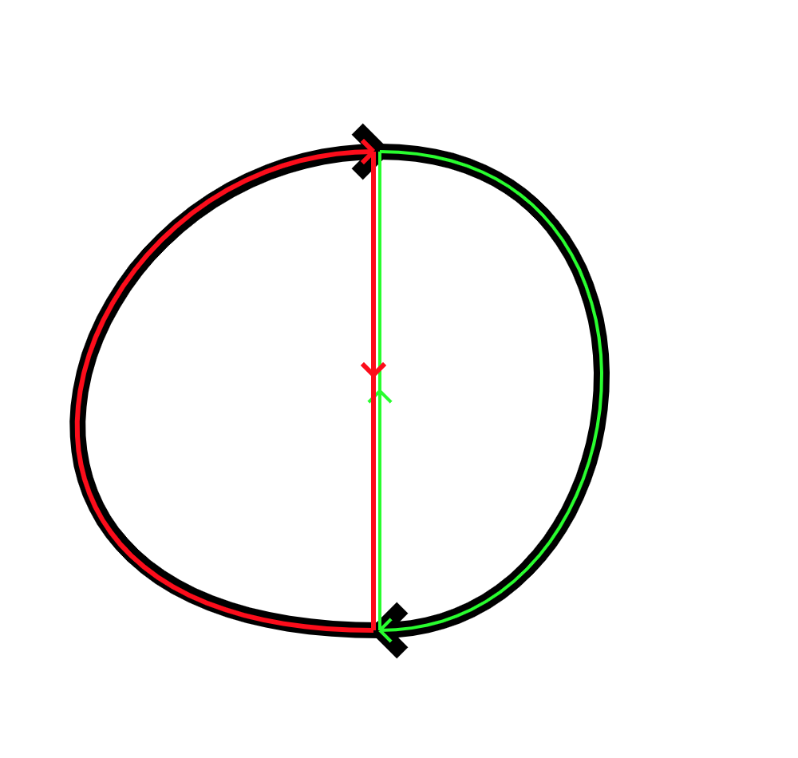

In chapter 18 of volume 2 of *The Feynman Lectures on Physics* (FLoP),
there is a
[chart](https://www.feynmanlectures.caltech.edu/II_18.html#Ch18-T1). The
chart takes up about half a page. It contains every fundamental law of
classical physics.

Of course, it takes a lot of work to get from the fundamental laws to an
explanation of something interesting. Classical physics is also neither
complete nor contradiction-free: extrapolating its consequences leads to
a few minor problems, such as [every object instantly radiating away all
of its energy](https://en.wikipedia.org/wiki/Ultraviolet_catastrophe)
(quantum physics fixes this).

It is still very striking to see, in one glance, the fundamental laws,
as known in 1900. Given sufficient time, you can deduce from these laws
almost any phenomenon you see in the world.

So, what are the laws?

Specifically, what is the "shape" or the "character" of the laws? It
is one thing to state the equations, and quite another to see how they
behave. It is also an entirely different thing to describe them only
qualitatively, without even hinting at what the underlying mathematics
is like.

In this post, I will try to summarise what the laws are about and how
they work. I will not avoid the maths. However, I will also try to
demonstrate the flavour of the laws in a qualitative way

## Force law

This is everyone's favorite:

$$
\boldsymbol{F} = m \boldsymbol{a}
$$
Doesn't look too bad either, right? All it means is that mass times
acceleration gives you force.

(The only complication is that if we're not restricting ourselves to
motion along a line, then force and acceleration are both vectors. But a
vector is just three numbers, one for each dimension. Vectors are
written in bold.)

Rearranging a bit, $\boldsymbol{a} = \boldsymbol{F} / m$; that
is, if you apply a force of $\boldsymbol{F}$ to a mass $m$,
then the acceleration will be in the same direction as the force, but
you have to divide the size of that acceleration by the mass. This tells
you how much you have to push something to accelerate it at a certain
rate.

Of course, we run into a problem of definitions. What is force? We've
just defined it. It's the product of mass and acceleration. Alright,
what's mass? Mass is resistance to acceleration; it's the property of
an object you get by dividing the force you apply to the object by its
rate of acceleration. However, since we're doing physics rather than
philosophy, we can just say that mass and force are these quantities
that we measure in such-and-such a way, and be done with it.

What about acceleration? Here we can go a bit deeper: it is the rate of
change of velocity with time. Velocity, in turn, is the rate of change
of position with time. So acceleration is the rate of change (with time)
of rate of change (with time) of position, and restate our law this way,
using whichever notation we prefer. For example, assuming
$\boldsymbol{x}$ is position and $t$ is our time variable:

$$
\begin{align}
\boldsymbol{F} &= m \boldsymbol{a} \\
\boldsymbol{F} &= m \ddot{\boldsymbol{x}} \\
\boldsymbol{F} &= m \frac{d}{dt} (\frac{d}{dt} \boldsymbol{x}) \\
\boldsymbol{F} &= m \frac{d^2}{dt^2} \boldsymbol{x}
\end{align}
$$

(Each of these means the same thing.)

We can also state the law in a slightly different way, which often turns
out to be more convenient.

What we do is we define a new quantity, somewhat more abstract than
"force" or "mass", but not demonstrably less "real" and certainly
not useless. Call it momentum, denote it $\boldsymbol{p}$ (note:
it's a vector), and let it be the product of mass and velocity:
$\boldsymbol{p} = m \boldsymbol{v}$.

Now: what is the rate of change (with time) of momentum? Since the rate
of change (with time) of velocity is acceleration, and mass is constant
with time, the rate of change of momentum is simply mass times the time
derivative of velocity, or mass times acceleration. So we've managed to
connect force to momentum. Force is just the rate of change (with time)
of momentum:

$$
\begin{align}
\boldsymbol{F} &= \frac{d}{dt} \boldsymbol{p}
\end{align}
$$

## Gravity

The law of gravity also discovered by Newton, states that the force
pulling two objects together is proportional to the mass of both
objects, and inversely proportional to the square of the distance
between the objects. Letting $G$ be the constant that makes our
experiments check out, $m_1$ and $m_2$ the masses of the two
objects, and $r$ the distance between them, we can write that the
strength $F$ of the force is:

$$
F = \frac{G m_1 m_2}{r^2}
$$

(We could write this equation in vector form, but the force is always
attractive so we know its direction.)

Now, from $F = ma$, we can calculate the acceleration that bodies
exert on each other. Let's say we want to know how much the mass
$m_1$ of object 1 accelerates object 2. The acceleration is the
force $G m_1 m_2 / r^2$ divided by the mass $m_2$ of object
2. The $m_2$ term cancels out, and we're left with $G m_1 /
r^2$. So this law can also be phrased as the statement that an
object of mass $M$ causes every other object in the universe to
accelerate towards it at a rate

$$
a = \frac{G M}{r^2},
$$

where $r$ is the distance between them. We are saved from total
chaos only by the little $2$ that tells us to square the distance.
This ensures that, though the force has infinite range (as far as we
know), its strength drops off fast: every doubling of distance means a
four-fold reduction in force; every 10-fold increase in distance means a
hundred-fold reduction in force.

### Gravitational potential and the gravitational force field

We can also express the law of gravitation in a different way: instead
of defining a law for the force, we define a law for the gravitational
potential, and construct a force field from this.

Imagine we have some contraption of mass $m$, and there's some
object of mass $M$ that we're moving directly away from in a
straight line (also let's assume that our velocity is constant and low,
so there are no changes in kinetic energy). The force pulling us
backwards, as a function of distance $r$ from the object's
center, is

$$
F(r) = \frac{GMm}{r^2}
$$

Now consider a small time interval during which me move a distance
$ds$. The work we have to do (in other words, the energy we have
to expend) against the force of gravity is the force against us times
the distance we move.

(Why do we define work/energy this way? Mainly because, if we do, it has
a bunch of interesting properties, such as being conserved. This is the
story of most quantities in physics -- either they're things we can
straightforwardly measure, or someone figures out that if we define a
more abstract quantity based on some simpler ones, this new quantity has
properties that make it useful enough to bother calculating.)

Thus, for each small unit of distance $ds$, the work we do is
$F(r) ds$. Note the word small -- if $ds$ is too large, this
is a poor approximation, since $F(r)$ and $F(r + ds)$ are
going to be noticeably different: the force will have changed a lot
between the beginning and end of the step. So if we want to figure out
the work needed to push something from, say, $r_0$ to a far away
point $r_1$ through a gravitational field, we have to add up a lot
of small pieces: $F(r_0)ds + F(r_0 + ds)ds + F(r_0 + 2ds)ds + \ldots +
+ F(r_1 - ds)ds + F(r_1)ds$.

For small distances, force is practically invariant and the energy
expenditure can be calculated simply by multiplying force and distance.
For example, if a crane lifts a weight of 1000 kilograms a distance of
50 metres from the surface of the Earth, the difference in gravitational
force at the beginning and end of the lift is on the order of 0.15
Newtons, or the force a 15-gram weight exerts on your hand. The total
energy spent on the lift (ignoring inefficiencies) is practically
identical to 50 metres times 1000 kilograms times the gravitational
acceleration 9.8 meters per second squared.

But for longer distances, we have to add up a lot of small pieces. This
is done by integration of the work done at each small step over the
distance travelled:

$$
W = \int\_{r_0}^{r_1} F(r) dr,
$$

where $W$ is the work done (= the energy spent), $r_0$ is
the distance we start from, $r_1$ the distance we end at, and
$F(r)$ the force gravity exerts at distance $r$.

This is valid only for one-dimensional motion. A more general
presentation requires vector notation. In the general case, work is not
the magnitude of the force times the magnitude of the distance, but the
dot product of the force and the magnitude vector. This can be
visualised as the length of the projection of the force vector onto a
unit vector in the direction of distance.

  ------------------------------------------------------------------------------------------------------------------------------------------------------------------------------------------------------------------------------------------------------------------------------------------------------------------------------------------------------------------------------------------------------------------------------------------------------------------------------------------------------------------------------------------------------------------------------------------------------------------------------------------------------
   
    To find the work done by a force on an object: take a unit vector along the axis the object moves in ($\hat{\boldsymbol{s}}$), and measure the projection of the force vector ($\boldsymbol{F}$) in this direction (the dotted blue lines). In this case, the work is negative, since the force is acting more against the direction of motion than along it. To keep the object moving at the same speed, we would therefore have to expend energy.
  ------------------------------------------------------------------------------------------------------------------------------------------------------------------------------------------------------------------------------------------------------------------------------------------------------------------------------------------------------------------------------------------------------------------------------------------------------------------------------------------------------------------------------------------------------------------------------------------------------------------------------------------------------

So if we're moving in a direction perpendicular to the force -- for
example, horizontally over the ground -- gravity does no work.

In general, then, given motion along a line $L$, the work done is
the sum of $\boldsymbol{F} \cdot \boldsymbol{dl}$, where
$\cdot$ is the dot product operator, $\boldsymbol{F}$ is
the force vector, and $\boldsymbol{dl}$ runs over each small
element of the path. In integral notation we write this

$$
W = \int_L \boldsymbol{F} \cdot \boldsymbol{dl}
$$

We can see that with the simple case of straight-line motion, in the
direction of the gravitational field, the result is going to be
positive; call it $W_0$. What this means is that gravity pushes us
along, so work is done by gravity on us. If we moved the other way, we
would have to do work against gravity. The total amount of work we would
have to do is exactly $W_0$, since the path is the same, the
gravitational force field is the same; only the sign is flipped from a
plus to a minus for each step we add, because at each point along the
path the step we take is now in the opposite direction.

Imaging we move along the line $L$ first in one direction, then
the other. First we get an energy $W_0$ from the gravitational
field, which we can think of as having to expend $-W_0$ units of
energy. Returning the other way, we have to spend $W_0$.

So far we've been assuming that our path is a straight line directly
away from the mass. The path doesn't matter, though. If we have any
path near a point mass, we can break it down into radial and tangential
components. The work done moving along any tangential component is zero,
since the force is at right angles to the direction of motion. The sum
of the work done moving along the radial components is the same as the
sum of the work done moving along our straight line path with the same
end-points, since the same outward/inward distance must be covered.

  ------------------------------------------------------------------------------------------------------------------------------------------------------------------------------------------------------------------------------------------------------------------------------------------------------------------------------------------------------------------------------------------------------------------------------------------------------------------------------------------------------------------------------------------------------------------------------------------------------------------------------------------------------

   
        The work done in moving a small step inwards from a distance $r_1 + dr$ to a distance $r_1$ from a point mass (along the black line) can be broken down into the work done in moving along the tangential component (blue), plus the work done moving along the radial component (red). But the force acts in a perpendicular direction as we move along the blue path, so no work is done against gravity as we move along the tangential path, and hence the work done moving along the black path and the red path are equal.
  ------------------------------------------------------------------------------------------------------------------------------------------------------------------------------------------------------------------------------------------------------------------------------------------------------------------------------------------------------------------------------------------------------------------------------------------------------------------------------------------------------------------------------------------------------------------------------------------------------------------------------------------------------

 Therefore we know that, given points A and B:

-   The energy it takes to go from A to B is the same as the energy we
    gain from travelling from B to A.
-   The energy it takes to travel between the two points is independent
    of the path taken.

(Since the gravitational forces of each mass are simply added together
to get the net gravitational force, we know that the work done in total
when we have multiple masses is just the sum of the work done against
each mass independently, and hence the above result applies not only
when moving near point masses, but when moving near any configuration of
masses at all.)

Now imagine that we choose a point X as our reference point. We call the
gravitational potential relative to X the amount of work, per unit mass,
that we have to do against the gravitational field to move from X to any
other point in space (we consider work per unit mass, since otherwise
the answer would depend on how big of a mass we're moving). Since we
know the path taken does not matter, to find the gravitational potential
between A and B we just take the potential from X to B and subtract the
potential from X to A (since potential from X to A is the negative of
the potential from A to X, and we want to add up the potential changes
along two segments of the path: A to X, and then X to B).

  ----------------------------------------------------------------------------------------------------------------------------------------------------------------------------------------------------------------------------------------------------------------------------------------------------------------------------------------------------------------------------------------------------------------------------------------------------------------------------------------------------------------------------------------------------------------------------------------------------------------------------------------------------
   
                                                                                                            The potential difference betweeen A to B is independent of the path taken. Thus, the total work done in moving a mass from A to B against gravity is the same as the totla work required to move it from A to X, and then X to B. The sum of work done over any loop must be zero, so it follows that the work done in moving from A to X is the negative of the work done in moving from X to A.
  ----------------------------------------------------------------------------------------------------------------------------------------------------------------------------------------------------------------------------------------------------------------------------------------------------------------------------------------------------------------------------------------------------------------------------------------------------------------------------------------------------------------------------------------------------------------------------------------------------------------------------------------------------

You can think of it this way. We have some two-dimensional plane
representing a piece of space, and the height of the terrain above each
point is the gravitational potential (so near masses, the terrain would
dip downwards). We choose the height at some arbitrary point X to be the
"sea level" relative to which we measure the height of other points.
Once we know the height of every point relative to X, we know the height
difference for each pair of points. The choice of X is arbitrary
(though, for reasons of mathematical simplicity, the gravitational
potential is usually taken to tend to zero far away from any mass, and
to be increasingly negative near masses).

(To be more accurate, you should visualise a 3D space, with the
potential being "height" into a fourth dimension. In the likely event
that you cannot visualise 4D space, visualising potential as height
along the third dimension above a 2D space usually gives the necessary
intuition anyways.)

We can define a gravitational potential function, call it $V$,
that takes a value at every point in space, and from which we can work
out the work done by gravitational forces from moving between any two
points just by subtracting the value of $V$ at the start from the
value of $V$ at the end. Mathematically, the work $W$ per
mass $m$ in moving from a point with position vector
$\boldsymbol{a}$ to $\boldsymbol{b}$ is

$$
\frac{W}{m} = V(\boldsymbol{b}) - V(\boldsymbol{a}).
$$

Now what if we want to find the force? We found the work (and hence
potential) by integrating force with respect to distance; therefore, we
find force again by differentiating with respect to distance.

The intuitive picture is that for every point in our
potential-versus-location "terrain height" picture of gravitational
potential, we figure out the magnitude of the force vector by looking at
how great the slope of the potential is, and the direction by making it
point in the direction of greatest decrease of potential.

  ------------------------------------------------------------------------------------------------------------------------------------------------------------------------------------------------------------------------------------------------------------------------------------------------------------------------------------------------------------------------------------------------------------------------------------------------------------------------------------------------------------------------------------------------------------------------------------------------------------------------------------------------------
   
                                                                                                                         The background color represents gravitational potential: the darker the color, the lower the potential (imagine the darker regions as being lower, and the lighter regions as higher). The red force vectors come from the gradient of the potential field: they are always in the direction of the greatest decrease of the potential, and have a magnitude proportional to the rate of this decrease.
  ------------------------------------------------------------------------------------------------------------------------------------------------------------------------------------------------------------------------------------------------------------------------------------------------------------------------------------------------------------------------------------------------------------------------------------------------------------------------------------------------------------------------------------------------------------------------------------------------------------------------------------------------------

Mathematically, the gravitational potential field $V$ is a scalar
field (one number for every point in space). We find the gravitational
force field $\boldsymbol{g}$ by taking the gradient of
$V$:

$$
\boldsymbol{g} = -\nabla V
$$

($\nabla$ is a vector calculus operator; $\nabla S$ is the
notation for the gradient of a scalar field $S$. The minus sign
comes from the fact that we've defined gravitational potential to
decrease near a mass, but we still want the force vectors to point
towards nearby masses.)

### Working out the gravitational field directly

We can also define a gravitational field directly. If our position
vector is $\boldsymbol{r_0}$, that of a point mass of mass
$m$ $\boldsymbol{r}$, $G$ is gravitational constant,
and the gravitational force vector is $\boldsymbol{g}$, then

$$
\boldsymbol{g}(\boldsymbol{r}) = Gm \frac{\boldsymbol{r} -
\boldsymbol{r_0}}{\|\boldsymbol{r} - \boldsymbol{r_0}\|^3},
$$

Let's see where the pieces come from.

It is a law that gravitational force is proportional to $Gm$.
Next, we want the force to point towards the mass; we get such a vector
by subtracting from the mass's position $\boldsymbol{r}$ our
position $\boldsymbol{r_0}$ (we have the mass M, us at P, and the
origin of whatever coordinate system we're using at O; we want a vector
from P to M, so we add the vector from P to O and the vector from O to
M). So we put in a $\boldsymbol{r} - \boldsymbol{r_0}$.

Finally, we want to ensure proportionality to the inverse square of
distance from the mass. Note however that the $\boldsymbol{r} -
\boldsymbol{r_0}$ vector in the numerator already scales with the
first power of distance between us and the mass, so we have to divide by
the third power of this distance to get a dependence on the minus second
power.

Alternatively, we can let $\boldsymbol{u}$ be a vector of length
1 pointing towards the mass, and write

$$
\boldsymbol{g}(\boldsymbol{r}) = Gm
\frac{\boldsymbol{u}}{\|\boldsymbol{r} - \boldsymbol{r_0}\|^2},
$$

If we have many point masses, the force vector at any point is simply
the (vector) sum of the contributions of each point mass. If we have a
continuous distribution of charge -- so we know the density of mass at
each point in space, rather than having individual point charges -- we
would integrate over all of space to add up the contributions of each
individual bit of mass.

The intuitive picture is that every bit of mass influences the force
vector at all other points (dragging it towards itself), but that the
strength of this influence drops quickly with distance. The
gravitational force vector at a point is the sum of the gravitational
influences of every mass in the universe.

If a mass $m$ is at a point where the field has the value
$\boldsymbol{g}$ (note that it's a vector), then the
gravitational force $F_g$ can be written simply as

$$
\boldsymbol{F_g} = m \boldsymbol{g}(\boldsymbol{r})
$$

### Electric and magnetic force law

We first expressed the gravitational force law as

$$
F = \frac{G m_1 m_2}{r^2}.
$$

There exists a similar law for the electric force between two
particles:

$$
F = \frac{k_e q_1 q_2}{r^2}

$$

Here, $k_e$ is just a constant (like $G$), and $q_1$
and $q_2$ are the charges of the two particles in question. The
main difference is that charge can be positive or negative (rather than
just positive like mass), and hence the electric force can switch from
being attractive to repulsive depending on the signs of the charges on
the particles.

It turns out that this is not the best way to reason about
electromagnetic forces in general.

With electromagnetism, the behavior of the electric field
$\boldsymbol{E}$ and the magnetic field $\boldsymbol{B}$
is rather complicated. The simplest way to write down the force law is
not directly in terms of charges and distances and whatever, but
directly in terms of the fields themselves (in the same way that writing
the gravitational force in terms of a vector field allowed us to write
it simply as $\boldsymbol{F_g} = m \boldsymbol{g}$).

So here is the law: given a charge $q$ moving at velocity
$\boldsymbol{v}$ at a point in space where the electric field is
$\boldsymbol{E}$ and the magnetic field $\boldsymbol{B}$,
the force experienced by the charge due to electromagnetic forces is

$$

\boldsymbol{F_e} = q \boldsymbol{E} + q \boldsymbol{v} \times
\boldsymbol{B}

$$

We see that the first bit is exactly like the gravitational case, except
with charge instead of mass, and the electric field instead of the
gravitational field. But the second bit is new.

(Here, $\times$ refers not to multiplication, but to the cross
product of two vectors. Briefly, the cross product of
$\boldsymbol{a}$ and $\boldsymbol{b}$ is a vector that
points perpendicular to both $\boldsymbol{a}$ and
$\boldsymbol{b}$, and with a magnitude that is greatest when
$\boldsymbol{a}$ and $\boldsymbol{b}$ are perpendicular to
each other, and 0 when they are parallel. Note there are two directions
perpendicular to any pair of vectors - which one the cross product
returns is determined by the right hand rule.)

The electric field and gravitational field are simple to understand. If
you visualise them as vectors in space, those vectors tell you in which
direction the force tugs at a charge or a mass passing through that
space (though in the case of the electric field, the force can be in the
opposite direction, depending on the sign on the charge).

The magnetic field, however, exerts a force in a direction that is
perpendicular both to the vectors of the field, and to the direction in
which the particle moves.

It's obvious that electric and gravitational fields can do work: they
can make something move that wasn't moving before, accelerating
something along a straight line, and so on. A magnetic field can't move
a stationary charge, though. In fact, it can do no work at all.

We have already seen that the work done by a constant force
$\boldsymbol{F}$ acting across a distance $\boldsymbol{s}$
is the dot product of the force and distance vector, or
$\boldsymbol{F} \cdot \boldsymbol{s}$. The rate at which work
is done -- the power -- is the rate of change of work with time, or
$P = \frac{dW}{dt} = \boldsymbol{F} \cdot \boldsymbol{v}$,
since we assume force is constant with time, and the rate of change of
the position vector $\boldsymbol{s}$ with time is the velocity
vector $\boldsymbol{v}$.

Now let $\boldsymbol{F} = q \boldsymbol{v} \times
\boldsymbol{B}$. Since $P = \boldsymbol{F} \cdot
\boldsymbol{v}$, it follows that $P = (q \boldsymbol{v} \times
\boldsymbol{B}) \cdot \boldsymbol{v}$. The part in parentheses is
a constant (the charge $q$) times the cross product of the
velocity and the magnetic field. Therefore it's a vector that points
perpendicular to the velocity. Now we take the dot product with the
velocity, essentially asking: if we have a vector perpendicular to the
velocity, what is its projection onto the velocity vector? The answer is
zero. And so the magnetic component of the electromagnetic force cannot
do work.

This doesn't mean that it has no effect, of course. Imagine a particle
moving upwards on the screen, and a magnetic field is switched on, going
into the screen. The magnetic force will be to the left, and the
particle's path will bend leftwards. But as it bends, the force also
keeps bending to remain always perpendicular. The result is that the
particle is now traveling in a circle, the radius of which is determined
by the particle's mass (increases radius), the strength of the field
(decreases radius), and the speed at which it is moving (increases
radius). Just like a planet in a circular orbit around the sun, no work
is done, because the force is always exactly perpendicular to the
direction of travel. But it still influences the path that the object
takes.

## Electric and magnetic fields: Maxwell's equations

Maxwell's equations are scary. They are written in the language of
vector calculus, so understanding them requires an understanding of
divergence, flux, circulation, and curl. There are also two equivalent
forms, which look completely different, but which are straightforwardly
equivalent if you grasp the vector calculus concepts.

The best introduction to these concepts is
[here](https://betterexplained.com/articles/category/math/vector-calculus/).
There are exceptionally lucid articles on MathInsight, for instance [on
curl](https://mathinsight.org/curl/_idea).

My aim here will be to try to convey, very concisely, the gist of what
the key concepts are, in just enough detail to show why they are
connected the way they are, and hence why the two forms of Maxwell's
equations are equivalent. After that, I will (mostly qualitatively)
describe the effects of each equation in turn.

### Flux and divergence

Flux is about the amount of \[whatever the field measures\] passing
through a surface. If you imagine a vector field as a bunch of arrows in
3D space, flux is approximated by counting how many arrows pass through
a 2D surface, and seeing how closely they are perpendicular to the
surface.

In a uniform field of strength $F$ that is exactly perpendicular
to a  surface of area $A$, the total flux through the surface is
$FA$. If the field were to tilt to an angle $\theta$
relative to the surface, the flux would decrease in proportion to
$\sin{\theta}$. If the field were parallel to the surface, the
field travels along the surface rather than through it, and the flux
would be zero.

More generally, flux is the sum, over each infinitesimally small piece
of a surface, of the dot product of the field with a perpendicular
vector to the surface (with a magnitude that represents the size of that
bit of the field) (that is, $\boldsymbol{dS}$ is a [vector
area](https://farside.ph.utexas.edu/teaching/302l/lectures/node4.html)
for an infinitesimal surface component). If the surface is $S$,
the field is $\boldsymbol{F}$, and $\boldsymbol{dS}$ is
the vector area of each surface bit, then

$$

\iint_A \boldsymbol{F} \cdot \boldsymbol{dS}

$$

is the flux.

We can take the flux through an open surface like a rectangle, or a
closed one like the surface of a sphere. If the vector field represents
the motion of gas particles, and the flux is going through a sphere to
the inside, then the average density of gas enclosed by the sphere must
be increasing.

Divergence is flux for a closed surface, as the size of the volume the
surface encloses goes to zero. Think of it as describing, for every
point in space, its tendency to act as a source or a sink of \[whatever
the field describes\]. The divergence of a field
$\boldsymbol{F}$, for reasons I will not get into, is denoted by
$\nabla \cdot \boldsymbol{F}$ (yes, that is -- in some sense --
the dot product).

The connection between divergence and flux is given by something
variously called the divergence theorem, Gauss's theorem, or
(presumably only by masochists and Ukrainians) Ostrogradsky's theorem.

Despite the confusing names, it is an intuitive result. For some volume
$V$ bounded by surface $S$, the total amount of flux passing
through $S$ is the total amount of divergence throughout the
volume (by which we mean the sum of the divergences at every
infinitesimal bit of volume in $V$). You can imagine an
incompressible liquid: if it's coming out of a volume (there is flux
through the surface enclosing the volume), then inside that volume there
must be some place that acts as a source of liquid.

Mathematically,

$$

\iiint_V (\nabla \cdot \boldsymbol{F}) dV = \phi_S,

$$

where $\phi_S$ is the flux through $S$.

### Flux and divergence in Maxwell's equations

The first of Maxwell's equations can be given in the form

$$

\nabla \cdot \boldsymbol{E} = \rho / \epsilon_0

$$

Here $\epsilon_0$ is just a constant (the vacuum permittivity);
you can ignore it. In general, any constants have no bearing on this
discussion, and are included only for the sake of accuracy.

The key bit is the charge density $\rho$, which is the amount of
charge per volume at each space.  Anywhere where you have a positive
charge, there will be a region of space where the amount of positive
charge per unit volume of space is positive. The above equation says
that this point will act as a source of electric field vectors; using
the "arrows in space" visualisation, there will be arrows pointing
away from this point. Likewise a negative charge will be a "sink" of
electric field vectors; think of arrows pointing in from the surrounding
space into the spots where we have negative charges.

  ----------------------------------------------------------------------------------------------------------------------------------------------------------------------------------------------------------------------------------------------------------------------------------------------------------------------------------------------------------------------------------------------------------------------------------------------------------------------------------------------------------------------------------------------------------------------------------------------------------------------------------------------------
   
                                                                                                                                                                                                                                                                                                      The electric field around a positive charge.
  ----------------------------------------------------------------------------------------------------------------------------------------------------------------------------------------------------------------------------------------------------------------------------------------------------------------------------------------------------------------------------------------------------------------------------------------------------------------------------------------------------------------------------------------------------------------------------------------------------------------------------------------------------

  ----------------------------------------------------------------------------------------------------------------------------------------------------------------------------------------------------------------------------------------------------------------------------------------------------------------------------------------------------------------------------------------------------------------------------------------------------------------------------------------------------------------------------------------------------------------------------------------------------------------------------------------------------
   
                                                                                                                                                                                                                                                                               The electric field around a positive (blue) and negative (red) charge in close proximity.
  ----------------------------------------------------------------------------------------------------------------------------------------------------------------------------------------------------------------------------------------------------------------------------------------------------------------------------------------------------------------------------------------------------------------------------------------------------------------------------------------------------------------------------------------------------------------------------------------------------------------------------------------------------

\
Now let's stop squinting at tiny bits of space and instead consider an
entire volume $V$. The above discussion on divergence and flux
tells us how to do this. If we integrate the divergence over a volume,
we get the flux through the enclosing surface (call it $S$ again).
So we have that the flux of the electric field through the enclosing
surface of our volume $\phi\_{ES}$ will be

$$

\phi\_{ES} = \frac{1}{\epsilon_0} \iiint_V \rho dV.

$$

The sum of all the charge densities in a volume is just the total charge
within that volume; call it $Q_V$, so we can write simply that the
electric flux through a closed surface is (a constant times) the total
charge enclosed within that surface:

$$

\phi\_{ES} = \left( \frac{1}{\epsilon_0} \right) Q_V

$$

Let's take a simple case of applying this law, and see where we end
up.

The simplest sort of closed surface we can have is a sphere. The
simplest charge distribution we can have inside a sphere is a point
charge in the centre. But note that, no matter how large the sphere is,
the electric flux $\phi\_{ES}$ through it has to be the same. The
area of the sphere grows with the square of its radius, so it follows
that electric field density has to decrease with the square of distance
from a point charge to keep the sum of the field through the entire
sphere's surface constant. Electric field density in turn is
proportional to the force per unit mass the field exerts. Therefore
electric forces exerted by a point charge decrease in proportion to the
inverse square of distance from the charge.

If we were to carry out the above line of reasoning while taking a bit
more care with the constants, we would wind up with our original
electric force law:

$$
F = \frac{k_e q_1 q_2}{r^2}.

$$

Another of Maxwell's equations has a differential form that states
$\nabla \cdot \boldsymbol{B} = 0$; that is, no point in space
is a source or sink of magnetic fields. It follows that no volume in
space can be a source or sink either, and hence that the magnetic flux
through a surface $S$, call it $\phi\_{BS}$, must always be
zero. This gives us the other form of this law.

An immediate consequence of this law is that there are no magnetic
"charges", and no magnetic monopoles. Magnetic field lines do not
start or stop, but always form loops.

\

### Circulation and curl

A key concept with vector fields is that of a line integral.

Consider taking a hike through hilly terrain. You know your path, and
you have a map that gives you the direction and magnitude of the slope
at each point. How do you find what distance up or down you travelled?

We can represent each step you take as a vector $\boldsymbol{s}$:
basically a line from where you were before the step to where you are
after the step. Assume that the size of the step is small enough and the
terrain gentle enough that the slope does not change appreciably between
one step and the next. Let the slope at that point be given by the
vector $\boldsymbol{G}$, which points in the direction of maximum
increase of terrain height, with units of distance moved up divided by
distance moved sideways (note that $\boldsymbol{G}$ always points
along the plane perpendicular to the up-down direction). If you step
directly along $\boldsymbol{G}$, then the distance you move up is
the length of the step, times the magnitude of $\boldsymbol{G}$;
you can verify this by looking at the units: distance moved sideways
times distance moved up per distance moved sideways gives distance moved
up.

Stepping the same distance in the opposite direction would result in
moving down by the same distance. Stepping perpendicular relative to
$\boldsymbol{G}$'s axis would result in no change in height (if
you're unconvinced, note that a small enough sloping region can be
approximated by a rectangular plane). In the general case, the amount
you move up or down is the projection of one vector onto the unit vector
in the direction of other, or the dot product: $\boldsymbol{G}
\cdot \boldsymbol{s}$.

If you take a lot of steps, you add up the contribution from each one.
Let the size of the steps decrease to zero, and we can work out the
total change in height as an integral along your path $P$: just
add up the dot product of $\boldsymbol{G}$ with each small vector
$\boldsymbol{dl}$ pointing along your path for every segment of
your path.

Consider now the problem of finding the work $W$ done on a
particle as it moves along some curve $C$. We know that for a
constant force $\boldsymbol{F}$ and a straight-line movement
along $\boldsymbol{s}$, $W = \boldsymbol{F} \cdot
\boldsymbol{s}$. In the standard calculus way, if we want to find
the total work over a curving path, we write the integral

$$

\int_P \boldsymbol{F} \cdot \boldsymbol{dl},

$$

to find the sum of the contributions of each infinitesimal step
$\boldsymbol{dl}$ along the smooth path $P$ along which we
travel.

Now consider a similar line integral, but a closed one: one where the
path we take returns to the starting point at the end.

In the case of the terrain height example, the result is obvious. The
net change in height when we travel from point A to point A is zero,
regardless of the path we take. The same is true of work in a
gravitational field, because we can write the gravitational force field
as the gradient of a gravitational potential field in the same way we
write the slope of a terrain as the gradient of the terrain's height.

(In general, if a vector field $\boldsymbol{F} = \nabla \phi$
for some scalar field $\phi$, then a closed line integral in that
vector field must be 0. Such a vector field is termed
"conservative".)

But consider the vector field representing the motion of water in a
whirlpool. We go around the whirlpool once, and at every point along the
way, the water is pushing in the direction of our travel: the line
integral the vector field along our closed path is positive.

Such a closed line integral is a quantity about a vector field and
something (in this case, a loop) in space that we can calculate,
similarly to flux. It is called circulation.

In the case of flux, we found a way to determine it by looking only at
divergence, which is a quantity that takes a value not for some large
shape in space, but for each individual point of a vector field. We'd
now like to do something similar with circulation. This is possible,
once again, with a very intuitive and visual argument.

  -----------------------------------------------------------------------------------------------------------------------------------------------------------------------------------------------------------------------------------------------------------------------------------------------------------------------------------------------------------------------------------------------------------------------------------------------------------------------------------------------------------------------------------------------------------------------------------------------------------------------------------------------------
   
                                                                                                                                                                                                                                          The circulation over the black loop is the circulation in the red loop plus the circulation in the green loop, since the net contribution of the middle part is zero.
  -----------------------------------------------------------------------------------------------------------------------------------------------------------------------------------------------------------------------------------------------------------------------------------------------------------------------------------------------------------------------------------------------------------------------------------------------------------------------------------------------------------------------------------------------------------------------------------------------------------------------------------------------------

\
Consider a loop $L$ in space, enclosing a surface $S$. Split
it into two loops, $L_1$ and $L_2$. There is a segment along
which these two circulations overlap, but when we add the circulation
along $L_1$ and that along $L_2$, the contribution of this
segment cancels out because the sign is reversed for $L_1$
compared to $L_2$ (for this segment, the infinitesimal path
direction vectors \$\boldsymbol{dl}\$ point in the opposite direction).
Therefore the circulation of $L$ is that of $L_1$ plus that
of $L_2$, or in other words,

$$

\oint_L \boldsymbol{F} \cdot \boldsymbol{dl} = \oint\_{L_1}
\boldsymbol{F} \cdot \boldsymbol{dl} + \oint\_{L_2} \boldsymbol{F}
\cdot \boldsymbol{dl}
$$

($\boldsymbol{dl}$ is what we will call the infinitesimal
segments of $L$, $L_1$, and $L_2$.)

We can continue recursively splitting up the surface $S$ into
smaller and smaller segments, always assured that, if we just add up all
of them, we still get the circulation along $L$. In the limit, we
have infinitesimally small segments -- in a loose sense, one for each
point in $S$. Integrate the value of each of these microscopic
circulations along all of $S$, and you will get the circulation
along $L$:

$$
\iint_S (\nabla \times \boldsymbol{F}) \cdot \boldsymbol{dS} =
\oint_L \boldsymbol{F} \cdot \boldsymbol{dS}
$$

($\nabla \times \boldsymbol{F}$ is how we denote curl.)

The main complexity is that since both expressions we're integrating
are vectors, to get a scalar result we're integrating with $\cdot
\boldsymbol{dS}$ -- that is, the dot product of the expression with
the vector area of each bit of surface -- rather than simply with a
scalar area element $dS$.

This infinitesimal equivalent of circulation is called curl. Imagine the
vector field as a fluid, and a microscopic sphere at some point in it.
The curl at that point can be visualised as the vector that represents
the axis along which the fluid makes the sphere turn (which way along
this axis the vector points is given by the right hand rule).

(It turns out that, for an infinitesimal square, it is possible to find
an expression for the circulation around it in terms of the rates of
change of the $x$, $y$, and $z$ components of the
vector field with respect to the $x$, $y$, and $z$
axes. This allows for a definition of curl that is not in terms of the
line integral of anything.)

\

### Circulation and curl in Maxwell's equations

The first two of (the differential form of) Maxwell's equations form a
pair: one for the divergence of an electric field, the other for that of
a magnetic field. The final two form another pair, this time dealing
with the curl of the fields.

The curl of an electric field is the negative rate of change with time
of the magnetic field at that point:

$$

\nabla \times \boldsymbol{E} = -\frac{\partial
\boldsymbol{B}}{\partial t}

$$

(We write $\partial$ instead of $d$ in the derivative
operator because we're taking a partial derivative: changing time
$t$ while holding the space coordinates, along which the magnetic
field also varies, constant.)

Armed with the result established previously for translating statements
about curl at a point to statements about the circulation along a closed
path, we can express the law in a different way. We simply pick a
surface $S$, and integrate both sides of the above equation over
this surface. There's only one detail: we can't integrate with respect
to scalar area elements $dS$, since curl is a vector, and then
we'd get a vector for the integral of the left-hand side. So we'll
integrate, once again, with the vector areas $\boldsymbol{dS}$.

The integral along the surface $S$ of the left-hand side
($\nabla \times \boldsymbol{E}$) is, by the circulation-curl
result, the integral along the line $L$ that encloses $S$.
Denoting the circulation of $E$ around $L$ by
$C\_{EL}$, we have:

$$
C\_{EL} = - \iint_S \frac{\partial \boldsymbol{B}}{\partial{t}}
\cdot \boldsymbol{dS}

$$

We integrate with respect to area and differentiate with respect to
time, and area and time don't change relative to each other, so it's
all the same which way around we do it. Thus we can just as well write

$$
C\_{EL} = - \frac{d}{dt} \iint_S \boldsymbol{B} \cdot
\boldsymbol{dS}

$$

Now the integral looks familiar - it's just the definition of flux, for
the case of finding the flux through surface $S$ for the magnetic
field $\boldsymbol{B}$. Denoting the flux of
$\boldsymbol{B}$ through the surface $S$
$\phi\_{BS}$, we arrive at the final version of the integral form
of the law:

$$
C\_{EL} = - \frac{d}{dt} \phi\_{BS}

$$

To put it in words: the circulation of an electric field around a closed
path is the negative rate of change with time of the magnetic flux
through the surface enclosed by the path.

This means that whenever we have magnetic fields changing, the electric
field circulates. An electric field in which there exist closed paths of
non-zero circulation is a powerful thing. We can, in theory, take a
charge, move it along such a path, return it back where it was before,
and have a positive amount of work done on the charge. (Remember that in
the gravitational case, the line integral around any loop of work done
comes to 0)

This principle is how electric generators work. You have coils of wire,
and in the middle, a changing magnetic field. This creates an electric
field pushing along the wire, which makes the electrons in the wire
move.

Of course, a magnetic field cannot get stronger without limit, so it's
difficult to do much with a uniformly increasing (or decreasing)
magnetic field. But if the magnetic flux varies, from positive to zero
to negative to zero within some bounded range, then most of the time it
will be changing (except when it's at a minimum or a maximum), and you
can get the electric charges in wires to oscillate back and forth, and
extract work from this motion.

The final law is the most complex one. In differential form, it is:

$$

\nabla \times \boldsymbol{B} = \mu_0 \boldsymbol{j} + \mu_0
\epsilon_0 \frac{\partial \boldsymbol{E}}{\partial t}

$$

Once again we have some constants ($\mu_0$ and
$\epsilon_0$, the permeability and permittivity of a vacuum
respectively) which have no bearing on this discussion.

We also have a new symbol: $\boldsymbol{j}$, the current density.
In the same way we previously referred to charge density $\rho$
instead of charge directly, we now talk about how much current flow
there is per unit volume. Note that it's a vector: we care not just
about how much current we have, but also about which direction it's
flowing in.

Originally, this final of Maxwell's equations was only half-complete.
When Ampère first wrote down this law, he wrote down this:

$$

\nabla \times \boldsymbol{B} = \mu_0 \boldsymbol{j}

$$

(Or rather, he wrote down something that, in modern vector notation,
might be written as the above.)

Looking at only this half, let's see what we get. Just as before, we
use the result relating curl to circulation, which gives

$$

\iint_S (\nabla \times \boldsymbol{B}) \cdot \boldsymbol{dS}

\equiv \oint_L \boldsymbol{B} \cdot \boldsymbol{dS}\
= \mu_0 \iint_S \boldsymbol{j} \cdot \boldsymbol{dS}.

$$

Using the incomplete version of the law, what we find is that the
integral-form version of it states: the line integral of the magnetic
field around a closed path $L$ is (a constant times) the current
flux through the surface $S$ enclosed by $L$.

And this is what Ampère observed. If you take a wire, with some amount
of current going through it, then you will always get a magnetic field
around the wire, with the property that the total circulation of the
field around a loop is proportional to the current flow and independent
of the shape or size of the loop (of course, it takes some ingenuity to
deduce from physically measurable quantities that the abstract magnetic
field behaves this way).

(In the same way as our divergence law for the electric field leads to
an inverse-square law for the strength of the electric field of a point
law, this law leads to an inverse law for the strength of a magnetic
field with distance from a wire; for a circular loop, the length is
proportional to the radius, so to maintain constant circulation along
the loop regardless of its size, magnetic field strength must go down
inversely with radius.)

The incomplete version of the law had some difficulties. These can be
illustrated through theoretical considerations, but the most concrete
demonstration I've seen is a thought experiment in the Feynman
Lectures. Consider a charged central blob that emits charged particles
uniformly in all directions. Imagine a sphere around this blob, and draw
a circle on the sphere. There are particles flying through this circle,
so the incomplete version of the law requires there to be a magnetic
circulation around our circle. But the situation is symmetric: we can
have no reason to prefer, say, a counterclockwise circulation of the
magnetic field over a clockwise one in our circle. There cannot
reasonably be any circulation of the magnetic field on this sphere.

If we were to try to invent our way out of this mess, we might note that
this thought experiment involves a bunch of electric charges flying
away, and thus the electric flux is constantly changing. Indeed, the
solution involves adding a term relating to the rate of change of the
electric field: this is the $\mu_0 \epsilon_0 \frac{\partial
\boldsymbol{E}}{\partial t}$ part of the equation.

(The very determined reader may wish to investigate how this saves us in
the sphere-around-escaping-charges thought experiment. The (slightly
less) determined reader can find the answer
[here](https://www.feynmanlectures.caltech.edu/II_18.html#Ch18-S2)).

The effect of this additional term is that, instead of the circulation
of the magnetic field around a loop being equal to one area integral, it
will be equal to the sum of two. Using the same procedure as before, we
eventually find that the integral form of

$$

\nabla \times \boldsymbol{B} = \mu_0 \boldsymbol{j} + \mu_0
\epsilon_0 \frac{\partial \boldsymbol{E}}{\partial t}

$$

is

$$

\oint_L \boldsymbol{B} \cdot \boldsymbol{dl} =

\mu_0 \iint_S \boldsymbol{j} \cdot \boldsymbol{dS}\
+ \mu_0 \epsilon_0 \frac{d}{dt} \iint_S \boldsymbol{E} \cdot
\boldsymbol{dS}.

$$

We recognise the left-hand side term as a circulation, and the two
right-hand terms as fluxes. To make the conceptual relationships here
clearer than the above mess of integrals, let $C\_{BL}$ be the
circulation of $B$ around $L$, and $\phi\_{jS}$ the
flux of current and $\phi\_{ES}$ the flux of the electric field
through the surface $S$ bounded by $L$, and we have that

$$
C\_{BL} = \mu_0 \phi\_{jS} + \mu_0 \epsilon_0 \frac{d
(\phi\_{ES})}{dt}.

$$

Therefore the circulation of a magnetic field around a loop $L$ is
(a constant times) the current flux through the enclosed surface, plus
(a constant times) the rate of change of electric flux through the same
surface.

To visualise this: imagine a string of electric charges passing through
an imaginary circle that we draw around their path. When the electrons
are passing through this circle, the first term on the right-hand side
means that there is a circulation of the magnetic field along our
imaginary circle. Even after the electrons have passed by, there will be
some circulation of the magnetic field. The electrons cause there to be
electric flux through the circle, and as they move further and further
away, the flux decreases (though the rate of decrease decreases as the
flux tends to zero). This changing flux keeps the magnetic field
circulating even after the electrons have physically passed by.

(A similar situation allows us to note another paradox with Ampère's
original incomplete version of the law. Note that the derivation of the
curl/circulation relationship given above does not require the circle to
be flat - the surface "enclosed" by the loop could be, for instance,
shaped like a cylindrical hat, with the rim being our circle. The time
at which the electrons have finished passing through the surface
therefore depends on what surface we choose our loop to enclose. If the
magnetic circulation depended only on electrons passing through this
surface, then changing where we draw an imaginary surface would change
how the magnetic field behaves! In the real world, any such change of
surface shape would also change the flux through the surface, in such a
way that we always agree about what the circulation is regardless of any
imaginary shapes.)

For the curl/circulation of an electric field, we found that it depends
on the rate of change of the magnetic field. Analogously, the
curl/circulation of a magnetic field depends on the rate of change of
the electric field.

But why the extra term?

Let's take the differential form of the equation, and take the
divergence of both sides:

$$

\nabla \cdot (\nabla \times \boldsymbol{B}) = \nabla \cdot
(\mu_0 \boldsymbol{j} + \mu_0 \epsilon_0 \frac{\partial
\boldsymbol{E}}{\partial t})

$$

There is a vector calculus identity that $\nabla \cdot (\nabla
\times \boldsymbol{F}) = 0$ for any vector field
$\boldsymbol{F}$.

(Why? Consider integrating $\nabla \cdot (\nabla \times
\boldsymbol{F})$ over a volume $V$, bounded by the closed
surface $S$. From the divergence-flux result, we know that this is
equal to the integral of $\nabla \times \boldsymbol{F}$ over
$S$. From the curl-circulation result, we know that this is equal
to the integral of $\boldsymbol{F}$ over the loop that bounds
$S$. But there can be no such loop, since $S$ must be closed
in order to enclose a volume; if $S$ almost but not quite closed
around $V$, then the loop would be very small, but since $S$
is closed it is of size zero. Therefore the integral must always be
zero, implying that the expression itself must be zero. (If any
mathematician challenges the technical details of this proof, I will be
on the next plane to New Zealand))

Using this identity and dividing by the constant $\mu_0$, we have
that

$$
0 = \nabla \cdot \boldsymbol{j} + \epsilon_0 (\nabla \cdot
\frac{\partial \boldsymbol{E}}{\partial t})

$$

We can reshuffle the order in which we take the derivatives (the
divergence operator is essentially a derivative) and move one term to
the other side to get:

$$

\nabla \cdot \boldsymbol{j} = -\epsilon_0
\frac{\partial}{\partial t} (\nabla \cdot \boldsymbol{E})

$$

The first of Maxwell's equations that we discussed tells us that
$\nabla \cdot \boldsymbol{E} = \rho / \epsilon_0$.
Substituting this into the above yields the final result:

$$

\nabla \cdot \boldsymbol{j} = -\frac{\partial \rho}{\partial t},

$$

where $\boldsymbol{j}$ is the current density vector and
$\rho$ is the charge density.

What does this result mean? The left-hand side is the divergence of the
current density, or, in other words, the tendency of a point in space to
act as a source or a sink of current. The right-hand side is the
negative rate of change of charge density with time.

Let's say we have current coming out of a point. This equation tells us
that the current density at that point must then be going down. If
current goes into a point, current density most go up.

In short, this is the law of the conservation of charge.

If we do the same thing, without the extra piece with the rate of change
of the electric field in the equation, we find that

$$

\nabla \cdot (\nabla \times \boldsymbol{B}) = \nabla \cdot
(\mu_0 \boldsymbol{j})

$$

and therefore that

$$
0 = \nabla \cdot \boldsymbol{j},

$$

which would imply that there can be no source or sink of current:
current would be like an incompressible fluid (or a magnetic field),
flowing in loops but never "piling up" or "emptying out" of one
place.

Maxwell's equations aren't really Maxwell's. Individually, they
don't even have Maxwell's name; there's Gauss's law, Gauss's law
for magnetism, Faraday's law, and Ampère's law (with Maxwell's
addition). What Maxwell did was, first, put them all together, and
second, add one piece - the $+ \mu_0 \epsilon_0 (\partial
\boldsymbol{E}) / (\partial t)$ bit - to Ampère's law. This one
piece, however, is a pretty significant one: not only does it resolve
the contradictions in Ampère's original law, but it straightforwardly
implies the conservation of charge, and (in a somewhat less
straightforward way) the behaviour of light as a wave. I'm happy to let
Maxwell have his name on the equations.

\

### Finding the electric and magnetic fields

Maxwell's equations don't really tell you how to figure out what
actually happens when you have a bunch of charges moving around. Sure,
you can deduce (from the two equations about curl) that they imply
disturbances in the field spread out as waves consisting of an electric
and a magnetic part oscillating together, or that you will only get
magnetic fields when electric charges are in motion, or what values the
field takes in simple cases like a current-carrying wire or a point
charge.

But if we have an arbitrary collection of moving charges, what do we do?
"The circulation of the electric field must be this and this", says
Faraday's law -- but this just sets a constraint, without directly
telling us how to find the field that fulfils it.

In the case of gravitational fields, we were able to present essentially
a complete solution. Once we've placed our masses, we know exactly how
to find the gravitational field, and that tells us how the masses
interact with each other. You could write a computer simulation to work
it out based on the preceding discussion.

Solving Maxwell's equations is more difficult. I will not present a
derivation here, but the general outline is as follows.

In the gravitational case, since the circulation of the gravitational
(vector) field was always zero, we could express it as the gradient of a
(scalar) potential field. Both magnetic and electric fields can have
non-zero circulation, however, so though we can define potentials, it
will not be in the form of a simple scalar potential with gradient equal
to the field.

In the same way that a zero-curl (and hence zero-circulation) field can
be expressed as the gradient of something, a zero-divergence vector
field can be expressed as the curl of something. The divergence of the
magnetic field is zero, so we define the magnetic vector potential to be
the vector field whose curl is the magnetic field.

If we have no moving charges, we have no changing magnetic fields, and
hence no curl in the electric field. In such a case, the electric field
is simply the gradient of the electric potential, which we define in a
way exactly analogous to the gravitational potential.

However, if we have moving charges, and hence changing magnetic fields,
we have circulating electric fields and hence the field cannot be the
gradient of something. In the general case, the expression for the
electric field involves the rate of change of the magnetic vector
potential.

Given these definitions, we get a relation between the magnetic vector
potential and current density, and a similar relation between the
(scalar) electric potential and the charge density (this relation takes
the form of the wave equation in places where there are no currents or
charges). (See [chapter 18 of
FLoP](https://www.feynmanlectures.caltech.edu/II_18.html#Ch18-S6) for
the details)

Finally, from this we can show, given an arbitrary charge and current
distribution, how to find the electric potential and magnetic vector
potential for each point in space. The case of finding the electric
potential is exactly analogous to the gravitational potential case. The
magnetic potential works similarly (though the constants are different),
except we don't integrate a scalar like charge/mass, but the current
density vector (over all space, scaled in inverse proportion to the
distance to the point whose potential we're finding, just like with the
electric and gravitational cases).

To summarise: the gravitational/electric/magnetic potential at a point
is a sum of the influences of masses/charges/currents elsewhere,
weighted based on on how far they are, and how much mass/charge/current
there is.

However, we have to take into account that electromagnetic influences
don't travel instantaneously (neither do gravitational ones, but
classical physics does not account for that). The electric potential at
time $t$ is affected not by the charge density a distance
$r$ away at time $t$, but by what the charge density was at
time $t - r / c$, where $c$ is the speed of light. Whenever
the charge or current density distribution changes, the effects of the
change on the electromagnetic potentials spreads out at the speed of
light.

(See [chapter 21 of
FLoP](https://www.feynmanlectures.caltech.edu/II_21.html#Ch21-S3) for
the details of the derivation.)

Now for the equations. Let the charge density at position
$\boldsymbol{R}$ and time $T$ be $\rho(\boldsymbol{R},
T)$, and likewise the current density at an arbitrary place and time
be $\boldsymbol{j}(\boldsymbol{R}, T)$. Then the electric
potential $\phi$ and the magnetic vector potential
$\boldsymbol{A}$ at a point with position vector
$\boldsymbol{r}$ at time $t$ are

$$
\begin{align}\
& \phi(\boldsymbol{r}) = \frac{1}{4 \pi \epsilon_0} \iiint
\frac{\rho( \boldsymbol{r\_{dV}}, t - r / c)}{r} dV, \\\
& \boldsymbol{A}(\boldsymbol{r}) = \frac{1}{4 \pi \epsilon_0 c^2}
\iiint
\frac{\boldsymbol{j}( \boldsymbol{r\_{dV}}, t - r / c)}{r} dV,
\end{align}
$$

where $\boldsymbol{r\_{dV}}$ is a position vector that always
points to whatever infinitesimal piece of volume the integral is running
over, and $r$ is the distance between $\boldsymbol{r}$
(where we're finding the potential) and $\boldsymbol{r\_{dV}}$
(so $r = \| \boldsymbol{r} - \boldsymbol{r\_{dV}}\|$). Note that
we let each integral run over all of space.

To find the electric field $\boldsymbol{E}$ and the magnetic
field $\boldsymbol{B}$ from these potentials, we have to do
something a bit more complicated than just taking the gradient:

$$
\begin{align}\
& \boldsymbol{E} = -\nabla \phi - \frac{\partial
\boldsymbol{A}}{\partial t} \\\
& \boldsymbol{B} = \nabla \times \boldsymbol{A}
\end{align}
$$

### Example: visualising the solution to Maxwell's equations

To get an intuitive picture of what the above solutions really mean,
let's think through a simple example.

Imagine a long series of positive charges moving upwards (in reality, if
you had nothing but positive charges in close proximity, they would
repel each other and fly away, but for the sake of simplicity let's say
we've managed to arrange the situation in such a way that talking about
just a string of positive charges is a good model for the
electromagnetic effects).

Now let's consider the electric and magnetic potentials outside the
wire.

Along this wire of charges, we have some current density. Therefore
there will be electric potential around it, and this potential will
decrease with distance from the wire.

(The potential will not, however, decrease in proportion to the inverse
of distance. We can find the exact way it decreases by doing the
integrals, but in this case it's simpler to reason from the fields to
the potentials rather than the other way around. By Gauss's law, we
know that the electric flux through a cylinder we place around our wire
is proportional to the charge density inside. By the symmetry of our
setup, the flux through the top of the cylinder cancels out thee flux
through the bottom; the net flux is the net flux through the sides, and
must be directed radially outwards from the wire. If we fix the height
of our cylinder, the charge inside is a constant. If we now increase the
radius of the cylinder, the area of its side will increase in proportion
to the radius, and hence, to keep total flux constant, the electric
field must decline in inverse proportion to the radius. Potential can be
found by integrating the field, and the integral of $1/r$ with
respect to $r$ is a natural logarithm. So the relationship between
distance from the wire and potential is actually logarithmic.)

Since the charges are moving, the current density vectors in the region
of space occupied by the wire are non-zero, directed up in the direction
of motion. And since we have non-zero current density, we will have
magnetic potential. The magnetic potential vectors will point upwards,
run parallel to the wire, and have length proportional to both the
amount of charge moving and to the speed of the charges.\

  -----------------------------------------------------------------------------------------------------------------------------------------------------------------------------------------------------------------------------------------------------------------------------------------------------------------------------------------------------------------------------------------------------------------------------------------------------------------------------------------------------------------------------------------------------------------------------------------------------------------------------------------------------
   
                                                                                                                                                                                                                                                                                The magnetic vector potential (blue) around a current (current density vectors in black).
  -----------------------------------------------------------------------------------------------------------------------------------------------------------------------------------------------------------------------------------------------------------------------------------------------------------------------------------------------------------------------------------------------------------------------------------------------------------------------------------------------------------------------------------------------------------------------------------------------------------------------------------------------------

\
(The exact proportionality between distance and the length of the
vectors is logarithmic, as with the electric case.)

If we look at a portion of the wire that is far from the ends, neither
potential will be changing (you can imagine that, at successive time
steps, each charge moves to take the place of the one before it).
Therefore the rate of change of the magnetic vector potential is 0, and
the electric field is simply the (negative) gradient of the potential.

For the magnetic field, we know it must be the curl of the magnetic
potential field.

You might think: how can a field consisting just of vectors pointing in
the same direction have any curl? Curl is a more subtle concept than
"vectors in loop-like arrangements". The intuitive idea here is to
remember the sphere-in-a-fluid analogy. If we imagine the magnetic
potential field as describing the flow of a fluid, and place a sphere in
it, it will spin, since the "flow" closer to the wire is stronger than
that further away, even though the direction of the flow is the same in
both cases. The curl is along the axis of this spin, so it is directed
tangentially to a circle around the wire.

  ------------------------------------------------------------------------------------------------------------------------------------------------------------------------------------------------------------------------------------------------------------------------------------------------------------------------------------------------------------------------------------------------------------------------------------------------------------------------------------------------------------------------------------------------------------------------------------------------------------------------------------------------------------------------------------------------------------------------------------------------------------------------------------------

   The black dotted circle indicates the current coming out of the screen. The blue dotted circles indicate the magnetic vector potential vectors, also directed out of the screen. The magnetic field vectors are drawn in red for a few selected distances from the wire. The curl of the magnetic potential can be visualised by imagining which direction the green sphere would roll in if the magnetic vector potential represented the flow of a fluid. The direction of fastest decline of the magnetic potential is as we move from the wire along the dotted line, so the axis along which the sphere rolls is the solid line (which is parallel to the magnetic field vectors at that angle). The right-hand rule gives the counterclockwise direction for the magnetic vectors.
  ------------------------------------------------------------------------------------------------------------------------------------------------------------------------------------------------------------------------------------------------------------------------------------------------------------------------------------------------------------------------------------------------------------------------------------------------------------------------------------------------------------------------------------------------------------------------------------------------------------------------------------------------------------------------------------------------------------------------------------------------------------------------------------------

In this way we recover what we had already deduced from Ampère's law: a
wire with current creates a circulation of the magnetic field around it
(that declines in strength with the inverse distance from the wire, as
can be seen, for example, from taking the derivative of our logarithmic
potential-with-distance function).

We can now consider the behaviour of another positive charge near this
wire. If it's stationary, it will be repelled radially outward from the
wire by electric forces. If it is somehow kept moving in a circle around
the wire, it will feel no magnetic force since the magnetic field will
always be parallel to its velocity vector. If it moves in some other
way, it will experience a force perpendicular to both its velocity and
the magnetic field (which of the two perpendicular directions it moves
in is given by the right-hand rule); for instance, moving parallel to
the wire, the magnetic force will draw it towards the wire.

All is well, then?

### Hints of relativity

Not quite. Imagine that, instead of sitting stationary next to the wire,
we move with the charges, so that from our perspective the charges are
stationary. Classical physics says the electric field is exactly as
before, but the charges in the wire aren't moving, so they do not
create a magnetic field around them (nor can magnetic fields exert
forces on them).

If (for simplicity) the additional charge near the wire was previously
moving at the same speed as the charges in the wire, it will also be
stationary in our new reference frame. Instead of feeling a repulsive
electric force that is partly cancelled by an attractive magnetic force,
it now feels only that same repulsive electric force, and would
therefore be accelerated outwards at a greater rate.

By following the laws of classical physics, we have changed how a system
behaves by looking at it from a different reference frame.

This isn't necessarily a paradox. In Newtonian mechanics, force always
depends on acceleration and never on velocity, so it must always predict
the same forces and hence the same consequences for a system regardless
of how fast we move relative to the system. But might this invariance on
what velocity we look at a system from just be a quirk that happens to
be a valid approximation when considering mechanics, but fails when we
get to deeper physics like electromagnetism? The electromagnetic force
law certainly includes velocity in it.

As it turns out, electromagnetism is correct, and Galilean invariance
(the principle that physics works the same way regardless of how fast
you move) holds. With these assumptions, the above situation really is a
paradox. What needs changing is our ideas of time and space instead, as
described by the theory of special relativity.

Galilean-invariant solution to the above paradox is that fast-moving
objects compress along the direction of their travel. In the stationary
case with no magnetic fields, we have only electric repulsion between
the wire and our charge. As we shift into the reference frame in which
the charges do move, the wire and the charge are compressed, which
increases charge density, and thus makes the electric repulsion increase
in strength in such a way that, when the magnetic attraction is added,
the net force is exactly the same as in the stationary case.

### Summary of Maxwell's equations

This list summarises Maxwell's equations and their key implications
when considered independently of each other.

-   **Gauss's law.**

-   -   **Differential form:**\
        $$
                    \nabla \cdot \boldsymbol{E} =
        \frac{\rho}{\epsilon_0}\
                $$ 
    -   **Interpretation:** The tendency of a point in space to act as a
        source/sink of electric charge is (a constant times) the charge
        density at that point.
    -   **Integral form:** $$
                    \oint \oint_S \boldsymbol{E} \cdot
        \boldsymbol{dS}\
                    = \frac{1}{\epsilon_0} \iiint_V \rho dV\
                $$
    -   **Interpretation:** The electric flux through a volume is
        proportional to the total charge contained within that volume.
    -   **Key consequence:** The strength of the electric field decays
        in proportion to the inverse square of distance from a point
        charge.

-   **Gauss's law for magnetism.**

-   -   **Differential form:**\
        $$
                    \nabla \cdot \boldsymbol{B} = 0\
                $$
    -   **Interpretation:** No point in space acts as a source or sink
        of magnetic flux.
    -   **Integral form:** $$
                    \iint_S \boldsymbol{B} \cdot \boldsymbol{dS}\
                    = 0\
                $$
    -   **Interpretation:** Given any volume, any magnetic flux passing
        into it must be equalled by magnetic field passing out.
    -   **Key consequence:** There are no magnetic charges / magnetic
        monopoles.

-   **Faraday's law.**

-   -   **Differential form:**\
        $$
                    \nabla \times \boldsymbol{E} = - \frac{\partial
        \boldsymbol{B}}{\partial t}\
                $$
    -   **Interpretation:** The curl of the electric field at a point in
        space is the negative rate of change of the magnetic field at
        that point.
    -   **Integral form: ** $$
                    \oint \boldsymbol{E} \cdot \boldsymbol{dl}\
                    = - \frac{d}{dt} \iint_S \boldsymbol{B} \cdot
        \boldsymbol{dS}\
                $$
    -   **Interpretation:** The circulation of the electric field along
        a closed loop is the negative rate of change of magnetic flux
        through the surface enclosed by the loop.
    -   **Key consequence:** Changing magnetic fields lead to a
        non-conservative electric field that can do net work e.g. on
        charges moving in loops.

-   **Ampère's law with Maxwell's addition.**

-   -   **Differential form:**\
        $$
                    \nabla \times \boldsymbol{B}\
                    = \mu_0 \boldsymbol{j} + \mu_0 \epsilon_0
        \frac{\partial \boldsymbol{E}}{\partial t}\
                $$
    -   **Interpretation:** The curl of the magnetic field at a point in
        space depends on the current density and the rate of change of
        the electric field at that point.
    -   **Integral form:** $$
                    \oint_L \boldsymbol{B} \cdot \boldsymbol{dl} =\
                    \mu_0 \iint_S \boldsymbol{j} \cdot
        \boldsymbol{dS}\
                    + \mu_0 \epsilon_0 \frac{d}{dt} \iint_S
        \boldsymbol{E} \cdot \boldsymbol{dS}\
                $$
    -   **Interpretation:** The circulation of the magnetic field along
        a closed loop is (a constant times) the current flux plus the
        electric flux through the enclosed surface.
    -   **Key consequence:** Conservation of charge.

## The shape of classical physics

Given an arbitrary collection of moving objects with known masses,
charges, and velocities, we can predict what happens (according to
classical physics) like this:\

-   For each point in space, calculate the gravitational, electric, and
    magnetic vector potential.
-   From these potentials, find the gravitational, electric, and
    magnetic field at each point by applying some sort of differential
    operator (a simple gradient in the gravitational case, an expression
    involving a gradient and the rate of change of the magnetic vector
    potential for the electric case, and the curl operator in the
    magnetic case.)
-   Calculate the total force $\boldsymbol{F}$ on every object by
    adding together the gravitational force ($\boldsymbol{F_g} = m
    \boldsymbol{g}$) and the electromagnetic force
    ($\boldsymbol{F_e} = q (\boldsymbol{E} + \boldsymbol{v}
    \times \boldsymbol{B})$).
-   Let the velocity of each object change at a rate of
    $\boldsymbol{F} / m$ (Newton's second law).

*All diagrams created with Schematica, a diagram-drawing program that is
currently under development. You can try out the experimental
version [here.](https://lrudl.github.io/Schematica/)*\
