# Data science: part 1

This is an overview of fundamental ideas in data science, mostly based on [Damon Wischik's excellent data science course at Cambridge](https://www.cl.cam.ac.uk/teaching/2021/DataSci/materials.html) (if using these notes for revision for that course, be aware that I don't cover all examinable things and cover some things that aren't examinable; the criteria for inclusion is interestingness, not examinability).

The basic question is this: we're given data; what can we say about the world based on it?

These notes are split into two parts due to length. In part 1:

- Notation
- A few results in probability, including a look at Bayes theorem leading up to an understanding of the continuous form.
- Model-fitting
  - Maximum likelihood estimation
  - Supervised & unsupervised learning
  - Linear models (fitting them and interpreting them)
  - Empirical distributions (with a note on KL divergence)

In part 2:

- Monte Carlo methods
- A few theorems that let you bound probabilities or expectations.
- Bayesianism & frequentism
- Probability systems (specifically basic results about Markov chains).


## Probability basics

The kind of background you want to have to understand this material:

- The basic maths of probability: reasoning about sample spaces, probabilities summing to one, understanding and working with random variables, etc.
- The ideas of expected value and variance.
- Some idea of the most common probability distributions:
  - normal/Gaussian,
  - binomial,
  - poisson,
  - geometric,
  - etc.
- What continuous and discrete distributions are.
- Understanding probability density/mass functions, and cumulative distribution functions.

### Notation

First, a few minor points:

- It's easy to interpret $Y = f(X)$, where $X$ and $Y$ are random variables, to mean "generate a value of $X$, then apply $f$ to it, and this is $Y$". But $Y=f(X)$ is maths, not code; we're stating something is true, not saying how the values are generated. If $f$ is an invertible function, then $Y=f(X)$ and $X=f^{-1}(Y)$ are both equally good and equally true mathematical statements, and neither of them tell you what causes what.
- Indicator functions are a useful trick when bounds are unknown; for example, write $1_{x \geq y}$ (or $1[x\geq y]$) to denote 1 if $x \geq y$ and 0 in all other cases.
  - They also let you express logical AND as multiplication: $1_{f(x)} \cdot 1_{g(x)}$ , where $f$ and $g$ are boolean functions, is the same as $1_{f(x) \wedge g(x)}$.

#### Probability notation

Discrete and continuous random variables are fundamentally different. In the discrete case, you deal with probability mass functions where there's a probability attached to each event; with the continuous case, you only get a probability density function that doesn't mean anything real and needs to be integrated to give you a probability. Many results apply to both discrete and continuous random variables though, and we might switch between continuous and discrete models in the same problem, so it's cumbersome to have to deal with the separate notation and semantics of them.

We will use the following notation: write $\Pr_X(x)$ to mean $P(X=x)$ if the distribution is discrete and $f(x)$ if the distribution of $X$ is continuous with probability density function $f$.

#### Python & NumPy

Python is a good choice for writing code, for various reasons:

- easy to read;
- found almost everywhere;
- easy to install even if it isn't already installed;
- not Java;

but particularly because it has excellent science/maths libraries:

- NumPy for vectorised calculations, maths, and stats;
- SciPy for, uh, science;
- Matplotlib for graphing;
- Pandas for data.

NumPy is a must-have.

To use it, the big thing to understand is the idea of vectorised calculations. Otherwise, you'll see code like this:

```python
xs = numpy.array([1, 2, 3])
ys = x ** 2 + x
```

and wonder how we're adding and squaring arrays (we're not; the operations are implicitly applied to each element separately – and all of this runs in C so it's much faster than doing it natively in Python).

### Some probability results

#### The law of total probability

Here's something intuitive: if we have a sample space (e.g. outcomes of a die roll) and we partition it into non-overlapping events $E_1$ to $E_N$ that cover every possible outcome (e.g. showing the numbers 1, 2, ..., 6, and losing the dice under the carpet), and we have some other event $A$ (e.g. a player gets mad), then
$$
P(A) = \sum_{n=1}^{N} P(A | E_n)P(E_n);
$$
if we know the probability of $A$ given each event $E_n$, we can find the total probability of $A$ by summing up the probabilities of each $E_n$, weighted by the conditional probability that $A$ also happens. Visually, where the height of the red bars represents each $P(A|E_n)$, and the area of each segment represents the different $P(E_n)$s, we see that the total red area corresponds to the sum above:


This is called the law of total probability; a fancy name to pull out when you want to use this idea.

#### The law of the unconscious statistician

Another useful law doesn't even sound like a law at first, which is why it's called the law of the unconscious statistician.

Remember that the expected value, in case of a discrete distribution for the random variable $X$, is
$$
E(X)=\sum_i x_iP(X=x_i).
$$
Now say we're not interested in the value of $X$ itself, but rather some function $f$ of it. What is the expected value of $f(X)$? Well, the values $x_i$ are the possible values of $X$, so let's just replace the $x_i$ above with $f(x_i)$:
$$
E(f(X)) = \sum_i f(x_i) P(X=x_i)
$$
... and we're done – but for the wrong reasons. This result is actually more subtle than this; to prove it, consider a random variable $Y$ for which $Y=f(X)$. By the definition of expected value,
$$
E(Y)=\sum_i y_i P(Y=y_i).
$$
Uh oh – suddenly the connection between the obvious result and what expected value is doesn't seem so obvious. The problem is that the mapping between the $y_i$ and $x_i$ could be anything – many $x_i$, thrown into the blackbox $f$, might produce the same $y_i$ – and we have to untangle this while keeping track of all the corresponding probabilities. 

For a start, we might notice values $x_i$ of $X$. So we might write
$$
E(Y)=\sum_i \Big( y_i
\sum_{j \,|\, f(x_j)=y_i}
P(X=x_j)
\Big),
$$
to sum over each possible value of $f(X)$, and then within that, also loop over the possible values of $X$ that might have generated that $f(X)$. We've managed to switch a term involving the probability that $Y$ takes some values to one about $X$ taking a specific value – progress!

Next, we realise that $y_i$ is the same for everything in the inner sum; $y_i = f(x_1) = f(x_2) = ... = f(x_j)$. So we don't change anything if we write
$$
E(Y)=\sum_i \Big(
\sum_{j \,|\, f(x_j)=y_i}
f(x_j)
P(X=x_j)
\Big)
$$
instead. Now we just have to see that the above is equivalent to iterating once over all the $j$s.

A diagram:

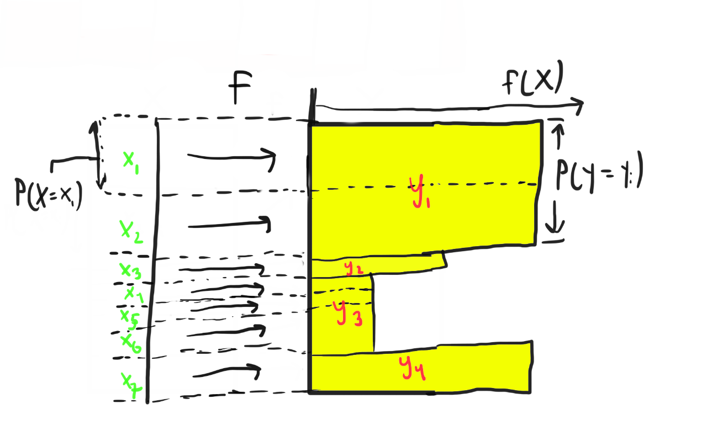

The yellow area is the expected value of $f(x) = Y$. By the definition of expected value, we can sum up the areas of the yellow rectangles to get $E(f(X))$. What we've now done is "reduced" this to a process like this: pick $y_1$, looking at the $x_i$ that map to it with $f$ ($x_1$ and $x_2$ in this case), and find these probabilities and multiply them by $f(x_1)=f(x_2)=y_1$. So we add up the rectangles in the slots marked by the dotted lines, and we do it with this weird double-iteration of looking first at $y_i$s and then at $x_i$s.

But once we've put it this way, it's simple to see we get the same result if we iterate over the $x_i$s, get the corresponding rectangle slice for each, and add it all up. This corresponds to the formula we had above (summing $f(x_i) P(X=x_i)$ over all possible $i$).

#### Bayes' theorem (odds ratio and continuous form)

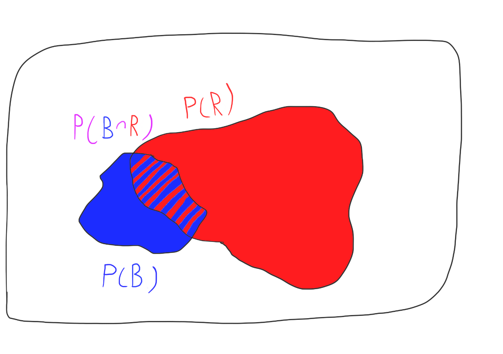

Above is a Venn diagram of a sample space (the box), with the probabilities of event $B$ and event $R$ marked by blue and red areas respectively (the hatched area represents that both happen).

By the definition of conditional probability,
$$
P(R|B)=\frac{P(B \cap R)}{P(B)}, \text{ and} \\
P(B|R)=\frac{P(B \cap R)}{P(R)}.
$$
Bayes theorem is about answering questions like "if we know how likely we are to be in the red area given that we're in the blue area, how likely are we to be in the blue area if we're in the red?" (Or: "if we know how likely we are to have symptoms if we have covid, how likely are we to have covid if we have symptoms?").

Solving both of the above equations for $P(B \cap R)$ and equating them gives
$$
P(R|B) P(B) = P(B|R) P(R),
$$
which is the answer – just divide out by either $P(B)$ or $P(R)$ to get, for example,
$$
P(B|R) = \frac{P(R|B)P(B)}{P(R)}.
$$
Let's say we split $B$ into $B_1$ and $B_2$ – two different variants of covid, say. Now instead of talking about probabilities, let's talk about odds: let's say the odds ratios that a random person has no covid, has variant 1, and has variant 2 are 40:2:1, and that symptoms are, compared to the no-covid population, ten times as likely in variant 1 and twenty times as likely in variant 2 (in symbols: $P(R| \neg B_1 \cap \neg B_2)/40 = P(R|B_1) / 2 = P(R|B_2)$). Now we learn that we have symptoms and want to calculate posterior probabilities, to use Bayes-speak.

To apply Bayes' rule, you could crank out the formula exactly as above: convert odds to probabilities, divide out by the total probability of no covid or having variant 1 or 2, and then get revised probabilities for your odds of having no covid or a variant. This is equivalent to keeping track of the absolute sizes of the intersections in the diagram below:


But this is unnecessary. When we learned we had symptoms, we've already zoomed in to the red blob; that is our sample space now, so blob size compared to the original sample space no longer interests us.

So let's take our odds ratios directly, and only focus on relative probabilities. Let's imagine each scenario fighting over a set amount of probability space, with the starting allocations determined by prior odds ratios:


Now Bayes rule says to multiply each prior probability $P(B_i)$ by $P(R|B_i)$. To adjust our prior odds ratio 40:2:1 by the ratios 1:10:20 telling us how many times more likely we are to see $R$ (symptoms) given no covid or $B_1$ or $B_2$, just multiply term-by-term to get 40:20:20, or 2:1:1. You can imagine each ocutome fighting it out with their newly-adjusted relative strengths, giving a new distribution of the sample space:


Now if we want to get absolute probabilities again, we just have to scale things right so that they add up to 1. This tiny bit of cleanup at the end (if we want to convert to probabilities again) is the only downside of working with odds ratios.

This gives us an idea about how to use Bayes when the sample space is continuous rather than discrete. For example, let's say the sample space is between 0 and 100, representing the blood oxygenation of a coronavirus patient. We can imagine an approximation where we write an odds ratio that includes every integer from 0 to 100, and then refine that until, in the limit, we've assigned odds to every real number between 0 and 100. Of course, at this point the odds ratio interpretation starts looking a bit weird, but we can switch to another one: what we have is a probability distribution, if only we scale it so that the entire thing integrates to one.

The same logic applies as before: if we now get some piece of evidence, like the patient's age, and know how the likelihood ratios of the patient being that age given each blood oxygenation level, we can just go through and multiply the prior likelihoods of each blood oxygenation level by the ratios given the new piece of evidence.

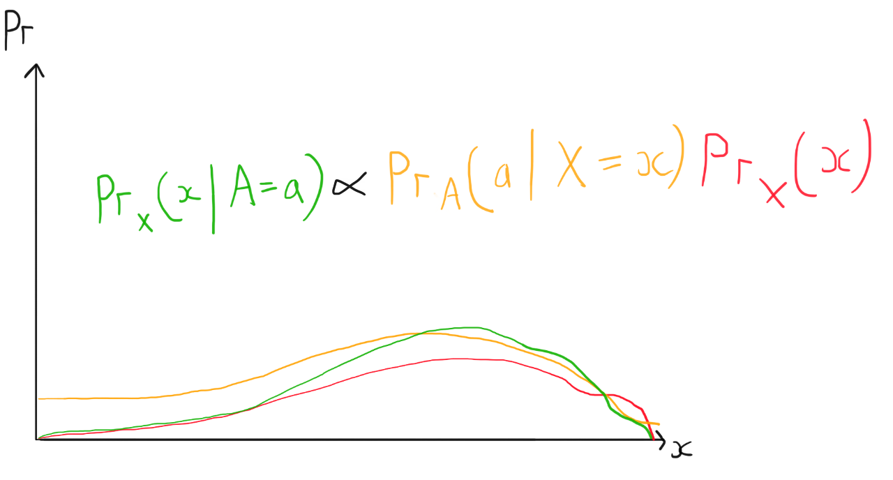

Above, the red line is the initial distribution of blood oxygenation $x$ across all patients. The yellow line represents the relative likelihoods of the patient's actual known age $a$ given a particular $x$. The green line is the product of these two, and it's our relative posterior. To interpret it as a probability distribution, we have to scale it vertically so that it integrates to 1 (that's why we write above that the LHS and RHS are proportional, not equal).

Now let's say more evidence comes in: the patient is unconscious (which we'll denote $U=\text{"yes"}$). We can repeat the same process of multiplying out relative likelihoods and the prior, this time with the prior being the result in the previous step:

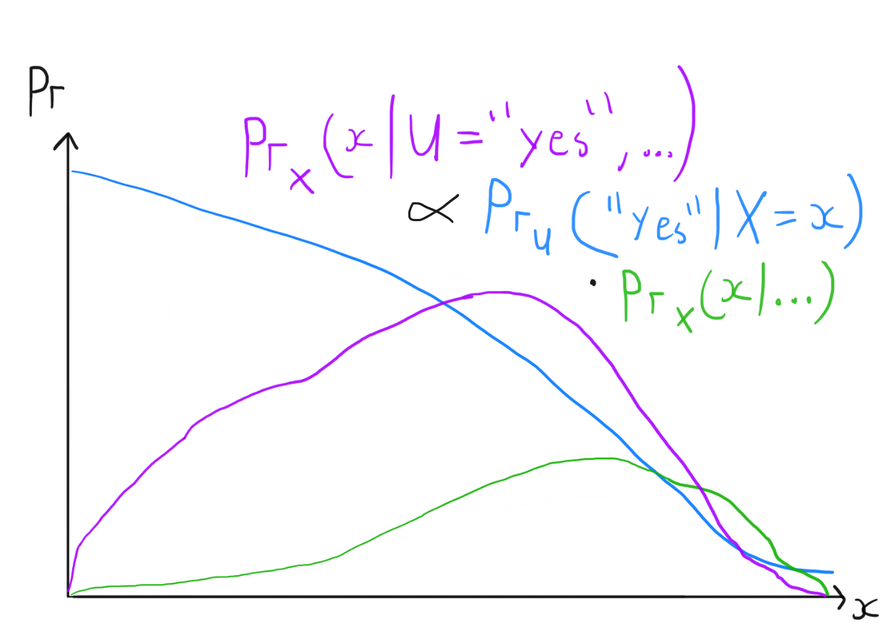

We can see that in this case the blue line varies a lot more depending on $x$, and hence our distribution for $x$ (the purple line) changes more compared to our prior (the green line). Now let's say we have a very good piece of evidence: the result $m$ of a blood oxygenation meter $M$.

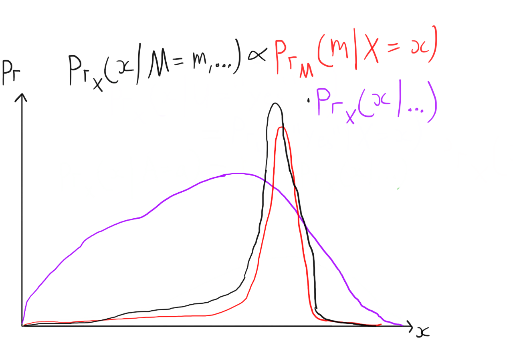

There's some error on the oxygenation measurement, so our final belief (that $x$ is distributed according to the black line) is very clearly a distribution of values rather than a single value, but it's clustered around a single point.

So to think through Bayes in practice, the lesson is this: throw out the denominator in the law. It's a constant anyways; if you really need it you can go through some integration at the end to find it. But it's not the central point of Bayes' theorem. Remember instead: prior times likelihood ratio gives posterior.

### Computation vs maths

Today we have computers. Statistics was invented before computers though, and this affected the field; work was directed to all the areas and problems where progress could be made without much computation. The result is an excellent theoretical mathematical underpinning, but modern statistics can benefit a lot from a computational approach – running simulations to get estimates and so on. For the simple problems there's an (imprecise) computational method and a (precise) mathematical method; for complex problems you either spend all day doing integrals (provided they're solvable at all) or switch to a computer.

In this post, I will focus on the maths, because the maths concepts are more interesting than the intricacies of NumPy, and because if you understand them (and programming, especially in a vectorised style), the programming bit isn't hard.


## Fitting models

A probability model tries to tell you how likely things are. Fitting a probability model to data is about finding one that is useful for given data.

 

Above, we have two axes representing whatever, and the intensity of the red shading is the probability attributed to a particular pair of values.

The model on the left is simply bad. The one in the middle is also bad, though; it assigns no probability to many of the data points that were actually seen.

Choosing which distribution to fit – or whether to do something else entirely – is sometimes obvious, sometimes not. Complexity is rarely good.

### Maximum likelihood estimation (MLE)

Let's say we do have a good idea of what the distribution is; the weight of stray cats in a city depends on a lot of small factors pushing both ways (when it last caught a mouse, the temperature over the past week, whether it was loved by its mother, etc.), so [we should expect a normal distribution](https://en.wikipedia.org/wiki/Bean_machine). Well, probably.

Let's say we have a dataset of cat weights, labelled $x_1$ to $x_n$ because we're serious maths people. How do we fit a distribution?

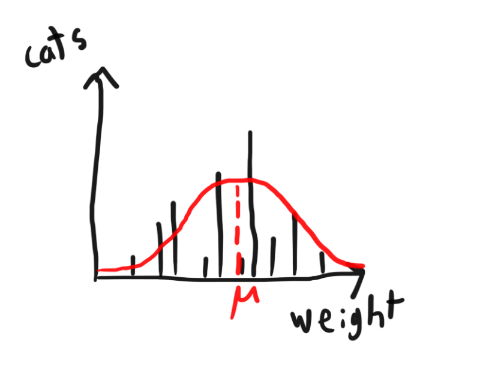

Step 1 is Wikipedia. Wikipedia tells us that a normal distribution has two parameters, $\mu$ (the mean) and $\sigma$ (the standard deviation), and that the likelihood (not probability! see above) a normal distribution $X$ with those parameters takes a value $x$ is
$$
\Pr_X(x)=
\frac{1}{\sigma \sqrt{2 \pi}}
e^{-\frac{1}{2}\big(
\frac{x-\mu}{\sigma}
\big)^2}.
$$
Oh dear.

After a moment's thought, we can interpret it more clearly:
$$
\Pr_X(x) = \frac{\text{blah}}{\sigma \text{ blah}}
\text{blah}^{\text{-blah}
{\big(\frac{x-\mu}{\sigma}\big)^2}}.
$$
So it's just an exponential that decays in both directions from $\mu$, and that's squeezed by $\sigma$.

(Why are there constants then? Because it's a probability distribution, and must therefore integrate to 1 over its entire range or else all hell will break loose.)

Step 2 is philosophising. What does it really mean to get the best fit of a distribution?

The first thing we can notice is that there are only two dials we can adjust: the values of $\mu$ and $\sigma$. For this particular problem at least, we've reduced the massive problem of picking the best model to one of finding the best spot in a 2D space (well, half of 2D space, since $\sigma$ must be greater than zero).

The second thing we can notice is that the only tool we have at our disposal here to tell us about the fit to the distribution is the likelihood function, and when all you have is a likelihood function ...

A good fit will give high likelihoods to the points in the data set (we can't get an arbitrarily good fit by giving everything a lot of likelihood, because there's only so much likelihood to go around – the probabilities that the likelihood function assigns across its domain must sum to 1).

Let's call the likelihood of the data, given some model, to be the likelihood that we get that specific data set if the model is correct (if we have a lot of data points, the likelihood of any particular set of them will usually be very low). And let's go ahead and try to tune the model so that the likelihood of our data is maximised.

(Remember, likelihood is probability, except for continuous random variables like our normal distribution, where we can't talk about the probability of a dataset (only about something like the probability of getting a dataset at least as close as [some metric] to the dataset).)

Step 3 is algebra. So what is the likelihood of all our data? Using basic probability, it's the product of the likelihoods of each data point (just like the probability of getting a set of independent events is the product of the probabilities of each event). Returning to our normal distribution with cat data $x_1$ to $x_n$, the likelihood of the data given distribution $X$ with mean $\mu$ and standard deviation $\sigma$ is
$$
\begin{align}
\Pr_X(x_1) \cdot \Pr_X(x_2) \cdot ... \cdot \Pr_X(x_n) \\
=&
\frac{1}{\sigma \sqrt{2 \pi}}
e^{-\frac{1}{2}\big(
\frac{x_1-\mu}{\sigma}
\big)^2}
\cdot ... \cdot
\frac{1}{\sigma \sqrt{2 \pi}}
e^{-\frac{1}{2}\big(
\frac{x_n-\mu}{\sigma}
\big)^2} \\
=&
\left(\frac{1}{\sigma \sqrt{2 \pi}} \right)^n
e^{-\frac{1}{2}\big( \big(
\frac{x_1 - \mu}{\sigma}
\big)^2
+
...
+
\big(\frac{x_n - \mu}{\sigma}
\big)^2
\big)}.
\end{align}
$$
Oh dear. Maximising this is a pain.

Thankfully, there's a trick. We don't care about the likelihood, only that we set $\mu$ and $\sigma$ so that the likelihood is maximised. We can apply any monotonically increasing function to the likelihood, maximise that, and we'll have the $\mu$ and $\sigma$ that maximise the original mess.

Which monotonically increasing function? Logarithms are generally best, because they convert the products you get from calculating the likelihood of a dataset into sums (and in this case they're especially nice, because they'll also take out the exponentials in our distribution's likelihood function).

In fact, throw away the previous calculation, note that
$$
\begin{align}
\log\Pr_X(x) &= -\log(\sigma \sqrt{2 \pi})
- \frac{1}{2} \left(\frac{x-\mu}{\sigma}\right)^2 \\
&=
-\log(\sqrt{2 \pi}) - \log(\sigma)
- \frac{1}{2} \left(\frac{x-\mu}{\sigma}\right)^2, \\
\end{align}
$$
from which we can throw away the $\log(\sqrt{2\pi})$ because it's the same in each term, and then sum all the rest up to get a total log likelihood of
$$
-n\log(\sigma)
- \sum_{i=1}^n \Big(
\frac{1}{2} \left(\frac{x_i-\mu}{\sigma}\right)^2
\Big).
$$
Call this $f$; the values of $\mu$ and $\sigma$ that maximise it are when when $\frac{\partial f}{\partial \mu} = 0$ and $\frac{\partial f}{\partial \sigma} = 0$; that's when we've found our peak on the 2D space of possible $(\mu, \sigma)$ pairs (technically this condition only tells us it's a stationary point, but it turns out to be the maximum, as you can prove by taking more derivatives).

So the maximum satisfies
$$
\begin{align}
\frac{\partial f}{\partial \mu} =
-\sum_{i=1}^n \Big(
\frac{x_i-\mu}{\sigma}
\Big)
&= 0, \text{ and} \\
\frac{\partial f}{\partial \sigma} =
-\frac{n}{\sigma}
+ \sum_{i=1}^n \left(
\frac{(x_i - \mu)^2}{\sigma^3}
\right)
&= 0.
\end{align}
$$
The first condition gives
$$
\hat{\mu} = \frac{1}{n}\sum_{i=1}^n x_i,
$$
in other words that $\hat{\mu}$, our best estimator function for the value of $\mu$, is the average of the values in the data set.

From the second condition, we can do algebra to get
$$
\hat{\sigma} = \sqrt{\frac{1}{n}
\sum_{i=1}^n(x_i-\mu)^2}.
$$
We need to be careful here, though. When writing out the conditions, $\mu$ and $\sigma$ stood for specific values of the parameters of the normal distribution $X$. We don't know these values; the best we can do is estimate them with *estimators*, which are technically not values but functions that take a data set and return an estimated value (and denoted by $\hat{\text{hats}}$). We can't have unknown values in our definition of $\hat{\sigma}$, as we currently do with the $\mu$ in it; we have to replace it with the estimator for $\mu$ like this:
$$
\hat{\sigma} = \sqrt{\frac{1}{n}
\sum_{i=1}^n(x_i-\hat{\mu})^2}
$$
– making sure that the estimator $\hat{\mu}$ does not depend on $\hat{\sigma}$ , since that would again make things undefined – or then by writing out the $\hat{\mu}$ estimator like this:
$$
\hat{\sigma} = \sqrt{\frac{1}{n}
\sum_{i=1}^n \left(x_i-\frac{1}{n}\sum_{i=1}^n x_i\right)^2},
$$
which at least makes it very clear that the $x_i$s and their number $n$ define $\hat{\sigma}$. 

When you're done defining your estimators, you should have a clear diagram in your head of how to pour data into the functions you've written down and come out with concrete numbers, with no dangling inputs anywhere – you're not done if you have any.

### Supervised and unsupervised learning

There are two main types of fancy model fitting we can do:

1. Supervised learning, where we have a set of pairs (of numbers or anything else) and we try to design a system to predict one element from the other. For example, maybe we measure the length and weight of some stray cats, but get bored of trying to get them to stay on the scale long enough, so we want to ditch the weighing and predict a weight from the length alone – how well can we do this?
2. Unsupervised learning, where we have our data (as a set of tuples of associated data, like cat lengths, weights, and locations), and we try to fit a model to it so we can generate similar items; maybe we want to fake a larger stray cat population in our data than actually exists but not get caught by the statistics bureau. (This category also includes things like trying to [identify clusters](https://en.wikipedia.org/wiki/Unsupervised_learning) to interpret the data.) Fitting a distribution is perhaps the simplest example: using our one-dimensional cat weight database discussed in the MLE section, we can "generate" new cats by sampling from it, though the "cat" will just be the weight number. The more interesting case is when we have to generate a lot of associated data; for example, [this website](https://thispersondoesnotexist.com/) offers you a new face every time you reload it. Behind it is a probability distribution for a human face in some crazy-dimensional variable space that's detailed enough that sampling it gives you all the data needed to figure out the colours of each pixel in a photorealistic face picture.

The unifying idea is maximum likelihood estimation (MLE). Clearly, something like MLE is needed if you want to fit a distribution to data for unsupervised learning; we're going to need to generate something eventually, so we better have a probability model. It's less clear that supervised learning has anything to do with MLE though, and tempting to think of it as defining some random loss function to measure how bad a fit is, and then minimising that. It's possible to think of supervised learning this way, but then you'll end up with a lot of detail about loss functions in your head, all of which will seem to be pulled out of thin air.

Instead, think of supervised learning as MLE too. We specify a probability model, which will take in some parameters (e.g. the exponent $a$ and constant $b$ in a cat length/weight model like $\text{weight} = b \times \text{length}^a + \epsilon$, where $\epsilon$ is a normally distributed error term with mean 0 and some standard deviation we either know already or then ask the fitting procedure to find for us), and the value of the predictor variable(s) (e.g. the cat's length), and spit out its prediction of the variable(s) of interest.

(Note that often the variable of interest is not numerical, but a label: "spam", "tumour", "Eurasian oystercatcher", etc.)

In fact, seen from the MLE perspective, it can almost be hard to see the difference – if so, good. Just look at the processes:

1. Unsupervised learning:
   1. Get your dataset $x = (x_1, x_2, ..., x_n)$.
   2. Decide on a probability model (e.g. a simple distribution) $X$ with a parameter set $\theta = (\theta_1, \theta_2, ..., \theta_m)$.
   3. Find the $\theta$ that maximises $\Pr_X(x_1; \theta) \times ... \times \Pr_X(x_n; \theta)=\Pr_X(x;\theta)$,* since assuming our data points are drawn independently, this is the likelihood of the dataset.
2. Supervised learning:
   1. Get your dataset of pairs of the form (thing to predict, thing to predict from): $((y_1, x_1), (y_2, x_2), ..., (y_n, x_n))$.
   2. Decide on a probability model $Y$ that which relies on parameter set $\theta = (\theta_1, \theta_2, ..., \theta_n)$, and also $x_i$, to predict $y_i$..
   3. Find the $\theta$ that maximises $\Pr_Y(y_1;x_1, \theta) \times ... \times \Pr_Y(y_n; x_n, \theta) = \Pr_Y(y_1, ..., y_n; x_1, ...., y_n, \theta)$.*

*(We write $\Pr_X(x_i;\theta)$ to mean the likelihood that $X$ takes the value $x_i$ if the parameters are $\theta$; we avoid writing it as a conditional probability $\Pr_X(x \, |\, \theta)$ because interpreting this as a conditional probability is technically only valid with a Bayesian interpretation.)

### Linear models

You can invent any model you choose. As always, simplicity pays though, and it turns out that there's a class of probability models which are easy to work with and reason about, for which general algorithms and mathematical tools exist, and which is often good enough: linear models.

The word "linear" immediately brings to mind straight lines. That's not what it means in this context. The linearity in linear models is because the output is a linear combination of "features" (predictor variables).

The general form is
$$
\hat{y_i} = c_1 e_{1,i} + c_2 e_{2,i} + ...  +c_n e_{n,i},
$$
where $\hat{y_i}$ is the predicted value, $c_1$ through $c_n$ are constants, and $e_{1,i}$ through $e_{n,i}$ are the features describing the $i$th set of data. In the simplest case, a feature might be a value we measure directly, but in general it can be any function of data we measure. Ideally, we want that the true value $y_i \approx c_1 e_{1,i} + ... + c_n e_{n,i}$.

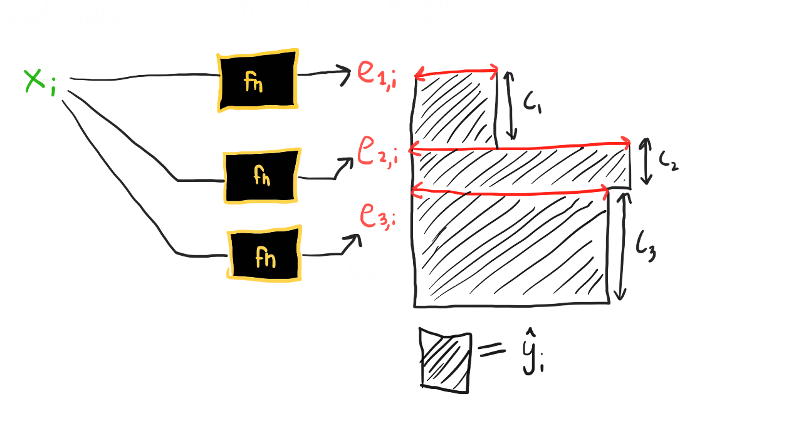

In the above diagram, we see we measure the data $x_i$ (note that it can be a tuple of values rather than a single value), pass it through some blackbox function to generate features, and take the prediction $\hat{y_i}$ to be the sum of multiplying together each feature by the weight assigned to it.

Note that the linear model above is a prediction-maker but not a probability model because it doesn't assign likelihoods. The probability model for a linear model is often taken to be
$$
y_i = c_1 e_{1,i} + c_2 e_{2,i} + ...  +c_n e_{n,i}
+ \epsilon
$$
that is, there's an error term $\epsilon$ that we assume to be a normal distribution with standard deviation $\sigma$ (which may be known, or finding it may be part of fitting the model).

The above is also an equation for predicting one specific output ($y_i$) from one specific set of features, which in turn are determined by one specific input (e.g. a single data point). More generally we can write it in vector form:
$$
\pmb{y} \approx c_1 \pmb{e_1} + ... + c_n \pmb{e_n},
$$
where $\pmb{y}=(y_1, y_2, ..., y_{n})$, and likewise $\pmb{e_j}$ is a vector whose $i$th position corresponds to the $j$th feature of the $i$th data item.

Note that we can read this equation in two ways: as a vector equation about data, as just described, that's fitted to give $\pmb{y}$ from its features, or as a prediction, saying that the value of a particular $y_i$ will be roughly this.

There's a set of standard tricks to use in linear modelling:

- "One-hot coding": using a function that is 0 unless the input data satisfies some condition (having a label, exceeding a value, etc.).
- If we have the data point $x_i$, using the features $e_{0,i} = 1$, $e_{1,i} = x_i$, and $e_{2,i} = x_i^2$ to fit a quadratic (if you fit a polynomial of degree higher than 2 without a very solid reason, you're probably overfitting).
- We often have a pattern with a known period $T$ (days, years, etc.), and some non-zero starting phase $\phi$. Therefore we'd want a feature like $\sin((2\pi/T)x+\phi)$, where $x$  to is an input, to fit this pattern to. If $\phi$ is known, we don't have a problem, but if we want to fit the phase, it doesn't work: the model is not linear in $\phi$. To fix this, use a trig angle addition identity; the above becomes $\sin(\phi) \cos((2\pi/T)x) + \cos(\phi) \sin((2\pi/T)x)$, where $\sin(\phi)$ and $\cos(\phi)$ are just constants so can be forgotten about because the fitting model will determine the constants of our features. (Recovering $\phi$ from the final constants will take a bit of maths; note that the constant of the cosine and sine terms in the fitted model will have the amplitude mixed in, in addition to $\phi$.)

Here's an annotated linear model with parameter interpretation:

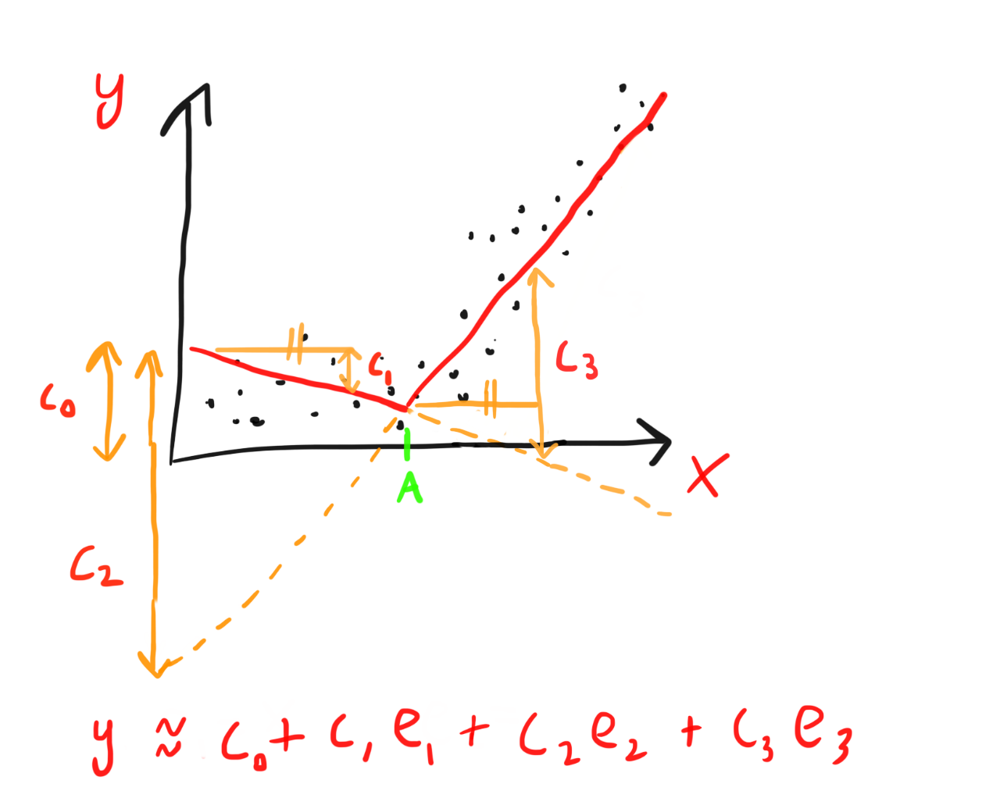

The features in this model:

- $e_1=x$.
- $e_2$ is 0 if $x < A$ and 1 otherwise.
- $e_3$ is 0 if $x < A$ and $x$ otherwise.

(If we want to fit the best value of $A$, we'll have to do some maths and reconfigure the model. Right now $A$ is a constant that's defined in the functions that calculate the features from the input data.)

The interpretation of the constants:

- $c_0$ is the prediction for $x=0$.
- $c_1$ is the base slope.
- $c_2$ is the difference between the prediction for $x=0$ (the $y$-intercept of the $x < A$ line) and the $y$-intercept of the $x>A$ line.
- $c_3$ is how much the slope changes after $x=A$.

We could have chosen different features (for example, letting $e_1 = 0$ for $x > A$), and then gotten perhaps more readable constants ($c_3$ would become just the slope, not the difference in slope). We could also have added a feature like $e_4 = x^2$, and then the model would no longer look like just straight lines. But whatever we do, we need to be careful to interpret the constants we get correctly, especially when the model gets complicated.

For our cat weight prediction example, we might expect weight $W$ and length $L$ to have a relation like $W \approx c L^3$, where $c$ is a constant that the model will fit. If we want to ask questions about whether a cubic relation really is the best, take logs and fit something like $\log(W) = c_1 + c_2 \log(L)$ – $c_2$ tells us the exponent.

#### Feature spaces and fitting linear models

The main benefit of linear models is that by talking about linear combinations of data vectors we reduce the maths of fitting parameters to linear algebra. Linear algebra is about transformations of space and the vectors in it, so it also allows for a visual interpretation of everything.

Let's say we have a model like this:
$$
\pmb{y} \approx c_1 \pmb{e_1} + c_2 \pmb{e_2}.
$$
Here, $\pmb{y}$ is the actual measured data, and $\pmb{e_i}$ are functions of the (also measured) predictor variables. Let's say $\pmb{y} = (y_1, y_2, y_3)$ – i.e., we have three data points. We can imagine $\pmb{y}$ as a vector pointing somewhere in 3D space, with $y_1$, $y_2$, and $y_3$ the distances along the $x$, $y$, and $z$ axes. Likewise, $\pmb{e_1}$ and $\pmb{e_2}$ can be thought of as 3D vectors encoding some (function of the) data we've measured.

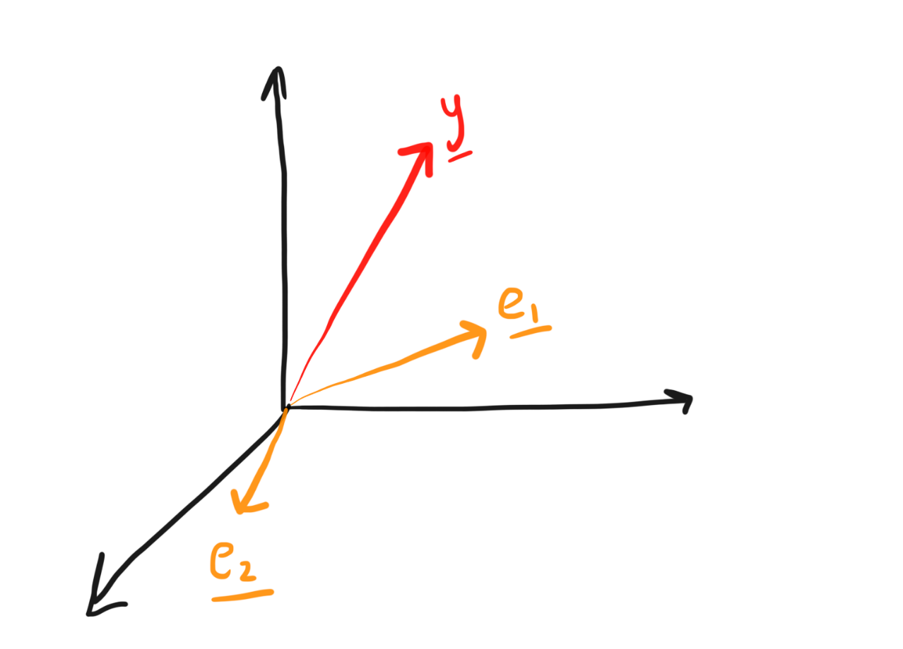

Now the only dials a linear model gives us to adjust are the weights of $\pmb{e_1}$ and $\pmb{e_2}$: $c_1$ and $c_2$. There's a 2D space of them (since there are two constants to adjust – $c_1$ and $c_2$), and as it happens, there's a nice geometric interpretation: each pair $(c_1, c_2)$ corresponds to a point on the plane spanned by $\pmb{e_1}$ and $\pmb{e_2}$ (specifically, the point you get to if you move $c_1$ times along $\pmb{e_1}$ and then $c_2$ times along $\pmb{c_2}$).

So what are the best values of $c_1$ and $c_2$? The intuitive answer is that we want to get as close as possible to $\pmb{y}$:

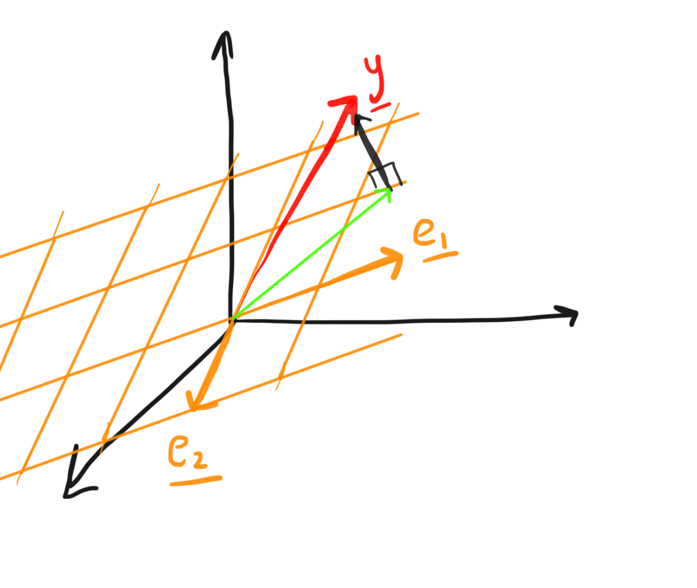

In this case, the closest to $\pmb{y}$ that we can reach on the plane spanned by $\pmb{e_1}$ and $\pmb{e_2}$ is the green vector, and the black vector is the difference between the predicted data vector and actual data vector.

Mathematically, what are we doing here? We're minimising the distance between the vector $\hat{\pmb{y}} = c_1 \pmb{e_1} + c_2 \pmb{e_2}$ (where $c_1$ and $c_2$ can be varied) and $\pmb{y}$; this distance is given by
$$
\sqrt{(\hat{y_1} - y_1)^2
+ (\hat{y_2} - y_2)^2
+ (\hat{y_3} - y_3)^2
}.
$$
Previously we simplified optimisation by applying a logarithm (a monotonically increasing function) and optimising that; this time we do the same by applying the squaring function (which is monotonically increasing for positive numbers, which our distance is limited to). This means that the quantity to minimise is
$$
(\hat{y_1} - y_1)^2
+ (\hat{y_2} - y_2)^2
+ (\hat{y_3} - y_3)^2.
$$
In other words, we minimise the sum of squared errors ("least squares estimation" is the most common phrase).

If we have more than three data points, then we can't picture it, but the idea is exactly the same. Fitting an $n$-dimensional dataset to a linear model of $m$ features boils down to moving as close as possible in $n$D space to the observed data vector, while limited to the $m$-dimensional (at most; see below) space spanned by the features.

(Above, $n=3$ and $m=2$. Generally $n$ is huge because datasets can be huge, while $m$ is much smaller since it's the number of features we've written down into the model.)

> A maths lecturer is giving a lecture about 5-dimensional geometry.
>
> A student asks a question: "I can follow the algebra just fine, but it would be helpful if I could visualise it. Is there any way to do that?"
>
> The lecturer replies: "Oh, it's easy. Just imagine everything in $n$ dimensions, and then let $n=5$."
>
> 
>
> (variants of this joke are common; see for example [here.](http://www.personal.psu.edu/sxt104/mathjoke1.html))

##### Linear independence

A set of vectors is linearly dependent if there exists a vector in it that can be written as a linear combination of the other vectors. If your feature vectors are linearly dependent, you will get the same predictions out of your model, but you can't interpret the coefficients.

(For visual intuition: two vectors in 2D are linearly dependent if they lie on the same line, three vectors in 3D are linearly dependent if they lie on the same plane (a superset of the case that they lie on the same line), and so on.)

An easy way to make this mistake is if you're doing one-hot coding of categories. Let's say you're fitting a linear model to estimate student exam grades $y$ based on their university, with a model that looks like this:
$$
y \approx \alpha + \beta \cdot 1_{\text{Oxford}}+\gamma\cdot1_{\text{Cambridge}}+...,
$$
using indicator function notation. Whatever linear fitting routine you do will happily give you coefficient values and the predictions it gives will be sensible, but you won't be able to interpret the coefficients. To see what's happening, consider an Oxford student: their predicted grade $y$ is $\alpha + \beta$. What is $\alpha$ and $\beta$? Good question – we can only assign meaning to their combination. If instead we eliminate one university and write
$$
y \approx \alpha + \beta \cdot 1_{\text{Cambridge}} + ...,
$$
when we now fit the coefficients, $\alpha$ will be the predicted grade for Oxford students, and $\alpha+\beta$ the predicted grade for Cambridge students, so we can interpret $\alpha$ as the Oxford average, and $\beta$ as the difference between Oxford and Cambridge. (The predictions given by the model won't change though.)

The vector interpretation is that if our dataset contains, say, 3 Oxford students followed by 2 Cambridge students, the (5D) data vectors in the first model will be
$$
\alpha \begin{pmatrix}1 \\ 1 \\ 1 \\ 1 \\ 1\end{pmatrix}
+ \beta
\begin{pmatrix}1 \\ 1 \\ 1 \\ 0 \\ 0\end{pmatrix}
+ \gamma
\begin{pmatrix}0 \\ 0 \\ 0 \\ 1 \\ 1\end{pmatrix}.
$$
But these vectors aren't linearly independent: the last two vectors sum up to the first one, and therefore there will be many triplets $(\alpha, \beta, \gamma)$ that give identical predictions.

#### Linear fitting and MLE

We talked about MLE being the holy grail of model fitting, and then about linear models and how fitting them comes down to a geometry problem. As it turns out, MLE lurks behind least squares estimation as well.

I mentioned earlier that linear models often assume a normal distribution for errors. Let's assume that, and do MLE.

Our model is that
$$
Y_i = c_1 e_{1,i} + ... + c_n e_{n,i} + \epsilon,
$$
where $\epsilon \sim N(0,\sigma^2)$ (i.e. follows a normal distribution with mean zero and standard deviation $\sigma$).

A useful property of normal distributions is that if we add a constant $c$ to a normal distribution with mean $\mu$, the result has a normal distribution with mean $\mu + c$ and the same standard deviation (this isn't true of all distributions!). Therefore we can write the above as
$$
Y_i \sim N(c_1 e_{1,i} + ... + c_n e_{n,i}, \sigma^2).
$$
The likelihood for getting $y$ is
$$
\Pr_Y(y;c_1...c_n, \sigma)
=
\frac{1}{\sigma \sqrt{2 \pi}}
e^{-\frac{1}{2}
\left(
\frac{y - (c_1 e_{1,i} + ... + c_n e_{n,i})}
{\sigma}
\right)^2},
$$
once again copying out the likelihood function for normal distributions.

Now remember that we just want to fit $c_1$ through $c_n$. These only occur in the exponent, so we can ignore all the constants out front, and also we can see that since there's a negative in the exponent, maximising it is equivalent to minimising the stuff in the exponent. Taking out $\sigma$ and constants, the relevant stuff to minimise is
$$
(y-(c_1 e_{1,i} + ... + c_n e_{n,i}))^2,
$$
where we can see that the thing we subtract from $y$ is our model's prediction of $y$ (one component of what we previously denoted $\hat{\pmb{y}}$). Once again, we can see we're minimising a square of the error. Of course, we have many $y$-values to fit; to see that it's the sum of these that we minimise, rather than some other function of them, just note that if we take a logarithm we'll get a term like the above (times constants) for each data point we're using to fit.

So least-squares fitting comes from MLE and the assumption of normally distributed errors.

(Are errors normally distributed? Often yes. Remember though that our features are functions of things we measure; even if $x$ has normally-distributed errors, after we apply an arbitrary function to it to generate feature $e$, the resulting $e$ might not have normally distributed errors (but for many simple functions it still will). We could be more fancy, and devise other fitting procedures, but often least squares is good enough.)

### Empirical distributions

What's the simplest probability model we can fit to a dataset? It's tempting to think of an answer like "a normal distribution", or "a linear model with one linear feature". But we can be even more radical: treat the dataset itself as a distribution.

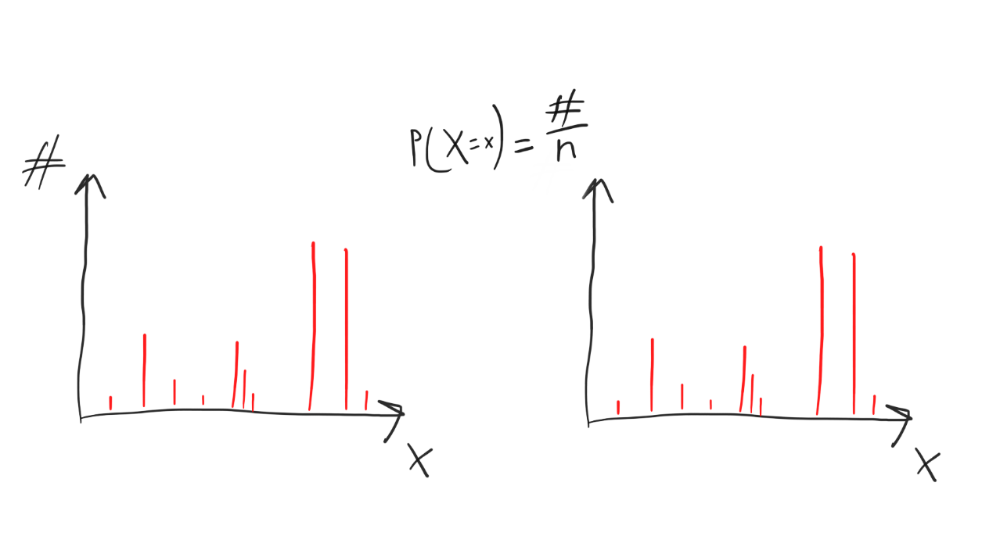

On the left, we've plotted the number of data points that take different values of $x$ (this is a discrete distribution; for a continuous distribution, the probability that any two samples drawn are equal is infinitesimal). On the right, all we've done is normalised the distribution, by rescaling the vertical axis so that the heights of all the bars sum to one. Once we've done that, we can go ahead and call it a probability distribution, and assign the meaning that the height of the bar at $x$ is the probability that the distribution $X$ that we've just defined takes the value $x$. This is called an empirical distribution.

Sampling from an empirical distribution is easy – just pick a value at random from the dataset. (Of course, the likelihood such a distribution assigns to any value not in the dataset is zero, which can be a problem for many use cases.)

In fact, you've probably already dealt with empirical distributions, at least implicitly. When you calculate the mean and variance of a dataset, you can interpret this as calculating the properties of the empirical distribution given by that dataset. An empirical distribution as an abstract thing apart from your dataset may seem ad hoc, but it's not any less defined than a normal distribution.

The standard way to illustrate an empirical distribution is by plotting its cumulative distribution function (cdf); an empirical one is known as an ecdf. This is almost necessary for continuous variables. In general, the ecdf of a dataset is a very useful and general way to visualise it: it saves you from the pains of histograms (how large to make the bins? if you take logs or squares first, do you take them before or after binning? etc. etc.), and is also complete in the sense of technically displaying every point in the dataset.

The ecdf for the above distribution would look something like this:

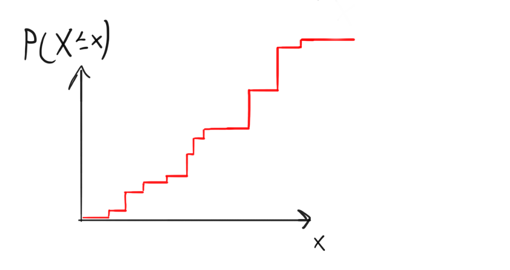

(Like any cdf, it takes the value 0 up until the first data point and the value 1 after the last data point.)

If we now fit any parametric (i.e. non-empirical) distribution, comparing its cdf to the ecdf is a good test of how good the fit is.

#### Measuring the goodness of a model fit with KL divergence

The empirical distribution is the best possible fit to a given dataset, and therefore it's a good benchmark to measure the fit of a proposed model against.

Let's say our data is $x=x_1, ... ,x_n$, and the empirical distribution is $X^*$. The likelihood of drawing $x$ from $X*$ is (under the assumption of each $x_i$ being drawn independently)
$$
\Pr_{X^*}(x_1) \cdot ... \cdot \Pr_{X^*}(x_n).
$$
Now $\Pr_{X^*}(x_i)$ is just the fraction of how many $x_j$ in $x$ are equal to $x_i$. Writing $N_{x_i}$ to mean the number of values equal to $x_i$ in the data, we can write
$$
\Pr_{X^*}(x_i) = \frac{N_{x_i}}{n}.
$$
Taking logs, and writing $q_i = N_{x_i} / n = \Pr_{X^*}(x_i)$, the above product for the likelihood becomes the sum for the log likelihood:
$$
\sum_{i=1}^{n} N_{x_i} \log(q_i).
$$


Now we'll do one last trick, which is to scale by $1/n$; otherwise, the term in front of the log will tend to be bigger if we have more data points, while we want something that means the same regardless of how many data points there are. After we do that, we notice a nice symmetry:
$$
\sum_{i=1}^n q_i \log(q_i).
$$
This is a good baseline to compare any other model to. For example, let's say we fit to this a (discrete) distribution $X$ (with the same sample space as $X^*$) with parameters $\theta$. Write $p_i = \Pr_X(x_i; \theta)$, and we can express the log likelihood of the dataset as
$$
\sum_{i=1}^{n} N_{v_i} \log(p_j).
$$
Normalising by $1/n$ as before, we get
$$
\sum_{j=1}^{n} q_i \log(p_i).
$$
Now to get a measure of fit goodness, just subtract, and do some algebra on top if you feel like it:
$$
\sum_{i=1}^n q_i \log(q_i) - \sum_{i=1}^{n} q_i \log(p_i) \\
= \sum_{i=1}^n q_i \log(q_i/p_i) \\
= \sum_{i=1}^n \Pr_{X^*}(x_i)
\log\left(\frac{\Pr_{X^*}(x_i)}{\Pr_X(x_i;\theta)}\right).
$$
(In the last step, I've just expanded out our earlier definitions of $p_i$ and $q_i$.)

This is called the Kullback-Leibler divergence (KL divergence). If $X=X^*$, then it comes out to 0; for worse fits, the value becomes greater.

There's a nice information theoretic interpretation of this result. $- \sum_{i} q_i \log_2(p_i)$ is the average number of bits needed to most efficiently represent a value randomly drawn from the dataset, using a coding scheme optimised for the distribution $X$. $-\sum_{i} q_i \log_2(q_i)$ is the same, but using the optimal coding scheme: the one designed for the empirical distribution. The difference we have in the first line is the first minus the second; i.e. the number of wasted bits that we could shave off a message describing an item in the dataset if we used the theoretically optimal encoding.
