# Data science: part 2

See the [first post](http://strataoftheworld.blogspot.com/2020/12/data-science-1.html) for an introduction.

## Monte Carlo methods

In the late 1940s, Stanislaw Ulam was trying to work out the probability of winning in a solitaire variant. After cranking out combinatorics equations for a while, he had the idea that simulating a large number of games starting from random starting configurations with the "fast" computers that were becoming available could be a more convenient method.

At the time, Ulam was working on nuclear weapons at Los Alamos, so he had the idea of using the same principle to solve some difficult neutron diffusion problems, and went on to develop such methods further with John von Neumann (no mid-20th century maths idea is complete without von Neumann's hand somewhere on it). Since this was secret research, it needed a codename, and a colleague suggested "Monte Carlo" after the casino in Monaco. (This group of geniuses managed to break rule #1 of codenames, which is "don't reveal the basic operating principle of your secret project in its codename".)

Ulam used this work to help himself become (along with Edward Teller) the father of the hydrogen bomb. Our purposes here will be a bit more modest.

The basic idea of Monte Carlo methods is just repeated random sampling. Have a way to generate a random variable $X$, but not to generate fancy maths stats like $P(X \in S)$, where $S$ is some subset of the sample space? Fear not – let $f(x)$, for values $x$ that $X$ can take, be 1 if $x \in S$ and 0 otherwise. Then $E(f(X))$ is $P(f(X) = 1) = P(X \in S)$ and we've solved the problem if we can estimate $P(f(X)=1)$. If we can randomly sample values from $X$ (and calculate the function $f$), then this is easy, because we simply sample many values and calculate for what fraction of them $f(X) = 1$.

In general,
$$
E(f(X)) \approx \frac{1}{n} \sum_{i=1}^n f(x_i)
$$
for large $n$ and with $x_i$ drawn independently at random from $X$, a result that comes from the law of the unconscious statistician (discussed in [part 1](http://strataoftheworld.blogspot.com/2020/12/data-science-1.html)) once you realise that as $n$ increases the fraction of $x_i$s in the sample approaches $P(X=x_i)$.

We can also do integration in a Monte Carlo style. The standard way to integrate a function $f$ is to sample it at uniform points, multiply each sampled value by the distance between the uniform points, and then add everything up. There's nothing special about uniformity though – as the number of samples increases, as long as we make sure to multiply each by the distance to the next sample, the result will converge to the integral.

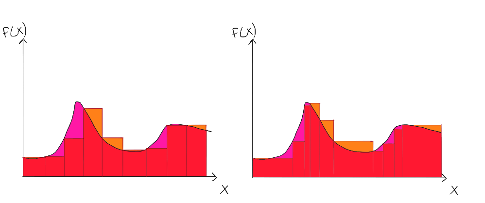

Above on the right, we see standard integration, with undershoot in pink and overshoot in orange, and Monte Carlo integration, with random samplings, on the right. 

Sometimes a lot of the interesting stuff (e.g. expected value, area in the integral, etc.) comes from a part of the function's domain that's low-probability when values in the domain are generated via $X$. If this happens, you either crank up the $n$ in your Monte Carlo, or then get smart about how exactly you sample (this is called importance sampling). If we're smart about this, our randomised integration can be faster than the standard method.

We will look at examples of using Monte Carlo -style random simulation to do both Bayesian and frequentist statistics below.


## Confidence

In addition to providing a best-guess estimate of something (the probability a coin comes up heads, say), useful statistics should be able to tell us about how confident we should be in a particular guess – the best estimate of the probability a coin lands heads after observing 1 head in 2 throws or 50 heads in 100 throws is the same, but the second one still allows us to say more.

The question of how to quantify confidence leads into the question of what probability is.

The frequentist approach is to say that probabilities are observed relative frequencies across many trials, and if you don't have many trials to look at, then you imagine some hypothetical set of trials that an event might be seen as being drawn from.

The Bayesian approach is that probabilities quantify the state of your own knowledge, and if you don't have data to look at, you should still be able to draw a probability distribution representing your knowledge.

### Bayesianism

Bayesianism is the idea that you represent uncertainty in beliefs about the world using numbers, which come from starting out with some prior distribution, and then shifting the distribution back and forth as evidence comes in. These numbers follow the axioms of probability, and so we might as well call them probabilities.

(Why should these numbers follow the axioms of probability? Because if you do otherwise and base decisions on those beliefs, you will do stupid things. As a simple example, making bets consistent with a probability model where the probabilities do not sum to 1 makes you exploitable. Let's say you're buying three options, each of which pays out 100€ if the winner of the 2036 US presidential election is EterniTrump, [GPT](https://en.wikipedia.org/wiki/GPT-3)-7, or Xi Jinping respectively, and pay 40€ for each (consistent with assigning a probability of greater than 0.4 to each event occurring). You're sure to be down 20€ that you could've spent on underground bunkers instead.)

In Bayesian statistics, you don't perform arcane statistical tests to reject hypotheses. Your subjective beliefs about something are a probability distribution (or at least they should be, if you want to reason perfectly). Once you've internalised the idea of what a probability distribution means, and know how to reason about updates to that probability distribution rather than in black-and-white terms of absolute truth or falsehood, Bayesianism is intuitive and will make your reasoning about probabilistic things (i.e., everything except pure maths) better.

(Why is Bayesianism named after Bayes? Bayes invented Bayes' theorem but not Bayesianism; however, Bayesian updating using Bayes' theorem is the core part of ideal Bayesian reasoning.)

There's one tricky part of Bayesianism, and it's a consequence of the Bayesian insistence that subjective uncertainty is represented by a probability distribution, and hence quantified. It's this: you always need to start with a quantified probability distribution (called a prior), even before you've seen any data.

There's a clear regress here, at least philosophically. Sure, you might be able to come up with a sensible prior for how effective masks are against a respiratory disease, but ask a baby for $P(\frac{P(\text{covid} | \text{mask})}{P(\text{covid}|\neg \text{mask})} = r)$ and you're not likely to get a coherent answer (and remember that your current prior should come from baby-you's prior in an unbroken series of Bayesian updates) – let alone if we're imagining some hypothetical platonic being existing beyond time and space who has never seen any data, or the [World Health Organisation](https://www.theguardian.com/world/2020/apr/07/face-masks-cannot-stop-healthy-people-getting-covid-19-says-who).

In practice, however, I don't think this is very worrying. Priors formalise the idea that you can apply background knowledge even when you don't have data for the specific case in front of you. Reject the use of priors, and you'll fall into another regress: "study suggests mask-wearing effective coronavirus variant in 40-60 year-old European females; no information yet on 40-60 year-old European females in red t-shirts ..."

#### Computational Bayes

In general, the scenario we have when doing a Bayesian calculation is that there's some model $X$ that depends on parameter(s) $\theta$, and we want to find what those parameters are given some sample $x$ from $X$ (since this is Bayesian, we have to assume that $\theta$ itself is a value of the random variable $\Theta$ describing the probabilities of each possible $\theta$). Now we could do this mathematically by calculating
$$
\Pr_\Theta(\theta \, | \, X=x) = c \Pr_X(x | \Theta = \theta) \Pr_\Theta(\theta),
$$
and then finding the constant $c$ with integration by the rule that probabilities must sum to 1. (Remember the interpretation of these terms: $\Pr_\Theta(\theta)$ is the prior distribution we assume for $\Theta$ before seeing evidence; $\Pr_\Theta(\theta \, | \, X=x)$ is the posterior likelihood distribution after seeing the data; see the [previous post](http://strataoftheworld.blogspot.com/2020/12/data-science-1.html) for some intuition on Bayes if these aren't clear to you.)

However, maybe some part of this (especially the integration) would be tricky, or you just happen to have a Jupyter notebook open on your computer. In any case, we can go about things in a different way, as long as we have a way to generate samples from our prior distribution and re-weight them appropriately.

The first thing we do is represent the prior distribution of $\Theta$ by sampling it many times. We don't need an equation for it, just some function (in the programming sense) that pulls from it.

Next, consider the impact of our data on the estimates. We can imagine each sample we took as a representation of a tiny blob of probability mass corresponding to some particular $\theta_i$, and imagine rescaling it in the same way that we rescaled the odds of various outcomes when talking about the odds ratio form of Bayes' rule in the first post. How much do we rescale it by? By the likelihood of observing $x$ if $\Theta=\theta_i$: this is the $\Pr_X(x|\Theta=\theta)$ term in the above equation.

Finally, we need to do the scaling. Thankfully, this doesn't take integration, since we can calculate the sum of our re-weighted likelihoods and just divide all our scaled values by that – boom, we have an (approximation of) a posterior probability distribution.

To make things concrete, let's write code and visualise a simple case: estimating the probability that a coin lands heads. The first step in Bayesian calculations is usually the trickiest: we need a prior. For simplicity, let's say our prior is that the coin has an equal chance of having every possible probability (so the real numbers 0 to 1) of coming up heads.

(The fact that the thing we're estimating is itself a probability doesn't matter; don't be confused by the fact that we have two sorts of probability – our knowledge about the coin's probability of coming up heads, represented as a probability distribution, and the probability that the coin comes up heads (an empirical fact you can measure by throwing it many times). Equally well we might have talked about some non-probabilistic feature of the coin, like its diameter, but that would be a lot more boring.)

To write this out in actual Python, the first step (after importing NumPy for vectorised calculation and Matplotlib for the graphing we'll do later) is some way to generate samples from this distribution:

```python
import numpy as np
import matplotlib.pyplot as plt

def prior_sample(n):
    return np.random.uniform(size=n)
```

(`np.random.uniform(size=n)` returns `n` samples from a uniform distribution over the range 0 to 1.)

To calculate the posterior:

```python
def posterior(sample, throws, heads):
    """ This function calculates an approximation of the
        posterior distribution after seeing the coin
        thrown a certain number of times;
        sample is a sample of our prior distribution,
        throws is how many times we've thrown the coin,
        heads is how many times it has come up heads."""
    # The number of times the coin lands heads follows a binomial distribution.
    # Thus, below we reweight using a binomial pdf:
    # (note that we drop the throws-Choose-heads term because it's a constant
    # and we rescale at the end anyways)
    weighted_sample = sample ** heads * (1 - sample) ** (throws - heads)
    # Divide by the sum of every element in the weighted sample to normalise:
    return weighted_sample / np.sum(weighted_sample)
```

(Remember that the calculation of `weighted_sample` is done on every term in the `sample` array separately, in the standard vectorised way.)

Now we can generate a sample to model the prior distribution, and plot it as a histogram:

```python
N = 100000
throws = 100
heads = 20

sample = prior_sample(N) # model the prior distribution

# Plot a histogram:
plt.hist(sample,
				 # split the range 0-1 into 50 bins for the histogram:
				 np.linspace(0, 1, 50), 
				 # weight each item by the likelihood:
         weights=posterior(sample, throws, heads))
```

The result will look something like this:

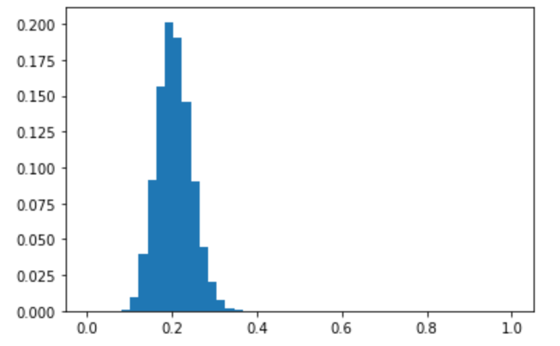

This is an approximation of the posterior probability distribution after seeing 100 throws and 20 heads. We see that most of the probability mass is clustered around a probability of 0.2 of landing heads; the chance of it being a fair coin is negligible.

What if we had a different prior? Let's say we're reasonably sure it's roughly a standard coin, and model our prior for the probability of landing heads as a normal distribution with mean 0.5 and standard deviation 0.1. To visualise this prior, here's a histogram of a 100k samples from it:

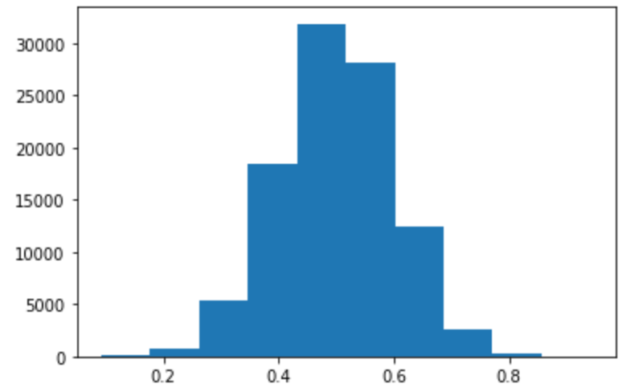

The posterior distribution looks almost identical to our previous posterior, though with slightly more probability mass remaining in the very upper range:

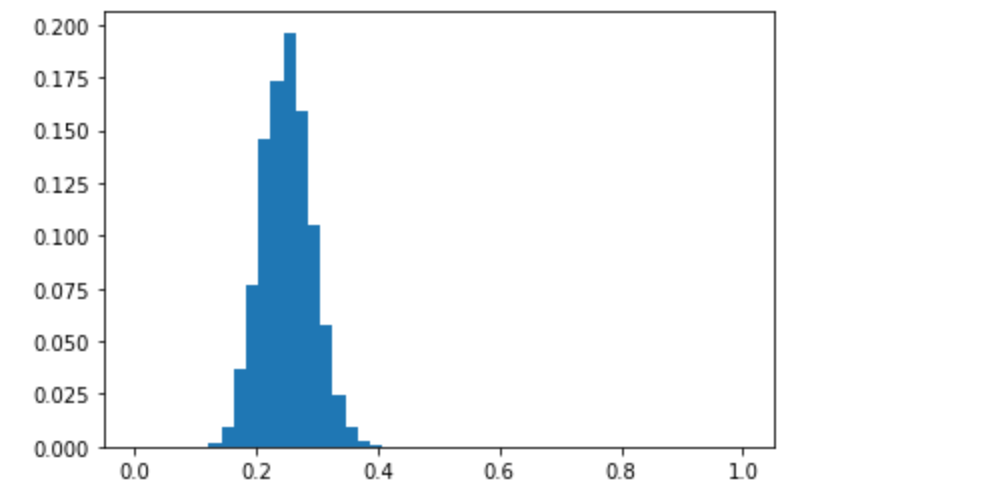

There's simply so much data (a hundred throws) that even very different priors will have converged on what the data indicates.

A normal distribution might not be a very good model, though. Say we think there's a 49.5% chance the coin is fair, a 49.5% chance it's been rigged to come up tails with a probability arbitrarily close to 1, and the remaining 1% is spread uniformly between 0 and 1 (be very careful about assigning zero probability to something!). Then our prior distribution might be coded like this:

```python
def prior_sample_3(n):
    m = n // 100
    return np.concatenate((np.random.uniform(size=m),
                           np.zeros((n - m) // 2),
                           np.ones(n - (n - m) // 2) // 2),
                           axis=0)
```

and 100k samples might be distributed like this:

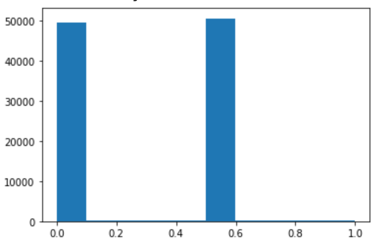

Let's also say we have less data than before – the coin has come heads 8 times out of 40, say. Now our posterior distribution looks like this:

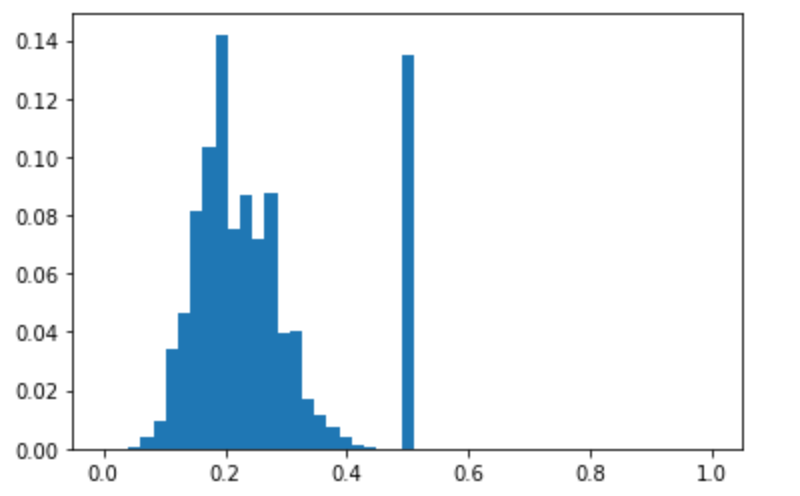

We've ruled out that the coin is rigged (a single heads was enough to nuke the likelihood of a completely rigged coin to zero – be very careful about assigning a probability of zero to something!), and most of the probability mass has shifted to a probability of landing heads of around 20%, as before, but because our prior was different, a noticeable chunk of our expectation is still that the coin is exactly fair.

As a final example, here's a big flowchart showing how the probability you should assign to different odds of the coin coming up heads shifts as you get data (red = tails, green = heads) up to 5 coin throws, assuming a prior that's the uniform distribution:

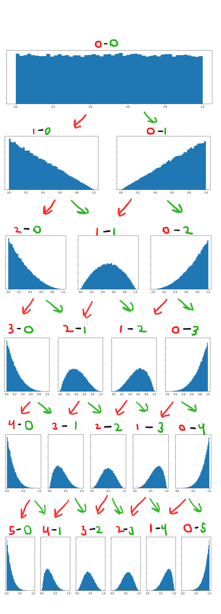

Two questions to think about, one simple and on-topic, the other open-ended and off-topic:

- What is the simple function giving, within a constant, the posterior distribution after $n$ heads and 0 tails? What about for $n$ tails and 0 heads?
- Doesn't the coin-throwing diagram look like Pascal's triangle? What's the connection between normal distributions, Pascal's triangle, and the central limit theorem (i.e., that the sum of enough of many of any random variable is distributed roughly normally?)? What extensions of Pascal's triangle can you think of, possibly with probabilistic interpretations?

### Frequentism

Frequentists try to banish the subjectivity out of probability. The probability of event $E$ is not a statement about subjective belief, but an empirical fact: given $n$ trials, what is the fraction of times that $E$ comes up, in the limit as $n \rightarrow \infty$? And ditch the Bayesian idea of doing nothing but shifting around the probability mass we assign to different beliefs; once you've done a statistical test, you either reject or fail to reject the null hypothesis.

A standard frequentist tool is hypothesis testing with a $p$-value. The procedure looks like this:

1. Pick a null hypothesis (usually denoted $H_0$). (For example, $H_0$ could be that a coin is fair; that is, that the probability $h$ of it coming up heads is 0.5.)
2. Pick a test statistic: a function $t$ from the dataset $x$ to a number. (For example, the maximum likelihood estimator for $h$, using the fact that we expect the number of heads to follow a binomial distribution with parameters for the number of throws and the probability $h$.)
3. Figure out a model for, or a way to sample from, the distribution of possible datasets given that $H_0$ is true. (For example, we might write code to generate synthetic datasets $X^*$ of the same size as $x$ based on $h=0.5$.)
4. Find the probability of the test statistic $t$ returning a result that is as extreme or more extreme than $t(x)$. We might do this using fancy maths that gives us cumulative distribution functions based on the model from the previous step, or by having our code generate many synthetic datasets $X^*$, calculate $t(X^*)$ for each of them, and seeing how $t(x)$ compares – what percentile of extremeness is it in? The answer is called the $p$-value.

(What is "more extreme"? That depends on our null hypothesis. If both low and high values of $t(x)$ are evidence against $H_0$ – as in our example – then we use a two-tailed test; if $t(x)$ is in the 90% percentile of the $t(X^*)$ distribution, both $t(x)$ in the top and bottom 10% are at least as extreme as the value we got, and $p=0.2$. If only low or high values are evidence against $H_0$, then we use a one-tailed test. Say only high values are evidence against $H_0$ and $t(x)$ is in the 90% percentile; then $p=0.1$.)

Here's some example code to calculate a $p$-value, using random simulation:

```python
# Import NumPy and graphing library:
import numpy as np
import matplotlib.pyplot as plt

# Define our null hypothesis:
h0_h = 0.5 # the value of h under the null hypothesis

# Define the data we've gotten:
throws = 50
heads = 20
# Generate an array for it:
data = np.concatenate((np.zeros(throws - heads), np.ones(heads)), axis = 0)

def t(x): # test statistic function
    return np.mean(x)
    # ^ this is the MLE for the binomial distribution

def synth_x(n, p):
    # Create a synthetic dataset of some size n, assuming some p
    return np.random.binomial(1, p, size=n)

# Take a lot of samples from the distribution of t(X*)
# (where X* is a synthetic dataset):
t_sample = np.array([t(synth_x(throws, h0_h)) for _ in range(100000)])

# Calculate the p-value, using a two-tailed test:
p1 = np.mean(t_sample >= t(data))
p2 = np.mean(t_sample <= t(data))
p = 2 * min(p1, p2)

# Display p-value
print(f"p-value is {p}") # about 0.20 in this case

# Plot a histogram:
plt.hist(t_sample, bins=50, range=[0,1])
# draw a line to show where t(data) falls
plt.axvline(x=t(data), color='black') 
```


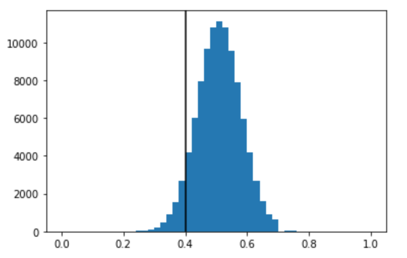

The main tricky part in the code is the calculation of the $p$-value. A neat way to do is the following: observe that a two-tailed $p$-value is either twice the percent of (synthetic) data with a test statistic lower than $t(x)$ (in the case that the observation ended up on the lower side of the distribution of synthetic datasets), or twice the percent of (synthetic) data with a higher test statistic.

Now, what exactly is a $p$-value? It's tempting to think of the $p$-value as the probability that the null hypothesis is correct: that is, that $p=0.05$ means there's only a 5% chance the null hypothesis is true. However, what a $p$-value actually tells you is this: assuming that your null hypothesis is true (and you can correctly model the distribution of data you'd get if it is), what is the probability of getting a result at least as extreme as your data? In maths: 
$$
p\text{-value} \ne P(H_0 \text{ is correct}), (!!)
$$
but instead
$$
p\text{-value} = P(t(x) \geq t(X^*)),
$$
for a right-tailed test (flip the $\geq$ for a left-tailed test), where $X^*$ is assumed drawn from the distribution resulting from assuming the null hypothesis $H_0$ , or
$$
P(|t'(x)| \geq|t'(X^*)|),
$$
for a two-tailed test, where $t'$ is the test statistic function, but shifted so that the median $H_0$ value is 0, so that we can just take absolute value to get an extremeness measure (for example, in the code above we'd subtract a 0.5 from the current definition of `t(x)`, since this is the median for the null hypothesis that the probability of heads is one-half).

## Probability bounds

Sometimes it's useful to be able to quickly estimate a bound on some probability or expectation. Here are some examples, with quick proofs.

#### Markov's inequality

For $x > 0$ if $X$ takes positive numerical values,
$$
P(X \geq a) \leq \frac{E(X)}{a}.
$$
Why?

**Short proof**: Given $X \geq 0$, $X \geq 1_{X \geq a} \cdot a$ (can be seen by considering cases $X < a$, $X=a$, and $X > a$), so, rearranging, $1_{X \geq a} \leq X/ a$. Taking the expectation on both sides we get $E(1_{X \geq a}) \leq E(X) / a$, and $E(1_{X \geq a}) = P(X \geq a)$. $\square$

**Intuitive proof**: let's say you want to draw a probability density function to maximise $P(X \geq a)$, given some value of the expectation of $E(X)$ (and given that $X$ only takes positive values). Any probability density assigned to values greater than $a$ is more expensive in terms of expectation increase than assigning value exactly at $a$, and has an identical effect on $P(X \geq a)$. So to maximise $P(X \geq a)$, assign as much probability density as you can to $a$, and none to values greater than $a$. Given the restriction that $X$ can only take positive values, the lowest value you can assign any probability to (to balance out the expectation if $a > E(X)$) is 0. If we allocate $p_1$ to $X=0$ and $p_2$ to $X=a$, then to match the expectation $E(X)$ we must have
$$
p_1 \cdot 0 + p_2 \cdot a = E(X),
$$
or
$$
p_2 = P(X\geq a) = \frac{E(X)}{a}
$$
in the maximal scenario; any other pdf we draw must have $P(X \geq a)$ smaller.

The above equation can also be interpreted as saying that the fraction of values greater than $k=a/E(X)$ times the average in a dataset of positive values can be at most $1/k$ (i.e. $E(X)/a$). For example, at most half of people can have twice the average income.

#### Chebyshev's inequality

(An extension of Markov's inequality.)

Let $X$ be a random variable with variance $\sigma^2$ and expected value $\mu$. Then
$$
P(|X-\mu| \geq x) \leq \frac{\sigma^2}{x^2},
$$
since if $Y = (X-\mu)^2$ then, by Markov's inequality,
$$
P(Y \geq x^2) \leq \frac{\mathbb{E}(Y)}{x^2} = \frac{\sigma^2}{x^2},
$$
by the definition of variance as $\mathbb{E}((X - \mu)^2)$. Finally, taking the square root inside the probability expression, $P(Y \geq x^2)=P(|X-\mu| \geq x)$. $\square$

#### Jensen's inequality

Consider a concave function $f$ and the values $E(f(X))$ and $f(E(X))$, where $X$ is (once again) a random variable.

Since $f$ is concave, if we plot $y=f(x)$ and the tangent line to $f$ at some $x_0$, the tangent is an upper bound on $f(x)$ for all $x$.

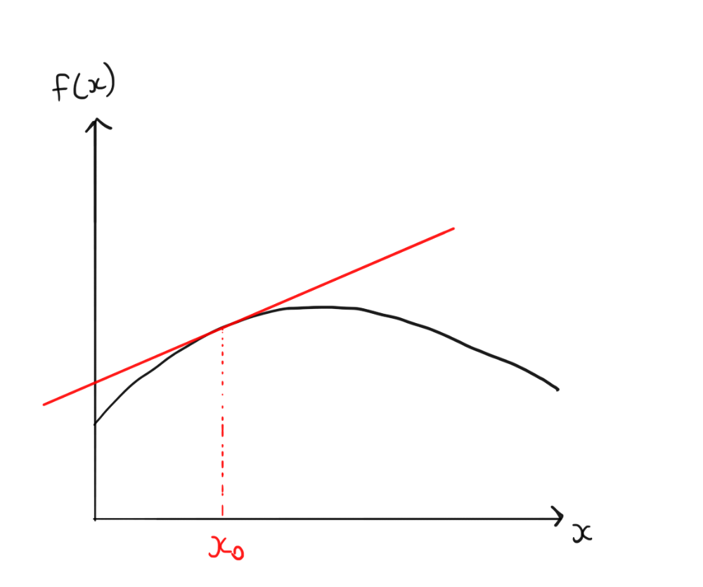

Let $E(X) = \mu$, and let the tangent line to $y=f(x)$ at $x=\mu$ be $y=mx+b$. We have that $f(X) \leq mx+b$ for all $x$. Taking the expectation on both sides,
$$
E(f(X)) \leq m \mu + b.
$$
What is $m\mu +b$? It's the value of the tangent when it touches $f(x)$ at $x=\mu$, and therefore it is also the value of $f$ at $\mu$. Thus we can say
$$
E(f(X)) \leq f(E(X)). \square
$$


## Probability systems

### Causal diagrams

The [*Perseverance*](https://en.wikipedia.org/wiki/Perseverance_(rover)) rover is due to land on Mars on February 18th, 2021, carrying a small helicopter called [*Ingenuity*](https://en.wikipedia.org/wiki/Mars_Helicopter_Ingenuity), which will likely become the first aircraft to make a powered flight on a planet that's not Earth.

Imagine that *Perseverance* is currently known to be in a position $X$ (where $X$ is some random variable, as is any capital letter). *Ingenuity* has completed its first flight, starting from the location of *Perseverance* (which we know to a high degree of accuracy), but because of a Martian sandstorm we only have inaccurate readings of *Ingenuity*'s current location and need to locate it quickly to know if it's in a place where it's going to run out of power due to dust blocking its solar panels unless we do a risky manoeuvre with its propellers. Specifically, we have two in-flight readouts of its position, $R_1$ and $R_2$, which are known to be its actual true position $Y_1$ and $Y_2$ at those times plus some random error modelled as a $\text{Normal}(0,\sigma_1^2)$ distribution, and also similarly we have a more accurate readout $R_f$ of its final position $Y_f$, this time with the error following $\text{Normal}(0, \sigma_2^2)$. We also model $Y_1$ as being generated from $X$ with a parameter $h_1$ representing its starting heading and velocity (e.g. $h_1$ is a vector and the model could be $Y_1 = X + h_1 + \epsilon$, where $\epsilon$ is another normally distributed error term), and likewise we have parameters $h_2$ and $h_f$ that influence how $Y_2$ and $Y_f$ are generated from the preceding positions. We know that it's initial battery level was $b_0$, and the battery level when it was at each of $Y_1$, $Y_2$, and $Y_f$ is $B_1$, $B_2$, and $B_f$, where each of those is generated from the previous and the heading/velocity parameters $h_1$, $h_2$, and $h_f$ (e.g. $B_2 = B_1  - (1 + \epsilon) |h_1|$ – the amount of power lost is a normal error term plus a constant times the velocity). We need to find the probability that the next battery level $B_n$, a random variable generated from $B_f$ (the previous level) and depending on $Y_f$ (since storm intensity varies with position; say we have a function $s$ that takes in positions and returns how much the dust will decrease power output and hence batter level at a particular position, then we might have $B_n = B_f - s(Y_f)$), is below a critical threshold $c$, given the starting $X$, and the position readings $R_1$, $R_2$, and $R_f$. Also the administrator of NASA is breathing down your neck because this is a 2 billion dollar mission, so better work fast and not make mistakes.

This problem seems almost intractably complicated. A handy way of making complex probability questions less unapproachable is to draw out a causal diagram: what are the key parameters, and which random variables are generated from which other ones? Here's an example for the above problem:

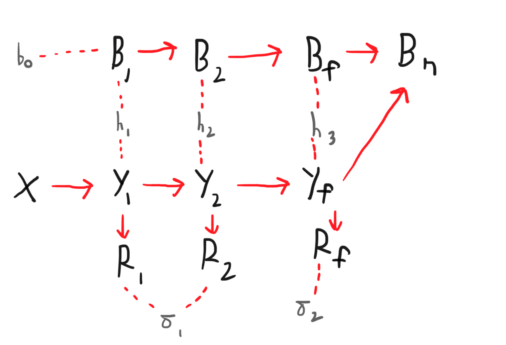

Arrows indicate random variables being generated from others; dotted lines note important parameters (note that some parameters are missing – those of $X$, for example). The probability we were asked about is $P(B_n < c | X = x, R_1 = r_1, R_2 = r_2, R_f = r_f)$; it doesn't look so complicated when you have the causal relations visualised in front of you.

The rest of the solution is left as an exercise for the reader. Please be in touch with NASA in late February to get the values $x$, $r_1$, $r_2$, and $r_f$.

### Markov chains

A Markov chain has the following causal diagram:


In words: the $n$th state of a Markov chain is generated from the $(n-1)$th state.

This might seem very restrictive. For example, the simplest text-generation Markov chain would just generate, say, one character based on the previous one, probably based on data for how often a letter follows another. It might tend to do some moderately reasonable things, like following "t" by "h" fairly often (assuming it was trained on English), but good luck getting anything too sensible out of it.

However, we can do a trick: generate letter $n$ from the previous $k$ letters. This seems like it's not a Markov chain; letter $X_n$ depends on $X_{n-k}$ through $X_{n-1}$. But we can define $Y_0=(X_0, X_1, ..., X_{k-1})$, $Y_1 = (X_1, X_2, ..., X_k)$, and so on, and now $Y_n$ can be generated entirely from $Y_{n-1}$, and so the $Y$s form a Markov chain.

So one one hand, we can do these sorts of tricks to use Markov chains even when it seems like the problem is too complex for them. But perhaps even more importantly, if you reduce something to a Markov chain, you can immediately apply a lot of nice mathematical results.

A Markov chain can be visualised with a state diagram. Here's one for a Markov chain representing traffic light transitions:

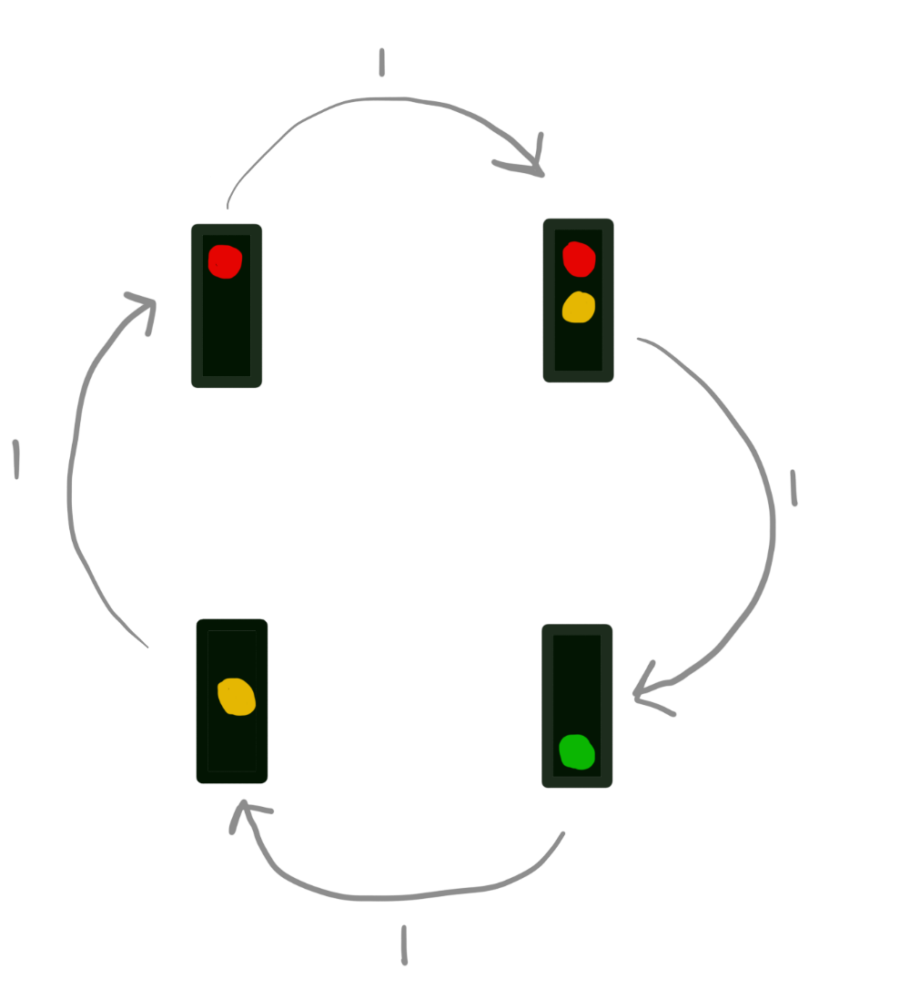

The same information can be described with a transition matrix, showing the probability of each transition happening:

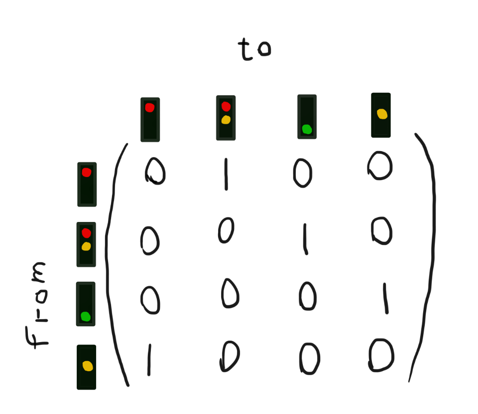

Note that this is a very boring Markov chain, because it's not probabilistic – every link has a probability mass of 1. This is not very interesting. Thankfully, our traffic light engineer is willing to add some randomness for the sake of making the system more mathematically interesting. For example, they might change the system to look like this (showing both the state diagram and transition matrix):

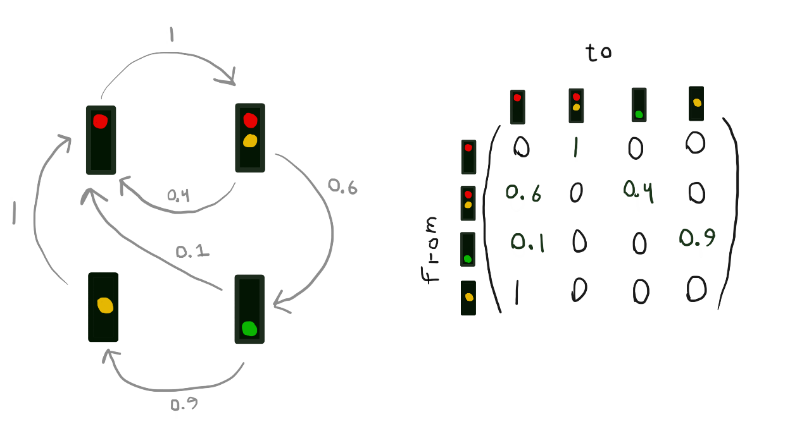

Now there's a 10% chance that the yellow light before red is skipped, and a 40% chance that red-yellow moves back to red instead of going green.

The key property with Markov chain calculations is memorylessness: $X_n$ depends only on $X_{n-1}$. If you can use this property, you can work out a lot of Markov chain problems. For example, let's say that $X_0 = \text{R}$ (we'll use $\text{R, RY, G, Y}$ to denote the states), and we want to find the probability that you'll actually get to drive in two state transitions from now – that is,  $\mathbb{P}(X_2 = \text{G} \, | \, X_0 = \text{R})$ (I use $\mathbb{P}$ here to differentiate a probability expression from the transition matrix $P$). Doing some straightforward algebra, you can figure out that this probability is $P_{\text{R},\text{RY}} \cdot P_{\text{RY},\text{G}}$ (where $P_{a,b}$ is the spot in the matrix with row label (i.e. start state) $a$ and column label (i.e. end state) $b$).

(Note that each row of the transition matrix is a probability distribution for the next state, starting from the state the row is labelled with. Writing it as a matrix is a trick for expressing the probability distribution from each state in the same mathematical object.)

More generally: for any transition matrix, $P_{a,b}$is $\mathbb{P}(X_n = b \, | X_{n-1} = a)$. Now consider point $a,b$ of $P^2$: by matrix multiplication, it is
$$
\sum_i P_{a,i}P_{i,b},
$$
 but by the definition of the transition matrix, this is the same as
$$
\sum_i
\mathbb{P}(X_{1} = i \,|\, X_{0} = a)
\mathbb{P}(X_{2} = b \,|\, X_{1} = i),
$$
which is just summing up the probabilities of all paths through the state space that start at $a$, go to some $i$, and then end up at $b$; in other words, it is the probability that if you're at $a$, you end up at $b$ after two state transitions.

You should be able to see that this extends more generally:
$$
\mathbb{P}(X_n = b \,|\,X_0 = a) = P^n_{a,b}.
$$
Linear algebra comes to the rescue yet again; we've reduced the problem of finding the probability of going between any two states in a Markov chain's state space in $n$ steps into the problem of multiplying a matrix $n$ times with itself and looking up one item in it.

#### Finding the stationary distribution

Given a starting state in a Markov chain, we can't say for sure what state it will be after $n$ transitions (unless it's entirely deterministic, like our initial boring traffic light model), but we can calculate exactly what the probability distribution over the states will be. This is usually denoted as a vector $\pi$, with $\pi_a$ being the probability we're in state $a$.

Here's something we might want to know: what is the stationary distribution; that is, how can we allocate probability mass amongst the different states in such a way that the total amount of probability mass in each state remains constant after a state transition?

Here's something you might ask: why is it interesting to know this? Perhaps most importantly, the stationary distribution of a Markov chain is the long-run average of time spent in each state (exercise: prove that this is the case); if you want to know how much time our probabilistic traffic lights will spend being green over a long period of time, you need to find the stationary distribution.

Now given our distribution $\pi$ (note: it's a row vector, not a column vector) and transition matrix $P$, we can express the stationary distribution as the $\pi$ that satisfies two conditions. First,
$$
\pi = \pi P.
$$
This is the condition that $\pi$ must remain unchanged when transformed by our transition matrix $P$ during a state transition. You might have expected the transformation to be written $P \pi$; usually we'd express a matrix transforming a vector in this order. However, because of the way we've defined $P$ – start states on the vertical axis, end states on the horizontal – we need to do it this way. Here's a visualisation, with the result vector in red:

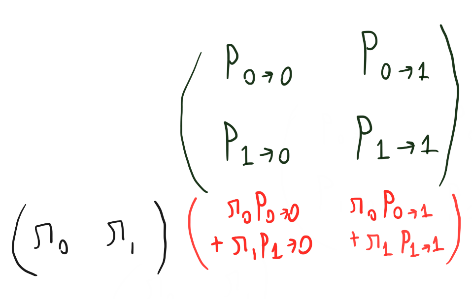

(Alternatively, we could take $\pi$ as a column vector, flip the meanings of the rows and columns in $P$, and write $P\pi$ – equivalent to transposing both of the current definitions of $\pi$ and $P$.)

The second condition (can you see why it's necessary?), where $\pmb{1}$ is a vector $(1,1,...,1,1)$ of the required length, is
$$
\pi \cdot \pmb{1} = 1.
$$
We can also write this as matrix multiplication, as long as we're clear about column and row vectors and transposing things as required. We can also be clever and write a single matrix that expresses both of these constraints, and then getting NumPy's linear algebra libraries to give us the answer becomes a single line of code.

(The second constraint is just the condition that any probability distribution sums to 1.) 

##### Uniqueness of the stationary distribution

Now for another question: when does a unique stationary distribution exist? You should be able to think of a state diagram for which there are an infinite number of stationary distributions.

For example:

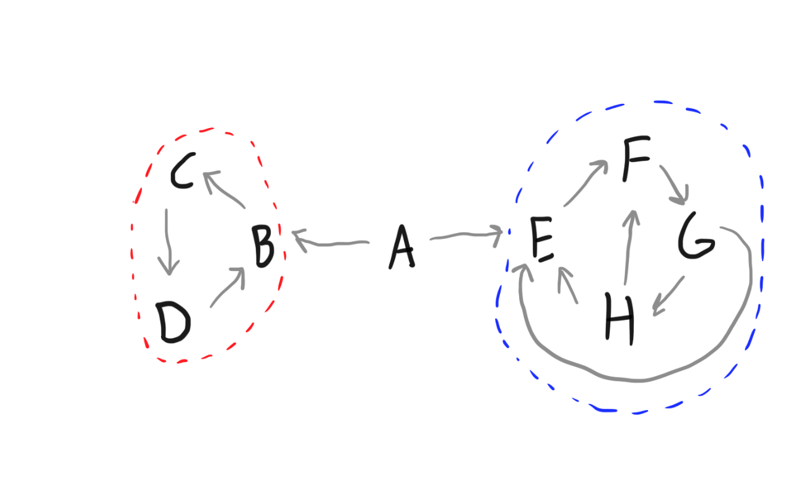

The states $C$, $B$, and $D$ (in the dotted red circle) and $E$, $F$, $G$, and $H$ (in the dotted blue circle) are "independent", in the sense that you can never get from one set of states to the other. Imagine that for the state set $\{C, B, D\}$, we have a stationary distribution over only those states $\pmb{\pi}$, and another stationary distribution $\pmb{\rho}$ over $\{E,F,G,H\}$. (Let each of these vectors have a slot for every state, but let it be zero for states outside the corresponding state set – $\pmb{\pi} = (0, \pi_b, \pi_c, \pi_d, 0, 0, 0, 0)$, for example.) Now, because there can be no probability mass flow between these two sets, we can see that any distribution $\pmb{\sigma} = a \pmb{\pi} + b \pmb{\rho}$ is also a stationary distribution, provided that $a$ and $b$ are chosen such that $\pmb{\sigma} \cdot \pmb{1} = 1$ (probability distributions sum to one!).

It turns out that for any state set where each state is theoretically reachable from all the others – i.e., if we represent the state diagram as a directed graph, the graph is connected – there does exist a unique stationary distribution.

##### Detailed balance

Sometimes it doesn't take matrix calculations to find a stationary distribution. In the general case, the condition is that the probability mass flow into a state, from all other states, must equal the outflow to all other states. The simplest case this can happen is when, for any pair of states $a$ and $b$, $a$ sends as much probability mass to $b$ upon a state transition as $b$ sends to $a$. If we can ensure that this is true "locally" for each pair of states, then we don't have to do complex "global" optimisation over all states.

This condition is known as detailed balance. Mathematically, letting $\pi$ be a distribution of probability mass over states and $P$ be the transition matrix, we can express it as
$$
\pi_a P_{ab} = \pi_b P_{ba}, \text{ for all states } a \text{ and } b,
$$
something that should be clear if you remember the interpretation of the transition matrix $P$: $P_{ab}$ is the probability of an $a \rightarrow b$ transition.

A final fun question: say we have an undirected graph and we consider a random walk over it (i.e., if we're at a given vertex, we take any edge going from it with equal probability). What is the stationary distribution over the states (i.e. the vertices of the graph)?