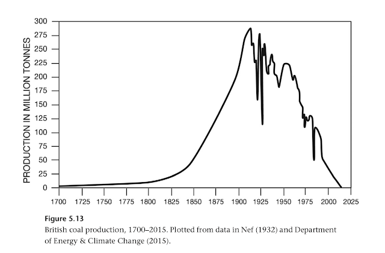
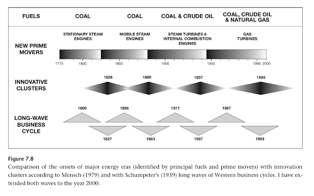

# More Energy and More Civilization
  
_Energy and Civilization: A History_ is one of the most information-dense books I have ever had the pleasure of reading, and so my review (which focused on energy transitions and the lessons they hold for the future) covered only a small part of the book.

In this post, I’ve compiled some facts and other tidbits from my notes that did not make it into the review. This is still just scratching the surface of the information available in _Energy and Civilization_, so get the book if you want more.

## **History**

- Perhaps the most significant energy innovator before 18th and 19th century Britain was Han China (207 BCE to 220 CE), which was the first society to use coal in iron-making, drill for natural gas, cast steel from iron, and use curved plows, collar harnesses, and multitube seed drills.
- Even in 1700, Chinese and European per capita energy use levels were broadly similar, but by the middle of the century the regions started to diverge and by 1900 there was a four-fold difference between them. Smil does not dive too deeply into the debate over what caused Europe’s development, but notes that the Christian belief in the dignity of manual labor is something many scholars consider to have played a role.
- Coal is not necessary for mass production or even some degree of industrialization; mass workshop manufacturing built on cheap labor and international markets was present in some parts of Europe as well as Ming and Qing China, Tokugawa Japan, and India centuries before the Industrial Revolution.
- Likewise, Smil notes that consumerism and materialism were not spawned by the Industrial Revolution, but had been present to some degree in France and the Netherlands already in the 15th and 16th centuries.
- An often neglected fact is that the world’s first commercial oil-distilling factory was built by Russians in Balakhani (now in Azerbaijan) in 1837, long before the Pennsylvanian oil extraction projects prominently featured in many western histories.

## **Energy and resource use**

- Everyone knows electricity generation and agriculture consume significant amounts of energy. Other surprisingly large consumers of energy:
	- Iron and steel production alone consume 35 EJ, or 7% of the world’s total energy annual energy consumption.
	- Information and communication takes another 5%.
	- During the Cold War, a rough estimate is that about 5% of US and Soviet energy was spent spent on developing and building nuclear weapons and their delivery systems.
	- World War I required about 15% of US energy, compared to 40% for World War II (with a peak of 54% in 1944). During the worst years of the war, Germany and the USSR spent a staggering 70-80% of their energy on the war effort.
- How has China accomplished so many huge infrastructure projects in so little time? Answer: lots of cement. China used almost 5 billion tons of cement in the three years from 2008-2010 alone,, compared to the United States’ consumption of 4.5 billion tons in the _entire twentieth century_.
- Which embodies more energy, phones or cars? (Spoiler alert: in practice it’s cars, but complicating factors make it surprisingly close). Despite the four-order-of-magnitude difference in weight, phones embody about 1 GJ of energy, compared to 100 GJ for cars (thus, gram for gram, the production of phones is 100 times more energy intensive than the production of cars). More phones are sold than cars, bringing the total amount of energy used on the production of each to 2 EJ and 7 EJ respectively. This is further evened when accounting for the five-fold difference in average lifespan (2 years versus 10), so all in all the energy spent on the production of phones and cars per year of use is used for is roughly the same. Of course, during their lifetime a phone will consume only an additional 30 MJ of energy (3% of its embodied energy), while a car can consume several times its embodied energy in gasoline.
- The IMF estimates that $5.3 trillion, or 6% of world GDP, is spent on energy subsidies (subsidies for _renewable_ energy are a very small fraction of this number).

## **Hitler**

- The (very general) specifications of the Beetle, the most produced car model in terms of both quantity and duration of production (production continued in Mexico till 2003), were decreed in 1933 by none other than Adolf Hitler. Perhaps he should have considered a career in automotive design?

## **Fossil fuels**

- American coal production peaked already in 2001 at 1.02 billion tons.
- British coal production chart from 1700 to 2015 is an especially neat illustration of energy transitions:

## **Fossil fuels are not running out**

- Smil does not mince words about this: “…only a fundamental misinterpretation of clear geological evidence can see in the rising use of fossil fuels a cause for concern about their early exhaustion.” Available reserves of fossil fuels are only a small part of the total theoretically extractable total, and so extraction will effectively always be limited by the cost of further extraction rather than by oil literally running out.
- This is, of course, no cause for complacence: “But the eventual exhaustion of fossil energies is most unlikely because the burning of coal and hydrocarbons is the principal source of anthropogenic CO2 and the combustion of available fossil fuel resources would raise the tropospheric temperature high enough to eliminate the entire Antarctic ice sheet and cause a sea-level rise of about 58 m (Winkelmann et al. 2015)” (read: it’s bad).

## **Electricity**

- Smil highlights just how shocking the impact of electrification was on society. First, electricity was unprecedented in that its adoption meant not just a substitution of one fuel for another, but the construction of entirely new infrastructure systems and appliances. Secondly, its usefulness was unparalleled; it made possible everything from cheap lighting to vaccines (which require refrigeration).
- Electricity also transformed household work, the burden of which had generally increased in the 1800s due to the need to uphold ever higher and higher standards of life and hygiene:

> “The liberating effects of electricity are unforgettably illustrated in Robert Caro’s (1982) first volume of Lyndon Johnson’s biography. As Caro points out, it was not the shortage of energy that made life in Texas Hill County so hard (households had plenty of wood and kerosene) but the absence of electricity. In a moving, almost physically painful, account Caro describes the drudgery, and danger, of ironing with heavy wedges of metal heated on wood stoves, the endless pumping and carrying of water for cooking, washing, and animals, the grinding of feed, and sawing wood. These burdens, which fell largely on women, were much harder than the typical labor requirements in poor countries as the Hill County farmers of the 1930s strove to maintain a much higher standard of life and run much larger farming operations than peasants in Asia or Latin America. For example, the water needs for a family of five came to nearly 300 t/year, and to supply them required an equivalent of more than 60 eight-hour days and walking about 2,500 km. Not surprisingly, nothing could have been as revolutionary in the life of these people as the extension of transmission lines.”

- The United States and Canada are the only developed countries without an integrated national grid.

## **Industrialization**

- It turns out industrialization was actually a pretty good idea. Exposure to pollutants was often higher in rural environments than industrial ones. Smil also agrees with Pinker {LINK} on the preferability of industrial work to agricultural work:

> “Moreover, the drudgery of field labor in the open is seldom preferable even to unskilled industrial work in a factory. In general, typical factory tasks require lower energy expenditures than does common farm work, and in a surprisingly short time after the beginning of mass urban industrial employment the duration of factory work became reasonably regulated.”

-  Smil provides a series of statistics on French living conditions that illustrate the speed of improvement:
	- In 1954, less than 60% of households had running water, about 25% had indoor toilets, and 10% had bathrooms and central heating.
	- In 1970, 90% of households had refrigerators, 75% had indoor toilets, and 60% had central heating and washing machines.
	- In 1990, all of the above were practically universal. 75% of people also owned a car.

## **Technology**

- Horses and people have approximately the same mass per power ratio (1000 grams of weight per watt of power delivered). Early steam engines were barely better (600-700 g/W), but by 1900 car engines had mass/power ratios of 30 g/W, rapidly falling to 1 g/W in modern cars. The Saturn V rocket, with a power output of 2.6 GW (equivalent to about 40 Boeing 747s or a large nuclear reactor), had a mass/power ratio of 0.001 g/W (yes, that includes the weight of over 2500 tons of fuel).

- In 1977, GM produced the first car with an electrically controlled spark ignition. By 1981, GM’s new car lineup had software with a total of 50 000 lines of code in it. In modern cars, the software can run up to 100 million lines of code and contribute 40% to the car’s cost (a lot of those 100 million lines is some combination of automatically generated, reused, bloated, and a result of having to deal with the vast number of different car configurations). Compare this to major airline systems; the F-35 and Boeing 787 both have “only” 6 million lines of code in their software.

## **War**

- Smil claims energy considerations are very rarely the actual reason for war. He lists Germany in World War II, the Korean War, the Vietnam War, the occupation of Afghanistan, and most civil civil wars as examples of recent conflicts in which energy considerations were not at play. Even the Iraqi invasion of Kuwait and the response, and the later 2003 US invasion of Iraq, involved significant non-energy factors. East Asia is the largest buyer of Iraqi oil, which in 2015 constituted only 3% of American oil imports and has not been much higher historically. Smil concludes: “The conclusion is clear: broader strategic aims, whether well justified or misplaced, and not a quest for resources have led America into its post–World War II conflicts.”

- The most destructive bombing in World War II was probably not the atomic bombing of Hiroshima. The firebombing of Tokyo by 334 bombers in March 1945 killed (very roughly) at least 100 000 people, compared to 70 000 - 126 000 people in the atomic bombing of Hiroshima (the atomic bombing of Nagasaki killed 40 000 - 80 000). What’s more surprising is that the destructive energy of the conventional bombing of Tokyo matches that of the Hiroshima bomb; both released about 60 TJ of energy. However, the bombs dropped on Tokyo were incendiary and thus caused far greater fires than the atomic bombs; using the number of wooden buildings that were destroyed, Smil estimates that very roughly 18 PJ, or 300 times the Hiroshima bomb’s energy, was released in the fires.

## **Business cycles and energy**

- Smil notes that there is an inverse correlation between business cycles and innovation periods; that is, periods of intense innovation (as identified by Mensch) often center on major economic downswings (as identified by Schumpeter). I don’t know what to make of this, so I’ll just leave you with this graph:

