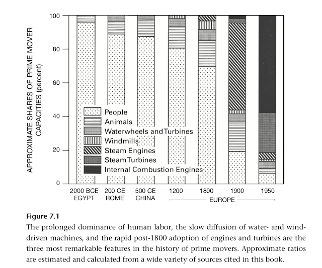
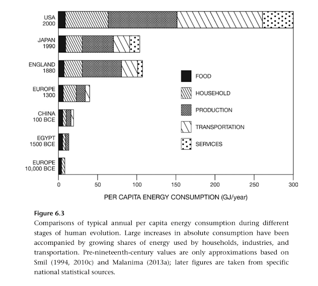
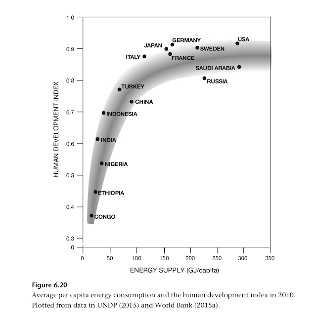
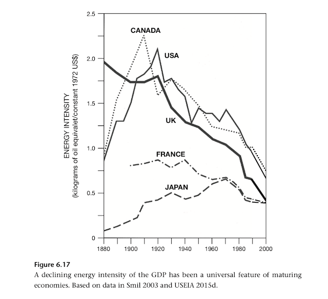

# Energy and Civilization: A History

The broad picture of civilizational energy use is often considered to look something like this:

- Hunter-gatherers rely on muscle power for their energy needs, expending energy primarily on hunting and foraging.

- Agriculture is invented; humans switch from nomadic to sedentary lifestyles and labor (and therefore energy use) is switched from humans to domesticated animals. Renewable, animate energy drives civilization for millennia.

- The potential of coal and steam engines brings about the industrial revolution, giving rise to mass production, industrialization, and rapid a switch from renewable animate to nonrenewable inanimate power in the middle of the 19th century.

- In the 20th century, oil replaces coal as the main energy source.

In _Energy and Civilization: A History_ (an ambitious title if there ever was one), Vaclav Smil shows that such a narrative is a simplification, and that transitions from one form of energy to another have typically been more complex.

The work is in good company among other books that explain long-run historical trends from a certain perspective, like Yuval Noah Harari’s famous _Sapiens_ (cognition), Francis Fukuyama’s _The Origins of Political Order_ and _Political Order and Political Decay_ (political organization), Jared Diamond’s _Guns, Germs, and Steel_ (geography), and Paul Kennedy’s _The Rise and Fall of the Great Powers_ (economic power). The lens of _Energy and Civilization_ is, predictably, energy. However, while at least as broad in scope (and in contrast to, say, _Sapiens_), Smil’s _Energy and Civilization_ is also very ready to dive into details.

What I mean by this is that _Energy and Civilization_ is full of facts and statistics. I opened a random page and counted 8 figures on that page  and 21 on the next one. From the first to the last page, Smil will assault you with facts about everything from the efficiency of different waterwheel designs to the mass/power ratio of the Saturn V to the energy density of seal meat (15-18 MJ/kg, if you were wondering). And yes, this does lend a certain dryness to the book. But it’s well worth it: the result is a comprehensive outline - if there is such a thing - of energy generation and use since prehistoric times.

What, then, is wrong with the simplified picture of energy transitions presented above? And what does it mean for the future transition to renewable energy?

## **Scales**

When dealing with global energy supplies, the numbers get fairly large. Since the larger SI prefixes are not used very often, here they are for quick reference, including reference points for power shamelessly stolen from the book’s excellent addenda:

- Kilo- (k): 1 000 / $10^3$. 1 kW is the peak power of a strong horse.
- Mega- (M): 1 000 000 / $10^6$. 0.9 MW is the maximum power of a steam locomotive; a wind turbine provides several megawatts of power; a Boeing 747 uses 60 MW.
- Giga- (G): 1 000 000 000 / $10^9$. Nuclear power plants are typically in the several gigawatt range
- Tera- (T): 1 000 000 000 000 / $10^{12}$. The world energy consumption is 17 TW. The Hiroshima bomb released 63 TJ of energy.
- Peta- (P): $10^{15}$. 170 PW is the power of sunlight hitting the Earth's surface.
- Exa- (E): $10^{18}$. 500 EJ is around the world's annual energy consumption.
- Zeta- (Z): $10^{21}$. 15 ZJ is the total energy the Earth receives in sunlight in one day. About 40 ZJ of energy are estimated to be contained in the world's fossil fuel reserves. Fossil fuels in the 20th century provided about 10 ZJ of power.
- Yota- (Y): $10^{24}$. 300 YW is the sun's power.
(Do not confuse power (measured in watts (W), which are joules per second) with energy (measured in joules (J), which are defined as force times distance))

## **Energy transitions**

A central concept in all the discussions in the book is that of a prime mover. Thankfully, this does not refer to the philosophical concept of an unmoved mover, but instead to something that uses energy from a source to do work.

One surprise to the conventional narrative presented above is that animals were never were even 20% of prime movers.

This is despite the fact that an animal like an ox or buffalo (both about 250-550 watts) or a horse (500-850 W) have power outputs for manual labor much higher than humans (70-150 W). While domesticated animals played an important role, the energy delivered by human muscle remained much greater.

Further, the animal share of prime movers peaked fairly late. In the US, animal power capacity was overtaken by internal combustion engines only around 1910, and by electricity only around 1920. The number of American horses peaked in 1917.

Though inanimate power achieved primacy only in the 1900s, it was an important part of energy supply for centuries before then. Waterwheels and, later, windmills had played an important role since Roman times (especially in Europe in grain milling, and later iron metallurgy and cloth fulling), and again their capacities were surpassed fairly late - installed capacity of steam engines in the US in 1849 was 920 MW compared to 500 MW of waterwheels, but because waterwheels had less downtime the energy delivered by them was 2.4 PJ, compared to about 1 PJ from coal (energy delivered by coal surpassed waterwheels in the 1860s). As late as the 1920s, there were more than 30 000 operational waterwheels in Germany.  Even the rise of European colonial empires was based on two sources of inanimate power: wind and gunpowder. And today, only a fifth of humanity has fully completed the transition to full reliance on inanimate power sources.

The second of the great great energy dichotomies - renewable versus non-renewable - also turns out to have a more complex history. In many pre-industrial areas, logging was far from sustainable, as evidenced by extensive deforestation in the Mediterranean, northern China, and later England and the United States (other pre-industrial fuels include dried dung, crop residues, and - in northern China - coal).

As cities grew, supplying them with wood - about 650 kg per capita per year in Rome in 200 CE, 1 750 kg per capita per year in medieval London, and 3 000-6 000 kg in 19th century European cities - became increasingly problematic, requiring more and more complex logistics chains and affecting many parts of life.

Perhaps the most serious effect was air pollution. Air pollution is often thought of as a modern or at least post-industrial problem, but air quality was often likely worse in pre-industrial rural environments than in industrialized cities. There are two main reasons for this: first, much of the combustion was done indoors (fireplaces, furnace, and so on), and secondly wood is simply a bad fuel: it is dirty, and is typically not very efficient (completely dry coniferous wood can approach coal in energy density, but air-dried wood in dry climates typically contains 15% moisture, reducing its heating potential).

Charcoal is an improvement over wood, providing an energy density of 28-30 MJ/kg (about 50% higher than completely dry wood) and burning more cleanly, though its production involves losing about 60% of the wood’s energy potential.

How quickly did the world transition away from biomass (wood, dung, and crop residues) to coal?

In 1800, the world’s energy consumption from fuels was 20 EJ, of which 98% was wood. In 1900, energy consumption had doubled to 43 EJ, which was split about evenly between wood and fossil fuels. In other words: after a century of industrialization, the world used about as much wood as before!

Of course, many European and American countries were ahead of the curve, but not always by much, or even at all: French oil and coal power reached the 50% level 1875, about 25 years before the world, the US in the 1880s, but Russia only around 1930.

What about the latest historical energy transition, from oil to coal? We have already seen that the 19th century, often considered the century of coal, was dominated by wood. From this you might already guess that the 20th century was not the century of oil: oil delivered 4 ZJ\* from 1900 to 2000, compared to 5.2 ZJ\* from coal (and coal remains ahead even after non-energy uses of oil are accounted for).

(\*My copy of the book has these numbers as 4 YJ and 5.2 YJ, or 4 000 ZJ and 5 200 ZJ respectively, implying that from 1900-2000 the world consumed a total of $9.2 \times 10^{24}$ J from fossil fuels. However, the world's total annual energy consumption is on the order of only $5 \times 10^{20}$ J; a century at this level of consumption would bring the total to $5 \times 10^{22}$ J, two hundred times less than the amount that the book lists as being supplied by fossil fuels in the 20th century. This is obviously implausible. Since energy consumption today is much higher than the 20th century average, this is roughly consistent with Smil having used yotajoules when he meant zetajoules, and so I've changed it.)

(Burning oil is far from good for the environment, but it is already a massive improvement over wood and coal. In a complete combustion reaction, every mole of carbon in the fuel results in another mole of carbon dioxide as a product, so minimizing the amount of carbon in the fuel directly reduces CO2 emissions. The hydrogen:carbon ratio of wood is about 0.5, compared to 1 for coal, 1.8 for gasoline and kerosene (though there is some variation because of differing concentrations of the constituent alkanes), and 4 for methane (CH4). Wood and coal also produce far more side products (such as sulfur dioxide for coal and various toxic components of woodsmoke for wood).)

## **Energy transitions are slow**

The two great industrial energy transitions have been the ones from muscle and wood to coal, and then from coal to oil. The greatest challenge of 21st century civilization will be enacting another transition, this time from oil to renewables.

But the history shows that both of the previous energy transitions have been slow:

> “My reconstruction of global energy transitions shows coal (replacing wood) reaching 5% of the global market around 1840, 10% by 1855, 15% by 1865, 20% by 1870, 25% by 1875, 33% by 1885, 40% by 1895, and 50% by 1900 (Smil 2010a). The sequence of years needed to reach these milestones was 15–25–30–35–45–55–60. The intervals for oil replacing coal, with 5% of the global supply reached in 1915, were virtually identical: 15–20–35–40–50–60 (oil will never reach 50%, and its share has been declining). Natural gas reached 5% of the global primary supply by 1930 and 25% of it after 55 years, taking significantly longer to reach that share than coal or oil.”

> “The similar progress of three global transitions—it takes two or three generations, or 50–75, years for a new resource to capture a large share of the global energy market—is remarkable because the three fuels require different production, distribution, and conversion techniques and because the scales of substitutions have been so different: going from 10% to 20% for coal required increasing the fuel’s annual output by less than 4 EJ, whereas going from 10% to 20% of natural gas needed roughly an additional 55 EJ/year (Smil 2010a). The two most important factors explaining the similarities in the pace of transitions are the prerequisites for enormous infrastructural investment and the inertia of massively embedded energy systems.”

Both of the past transitions have taken 55-75 years from the 5% to the 40% level. Compare this with the state of renewables today: in 2017 solar provided 1.7% and wind 4.4% of global energy consumption (hydropower is at 16%, but unlikely to grow too much since viable locations are limited).

## **Accelerating the next energy transition**

The picture might look bleak. However, there is a pressing need for the next energy transition, meaning that significant resources will likely be devoted to accelerating it. So all we need is rapid, expansive international commitment, and … okay, it does look pretty bad.

What advice does Smil have? He is not a fan of biofuels, which currently supply 1.8% of the world’s energy; Smil writes: “Scaling this industry to supply a significant share of the world’s liquid biofuels is, bluntly put, delusionary (Giampietro and Mayumi 2009, Smil 2010a)”. He does, however, have three main ideas for hastening the energy transition.

First, more nuclear power. This is not surprising. In my review of _Enlightenment Now_ {LINK}, I noted Pinker’s strong support for it, as well as providing links to further statistics and articles on nuclear power that support its efficacy and safety. When all the knowledgeable and rigorous sources support something, I think it’s time to listen.

The world - and particularly the West - is not listening. Nuclear provided only 10.7% of the world’s energy in 2015 (though the share was 17% before the Chinese surge in coal energy). Of the 67 reactors under construction worldwide, 60% are Chinese, Russian or Indian (25, 9, and 6 reactors respectively), leading Smil to conclude: “The West has essentially given up on this clean, carbon-free way of electricity generation” (though countries like France, with 77% nuclear power, are a notable exception).

The second major step would be the invention of cheap, large-scale energy storage. This would allow fluctuating renewables like solar and wind to take over a far larger share of electricity generation. However, while battery technology continues to advance, the search for this Holy Grail has so far yielded as many results as the expedition in _Monty Python and the Holy Grail_.

 

## **Efficiency? What efficiency?**

The third major step is more rational energy use. Smil notes that energy’s true cost is not reflected in its price, driving uneconomic trends in energy use.

For example, the power of an average American almost doubled from 90 kW in 1990 to 175 kW in 2015. It seems hard to imagine such an increase being driven by economic considerations - were the cars of 20 years ago really bottlenecked by their power output? Of the trend towards larger cars, particularly SUVs, Smil asks: “Where is the sport and what is the utility of driving these heavy minitrucks to a shopping center?”

But perhaps the clearest damnation of the economic value of cars is the following:

> “After taking into account the time needed to earn monies for buying (or leasing) the car and to fuel it, maintain it, and insure it, the average speed of U.S. car travel amounted to less than 8 km/h in the early 1970s (Illich 1974)—and, with more congestion, by the early 2000s the speed was no higher than 5 km/h, comparable to speeds achieved before 1900 with horse-drawn omnibuses or by simply walking. In addition, with well-to-wheel efficiencies well below 10%, cars remain a leading source of environmental pollution; as already noted, they also exact a considerable death and injury toll (WHO 2015b).”

Smil’s disdain is not limited to modern cars. In the last chapter, he writes: 

>  “On a more mundane level, tens of millions of people annually take inter- continental flights to generic beaches in order to acquire skin cancer faster; the shrinking cohort of classical music aficionados has more than 100 recordings of Vivaldi’s _Quattro Stagioni_ to choose from; there are more than 500 varieties of breakfast cereals and more than 700 models of passenger cars. Such excessive diversity results in a considerable misallocation of energies, but there appears to be no end to it: electronic access to the global selection of consumer goods has already multiplied the choice available for Internet orders, and the customized production of many consumer items (using individualized adjustments of computer designs and additive manufacturing) would raise it to yet another level of excess. The same is true of speed: do we really need a piece of ephemeral junk made in China delivered within a few hours after an order was placed on a computer? And (coming soon) by a drone, no less!”

Though Smil somewhat overstates his case (are classical music recordings and customized computers really examples of wasted resources?), I think he is correct in decrying the inefficiency of consumerism. Excess consumption of unnecessary goods is not just detrimental to the world, but also unlikely to serve the true interests of the consumers themselves; I’m not sure what the path to happiness and enlightenment is, but I will bet you it has little to do with designer clothes or 4K TVs.

 However, keep in mind that such energy use is far from the global norm:

> “[…] regardless of the indicators used, those kinds of wasteful, unproductive, and excessive final energy use are still in the global minority. When looking at average per capita energy supply, then only about one-fifth of the world’s 200 countries have accomplished the transition to mature, affluent industrial societies supported by the high consumption of energy (\>120 GJ/capita), and the share is even lower in population terms, about 18% (1.3 billion among 7.3 billion in 2015).”

From an energy perspective, parts of the developed world’s economies are wasteful. On the other hand, many countries remain constrained by energy considerations.

How much energy is required for an industrialized welfare society? Here Smil provides a comprehensive scale:

- Hunter-gatherer energy consumption is hard to estimate, but given a daily food intake of 10 MJ per capita (about 2400 kcal), about 3.6 GJ of food energy would be needed per capita per year. In addition, Smil estimates that the wood for cooking meat might very roughly translate to another 2 GJ. 

- 5 GJ per capita per year (120 kg oil equivalent) is required for even the most basic necessities. This is somewhere around the energy consumption of Ethiopia, Bangladesh, China in 1950, and Western Europe before 1800.

- 40 GJ capita^-1 year^-1 (1000 kg oil equivalent) is required for industrialization and basic well-being (around the level of 1980s China, 1930-1950s Japan, and late 1800s Western Europe and US).

- 80 GJ/c (2000 kg oil equivalent) corresponds to more affluent industrial society (1960s France, 1970s Japan, and 2012 China (though high industrial energy use in China means that its level is not directly comparable to the others)). 

- Over 110 GJ/c (2.5t oil equivalent) is the minimum level for highly affluent societies.

Note, however, that the approximately 100 GJ level is not a guarantee of welfare and affluence, but simply the minimum level. It also seems to be a threshold level: above this, further energy use no longer correlates with wellbeing (or is the trend just logarithmic?):

Thus, countries like Japan, Germany, France, UK, and Italy manage to sustain affluent industrialized societies with 100-175 GJ of annual per capita energy use, while other countries take much more energy to reach a similar level. In some cases this makes sense: looking at a list of countries by per capita energy consumption, many northern countries like Iceland, Canada, and Finland have fairly high consumptions (760, 300, and 255 GJ/capita/year respectively). Other countries don’t have this excuse - many Middle-Eastern oil nations, like Qatar (800 GJ/capita/year), Bahrain (430), Kuwait (410), and UAE (320), have very high energy consumption. The United States, Russia, and Saudi Arabia also have disproportionate levels of energy consumption compared to their standards of living.

Thus, it seems that there is a lot of room for cutting energy consumption in many countries without reducing quality of life. However, as Smil laments, this tends to be politically unfeasible.

## **Efficiency gains**

The efficiencies of many processes have improved by an order of magnitude or more.

The most dramatic example is light. The number of lumens produced per watt has risen from 0.3 for candles to 2 for gas lights to 5 for incandescent light bulbs to 15 for modern light bulbs to 100 for fluorescent light bulbs and almost 150 for LEDs (this has been accompanied by a drop in real prices of _four orders of magnitude_, and a 200-600 fold decrease during just the 1900s!).

Similarly, the efficiency of cooking has increased from a few percent for open fires, to 30% for wood stoves to 45% for coal stoves to 65% for gas furnaces and up to 97% in the newest models, like the one which the author has in his “super-efficient home” (somehow I’m not surprised that Smil knows the efficiencies of his household appliances).

On a larger level, Smil estimates that while energy use increased 14-fold during the 20th century, useful energy increased 30-fold due to an increase in weighted global energy efficiency from roughly 20% in 1900 to 35% in 1950 to 50% in 2015 .

A doubling of energy efficiency is no small thing. However, the issue with efficiency improvements is that they cannot be eternal: X joules of work can never be done with less than X joules of input (in fact, thermodynamics dictates it will always take at least a bit more than X joules). With many things - including light, heating, and power plant boilers - already operating near the theoretical limit, reductions in energy use in developed economies will increasingly require decreases in delivered useful energy as well.

As noted above, one industry where efficiency gains are still possible is cars, which currently have efficiencies of below 10% (though this figure includes all inefficiencies between oil in the ground and the kinetic energy of a car). There are two obvious ways to increase efficiency: switch from ICEs to electric motors, and - once autonomous vehicles are finally a thing - switch to a shared-ownership model; the production of a car takes about 100 GJ, which, as we saw earlier, is comparable to the total annual per capita energy use of an efficient welfare society.

Efficiency gains, however, are far from automatic, in large part due to the distorting effect of unpriced externalities on prices. Once again, the American car industry turns out to be far from a paragon of excellence in these matters: the fuel efficiency of American cars fell from 13.4 to 17.7 liters per 100km from the early 1930s to 1973. The gains from new technology were eaten up by cars becoming bigger and faster (the trend was interrupted by the OPEC oil crisis, but resumed thereafter).

The cheapest and most important efficiency gains will, however, come from the developing world. Smil points out that even something as simple as introducing modern stoves with efficiencies of 25-30%, compared to 10-15% for traditional ones, would cut the energy required for cooking by half, hence halving the wood requirements and having a sizable impact on deforestation rates.

Despite inefficiencies in some industries, it is important to remember that there is an overall downwards trend in the energy intensity of GDP in every industrialized nation:

For Canada, the US, and Western Europe, the energy intensity of the economy peaked in the early 1900s and has been declining since then. The pattern has repeated for Japan’s industrialization, and will likely repeat as more and more countries industrialize.

## **Man perisheth?**

Smil ends his book imploring the world to commit to action with this cheery quote from Senancour:

> “Man perisheth. That may be, but let us struggle even though we perish; and if nothing is to be our portion, let it not come to us as a just reward.”

Indeed, the image painted by Smil’s remorseless statistics is not promising when considering the enormous speed with which humanity must complete the next energy transition. Assuming solar and wind grow at the same rate as coal use, they will be providing a majority of the world’s power by 2070 at the earliest. Electricity production is also only part of the challenge; agriculture, industry, and transportation are all significant polluters. There is no greater task for a civilization than overhauling its energy basis. And yet, given the stakes, there is little choice.