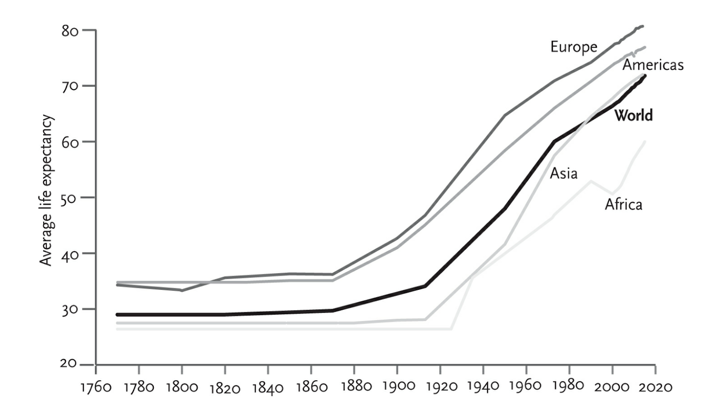
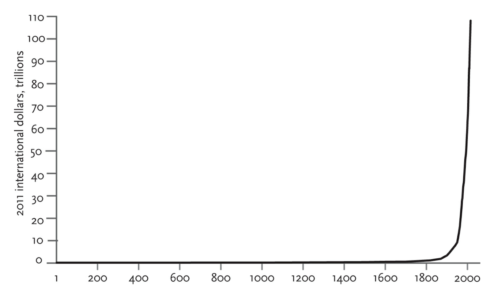
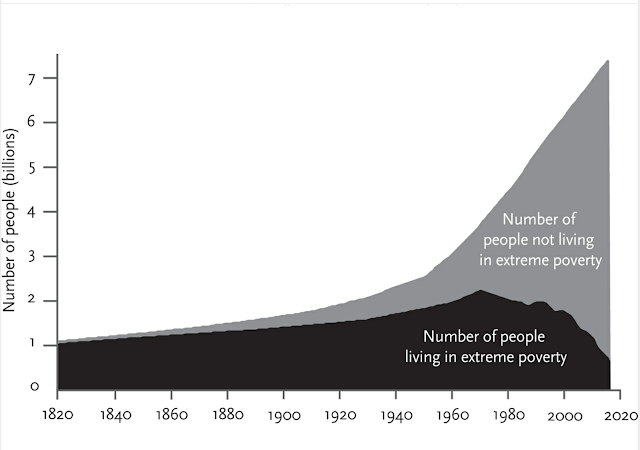
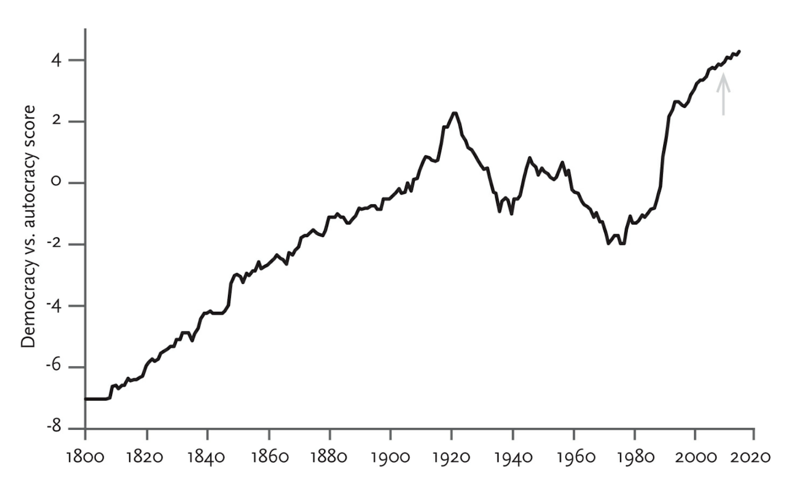
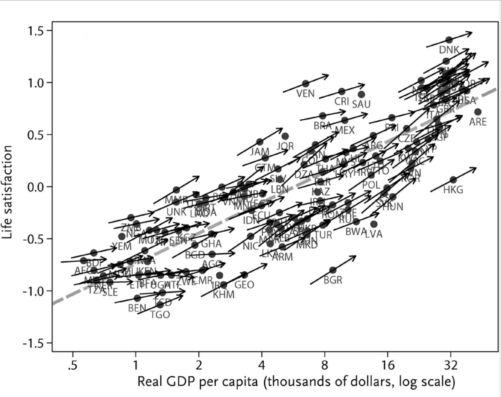
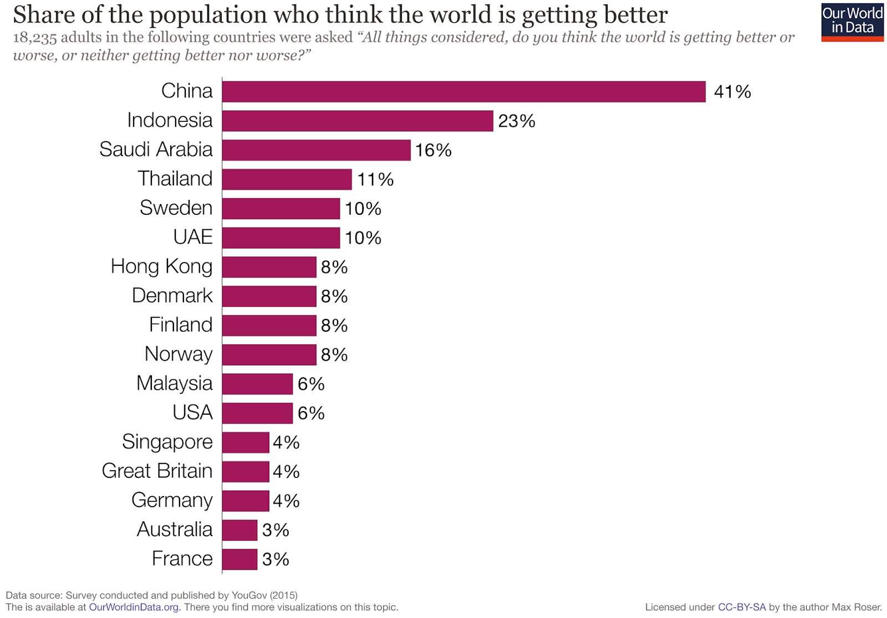
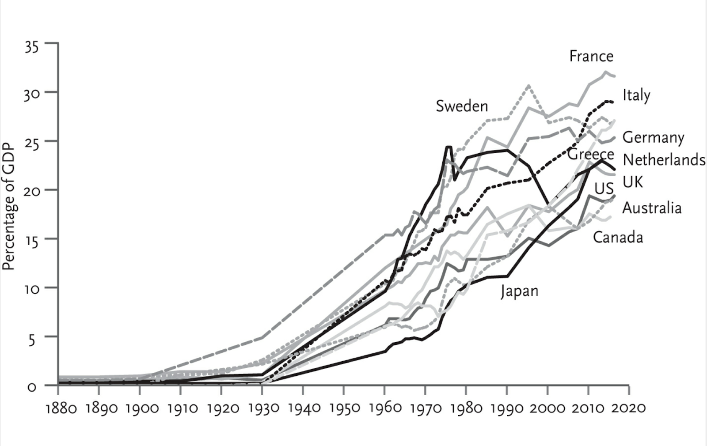

# Enlightenment Now

_Enlightenment Now_ makes a convincing case that the state of human civilization has improved massively over the course of history, particularly the last few centuries, and that this progress is continuing today.

More generally, Pinker argues for a set of principles, which he succinctly sums up as “reason, science, humanism, and progress”. These are the ideals  formulated during the Enlightenment: reason over superstition, knowledge over ignorance, humanism over religion, and a proactive, rational approach to solving problems. These are also the ideals that have guided civilization towards good, and with which our greatest achievements are built.

But first: the idea that life, on average, is improving is a surprising idea (at least to people answering surveys with this question). So is it?

### How has the world improved? Let me count the ways

The majority of the book is about statistics on long-term trends in the world. Let’s take a look.

#### Material progress

- Human lifespans have increased, reaching 71.4 years in 2015.

- Child mortality has declined from 30-50% even in the richer European countries in the 1800s to a fraction of a percent in developed countries (the global average is 4%).
- The lifespan increase is not just a result of decreasing child mortality: the life expectancy for people of all ages has increased, and if anything the trend is accelerating.
- Deaths from diseases have declined.

- The percentage of undernourished people in the developing world has fallen from 35% in 1970 to less than 15% in 2015.
- World GDP, well …

In many of these cases, it is not just the total progress that it shocking, but how much of it has been recent. Until around 1970, the number of people living in extreme poverty increased as the population rose, and then started falling, and then went into a massive fall starting in 2000.

#### Safety

I discussed the decline of warfare in a previous post {link}. Meanwhile Steven Pinker has written an entire book, _The Better Angels of Our Nature_ , focused on the decline of conflict. For more on this, see one of those resources.

Other aspects of safety have also improved:

- Car-related deaths per kilometer in the US have fallen to about 1/20th of their 1920 value and 1/5th of their 1950 value.
- Pedestrian deaths have also fallen: in the US, 5 000 pedestrians died in 2014, compared to 15 500 in 1937. This is especially surprising when you consider the difference in the number of cars on the road and even total population.
- Aircraft deaths have fallen from about 5 per year per million passengers in 1970 to a value so close to the x-axis that I can’t read it off the graph (0.1 or less) in 2015.
- Deaths from falls, fire, and drowning have fallen steadily during the 1900s.
- Workplace deaths have declined by about a factor of over 10 since 1910.
- Natural disaster deaths, though, can’t be helped - except, wait, they can. Natural disaster deaths have fallen from about 8 per 100 000 people to 1 per 100 000 since the 1950s.
- Deaths from lightning strikes have declined by a factor of over 50.

Pinker reiterates the standard - though seemingly much needed - litany that terrorism deaths are insignificant compared to practically any other cause of death. Pinker lists lightning, attacks by non-dog mammals, bathtub-related drownings, and, I quote, “contact with hot tap water” as causing more deaths per year in the US.

It is true that terrorist acts are high-variance events; if 2001 had been selected as the year instead of 2015, it is likely that “contact with hot tap water” might have to settle for a lower ranking. And there is a very small chance of statistically significant terrorism - a nuclear attack on a large city could kill millions. But even taking all the existing and potential outliers into consideration, the fact that ISIS tops the list of threats on a [recent opinion poll](http://www.pewglobal.org/2017/08/01/globally-people-point-to-isis-and-climate-change-as-leading-security-threats/) is a colossal failure of reason.

Pinker notes that terrorist groups have utterly failed to accomplish long-run strategic objectives, and their prominence in the media is mostly due to their being so few real security threats. He quotes Yuval Noah Harari (author of _Sapiens_): “If in 1150 a few Muslim extremists had murdered a handful of citizens in Jerusalem, demanding that the crusaders leave the Holy Land, the reaction would have been ridicule rather than terror. If you wanted to be taken seriously, you should have at least gained control of a fortified castle or two.”

#### Freedom & democracy

Perhaps civilization has enjoyed a brief respite from starvation and violence, while temporarily beating back illness and death. Perhaps the fragile international order has bestowed us a brief respite from conflict and genocide. But surely the world is once again sliding towards autocracy as our democratic institutions crumble, after which all the material advances will be rolled back and the tanks rolled in?

(The arrow is 2008, the last year plotted in the 2011 _The Better Angels of Our Nature_, to show that, no, Pinker has not jinxed the world with his optimism)

It is notable that the upwards trend in this graph was reversed for the time period from 1920 to 1980; progress is far from smooth or constant. But even in the 2010 to 2015 period, the latest shown in the graph, democracy marched steadily onwards.

Pinker takes care to point out that this is not because democracy works like the “civics-class ideal” of rational voters electing reasonable, uncorrupt politicians. Instead, perhaps the greatest strength of democratic systems is their ability to foster peaceful power transfers. Pre-modern monarchs would have looked with envy on, say, the United States, which has transferred executive power 44 times without it causing a single coup, revolution, or peasant uprising.

It is also true that many recent trends (including ones in the United States, Turkey, Russia, China) are not positive; it will be interesting to see what the data looks like once it’s updated to 2018. But the long-run trend offers hope that democracy is far from fragile.

Once again, the simple fact that the world has improved so much makes it harder to realize the extent of progress. Human rights watchdogs find more and more evidence of wrongdoing, not always because there is more of it, but because we are - rightly - getting better at finding and eradicating it.

#### Equality

Alright, maybe civilization is a lot more safe and prosperous and free and democratic, but surely this just allows humanity’s worst tribal instincts to show in the form of discrimination?

In what seems to be a recurring trend, media reports on the latest wrongdoings and failures around the world can give the impression that sexism and racism are on the rise. But surveys show that attitudes are improving, and fast.

Perhaps people are simply concealing their hidden prejudices? In a clever piece of statistics, Pinker looks at trends in Google search terms (which people don’t exactly take pains to filter, at least judging by some of the most popular ones): searches for sexist, racist, and homophobic jokes have all declined by a factor of over 3 since 2004. This is likely understating the effect, since during this time Google has gone from being the platform for young technophile liberals to being the platform for everyone and everything (except a few ardent DuckDuckGo users).

There are dozens of other statistics to back up this trend: hate crimes are decreasing; partner-inflicted violence in the US is down to one-third of the number in the 1990s; in 1950, half of the world’s countries had laws that discriminated against minorities, whereas in 2003 the share had fallen to a fifth; more countries are decriminalizing homosexuality each year; a 2008 survey found that in all countries polled, a majority of people were in favor of ethnic and religious equality.

In general, discrimination decreases as countries grow richer; rich, Western countries are the most tolerant, and developing ones the least. But everywhere, the trend is upwards. The World Values Survey’s Emancipative Value Index shows a remarkably steady upwards increase in every region from 1960 onwards. For instance, the Middle East in 2005 ranks as high as 1960s Western Europe or 1970s United States.

By far the best predictor of liberal, emancipative values, however, is knowledge. The type of knowledge in question is the World Bank Knowledge Index, which explains 73% of variation in emancipative values (much more than per capita GDP). Who would have guessed?

#### Knowledge

Sure, let’s grant that people are healthier and safer and freer and more equal, but are we more knowledgeable?

Yes. For example, in 1950 35% of the world population was literate, compared to 85% in 2014. _Enlightenment Now_ has a chapter on knowledge and it is full of similar statistics, as well as a bunch of graphs where time is on the x-axis and something education-related on the y-axis and all the lines on the graph are going upwards faster than a .

#### Happiness

Fine. Civilization is a lot better, and rapidly becoming even better, at keeping people healthy and safe, at the same time as people become freer and more equal and less affected by discrimination and more knowledgeable. But surely all this material progress and increased comfort and safety and wellbeing and equality and understanding merely sets the stage for crushing existential ennui that leaves people more sad, depressed, and lonely than in the simple old times?

There’s something called the Easterlin paradox which states: within countries, richer people are happier, but richer countries are not happier than poorer ones.

This paradox is easy to resolve, because the claim is false.

(The arrows on the country dots represent the correlation between income and life satisfaction within that country)

Firstly, the trend is so clearly upwards that you can barely ask for any better when you’re comparing 131 different countries. Secondly, all the arrows are upwards; in no country is there a negative correlation between income and happiness.

Note, however, that the x-axis scale is logarithmic, so the straight line would actually look like heavily diminishing returns on a linear plot. In other words, the absolute increase in GDP per capita required to make a country x units happier increases as GDP per capita increases (the formulation of the Easterlin paradox was a result of noisy data making diminishing returns look like no returns).

Do you want more statistics? Another study found that in 8 out of the 9 European countries studied happiness trends tracked changes in GDP per capita. The World Values Survey found that 45 out of 52 countries were happier in 2007 than 1981. Outliers exist - for example, life satisfaction has remained roughly constant in the United States for the past few decades, and what’s up with Bulgaria in the graph above? - but the general trend is clear.

All this means that as developing countries develop, they will become happier. As developed countries continue to grow, they will also become happier. This is great news: there is a relatively straightforward way to make the people happier, and it is already happening and will continue to happen, absent a major disaster, for the foreseeable future.

What about loneliness? Despite the “loneliness epidemic” that sensationalist articles claim is ravaging the West, studies have found that loneliness rates among high school and college students in the United States have steadily trended downwards since the 1970s. The few studies on loneliness in the general population show no increase or a slight increase, probably due to more people being single. Despite social media’s supposed destruction of face-to-face interaction, it turns out people enjoy real social interaction and have not traded it away: on average, people report having as much quality friendships and emotional support as in previous decades. Though avid internet users have less face-to-face contact with people, they spend more time with friends and on average report that social media has a positive affect (once again, increasing averages do not imply a uniform effect on everybody and say nothing about outliers).

Of course, not all modern social trends are positive. But the message in the data is that the net effect of modernity on mental health and wellbeing is positive. Increasing quality of life is not causing epidemics of anything. People tend to be happier and more satisfied with life when they are healthier, safer, richer, freer, and live longer. This is not quite breaking news.

### In defense of progress

#### The case for the case for progress

_Enlightenment Now_ is not a dispassionate, academic overview of the effects of modernity, progress, and Enlightenment; it reads more like a lawyer defending a client.

This is not a bad thing. An outright defense of progress is much needed.

Our World in Data published an [excellent article](https://ourworldindata.org/wrong-about-the-world) about people’s perceptions of worldwide trends. In most surveyed countries, a majority of people think global poverty is increasing. In no country does a majority think it’s decreasing; only China is close, with 49% correctly answering that it is decreasing (and fast; see the graph above). In many countries, particularly developed ones, only 10-15% answered correctly.

As the article argues, this is important because people are far too pessimistic about the future.

(From the same article)

Look at the bottom of that graph. In France and Australia, only 3% of people think the world is getting better. 3% of people is a ridiculously low fraction to get for any survey question, especially one with only three answer choices. That’s probably close to the percentage of people who clicked the wrong box by accident. I would be surprised to see such pessimism if I ran this survey in an underground zombie apocalypse survival shelter that ran out of canned food last week.

So there is need for perspective recalibration, especially in the developed world. If you look at the graphs in that article, you will see that China is always near the top, along with places like Kenya, Senegal, Nigeria, and Indonesia. It is easy to forget how much modernity has done for us when you’re not experiencing it first-hand.

Perhaps modernity has run its course, and though developing countries can still benefit from it, the developed world is about as saturated with progress as it can get without ill-effects? This is the conclusion that each generation seems to come to, and so far they’ve all been proven wrong by the next.

#### Progress: 2/5, would not recommend

Though the fruits of progress are as popular as ever, the idea that civilization advances is remarkably unpopular. As Pinker illustrates:

> An entire lexicon of abuse has grown up to express {scorn about the idea of progress}. If you think knowledge can help solve problems, then you have a “blind faith” and a “quasi-religious belief” in the “outmoded superstition” and “false promise” of the “myth” of the “onward march” of “inevitable progress.” You are a “cheerleader” for “vulgar American can-doism” with the “rah-rah” spirit of “boardroom ideology,” “Silicon Valley,” and the “Chamber of Commerce.” You are a practitioner of “Whig history,” a “naïve optimist,” a “Pollyanna,” and of course a “Pangloss,” a modern-day version of the philosopher in Voltaire’s Candide who asserts that “all is for the best in the best of all possible worlds.”

Several biases contribute to a distorted view of progress. Intuitive ideas of frequency often rely on the availability heuristic (judging frequency based on how readily examples come to mind). Negative examples feature more often in the media and remain in memory for longer, tilting people’s perceptions.

Meanwhile, the “Optimism Gap” is a phenomenon where people tend to assume that their own circumstances and future outlook are good, while those of society as a whole are bad. The most flagrant example of this is a survey which found that across the world, people underestimate the percentage of other people who say they’re happy by 42 percentage points.

But Pinker argues that resistance to the idea of progress runs deeper.

First, there’s an asymmetry between bad outcomes and good outcomes. A random change to something that works is much more likely to do harm than good, simply because of how many things need to go right for something to work. Therefore it is rational to assume that, given random change in a complex system, the trend would be down.

Second, the world is big, so questions of whether there has been progress are almost bound to be quantitative ones. The way to counteract availability bias is to look at numbers, and assigning enough weigh to mere numbers to cancel out vivid examples is something humans are notoriously bad at.

Third, cynicism looks intellectual. Pinker cites a study showing that critics who praised a work were rated as less competent than those who criticized it. If one journalist writes “The Crisis in Crime: How the latest crime epidemic reveals the sickness of modern society”, and another writes “Crime Trends Pretty Okay, Actually: Some further incremental improvement still needed”, which seems like serious, quality journalism?

How might this perception come about? Skepticism is a key attitude when discussing claims and arguments. Most sophisticated, fancy claims rely on a lot of skepticism; this might lead to the impression that cynicism and skepticism are required properties of a sophisticated idea. But these are just surface-level appearances; it does not follow that all skeptical ideas are correct. It’s easy to hear “critical thinking” and think it means “_critical_ thinking”.

Fourth, Pinker argues that during the 20th century, pessimism and skepticism towards Western progress were the Mongol hordes of the intellectual landscape, sweeping out of their far-off lands to conquer the entire continent (he cites Arthur Herman’s _The Idea of Decline in Western History_ and Robert Nisbet’s _History of the Idea of Progress_). In particular Pinker, bemoans Nietzsche’s resurgent popularity and argues against his misanthropic views. It’s hard not to agree with him. A philosopher who calls for the need of a “declaration of war on the masses by _higher men_” to annihilate the “decaying races” and the “humbug called ‘morality’”, or says “Man shall be trained for war and woman for the recreation of the warrior. All else is folly” is not a philosopher whose views should be admired by people who value human life or wellbeing.

In addition to philosophers who are diametrically opposed to any reasonable humanist morality, philosophies that seek to undermine knowledge and objectivity are surprisingly popular (Pinker lists Critical Theory, Existentialism, Postmodernism, Poststructuralism, and Post-whateverism as examples).

Pinker also briefly outlines the influence of Nietzschean romantic heroism and the denial of objectivity on the ideologies of such historical heroes as Benito Mussolini, the Nazis, and the “theoconservatism” of Bannon and Trump. This isn’t exactly a fair argument: the type of anti-objectivity and romanticism that gives you millions of people sacrificing themselves for the glory of the fatherland is different, at least quantitatively, from the type of anti-objectivity endorsed by sane people.

But Pinker does have a point. No society has ever failed due to being too humanist or too rational. But example after example tells us that in the other way lies danger.

### Houston, we … don’t have a problem?

So, is everything in the world improving? Is everyone who talks about negative trends wrong? Should we just sit back and watch the inevitable march of progress?

This is not the point. Civilization advances when people work to advance it. Emphasizing the progress we have made is not an argument for laziness and blind faith; it is an argument for doing more of whatever it is we did right to achieve that progress.

And, of course, there are many negative trends in the world, perhaps most notably inequality, climate change, and existential risks.

#### Inequality

First, inequality. GINI coefficients have been rising in the United States and some other developed countries. While this is a problem, Pinker points out several facts that should be taken into account. The world as a whole is becoming more equal, and fast, as developing countries catch up. In large part due to the rise of China and India, the world income distribution is less like a two-humped camel and more like a single distribution, as vividly illustrated by the graphs on this page {link to OurWorldInData thing}.

Even within developed countries like the US and UK, the GINI coefficient is still below the level it was in the 1700s and 1800s. At the same time, social spending as a percentage of GDP has been on a near-continuous rise in developed countries:

While Thomas Piketty writes in _Capital in the Twenty-First Century_ that “The poorer half of the population are as poor today as they were in the past, with barely 5 percent of total wealth in 2010, just like in 1910”, Pinker notes that this is confusing inequality with poverty. Though incomes have, in recent decades, risen slower for the poor, they have still risen. Government statistics on poverty often understate improvements because the definition of poverty is readjusted; using the 1980 definition, consumption poverty in the United States fell from 30% in 1960 to below 15% in 1980, and has since then declined at a slower rate to about 4% in 2015 (disposable income trends are mostly similar, though have stagnated instead of falling slowly since 2000). There is a lot of room for improvement, but the trend is far from apocalyptic.

#### Sustainability

A big challenge facing civilization is sustainability. There are a few good trends here: CO2 emissions per dollar of GDP have been declining in developed countries like the US and UK since 1950, and in the world as a whole as 1980, due to the economy’s carbon intensiveness falling and environmental concerns being accorded more weight as countries develop. Predicted resource shortages have failed to occur, international cooperation has worked in slowing ozone depletion and protecting ever greater areas on both land and sea, and the population explosion scenario has largely been averted.

However, at the same time global CO2 emissions have quadrupled since 1960 and, despite staying roughly steady in recent years, there is no sign of the required rapid decrease.

What should we do? Actually, let’s take an easier question: what should we _not_ do? Pinker correctly identifies some things that we definitely should not do, yet which have somehow become associated with the environmental movement.

Part of the mainstream environmental movement has developed an ideology Pinker calls “greenism”, which holds as its basic principle some variation of sacred nature being defiled by human greed. The only solution is to protect nature at all costs, switch to “natural” ways of life and production, scale back industrialization, and, according to more extreme ideologues, reduce human population in rapid, unspecified ways.

I think the central mistake in greenist ideology is selecting shallow terminal values. We care about the environment because of its necessity for human and animal welfare. We care about biodiversity because it is our greatest heritage and, as far as we know, unique in the universe. Greenist ideology forgets the reasons we need to fight for the environment, replacing them with worship of a semi-coherent ideal of nature as an end in itself.

Needless to say, this sometimes goes wrong. Take nuclear power. Pinker writes: “It’s often said that with climate change, those who know the most are the most frightened, but with nuclear power, those who know the most are the least frightened.” The consensus on nuclear power is that it is the most scalable zero-carbon energy production method we have, as well as the safest power source (even solar and wind cause more deaths per watt-hour, though admittedly this is because the installation of rooftop solar and wind turbines dangerous (see [here](https://www.nextbigfuture.com/2011/03/deaths-per-twh-by-energy-source.html) and [here](http://www.nuceng.ca/refer/risk/15%20-%20Polenp~1.pdf)). [Another study](https://pubs.acs.org/doi/abs/10.1021/es3051197) estimates that the use of nuclear power has saved 1.8 million lives, and replacing it worldwide with fossil fuel power could cost from 420 000 (if it’s replaced with only natural gas) to 7 million (if it’s replaced with coal) lives. The rational, science-based climate policy is to massively ramp up nuclear power production alongside renewables to maximize carbon-free energy generation.

But the end-goal of greenists isn’t solving climate change or preventing deaths from pollution. It’s about “nature”, whatever that means, and everyone agrees that “big complex machine that uses dangerous artificial materials” is not really natural.

And so we get absurd situations, such as Germany, a country more likely to be hit by an asteroid than a tsunami, deciding to phase out all nuclear power plants after the Fukushima disaster (which caused exactly 0 deaths, compared to [11 000 air pollution-related deaths per day](http://www.who.int/airpollution/en/)), cancelling out a lot of the country’s considerable progress in carbon-free energy generation.

A similar situation, where complaints of something being unnatural hinders real progress on environmental issues, exists for GMOs.

(This is not to say that there are no valid arguments against GMOs or nuclear power; just that in both cases the scientific consensus is that, on balance, they are safe, practical, and their correct use could be an essential part of solving environmental problems.)

Pinker’s alternative to “greenism” is a movement called ecopragmatism, ecomodernism, or bright green environmentalism. Instead of railing against any human effect on nature, ecomodernism acknowledges that some amount of environmental impact is both unavoidable and desirable. Instead of calling for degrowth and the dismantling of modern civilization or, alternatively, bemoaning the inevitable eco-Armageddon, ecomodernism advocates for rapid and constructive technological and societal innovation to solve sustainability problems. And finally, like (one of) its name suggests, it is pragmatic: let’s not waste potentially climate-saving innovations just because they look unnatural.

To sum up: various sustainability problems are the greatest issues facing 21st century civilization. The way forwards, like with any other problem, is not preaching doom and gloom, or pursuing the wrong goal, but working to solve it using knowledge and reason.

#### Existential threats

Pinker makes good points about world-ending disasters: predictions of apocalypse have a long and unsuccessful history, society is surprisingly resilient to disasters, many existential threats are immensely low-probability events, well-known ones often doubly so, and alarmism is counterproductive (variants of “we are all going to die and there’s nothing you can do about it” are strangely ineffective at inspiring action).

Other points are less convincing. Pinker raises questionable objections to AI threats; he critiques the paperclip maximizer thought experiment by saying that a superhuman AI would not make such “elementary blunders of misunderstanding”. But the point of the though experiment is that very few value systems, executed executed to their fullest by a powerful agent, will align well enough with human values for the results to be good. Pinker seems to implicitly assume that any intelligent system will have goals that are reasonable by human standards.

More generally there is a danger in assuming that the future is assured. This is not to say that Pinker directly endorses such a view, but it is an easy misinterpretation to make. There is no law of nature that forbids civilization-ending disasters. There is no benevolent force making sure that nothing too bad happens, or if it does, it will at least not be for a stupid reason. Maybe Trump wakes up in a bad mood tomorrow morning, starts a nuclear war, and that’s it.

### Enlightenment when?

(To paraphrase the opening of book 2 of _The Hitchhiker’s Guide to the Galaxy_ ADD LINK:)

The story so far:

In the beginning [modernization was started].

This has made a lot of people very angry and has widely been regarded as a bad move.

_Enlightenment Now_ argues that it has, in fact, turned out to be a very good move. On practically every metric of human wellbeing and satisfaction, the world is doing better than it was two centuries ago, let alone two millennia ago.

This might be hard to believe, at least until you look at the data. But is progress really so improbable? There are 7.6 billion people in the world, the vast majority of whom want things like life, safety, happiness, comfort, and freedom for themselves and others. Even factoring in all of humanity’s worst tendencies and institutional failures and whatnot, there is still an enormous amount of goodwill being directed towards solving these problems.

A key theme in _Enlightenment Now_ is that, contrary to the opinions of edgy philosophers, civilizational progress is neither an oxymoron nor unattainable nor undesirable nor ill-defined. Good things, it turns out, are good. Futhermore, they are interrelated: education, GDP per capita, life satisfaction, freedom, health, and safety correlate with and bolster each other.

This is great news. It means that we are not locked in a trap of sacrifices:  in general, increasing wealth does not leave us listless and decadent; longer life does not make us bored; being educated rather than superstitious and ignorant does not make us sad.

Finally, _Enlightenment Now_ is a reminder of how humanity has wrought the progress it has achieved: rational problem-solving, guided by humanist morality. To continue the upwards rise of civilization and to fix its problems, these Enlightenment ideals are what we need.

[1]:	http://www.pewglobal.org/2017/08/01/globally-people-point-to-isis-and-climate-change-as-leading-security-threats/

[2]:	https://ourworldindata.org/wrong-about-the-world

[3]:	https://www.nextbigfuture.com/2011/03/deaths-per-twh-by-energy-source.html

[4]:	http://www.nuceng.ca/refer/risk/15%20-%20Polenp~1.pdf

[5]:	https://pubs.acs.org/doi/abs/10.1021/es3051197

[6]:	http://www.who.int/airpollution/en/
