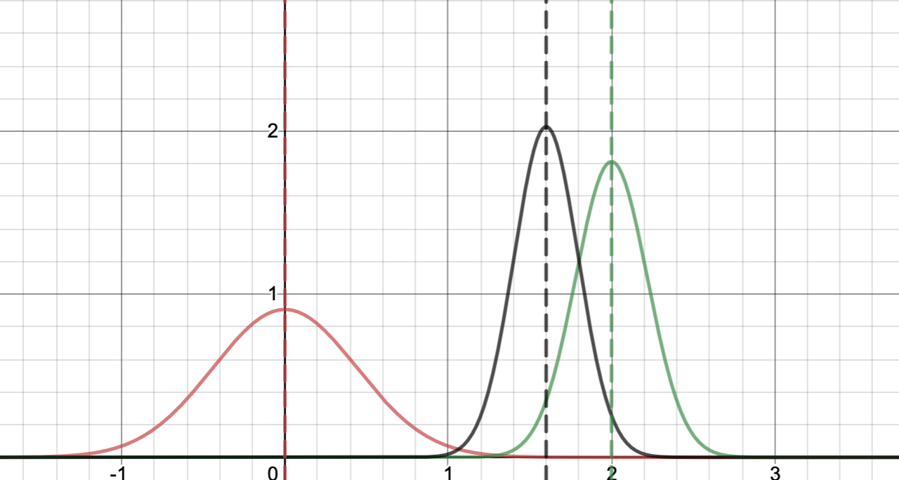
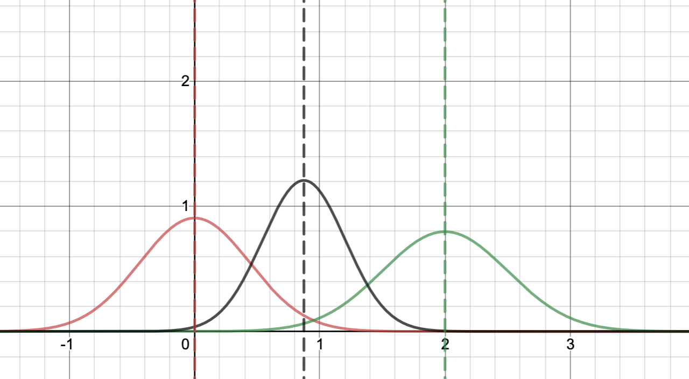
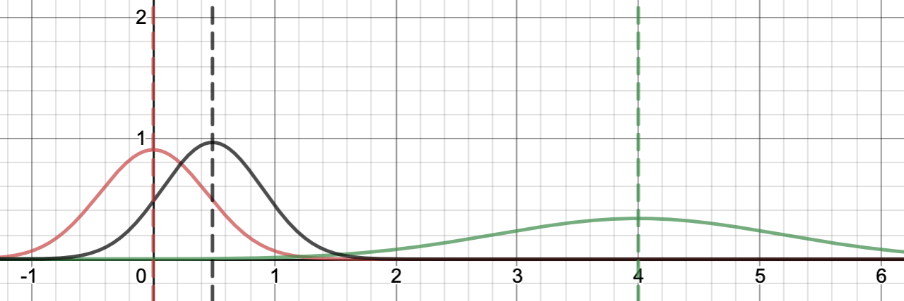

The expected value (EV) of an event / choice / random variable is the sum, over all possible outcomes, of {value of outcome} times {probability of that outcome} (if all outcomes are equally likely, it is the average; if they’re not, it’s the probability-weighted average).

In general, a rational agent makes decisions that maximise the expected value of the things they care about. However, EV reasoning involves more subtleties than its mathematical simplicity suggests, in both the real world and in thought experiments.

Is a 50% chance of 1000€ exactly as good as a certain gain of 500€, or a 50% chance of 2000€ with a 50% chance of a 1000€ loss instead?

Not necessarily. A bunch of research (and common sense) says people put decreasing value on an additional unit of money: the thousandth euro is worth less than the ten-thousandth. For example, average happiness scales roughly logarithmically with per-capita GDP. The thing to maximise in a monetary tradeoff is not the money, but the value you place on money; with a logarithmic relationship, the diminishing returns mean that more certain bets are better than naive EV-of-money reasoning implies. A related reason is that people [weight losses more than gains][1], which makes the third case look worse than the first even if you don’t assume a logarithmic money-\>value function.

However, a (selfish) rational agent will still maximise EV in such decisions – not of money, but of what they get from it.

(If you’re not selfish and live in a world where money can be transferred easily, the marginal benefit curve of efficiently targeted donations is essentially flat for a very long time – a single person will hit quickly diminishing returns after getting some amount of money, but there are enough poor people in the world that enormous resources are needed before you need to worry about everyone reaching the point of very low marginal benefit from more money. To fix the old saying, albeit with some hit to its catchiness: “money can buy happiness only (roughly) logarithmically for yourself, but (almost) linearly in the world at large, given efficient targeting”.)

In some cases, we don’t need to worry about wonky thing-\>value functions. Imagine the three scenarios above, but instead of euros we have lives. Each life has the same value; there’s no reasonable argument for the thousandth life being worth less than the first. Simple EV reasoning is the right tool.

### Why expected value?

This conclusion easily invites a certain hesitation. Any decision involving hundreds of lives is a momentous one; how can we be sure of exactly the right way to value these decisions, even in simplified thought experiments? What’s so great about EV?

A strong argument is that maximising EV is the strategy that leads to the greatest good over many decisions. In a single decision, a risky but EV-maximising choice can backfire – you might take a 50-50 bet of saving 1000 lives and lose, in which case you’ll have done much worse than picking an option of certainly saving 400. However, it’s a mathematical fact that given enough such choices, the *actual* average value will tend towards the EV. So maximising EV is what results in the most value in the long run.

You might argue that we’re not often met with dozens of similar momentous decisions. Say that we’re reasonably confident the same choice will never pop up again, and certainly not many times; doesn’t the above argument no longer apply? Take a slightly broader view though, and consider which strategy gets you the most value across all decisions you make (of which there will realistically be many, even if no single decision occurs twice): the answer is still EV maximisation. We could go on to construct crazier thought experiments – toy universes in which only one decision ever occurs, for example – and then the argument really begins to break down (though you might try to save it by some wild scheme of imagining many hypothetical agents faced with the same choice and consider a Kantian / rule-utilitarian principle of deciding by answering the question of which strategy would be right if it were the one adopted across all countless hypothetical instances of this decision).

There are other arguments too. Imagine 1000 people are about to die of a disease, and you have to decide between a cure that will certainly cure 400 versus an experimental one that will either cure everyone or save no-one. Imagine you are one of these people. In the first scenario, you have a 40% chance of living; in the second, a 50% chance. Which would you prefer?

On a more mathematical level, von Neumann (an [all-around][2] polymath) and Morgenstern (co-founder of game theory with von Neumann) have [proved][3] that under fairly basic assumptions of what is rational behaviour, a rational agent acts as if they’re maximising the EV of some preference function.

### Problems with EV

Diabolical philosophers have managed to dream up many challenges for EV reasoning. For example, imagine there’s two dollars on the table. You toss a coin; if it’s heads you take the money on the table, if it’s tails the money on the table doubles and you toss again. You have a 1/2 chance of winning 2 dollars, 1/4 chance of winning 4, 1/8 chance of winning 8, and so on, for a total EV of 1/2 x 2 + 1/4 x 4 + … = 1 + 1 + … . The sequence diverges to infinity.

Imagine a choice: one game of the “St. Petersburg lottery” described above, or a million dollars. You’d be crazy not to pick the latter.

Is this a challenge to the principle of maximising EV? Not in our universe. We know that whatever casino we’re playing at can’t have an infinite amount of money, so we’re wise to intuitively reject the St. Petersburg lottery. ([This section on Wikipedia][4] has a very nice demonstration of why, even if the casino is backed by Bill Gates’s net worth, the EV of the St. Petersburg game is less than $40.)

The St. Petersburg lottery isn’t the weirdest EV paradox by half, though. In the [Pasadena game][5], the EV is undefined (see the link for a definition, analysis, and an argument that such scenarios are points against EV-only decision-making). Nick Bostrom writes about the problems of consequentialist ethics in an infinite universe (or a universe that has a finite probability of being infinite) [here][6].

There’s also the classic: Pascal’s wager, the idea that even if the probability of god existing is extremely low, the benefits (an eternity in heaven) are great enough that you should seek to believe in god and live a life of Christian virtue.

Unlike even Bostrom’s infinite ethics, Pascal’s wager is straightforwardly silly. We have no reason to privilege the hypothesis of a Christian god over the hypothesis – equally probable given the evidence we have – that there’s a god who punishes us exactly for what the Christian god rewards us for, or that god is a chicken and condemns all chicken-eaters to an eternity of hell. So even if you accept the mathematically dubious multiplication of infinities, Pascal’s wager doesn’t let you make an informed decision one way or another.

However, the general format of Pascal’s wager – big values multiplied by small probabilities – is the cause of much of EV-related craziness, and dealing with such situations is a good example of how naive EV reasoning can go wrong. The more general case is often referred to as [Pascal’s mugging][7], and exemplified by the scenario (see link) where a mugger threatens to torture an astronomical amount of people unless you give them a small amount of money.

### Tempering EV extremeness with Bayesian updating

Something similar to Pascal’s mugging easily happens if you calculate EVs by multiplying together very rough guesses involving small probabilities and huge outcomes.

The best and most general approach to these sorts of issues is laid out [here][8].

The key insight is to remember two things. First, every estimate is a probability distribution: if you measure a nail or estimate the effectiveness of a charity, the result isn’t just your best-guess value, but also the uncertainty surrounding it. Second, [Bayesian updating][9] is the correct way to change your estimates when given new evidence (and hence you should pay attention to your prior: the estimate you have before getting the new information).

Using some maths detailed [here][10], it can be shown that if your prior and measurement both follow normal distributions, then your new (Bayesian) estimate will be another normal distribution, with a mean (=expected value) that is an average of the prior and measurement means, weighted by the inverse variance of the two distributions. (Note that the link does it with log-normal distributions, but the result is the same; just switch between variables and their logarithms.)

[Here’s an interactive graph that lets you visualise this][11].

The results are pretty intuitive. Let’s say our prior for the effectiveness of some intervention has a mean of zero. If we take a measurement with low variance, our updated estimate probability distribution will shift most of the way towards our new measurement, and its variance will decrease (it will become narrower):

If the same measurement has greater variance, our estimates shift less:

And if we have a very imprecise measurement – for example, we’ve multiplied a bunch of rough guesses together – the estimate barely shifts even if the estimate is high:

Of course, we can argue about what our priors should be – perhaps, for many of the hypothetical scenarios with potentially massive benefits (for instance concerning potential space colonisation in the future), the variance of our prior should be very large, in which case even highly uncertain guesses will shift our best-guess EV a lot. But the overall point still stands: if you go to your calculator, punch in some numbers, and conclude you’ve discovered something massively more important than anything else, it’s time to think very carefully about how much you can really conclude.

Overall, I think this is a good example of how a bit of maths can knock off quite a few teeth from a philosophical problem.

([Here’s a link to a wider look at pitfalls of overly simple EV reasoning with a different framing][12], by the same author as [this earlier link][13]. And [here][14] is another exploration of the special considerations involved with low-probability, high-stakes risks.) 

### Risk neutrality

An implication of EV maximisation as a decision framework is risk neutrality: when you’ve measured things in units of what you actually care about (e.g. converting money to the value it has for you as discussed above), you really should prefer a 10% chance of 11 “value units” over a 100% chance of 1 “value unit”, or a 50-50 bet between losing 10 and gaining 20 over a certain gain of 14. 

This is not an intuitive conclusion, but I think we can be fairly confident in its correctness. Not only do we have robust theoretical reasons for using EV, but we can point to specific bugs in our brains that makes us balk at risk-neutrality: biases like [scope neglect][15], which makes humans underestimate the difference between big and small effects, or [loss aversion][16], which makes losses more salient than gains, or a preference for certainty.

### Stochastic dominance (an aside)

Risk neutrality is not necessarily specific to EV maximisation. There’s a far more lenient, though also far more incomplete, principle of rational decision making that goes under the clumsy name of “[stochastic dominance][17]”: given options A and B, if the probability of a payoff of X or greater is more under option A than option B for all values of X, then A “stochastically dominates” option B and should be preferred. It’s very hard to argue against stochastic dominance.

Consider a risky and a safe bet; to be precise, call them option $A$, with a small probability $p$ of a large payoff $L$, and option $B$, with a certain small payoff $S$. Assume that $pL > S$, so EV maximising says to take option $A$. However, we don’t have stochastic dominance: the probability of getting a small amount of value $v$ ($v < S$) is greater with $B$ than $A$, whereas the probability of getting a large amount of value ($S < v < L$) is greater with option $A$.

The insight of [this paper][18] (summarised [here][19]) is that if we care about the total amount of value in the universe, are sufficiently uncertain about this total amount, and make some assumptions about its distribution, then stochastic dominance alone implies a high level of risk neutrality.

The argument goes as follows: we have some estimate of the probability distribution $U$ of value that might exist in the universe. We care about the entire universe, not just the local effects of our decision, so what we consider is $A + U$ and $B + U$ rather than $A$ and $B$. Now consider an amount of value $v$. The probability that $A + U$ exceeds $v$ is the probability that $U > v$, plus the probability that $(v - L) < U < v$ *and* $A$ pays off $L$ (we called this probability $p$ earlier). The probability that $B + U$ exceeds $v$ is the probability that $U > v - S$.

Is the first probability greater? This depends on the shape of the distribution of $U$ (to be precise, we’re asking whether $P(U > v) + p P(v - L < U < v) > P(U > v - S)$, which depends on $U$). If you do a bunch of maths (which is present in the paper linked above; I haven’t looked through it), it turns out that this is true for all $v$ – and hence we have stochastic dominance of $A$ over $B$ – *if* the distribution of $U$ is wide enough and has a fat tail (i.e. trails off slowly as $v$ increases).

What’s especially neat is that this automatically excludes Pascal’s mugging. The smaller the probability p of our payoff is, the more stringent the criteria get: we need a wider and wider distribution of U before A stochastically dominates B, and at some point even the most stringent Pascalian must admit U can’t plausibly have that wide of a distribution.

It’s far from clear what U’s shape is, and hence how strong this reasoning is (see the links above for that). However, it is a good example of how easily benign background assumptions introduce risk neutrality into the problem of rational choice.

### Implications of risk neutrality: hits-based giving

What does risk neutrality imply about real-world altruism? In short, that we should be willing to take risks.

A good overview of these considerations is given [in this article][20]. The key point:

> [W]e suspect that, in fact, much of the best philanthropy is likely to fail.

For example, [GiveWell thinks that Deworm the World Initiative probably has low impact][21], but still recommends them as one of their top charities because there’s a chance of massive impacts.

Hits-based giving comes with its own share of problems. As [the article linked above][22] notes, it can provide a cover for arrogance and make it harder to be open about decision-making.  However, just as high-risk high-reward projects make up a disproportionate share of successes in scientific research and entrepreneurship, we shouldn’t be surprised if the bulk of returns on charity comes from a small number of risky bets.

[1]:	https://en.wikipedia.org/wiki/Loss_aversion
[2]:	https://en.wikipedia.org/wiki/List_of_things_named_after_John_von_Neumann
[3]:	https://en.wikipedia.org/wiki/Von_Neumann%E2%80%93Morgenstern_utility_theorem
[4]:	https://en.wikipedia.org/wiki/St._Petersburg_paradox#Finite_St._Petersburg_lotteries
[5]:	http://www.colyvan.com/papers/pasadena.pdf
[6]:	https://nickbostrom.com/ethics/infinite.html
[7]:	https://nickbostrom.com/papers/pascal.pdf
[8]:	https://blog.givewell.org/2011/08/18/why-we-cant-take-expected-value-estimates-literally-even-when-theyre-unbiased/
[9]:	https://en.wikipedia.org/wiki/Bayesian_inference
[10]:	https://blog.givewell.org/attachments/worms.pdf
[11]:	https://www.desmos.com/calculator/t8g3rdllxe
[12]:	https://blog.givewell.org/2014/06/10/sequence-thinking-vs-cluster-thinking/
[13]:	https://blog.givewell.org/2011/08/18/why-we-cant-take-expected-value-estimates-literally-even-when-theyre-unbiased/
[14]:	https://arxiv.org/ftp/arxiv/papers/0810/0810.5515.pdf
[15]:	https://en.wikipedia.org/wiki/Scope_neglect
[16]:	https://en.wikipedia.org/wiki/Loss_aversion
[17]:	https://en.wikipedia.org/wiki/Stochastic_dominance
[18]:	https://philarchive.org/archive/TAREES
[19]:	https://ethicalhaydonism.wordpress.com/2020/03/27/in-this-universe-you-have-to-be-risk-neutral/
[20]:	https://www.openphilanthropy.org/blog/hits-based-giving
[21]:	https://blog.givewell.org/2016/07/26/deworming-might-huge-impact-might-close-zero-impact/
[22]:	https://www.openphilanthropy.org/blog/hits-based-giving