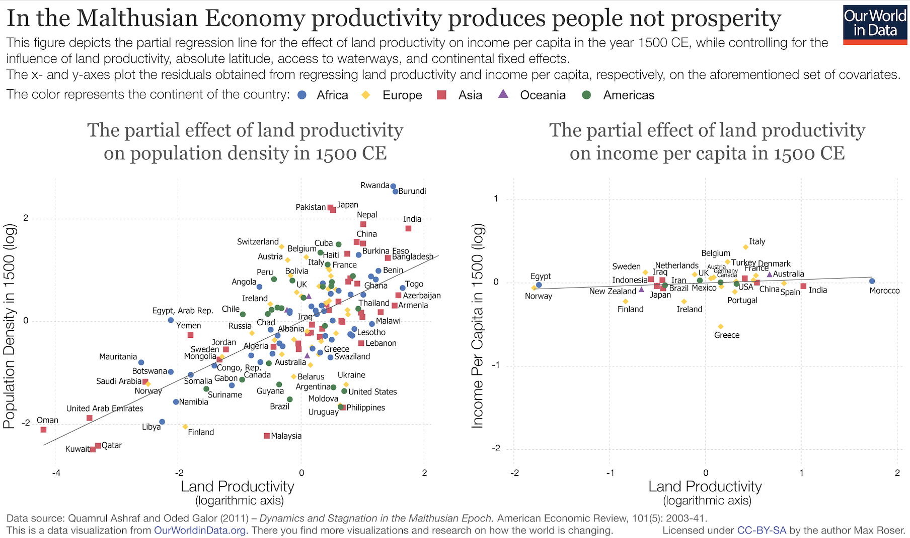
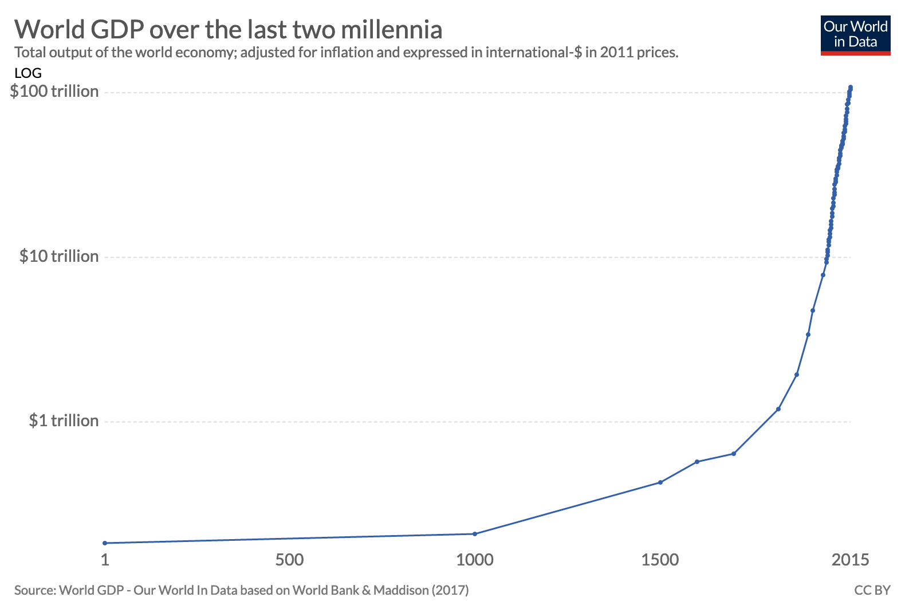
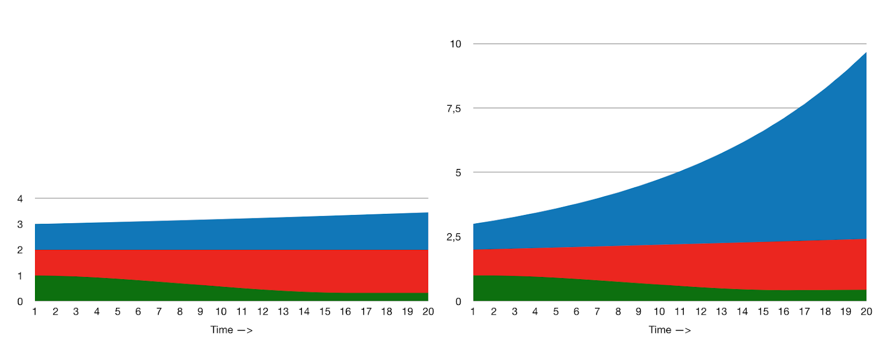

# Growth

It is often said that continuous exponential economic growth cannot be sustainable in the long run. This may well be so. But are our values sustainable without growth?

## The zero-sum world

Game theorists distinguish between zero-sum games and non-zero-sum (positive-sum or negative-sum) games. In a zero-sum game, one player’s gain is another’s loss, and visa versa. The sum of the player’s gains is zero; it is impossible for the world at large to gain.

A world without growth is a zero-sum game. If the resources available at time T2 are the same as those available at time T1, the only way to increase your share of those resources is to take them from someone else.

For most of human history, the world was largely zero-sum. Before the industrial revolution, economic and technological progress were generally slow enough that major increases in resources (or human power more generally) did not happen over an individual’s lifespan.

A well-managed estate or a hard-working farmer could, of course, beat the averages without hurting others. However, if you sought to become rich, creating value was a bad bet; you were far better off trying to become friends with the powerful. The powerful had only so many resources at their disposal, so this generally meant – directly or indirectly – worsening someone else’s access to riches. If you were a king seeking to make your nation great, you were probably better off trying to seek control over the resources of other nations (whether through royal marriage, warfare, or other means) than figuring out how to best create wealth within your nation. In a world of slow growth, the first strategy might net you France; the second strategy might mean that your descendants see agricultural efficiency improve by 10%.

Land was essential in premodern societies. Populations generally grew to the maximum density that the land would support, so in the long run land also meant people. Land is an inherently zero-sum game – very little productive land was unoccupied (even historically) and you can’t make more, so gains in land for one party are always losses for another.

Look at premodern societies through a modern lens, and the zero-sum thinking inherent in them is striking. If you were a member of the elite, you squeezed as much value out of the land and labour you have control over as you can; there’s no reason to invest in the future, because productivity would not change much anyways. The ultimate institution in a zero-sum world is the military, because that is how you grab value from others and stop others from grabbing it from you. Hence military culture was venerated.

### A note on the above historical claims

All of these things are, of course, vast generalisations to which there are innumerable exceptions and which, in a more thorough piece, would require plenty of asterisks. Below I’ve gestured at data that supports the general gist of the points made above (feel free to skip this section):

- The transition from a zero- to positive-sum world is indisputable. Consider for instance [English per capita GDP over the past 700-and-some years][1]: from 1270 to 1800, wealth per person rose about 3-fold, for an average growth rate of 0.2% per year, compared to an average 1.1% since then. Over a 70-year life starting in the year 1400, you’d observe average income dip a few percent; over the same life starting in 1900, you’d see it almost triple. Note that such charts don’t measure _money_; they measure wealth, including the value of home-grown food, etc. See [this excellent write-up][2] for more on the methodology.

- Importance of land: There is a very nice graph I once saw showing, for some roughly medieval historical period, almost no correlation between arability of land and per capita wealth but a strong correlation between arability and population density. I was unable to locate this graph, but be assured it exists (at least in my imagination). Nevertheless, I hope you will agree that 1) pre-industrial agrarian societies had a rather Malthusian relationship with land, thus 2) land was dreadfully important, and thus 3) there was a lot of non-value-creating politicking and fighting over land. The issue of land has not stopped being important (or divisive), but today lack thereof is no longer nearly as much of a cap on economic power. 

EDIT [2020]: I have found the graph! Behold:

- Military values: I was unable to find quantitative data on this, but the general pattern seems to be that the military played a more central role in pre-industrial societies than today, and that military values like bravery, martial prowess, discipline, and aggression have declined in importance since the industrial revolution.

- Tendency toward*you can’t take very much from people before they start starving to death, and when the poorest no longer exist, inequality goes down; the wealthier a society, the higher the rate of inequality that is “sustainable” in this sense). _The Great Leveler_ by Walter Scheidel provides a good summary of this data. A summary of the summary might be the following fact: in 28 pre-industrial societies (including places like 1290s England, Byzantium in the year 1000, 1730s Holland, 1860s Chile), the [average extraction rate was 77% of the theoretical maximum][3] (for comparison, today’s OECD countries are roughly in the 20-40% range). I consider this strong evidence for a general tendency towards maximum extraction of resources by the elite in a zero-growth world. However, it’s clear that the causes of any shift are likely more complex than just the zero- to positive-sum transition (for instance, democracy makes ruthless exploitation of the masses harder, and knowledge work is less amenable to forceful extraction than agricultural work).

- Corruption as the best get-rich-scheme in pre-industrial societies: In the same book (in fact, on the same page I linked above), Scheidel states that pre-industrial fortunes were usually extremely closely tied to political power, to an extent far greater than today.

## Things change

The industrial revolution was the first time in human history during which the world saw prolonged economic growth at a rate fast enough to be obvious over a single human life.

If we step back and look at the grand sweep of human economic history, we see something like this:

Of course, there is much more to life than economics. However, the past few hundred years have also been ones of immense ethical change. Since the industrial revolution, we have gone from a world were war, slavery, racism, sexism, and religious intolerance are the norm and even celebrated to one where all of these things are rightly condemned.

A large part of this is because prosperous people living comfortable lives tend to care a lot more about others than poor people in bad conditions. Thus, even if growth were to suddenly stop, a large part of the moral gains we have made would likely remain. It is also true that the effect is not one way – in fact, [one study][4] found that secularisation often preceded economic growth.

However, there is a case to be made that, regardless of the level of prosperity, whether wealth is increasing or not is an important factor for what sort of attitudes prevail in the long run.

Intuitively, this makes sense. It’s much easier to be altruistic and tolerant when the ceiling of human capacity keeps rising. Economic troubles are among the first explanations cited by political pundits as a cause of the recent rise in anti-tolerant populism. Whether the world is stagnant or growing also has an effect on what sort of strategies make sense.

We can capture this intuition with a thought experiment.

## Blue vs red strategies

A shift from positive- to zero-sum games is also a shift in what sort of strategies are successful, and hence what sort of strategies will govern society in the long run.

Consider two different starting scenarios with the same players, one in an (almost) zero-sum world and the other in a strongly positive-sum world. Imagine, in each, three different factions, each following a specific strategy:

- Blue invests in future growth to create value.

- Red tries to capture value from others.

- Green sits around being captured by Red.

In a positive-sum world like our current one, the future might unfold something like the graph on the right side in the image above. Red captures a bit of Green, but Blue makes enormous gains.

In a zero-sum world, like our past, or a hypothetical no-growth future, the future might unfold more like in the graph on the left. Blue succeeds in creating some value, but its gains are dwarfed by Red’s gains from conquering Green.

The key point is this: *in the long run and in a positive-sum world, the Blue strategy will dominate, and Blue players – individuals, companies, institutions, governments, whatever – are the ones who dictate what the future looks like. In the long run and in a zero-sum world, the Red strategy will dominate, and Red players will have the most say in what the future looks like.*

Thus, when the industrial revolution made the world economy shift from a zero- to a positive-sum game, a shift from Red to Blue strategies inevitably followed. The fact that society was wired for a zero-sum world slowed the spread of Blue strategies, but in the long run existing zero-sum values and customs were often swept aside simply by the greater success of the Blue strategy at capturing future value. Given a sufficiently long time scale, it is hard to resist this kind of harsh evolutionary logic.

In medieval Europe, there almost certainly were people who believed in peaceful cooperation and investing in the future. Unfortunately, in that time and place, this is not the strategy that maximises its adherents’ share of future power, and so these people were largely trampled underfoot by those who followed a Red strategy of capturing value from others.

To take another example: today, war is no longer the best way to make your nation greater. This doesn’t just mean that peaceful, tolerant, growth- and future-investing nations are the winners – it also means that, because they are the winners, they get a lot of say in how the world works. After all, it is human nature to spread your values to others. No surprise, then, when the post-industrial world order gradually shifts from one where war is simply politics by other means, to one where it is rare and condemned. Things like treaties, international organisations, and cross-border trade now dominate international politics. Ease-of-doing-business indices matter more than troop numbers.

Not everyone got the memo; some of those who didn’t even ended up in charge of big nations and started a few world wars, before being crushed by the Allies’ economic superiority. Being defeated in war forced Japan and Germany to become even more peaceful and growth-oriented than the rest, and now they’re among the richest countries in the world. Nowadays no serious up-and-coming nation even considers going warpath. Instead they compete to hit double-digit GDP growth, usually by first trying to build products for everyone else and then worrying a lot about things like investing in education to maximise the human potential of their citizens.

The transition is far from absolute. Win-win cooperation and future investment were never entirely absent, just as zero-sum fights are still very much part of our world. However, I’d argue that a shift in which type of interaction tends to have more power over the long run has happened.

## Zero-sum thinking - a mistake?

Many foolish mistakes we now scorn are only mistakes because we live in a positive-sum world. For example, Donald Trump thinks in zero-sum terms: China gains a lot from trade, therefore that trade must be hurting someone, and most likely that someone is the United States, China’s largest trade partner; immigrants are moving into the country, they consume resources and take jobs when they live there, and therefore they must be a net drain on Americans; and so on. The critical mistake in all such lines of reasoning is that they ignore the fact that trade and immigration are often positive-sum situations. Trump’s suspicion for win-win cooperation would be a perfectly reasonable attitude in a negative- or zero-sum world.

[A tendency for zero-sum thinking][5] seems partly innate to humans. This is because a strongly positive-sum world has existed for less than two centuries, and is not the one our brains evolved to deal with. Many of the worst tendencies that zero-sum thinking brings with it are kept at bay only because (for the time being) growth is now a regular part of our world.

If the world turns back into a zero-sum world (or society turns zero-sum for a large enough section of the population), the danger isn’t just that zero-sum thinkers will be the winners. The danger is that they’ll also be right.

## Sustainability vs values?

The idea that there is a serious contradiction between the ever-accelerating growth of human civilisation and the finite resources of our planet has become mainstream.

This view is broadly correct. A civilisation powered by fossil fuels cannot even maintain our current prosperity level without causing serious environmental issues (the finiteness of fossil fuels might eventually be a problem, but only long after the impacts on the climate have become catastrophic). It is also true that being naively optimistic about technological solutions is not wise.

Thus the early-21st-century dream for the future might look something like a prosperous sustainable planetary civilisation that has outgrown its hubristic drive towards ever greater capabilities, inhabited by people who coexist peacefully and hold on to altruistic liberal values.

However, like most dreams, something is off about this vision. We should not expect a stagnant, zero-sum world to be one where openness, altruism, and a future-oriented outlook are winning strategies.

This is not to say that a zero-sum world would revert back to medieval levels of warfare and violence. However, in the long run value-capturing players will gain at the expense of others. If history is any guide, a world where it is difficult to create value will tend towards one where connections and loyalty are everything, and those without are increasingly exploited. Most likely this would manifest more as politicking than outright bloodshed: a steadily rising tide of influence struggles, political dynasties, and moralising about who deserves what.

But even if we want to ensure that growth continues, what can we do about it? Environmental limits are very real, and a stagnant future is better than no future at all.

The only solution is to think bigger.

The physical limits are a lot further out than they may seem. Humanity’s energy consumption is about 2\*10^13 watts (20 trillion joules per second). Harvesting 1% of the solar radiation that falls on Earth would net us on the order of 10^15 watts (a thousand trillion joules per second). Relying only on this small sliver of solar energy, we can keep up a growth in energy consumption of 2% per year for the next 200 years, roughly as long as humanity has been making significant use of fossil fuels. After we reach this limit, we will have captured an infinitesimal slice of the energy output of one star in a galaxy of hundreds of billions.

There’s no guarantee that we will ever have the technology (or the will) to harness such power. However, it’s important to understand that the problems standing in the way are not fundamental physical limits. We do not lack energy – we lack the organisation, will, and ingenuity needed to harness the right energy sources. Given enough of these elements, the capacities of future humans may be as far removed from us as ours are from hunter-gatherers.

In the shorter run, the most critical task is transitioning to a sustainable civilisation, because what is not sustainable must eventually end, and certainly cannot grow without limit.

I think we should also make a greater effort to recognise and promote the non-zero-sumness of our world. Some problems genuinely are zero-sum, but many only seem that way because of our cognitive biases.

We must also make sure that the right variables are positive-sum. It is of little use if GDP keeps growing, but the benefits accrue only to a small number or are outweighed by non-economic costs. Growth in indicators like [Green GDP][6] or the [Genuine Progress Indicator][7] is likely a far better measure of the type of positive-sumness discussed here than raw GDP growth figures.

Finally, I want to draw attention to a simplification made in this discussion. I’ve written about zero- or positive-sumness  as if they were immutable properties of the world that have a one-way casual effect on what happens. In reality there’s no magical ceiling on growth that constrains human activity. Human wealth increases when people go out and make things – life-saving medicines, time-saving devices, whatever.

Of course, different societies in different times can be more or less hospitable to growth. A peasant in medieval Europe would have a hard time making a significant contribution to human capacities. The industrial revolution relied on a critical mass of scientific understanding and Enlightenment values to get going.

Today, we have this immense legacy to thank for our ability to (on average) raise living standards by a few percent each year and keep the self-improving loops of both technology and values going.

The best future is not a stagnant one, but a growing one: a world where human capabilities stretch a bit further every year, and where the winners are those who create value rather than those who take it from others.

[1]:	https://ourworldindata.org/economic-growth#from-poverty-to-prosperity-the-uk-over-the-long-run

[2]:	https://ourworldindata.org/extreme-history-methods

[3]:	https://books.google.fi/books?id=CD1hDwAAQBAJ&printsec=frontcover&dq=the+great+leveler&hl=en&sa=X&ved=0ahUKEwjn35eXyuzkAhVi1qYKHVlxDlkQ6AEIKzAA#v=onepage&q=%22often%20about%20as%20unequal%20as%20they%20could%20be%22&f=false

[4]:	https://advances.sciencemag.org/content/4/7/eaar8680

[5]:	[https://en.wikipedia.org/wiki/Zero-sum%5C_thinking]

[6]:	https://en.wikipedia.org/wiki/Green_gross_domestic_product

[7]:	https://en.wikipedia.org/wiki/Genuine_progress_indicator

