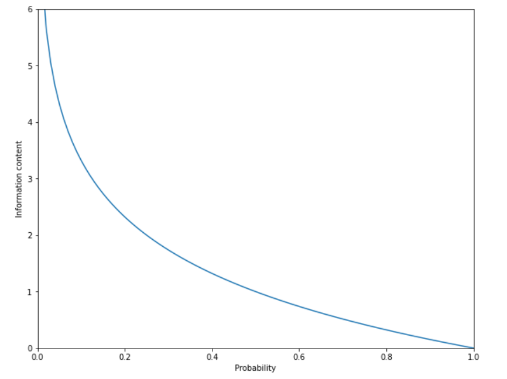
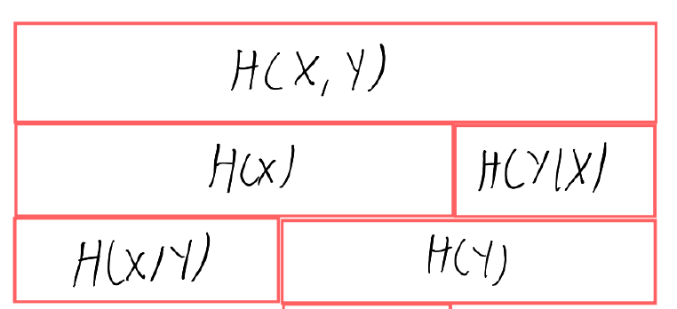
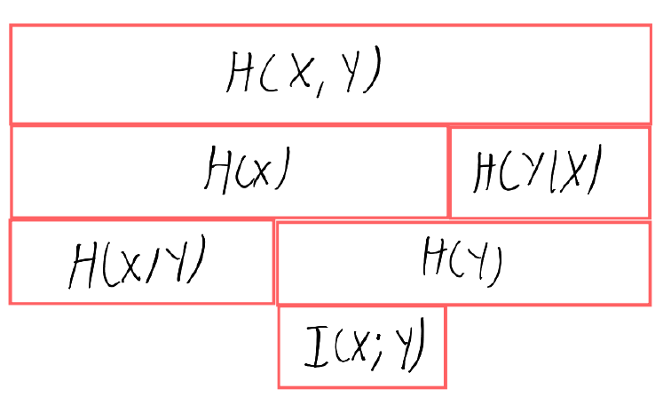
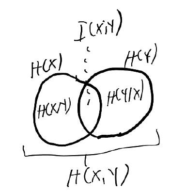
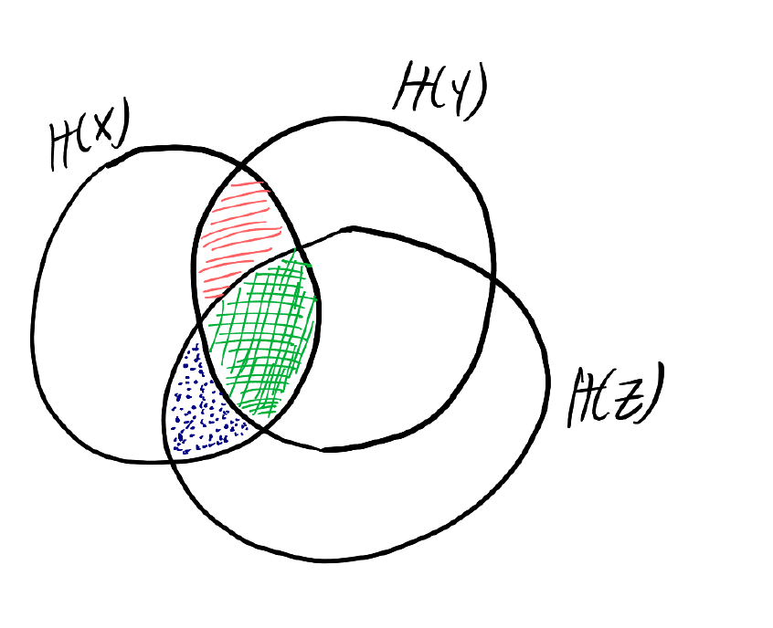

# Information theory 1

This is the first in a series of posts about information theory. A solid understanding of basic probability (random variables, probability distributions, etc.) is assumed. This post covers:

- what information and entropy are, both intuitively and axiomatically
- (briefly) the relation of information-theoretic entropy to entropy in physics
- conditional entropy
- joint entropy
- KL distance (also known as relative entropy)
- mutual information
- some results involving the above quantities
- the point of source coding and channel coding

Future posts cover source coding and channel coding in detail.

## What is information?

How much information is there in the number 14? What about the word "information"? Or this blog post? These don't seem like questions with exact answers.

Imagine you already know that someone has drawn a number between 0 and 15 from a hat. Then you're told that the number is 14. How much additional information have you learned? A first guess at a definition for information might be that it's the number of questions you need to ask to become certain about an answer. We don't want arbitrary questions though; "what is the number?" is very different from "is the number zero?". So let's say that it has to be a yes-no question.

You can represent a number within some specific range as a series of yes-no questions by writing it out in base-2. In base-2, 14 is 1110. Four questions suffice: "is the leftmost base-2 digit a 0?", etc. The number of base-$B$ digits required to represent a number $n$ is $\lceil\log_B n\rceil$, where $\lceil x \rceil$ means the smallest integer greater than or equal to $x$ (i.e., rounding up). Now maybe there should be some sense in which we can allow pointing at a number in the range 0 to 16 to have a bit more information than pointing at a number from 0 to 15, even though we can't literally ask 4.09 yes-no questions. So we might try to define our information measure as $\log n$ (in whatever base because changing which base we're doing logs in would only change the answer by a constant factor anyways, but let's just say it's base-2 to maintain the correspondence to yes-no questions), where $n$ is the number of outcomes that the thing we now know was selected from.

Now let's say there's a shoe box we've picked up from a store. There are a gazillion things that could be inside the box, so $n$ is something huge. However, it seems that if we open the box and find a new pair of sneakers, we are less surprised than if we open the box and find the Shroud of Turin. We'd like to make some types of contain quantitatively more information than others.

The standard sort of thing you do in this kind of situation is that you bring in probabilities. With drawing a number out of a hat, we have a uniform distribution where the probability for each outcome is $p = 1/ n$. So therefore we might as well have written that information content is equivalent to $\log \frac{1}{p}$, and gotten the same answer in that question. Since presumably the probability of your average shoe box containing sneakers is higher than the probability of it containing the Shroud of Turin, with this revised definition we now sensibly get that the latter gives us more information (because $\log \frac{1}{p}$ is a decreasing function of $p$). Note also that $\log \frac{1}{p}$ is the same as $- \log p$; we will usually use the latter form. This is called the Shannon information. To be precise:

> The (Shannon) information content of seeing a random variable $X$ take a value $x$ is
> $$
> - \log p_x
> $$
> where $p_x$ is the probability that $X$ takes value $x$.

We can see the behaviour of the information content of an event as a function of its probability here: 

### Axiomatic definition

The above derivation was so hand-wavy that it wasn't even close to being a derivation.

When discovering/inventing the concept of Shannon information, Shannon started from the idea that the information contained in seeing an event is a function of that event's probability (and nothing else). Then he required three further axioms to hold for this function:

- If the probability of an outcome is 1, it contains no information. This makes sense - if you already know something with certainty, then you can't get more information by seeing it again.
- The information contained in an event is a decreasing function of its probability of happening. Again, this makes sense: seeing something you think is very unlikely is more informative than seeing something you were pretty certain was already going to happen.
- The information contained in seeing two independent events is the sum of the information of seeing them separately. We don't want to have to apply some obscure maths magic to figure out how much information we got in total from seeing one dice roll and then another other.

The last one is the big hint. The probability of seeing random variable (RV) $X$ take value $x$ and RV $Y$ take value $y$ is $p_x p_y$ if $X$ and $Y$ are independent. We want a function, call it $f$, such that $f(p_x p_y) = f(p_x) + f(p_y)$. This is the most important property of logarithms. You can do some more maths to really demonstrate that  is the logarithms with some base are the only function that fit this definition, or you can just guess that it's a $\log$ and move on. We'll do the latter.

### Entropy

Entropy is the flashy term that comes up in everything from chemistry to .zip files to the fundamental fact that we're all going to die. It is often introduced as something like "[mumble mumble] a measure of information [mumble mumble]".

It is important to distinguish between information and entropy. Information is a function of an outcome (of a random variable), for example the outcome of an experiment. Entropy is a function of a random variable, for example an experiment before you see the outcome. Specifically,

>  The **entropy** $H(X)$ is the expected information gain from a random variable $X$:
>  $$
>  H(X) = \underset{x_i \sim X}{\mathbb{E}}\Big[-\log P(X=x_i)\Big] \\
>  = -\sum_i p_{x_i} \log p_{x_i}
>  $$
>  ($\underset{x_i \sim X}{\mathbb{E}}$ means the expected value when value $x_i$ is drawn from the distribution of RV $X$. $P(X=x_i)$, alternatively denoted $p_{x_i}$ when $X$ is clear from context, is the probability of $X$ taking value $x_i$.)

(Why is entropy denoted with an $H$? I don't know. Just be thankful it wasn't a random *Greek* letter.)

Imagine you're guessing a number between 0 and 15 inclusive, and the current state of your beliefs is that it is as likely to be any of these numbers. You ask "is the number 9?". If the answer is yes, you've gained $-\log_2 \frac{1}{16} = \log_2 16 = 4$ bits of information. If the answer is no, you've gained $-\log_2 \frac{15}{16} = \log_2 16 - \log_2 15 = 0.093$ bits of information. The probability of the first outcome is 1/16 and the probability of the second is 15/16, so the entropy is $\frac{15}{16} \times 4 + \frac{1}{16} \times 0.093 = 0.337$ bits.

In contrast, if you ask "is the number smaller than 8?", you always get $-\log_2 \frac{8}{16} = \log_2{2} = 1$ bit of information, and therefore the entropy of the question is 1 bit.

Since entropy is expected information gain, whenever you prepare a random variable for the purpose of getting information by observing its value, you want to maximise its entropy.

The closer a probability distribution is to a uniform distribution, the higher its entropy. The maximum entropy of a distribution with $n$ possible outcomes is the entropy of the uniform distribution $U_n$, which is
$$
\begin{align}
H(U_n) &= -\sum_i p_{u_i} \log p_{u_i} = -\sum_i \frac{1}{n} \log \frac{1}{n} \\
&= -\log \frac{1}{n} = \log n
\end{align}
$$
(This can be proved easily once we introduce some additional concepts.)

A general and very helpful principle to remember is that RVs with uniform distributions are most informative.

The above definition of entropy is sometimes called Shannon entropy, to distinguish it from the older but weaker concept of entropy in physics.

#### Entropy in physics

The physicists' definition of entropy is a constant times the logarithm of the number of possible states that correspond to the observable macroscopic characteristics of a thermodynamic system:
$$
S=k_B \ln W
$$
where $k_B$ is the Boltzmann constant, $\ln$ is used instead of $\log_2$ because physics, and $W$ is the number of microstates. (Why do physicists denote entropy with the letter $S$? I don't know. Just be glad it wasn't a random *Hebrew* letter.)

In plain language: it is proportional to the Shannon entropy of finding out what is the exact configuration of bouncing atoms of the hot/cold/whatever box you're looking, out of all the ways the atoms could be bouncing inside that box given that the box is hot/cold/whatever, assuming that all those ways are equally likely. It is less general than the information theoretic entropy in the sense that it assumes a uniform distribution.

Entropy, either the Shannon or the physics version, seems abstract; random variables, numbers of microstates, what? However, $S$ as defined above has very real physical consequences. There's an important thermodynamics equation relating a change in entropy $\delta S$, a change in heat energy $\delta Q$, and temperature $T$ for a reversible process with the equation $T\delta S = \delta Q$, which sets a lower bound on how much energy you need to discover information (i.e., reduce the number of microstates that might be behind the macrostate you observe). Getting one bit of information means that $\delta S$ is $k_B \ln 2$ (from the definition of $S$), so at temperature $T$ kelvins we need $k_B T \ln 2 \approx 9.6 \times 10^{-24} \times T$ joules. This prevents arbitrarily efficient computers, and saves us from problems like Maxwell's demon. (Maxwell's demon is a thought experiment in physics: couldn't you violate the principle of increasing entropy (a physics thing) by building a box with a wall cutting it in half with a "demon" (some device) that lets slow particles pass left-to-right only and fast particles right-to-left, thus separating particles by temperature and reducing the number of microstates corresponding to the configuration of atoms inside the box? No, because the demon needs to expend energy to get information.)

Finally, is there an information-theoretic analogue of the second law of thermodynamics, which states that the entropy of a system always increases? You have to make some assumptions, but you can get to something like it, which I will sketch out in *very* rough detail and without explaining the terms (see Chapter 4 of *Elements of Information Theory* for the details). Imagine you have a probability distribution on the state space of a Markov chain. Now it is possible to prove that given any two such probability distributions, the distance between them (as measured using relative entropy; see below) is non-increasing. Now assume it also happens to be the case that the stationary distribution of the Markov chain is uniform (the stationary distribution is the probability distribution over states such that if every state sends out its probability mass according to the transition probabilities, you get back to the same distribution). We can consider an arbitrary probability distribution over the states, and compare it to the unchanging uniform one, and use the result that the distance between them is non-increasing to deduce that an arbitrary probability distribution will tend towards the uniform (= maximal entropy) one.

Reportedly, von Neumann (a polymath whose name appears in any mid-1900s mathsy thing) advised Shannon thus:

> "You should call [your concept] entropy, for two reasons. In the first place your uncertainty function has been used in statistical mechanics under that name, so it already has a name. In the second place, and more important, nobody knows what entropy really is, so in a debate you will always have the advantage."

### Intuition

We've snuck in the assumption that all information comes in the form of:

1. You first have some *quantitative* uncertainty over a *known set* of possible outcomes, which you specify in terms of a random variable $X$.
2. You find out the value that $X$ has taken.

There's a clear random variable if you're pulling numbers out of a hat: the possible values of $X$ are the numbers written on the pieces of paper in the hat, and they all have equal probability. But where is the random variable when the piece of information you get is, say, the definition of information? (I don't mean here the literal characters on the screen - that's a more boring question - but instead the knowledge about information theory that is now (hopefully) in your brain). The answer would have to be something like "the random variable representing all possible definitions of information" (with a probability distribution that is, for example, skewed towards definitions that include a $\log$ somewhere because you remember seeing that before).

This is a bit tricky to think about, but we see that even in this kind of weird case you can specify some kind of set and probabilities over that set. Fundamentally, knowledge (or its lack) is about having a probability distribution over states. Perfect knowledge means you have probability $1.00$ on exactly one state of how something could be. If you're very uncertain, you have a huge probability distribution over an unimaginably large set of states (for example, all possible concepts that might be a definition of information). If you've literally seen nothing, then you're forced to rely on some guess for the prior distribution over states, like all those pesky Bayesian statisticians keep saying.

## More quantities

### Conditional entropy

Entropy is a function of the probability distribution of a random variable. We want to be able to calculate the entropies of the random variables we encounter.

A common combination of random variables we see is $X$ given $Y$, written $X | Y$. The definition is
$$
P(X = x \, |\, Y = y) = \frac{P(X = x \,\land\, Y = y)}{P(Y=y)}.
$$
It is a common mistake to think that $H(X|Y) = -\sum_i P(X = x_i | Y = y) \log P(X = x_i | Y = y)$. What is it then? Let's just do the algebra:
$$
H(X|Y) = -\underset{x \sim X|Y, y \sim Y}{\mathbb{E}} \big( 
\log P(X=x|Y=y)
\big)
$$
from the definition of the entropy as the expectation of the Shannon information content, and then by algebra:
$$
\begin{align}
H(X|Y) &= -\underset{x \sim X|Y, y \sim Y}{\mathbb{E}} \big( 
\log P(X=x|Y=y)
\big) \\
&= -\sum_{y \in \mathcal{Y}} P(Y=y) \sum_{x \in \mathcal{X}} P(X=x | Y=y) \log P(X=x \,|\, Y = Y) \\
&= -\sum_{y \in \mathcal{Y}, \, x \in \mathcal{X}}P(X=x\,\land\, Y = y) \log P(X=x \,|\, Y = Y)
\end{align}
$$
where $\mathcal{X}$ and $\mathcal{Y}$ are simply the sets of possible values of $X$ and $Y$ respectively. In a trick beloved of bloggers everywhere tired of writing up equations as $\LaTeX$, the above is often abbreviated
$$
\sum_{y \in \mathcal{Y}, \, x \in \mathcal{X}} p(x,y) \log p(x|y)
$$
where we use $p$ as a generic notation for "probability of whatever; random variables left implicit".

> The **conditional entropy** $X|Y$ for a random variable $X$ given the value of another random variable $Y$, is written $H(X|Y)$ and defined as
> $$
> H(X|Y) = - \sum_{y \in \mathcal{Y}, \, x \in \mathcal{X}} p(x,y) \log p(x|y)
> $$
> which is lazier notation for
> $$
> -\sum_{y \in \mathcal{Y}, \, x \in \mathcal{X}}P(X=x\,\land\, Y = y) \log P(X=x \,|\, Y = Y).
> $$
> and also equal to
> $$
> -\sum_{y \in \mathcal{Y}, \, x \in \mathcal{X}} p(x,y) \log \frac{p(x, y)}{p(y)}
> $$
> It is most definitely *not* equal to $\sum_{y \in \mathcal{Y}, \, x \in \mathcal{X}} p(x | y) \log p(x | y)$.

Conditional entropy is a measure of how much information we expect to get from a random variable assuming we've already seen another one. If the RVs $X$ and $Y$ are independent, the answer is that $H(X|Y) = H(X)$. If the value of $Y$ implies a value of $X$ (e.g. "percentage of sales in the US" implies "percentage of sales outside the US"), then $H(X|Y) = 0$, since we can work out what $X$ is from seeing what $Y$ is.

### Joint entropy

Now if $H(X|Y)$ is how much expected surprise there is left in $X$ after you've seen $Y$, then $H(X|Y) + H(Y)$ would sensibly be the total expected surprise in the combination of $X$ and $Y$. We write $H(X,Y)$ for this combination. If we do the algebra, we see that
$$
\begin{align}
H(X,Y) &= H(X|Y) + H(Y) \\
&= -\sum_{y \in \mathcal{Y}, \, x \in \mathcal{X}} p(x,y) \log \frac{p(x, y)}{p(y)} - \sum_{y \in \mathcal{Y}} p(y) \log p(y) \\
&= -\left(\sum_{y \in \mathcal{Y}, \, x \in \mathcal{X}} p(x,y) \log p(x, y)\right) +\left( \sum_{y \in \mathcal{Y}, \,x\in \mathcal{X}} p(x,y) \log p(y)\right) \\
& \quad \quad -\left( \sum_{y \in \mathcal{Y}} p(y) \log p(y) \right) \\
&= -\left(\sum_{y \in \mathcal{Y}, \, x \in \mathcal{X}} p(x,y) \log p(x, y)\right) \\
&= H(Z)
\end{align}
$$
if $Z$ is the random variable formed of the pair $(X, Y)$ drawn from the joint distribution over $X$ and $Y$.

### Kullback-Leibler divergence, AKA relative entropy

"Kullback-Leibler divergence" is a bit of a mouthful. It is also called KL divergence, KL distance, or relative entropy. Intuitively, it is a measure of the distance between two probability distributions. For probability distributions represented by functions $p$ and $q$ over the same set $\mathcal{X}$, it is defined as
$$
D(p\,||\,q) = \sum_{x \in \mathcal{X}} p(x) \log \left(\frac{p(x)}{q(x)}\right).
$$
It's not a very good distance function; the only property of a distance function it meets is that it's non-negative. It's not symmetric (i.e. $D(p \,||\, q) \ne D(q \,||\, p)$) as you can see from the definition (especially considering how it breaks when $q(x) = 0$ but not if $p(x) = 0$). However, it has a number of cool interpretations, including how many bits you expect to lose on average if you build a code assuming a probability distribution $q$ when it's actually $p$, and how many bits of information you get in a Bayesian update from distribution $q$ to distribution $p$. It is also a common loss function in machine learning. The first argument $p$ is generally some better or true model, and we want to know how far away $q$ is from it.

### Why the uniform distribution maximises entropy

The KL divergence gives us a nice way of proving that the uniform distribution maximises entropy. Consider the KL divergence of an arbitrary probability distribution $p$ from the uniform probability distribution $u$: 
$$
\begin{align}
D(p \,||\, u ) &= \sum_{x \in \mathcal{X}} p(x) \log \left(\frac{p(x)}{q(x)}\right) \\
&= \sum_{x \in \mathcal{X}} \big( p(x) \log p(x)\big)  - \sum_{x \in \mathcal{X}}  \big(p(x) \log q(x) \big) \\
&= -H(X) - \sum_{x \in \mathcal{X}} p(x) \log \frac{1}{|\mathcal{X}|} \\
&= H(X) - H(U)
\end{align}
$$
where $\mathcal{X}$ is the set of values over which $p$ and $u$ have non-zero values, $X$ is a random variable distributed according to $p$, and $U$ is a random variable distributed according to $u$ (i.e. uniformly). This is the same thing as
$$
H(X) = H(U) + D(p \,||\,u) 
$$
which implies that we can write the entropy of a random variable as the entropy of a uniform random variable over a set of the same size, plus the KL distance between the distribution of $X$ and the distribution of the uniform random variable. Also, since all three quantities in the above equation are guaranteed to be non-negative, this implies that
$$
H(X) \leq H(U)
$$
and therefore that the uniform random variable has higher entropy than any other random variable over the same number of outcomes.

### Mutual information

Earlier, we saw that $H(X, Y) = H(X|Y) + H(Y) = H(X) + H(Y|X)$. As a picture:

There's an overlapping region, representing the information you get no matter which of $X$ or $Y$ you look at. We call this the mutual information, a refreshingly sensible name, and denote it $I(X;Y)$, somewhat less sensibly. One way to find it is
$$
\begin{align}
I(X;Y) &= H(X,Y) - H(X|Y) - H(Y|X) \\
&= - \sum_{x,y} p(x,y) \log p(x,y) \,+\, \sum_{x,y} p(x,y) \log \frac{p(x,y)}{p(y)} + \\
& \quad \quad \sum_{x,y} p(x,y) \log \frac{p(x,y)}{p(x)} \\
&= \sum_{x,y} p(x,y) \big(
\log p(x,y) - \log p(x) - \log p(y)
\big) \\
&= \sum_{x,y} p(x,y) \log \frac{p(x,y)}{p(x)p(y)}.
\end{align}
$$
Does this look familiar? Recall the definition 
$$
D(p\,||\,q) = \sum_{x \in \mathcal{X}} p(x) \log \left(\frac{p(x)}{q(x)}\right).
$$
What we see is that
$$
I(X;Y) = D(p(x, y) \, || \, p(x) p(y)),
$$
or in other words that the mutual information between $X$ and $Y$ is the "distance" (as measured by KL divergence) between the probability distributions $p(x,y)$ - the joint distribution between $X$ and $Y$ - and $p(x) p(y)$, the joint distribution that $X$ and $Y$ would have if $x$ and $y$ were drawn independently.

If $X$ and $Y$ are independent, then these are the same distribution, and their KL divergence is 0.

If the value of $Y$ can be determined from the value of $X$, then the joint probability distribution of $X$ and $Y$ is a table where for every $x$, there is only one $y$ such that $p(x,y) > 0$ (otherwise, there would be a value $x$ such that there is uncertainty about $Y$).  Let the function mapping an $x$ to the singular $y$ such that $p(x,y) > 0$ be $f$. Then
$$
\begin{align}
I(X;Y) &= \sum_{x,y} p(x,y) \log \frac{p(x,y)}{p(x)p(y)} \\
&= \sum_y p(y) \sum_{x | f(x) = y} p(x|y) \log \frac{p(x, f(x))}{p(x)p(y)}.
\end{align}
$$
Now $p(x, f(x)) = p(x)$, because there is no $y \ne f(x)$ such that $p(x, y) \ne 0$. Therefore we get that the above is equal to
$$
\begin{align}
&\sum_y p(y) \sum_{x | f(x) = y} p(x|y) \log \frac{p(x)}{p(x)p(y)} \\
&= - \sum_y p(y) \sum_{x | f(x) = y} p(x|y) \log p(y),
\end{align}
$$
and since $\log p(y)$ does not depend on $x$, we can sum out the probability distribution to get
$$
- \sum_y p(y) \log p(y) = H(Y).
$$
In other words, if $Y$ can be determined from $X$, then the expected information that $X$ gives about $Y$ is the same as the expected information given by $Y$.

We can graphically represent the relations between $H(X)$, $H(Y)$, $H(X|Y)$, $H(Y|X)$, $H(X,Y)$, and $I(X;Y)$ like this:

Having this image in your head is the single most valuable thing you can do to improve your ability to follow information theoretic maths. Just to spell it out, here are some of the results you can read out from it:
$$
\begin{align}
H(X,Y) &= H(X) + H(Y|X) \\
H(X,Y) &= H(X|Y) + H(Y) \\
H(X,Y) &= H(X|Y) + I(X;Y) + H(Y|X) \\
H(X,Y) &= H(X) + H(Y) - I(X;Y) \\
H(X) &= I(X;Y) + H(Y|X)
\end{align}
$$
This diagram is also sometimes drawn with Venn diagrams:

### Data processing inequality

A Markov chain is a series of random variables such that the $(n+1)$th is only directly influenced by the $n$th. If $X \to Y \to Z$ is a Markov chain, it means that all effects $X$ has on $Z$ are through $Y$.

The data processing inequality states that if $X \to Y \to Z$ is a Markov chain, then
$$
I(X; Y) \geq I(X; Z).
$$
This should be pretty intuitive, since the mutual information $I(X;Y)$ between $X$ and $Y$, which have a direct causal link between them, shouldn't be higher than that between $X$ and the more-distant $Z$, which $X$ can only influence through $Y$. Any function you try to apply to some data $Y$ you have about some event $X$ cannot increase the information about the event that is available. Any enhancing function can only make it easier to spot some information about the event that is *already present* in the data you have about it (and the function might very plausibly destroy some). If all you have are four pixels, no amount of image enhancement wizardry will let you figure out the perpetrator's eye colour.

The proof (for the general case of $X \to Y \to Z$) goes like this: consider $I(X; Y,Z)$ (that is, the mutual information between knowing $X$ and knowing both $Y$ and $Z$). Now consider the different values in Venn diagram form:

$I(X; Y, Z)$ corresponds to all areas within the circle representing $X$ that are also within at least one of the circle for $Y$ or $Z$. If we knew both $Y$ and $Z$, this "bite" is how much would be taken out of the uncertainty $H(X)$ of $X$.

We see that the red lined area is $I(X; Y|Z)$ (the information shared between $X$ and the part of $Y$ that remains unknown if you know $Z$), and likewise the green hatched area is $I(X; Y; Z)$ and the blue dotted area is $I(X;Z|Y)$. Since the red-lined and green-hatched areas together are $I(X;Y)$, and the green-hatched and blue-dotted areas together are $I(X;Z)$, we can write both
$$
\begin{align}
I(X; \,Y,Z) &= I(X;\,Y) + I(X;\,Z|Y) \\
I(X; \,Y,Z) &= I(X;\,Z) + I(X;\,Y|Z)
\end{align}
$$
But hold on - $I(X;Z|Y)=0$ by the definition of a Markov chain, since no influence can pass from $X$ to $Z$ without going through $Y$, meaning that if we know everything about $Y$, nothing more we can learn about $Z$ will tell us anything more about $X$.

Since that term is zero, we have
$$
I(X; \; Y) = I(X; \; Z) + I(X; \, Y|Z)
$$
and since mutual information must be non-negative, this in turn implies
$$
I(X;Y) \geq I(X;Z).
$$

## Two big things: source & channel coding

Much of information theory concerns itself with one of two goals.

Source coding is about data compression. It is about taking something that encodes some information, and trying to make it shorter without losing the information.

Channel coding is about error correction. It is about taking something that encodes some information, and making it longer to try to make sure the information can be recovered even if some errors creep in.

The basic model that information theory deals with is the following:

We have some random variable $Z$ - the contents of a text message, for example - which we encode under some coding scheme to get a message consisting of a sequence of symbols that we send over some channel - the internet, for example - and then hopefully recover the original message. The channel can be noiseless, meaning it transmits everything perfectly and can be removed from the diagram, or noisy, in which case some there is a chance that for some $i$, the $X_i$ sent into the channel differs from the $Y_i$ you get out.

Source coding is about trying to minimise how many symbols you have to send, while channel coding is about trying to make sure that $\hat{Z}$, the estimate of the original message, really ends up being the original message $Z$.

A big result in information theory is that for the above model, it is possible to separate the source coding and the channel coding, while maintaining optimality. The problems are distinct; regardless of source coding method, we can use the same channel method and still do well, and vice versa. Thanks to this result, called the source-channel separation theorem, source and channel coding can be considered separately. Therefore, our model can look like this:

(We use $X^n$ to refer to a random variable representing a length-$n$ sequence of symbols)

Both source and channel coding consist of:

- a central but tricky theorem giving theoretical bounds and motivating some definitions
- a bunch of methods that people have invented for achieving something close to those theoretical bounds in practice
