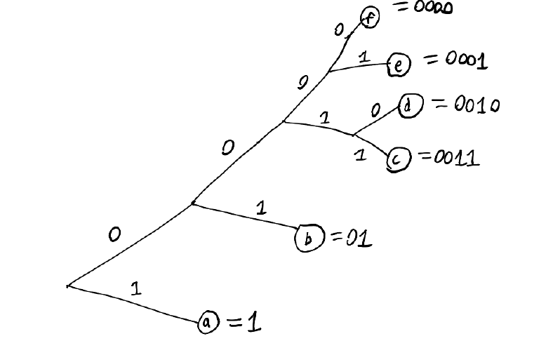
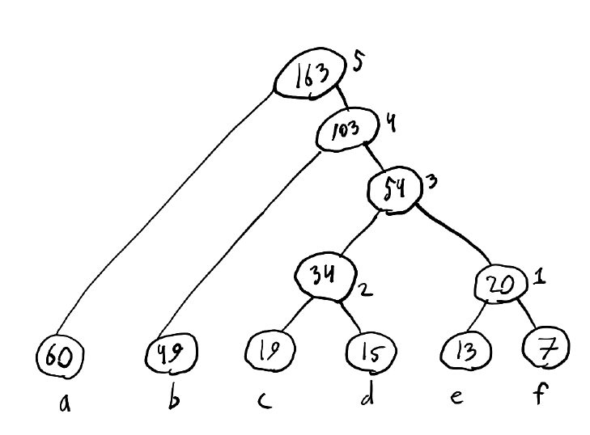
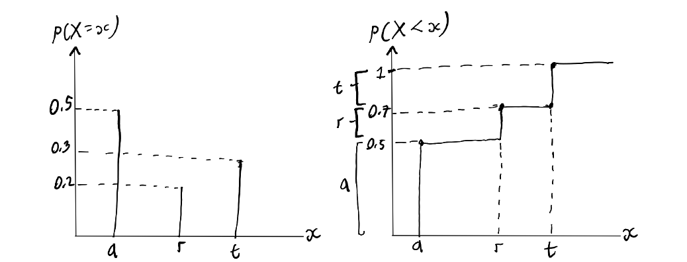
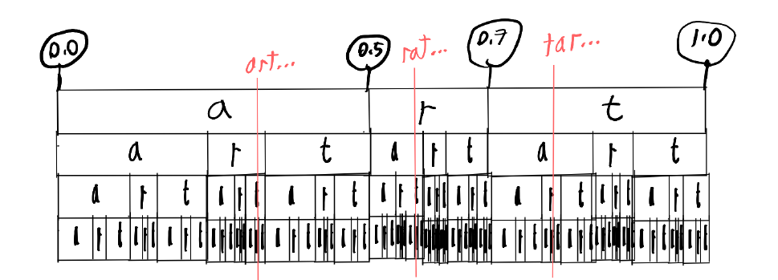
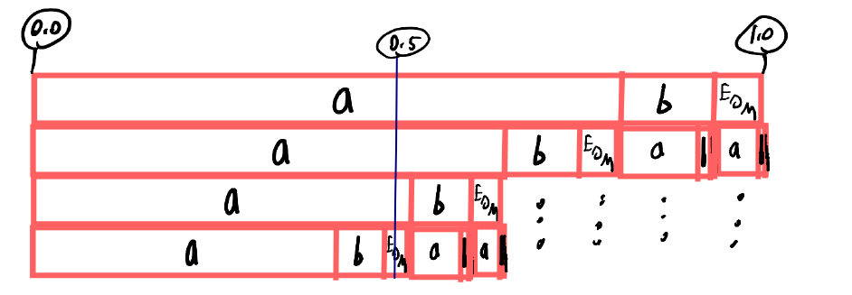
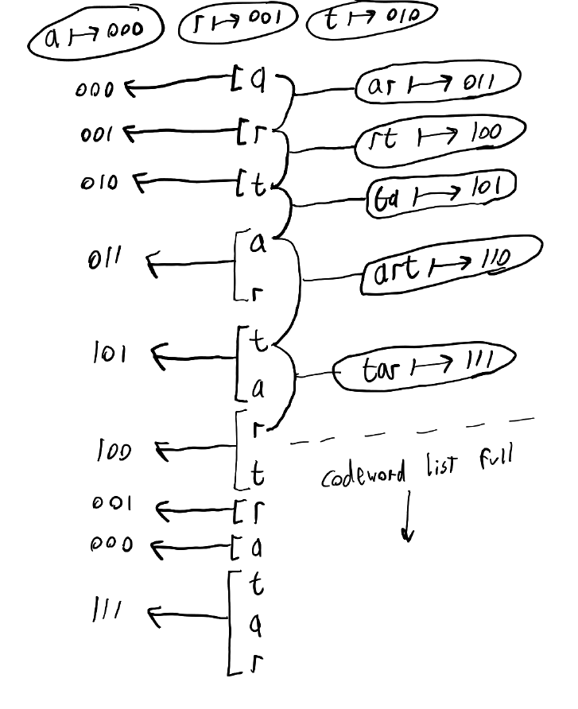
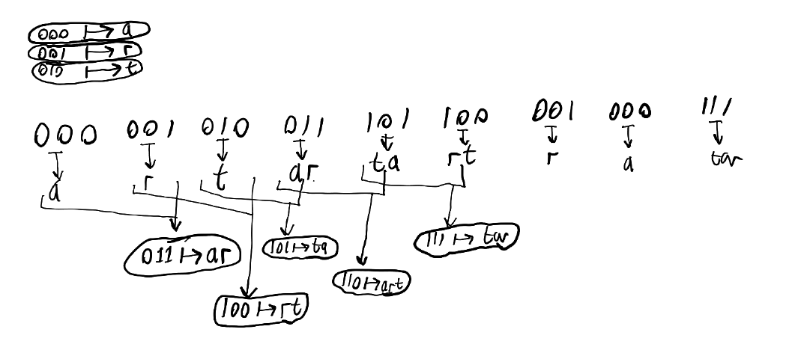
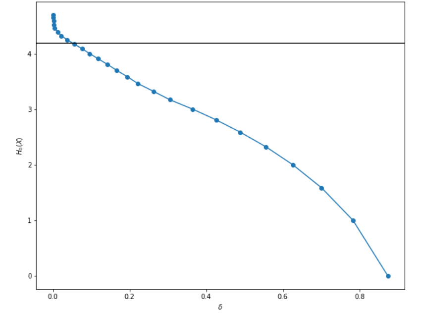
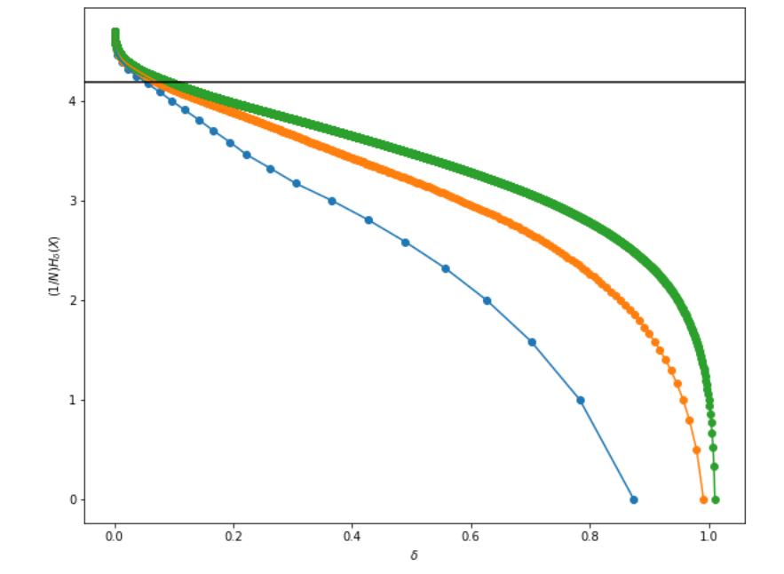

# Information Theory 2: Source coding

In [the previous post](https://www.strataoftheworld.com/2022/06/information-theory-1.html), we saw the basic information theory model:

If we have no noise in the channel, we don't need channel coding. Therefore the above model simplifies to

and the goal is to minimise $n$ - that is, minimise the number of symbols we need to send - without needing to worry about being robust to any errors.

Here's one question to get started: imagine we're working with a compression function $f_e$ that acts on length-$n$ strings (that is, sequences of symbols) with some arbitrary alphabet size $A$ (that is, $A$ different types of symbols). is it possible to build an encoding function $f_e$ that compresses every possible input? Clearly not; imagine that it took every length-$n$ string to a length-$m$ string using the same alphabet, with $m < n$. Then we'd have $A^m$ different available codewords that would need to code for $A^n > A^m$ different messages. By the pigeonhole principle, there must be at least one codeword that codes for more than one message. But that means that if we see this codeword, we can't be sure what it codes for, so we can't recover the original with certainty.

Therefore, we have a choice: either:

- do *lossy compression*, where every message shrinks in size but we can't recover information perfectly; or
- do *lossless compression*, and hope that more messages shrink in size than expand in size.

This is obvious with lossless compression, but applies to both: if you want to do them well, you generally need a probability model for what your data looks like, or at least something that approximates one.

## Terminology

When we talk about a "code", we just mean something that maps messages (the $Z$ in the above diagram) to a sequence of symbols. A code is **nonsingular** if it associates every message with a unique code. 

A **symbol code** is a code where each symbol in the message maps to a codeword, and the code of a message is the concatenation of the codewords of the symbols that it is made of.

A **prefix code** is a code where no codeword is a prefix of another codeword. They are also called **instantaneous codes**, because when decoding, you can decode a codeword to a symbol immediately when you reach a point where the some prefix of the code corresponds to a codeword.

## Useful basic results in lossless compression

### Kraft's inequality

Kraft's inequality states that a prefix code with an alphabet of size $D$ and code words of lengths $l_1, l_2, \ldots, l_n$ satisfies
$$
\sum_{i=1}^n D^{-l_i} \leq 1,
$$
and conversely that if there is a set of lengths $\{l_1, \ldots, l_n\}$ that satisfies the above inequality, there exists a prefix code with those codeword lengths. We will only prove the first direction: that all prefix codes satisfy the above inequality.

Let $l = \max_i l_i$ and consider the tree with branching factor $D$ and depth $l$. This tree has $D^l$ nodes on the bottom level. Each codeword $x_1x_2...x_c$ is the node in this tree that you get to by choosing the $d_i$th branch on the $i$th level where $d_i$ is the index of symbol $x_i$ in the alphabet. Since it must be a prefix code, no node that is a descendant of a node that is a codeword can be a codeword. We can define our "budget " as the $D^l$ nodes on the bottom level of the tree, and define the "cost" of each codeword as the number of nodes on the bottom level of the tree that are descendants of the node. The node with length $l$ has cost 1, and in general a codeword at level $l_i$ has cost $D^{l - l_i}$. From this, and the prefix-freeness, we get
$$
\sum_i D^{l - l_i} \leq D^l
$$
which becomes the inequality when you divide both sides by $D^l$.

### Gibbs' inequality

Gibbs' inequality states that for any two probability distributions $p$ and $q$,
$$
-\sum_i p_i \log p_i \leq - \sum_i p_i \log q_i
$$
which can be written using the relative entropy $D$ (also known as the KL distance/divergence) as
$$
\sum_i p_i \log \frac{p_i}{q_i} = D(p||q) \geq 0.
$$
This can be proved using the [log sum inequality](https://en.wikipedia.org/wiki/Log_sum_inequality). The proof is boring.

### Minimum expected length of a symbol code

We want to minimise the expected length of our code $C$ for each symbol that $X$ might output. The expected length is $L(C,X) = \sum_i p_i l_i$. Now one way to think of what a length $l_i$ means is using the correspondence between prefix codes and binary trees discussed above. Given the prefix requirement, the higher the level in the tree (and thus the shorter the length of the codeword) the more other options we block out in the tree. Therefore we can think of the collection of lengths we assign to our codewords as specifying a rough probability distribution that assigns probability in proportion to $2^{-l_i}$. What we'll do is introduce a variable $q_i$ that measures the "implied probability" in this way (note dividing the division by a normalising constant):
$$
q_i = \frac{2^{-l_i}}{\sum_i 2^{-l_i}} = \frac{2^{-l_i}}{z}
$$
 where in the 2nd step we've just defined $z$ to be the normalising constant. Now $l_i = - \log zq_i = -\log q_i - \log z$, so
$$
L(C,X) = \sum_i (-p_i \log q_i) - \log z
$$
Now we can apply Gibbs' inequality to know that $\sum_i(- p_i \log q_i) \geq \sum_i (-p_i \log p_i)$ and Kraft's inequality to know that $\log z = \log \big(\sum_i 2^{-l_i} \big) \leq \log(1)=0$, so we get
$$
L(C,X) \geq -\sum_i p_i \log p_i = H(X). 
$$
Therefore the entropy (with base-2 $\log$) of a random variable is a lower bound on the expected length of a codeword (in a 2-symbol alphabet) that represents the outcome of that random variable. (And more generally, entropy with base-$d$ logarithms is a lower bound on the length of a codeword for the result in a $d$-symbol alphabet.)

## Huffman coding

Huffman coding is a very pretty concept.

We saw above that if you're making a random variable for the purpose of gaining the most information possible, you should prepare your random variable to have a uniform probability distribution. This is because entropy is maximised by a uniform distribution, and the entropy of a random variable is the average amount of information you get by observing it.

The reason why, say, encoding English characters as 5-bit strings (A = 00000, B = 00001, ..., Z = 11010, and then use the remaining 6 codes for punctuation or cat emojis or whatever) is not optimal is that some of those 5-bit strings are more likely than others. On a symbol-by-symbol-level, whether the first symbol is a 0 or a 1 is not equiprobable. To get an ideal code, each symbol we send should have equal probability (or as close to equal probability as we can get).

Robert Fano, of [Fano's inequality](https://en.wikipedia.org/wiki/Fano%27s_inequality) fame, and Claude Shannon, of everything-in-information-theory fame, had tried to find an efficient general coding scheme in the early 1950s. They hadn't succeeded. Fano set it as an alternative to taking the final exam for his information theory class at MIT. David Huffman tried for a while, and had almost given up and started studying instead, when he came up with Huffman coding and quickly proved it to be optimal.

We want the first code symbol (a binary digit) to divide the space of possible message symbols (the English letters, say) in two equally-likely parts, the first two to divide it in four, the third into eight, and so o n. Now some message symbols are going to be more likely than others, so the codes for some symbols have to be longer. We don't want it to be ambiguous when we get to the end of a codeword, so we want a prefix-free code. Prefix-free codes with a size-$d$ alphabet can be represented as trees with branching factor $d$, where each leaf is one codeword:

Above, we have $d=2$ (i..e binary), and six items to code for (`a`, `b`, `c`, `d`, `e`, and `f`), and six code words with lengths of between 1 and 4 characters in the codeword alphabet.

Each codeword is associated with some probability. We can define the weight of a leaf node to be its probability (or just how many times it occurs in the data) and the weight of a non-leaf code to be the sum of the weights of all leaves that are downstream of it in the tree. For an optimal prefix-free code, all we need to do is make sure that each node has children that are as equally balanced in weight as possible.

The best way to achieve this is to work bottom-up. Start without any tree, just a collection of leaf nodes representing the symbols you want codewords for. Then repeatedly build a node uniting the two least-likely parentless nodes in the tree, until the tree has a root.

Above, the numbers on the non-leaf nodes show the order in which the node was created. This set of weights on the leaf nodes creates the same tree structure as in teh previous diagram.

(We could also try to work top-down, creating the tree the root to the leaves rather than from the leaves to the root, but this turns out to give slightly worse results. Also the algorithm for achieving this is less elegant.)

## Arithmetic coding

The Huffman code is the best symbol code - that is, a code where every symbol in the message gets associated with a codeword, and the code for the entire message is simply the concatenation of all the codewords of its symbols.

Symbol codes aren't always great, though. Consider encoding the output of a source that has a lot of runs like "`aaaaaaaaaahaaaaahahahaaaaa`" (a source of such messages might be, for example, a transcription of what a student says right before finals). The Huffman coding for this message is, for example, that "a" maps to a 0, and "h" maps to a 1, and you have achieved a compression of exactly 0%, even though intuitively those long runs of "a"s could be compressed.

One obvious thing you could do is run-length encoding, where long blocks of a character get compressed into a code for the character plus a code for how many times the character is repeated; for example the above might become "`10a1h5a1h1a1h1a1h5a`". However, this is only a good idea if there are lots of runs, and requires a bunch of complexity (e.g. your alphabet for the codewords must either be something more than binary, or then you need to be able to express things like lengths and counts in binary unambiguously, possibly using a second layer of encoding with a symbol code).

Another problem with Huffman codes is that the code is based on assuming an unchanging probability model across the entire length of the message that is being encoded. This might be a bad assumption if we're encoding, for example, long angry Twitter threads, where the frequency of exclamation marks and capital letters increases as the message continues. We could try to brute-force a solution, such as splitting the message into chunks and fitting a Huffman code separately to each chunk, but that's not very elegant. Remember how elegant Huffman codes feel as a solution to the symbol coding problem? We'd rather not settle for less.

The fundamental idea of arithmetic coding is that we send a number representing where on the cumulative probability distribution of all messages the message we want to send lies. This is a dense statement, so we will unpack it with an example. Let's say our alphabet is $A = \{a, r, t\}$. To establish an ordering, we'll just say we consider the alphabet symbols in alphabetic order. Now let's say our probability distribution for the random variable $X$ looks like the diagram on the left; then our cumulative probability distribution looks like the diagram on the right:

One way to specify which of $\{a, r, t\}$ we mean is to pick a number $0 \leq c \leq 1$, and then look at which range it corresponds to on the $y$-axis of the right-hand figure; $0 \leq c < 0.5$ implies $a$, $0.5 \leq c < 0.7$ implies $r$, and $0.7 \leq c < 1$ implies $t$. We don't need to send the leading 0 because it is always present, and for simplicity we'll transmit the following decimals in binary; 0.0 becomes "0", 0.5 becomes "1", 0.25 becomes "01", and 0.875 is "111". 

Note that at this point we've almost reinvented is the Huffman code. $a$ has the most probability mass and can be represented in one symbol. $r$ happens to be representable in one symbol ("1" corresponds to 0.5 which maps to $r$) as well even though it has the least probability mass, which is definitely inefficient but not too bad. $t$ takes 2: "11".

The real benefit begins when we have multi-character messages. The way we can do it is like this, recursively splitting the number range between 0 and 1 into smaller and smaller chunks:

We see possible numbers encoding "art", "rat", and "tar". Not only that, but we see that all messages we send are infinite in length, as we can just keep going down, adding more and more letters. At first this might seem like a great deal - send one number, get infinite symbols transmitted for free! However, there's a real difference between "art" and "artrat", so we want to be able to know when to stop as well.

A simple answer is that the message also includes some code encoding how many symbols to decode for. A more elegant answer is that we can keep our message as just one number, but extend our alphabet to include an end-of-message token. Note that even with this end-of-message token, it is still true that many characters of the message can be encoded by a single symbol of output, especially if some outcome is much more likely. For example, in the example below we need only one bit ("1", for the number 0.5) to represent the message "aaa" (followed by the end-of-message character):

There are still two ways in which this code is underspecified.

The first is that we need to choose how much of the probability space to assign to our end-of-message token. The optimal value for this clearly depends on how long messages we will be sending.

The second is that even with the end-of-message token, each codeword is still represented by a range of values rather than a single number. Any of these are valid numbers to send, but we want to minimise the length, so therefore we will choose the number in this range that has the shortest binary representation.

Finally, what is our probability model? With the Huffman code, we either assume a probability model based on background information (e.g. we have the set of English characters, and we know the rough probabilities of them by looking at some text corpus that someone else has already compiled), or we fit the probability model based on the message we want to send - if 1/10th of all letters in the message are $a$s, we set $p_a = 0.1$ when building the tree for our Huffman code, and so on.

With arithmetic coding, we can also assume static probabilities. However, we can also do adaptive arithmetic coding, where we change the probability model as we go. A good way to do this is for our probability model to assume that the probability $p_x$ of the symbol $x$ after we have already processed text $T$ is
$$
p_x = \frac{\text{Count}(x, T) + 1}{\sum_{y \in A} \big(\text{Count}(y, T) + 1\big)} \\
= \frac{\text{Count}(x, T) + 1}{\sum_{y \in A} \big(\text{Count}(y, T)\big) + |A|}
$$
where $A$ is the alphabet, and $\text{Count}(a, T)$ simply returns the count of how many times the character $a$ occurs in $T$. Note that if we didn't have the $+1$ in the numerator and in the sum in the denominator, we would assume a probability of zero to anything we haven't seen before, and be unable to encode it.

(We can either say that the end-of-message token is in the alphabet $A$, or, more commonly, assign "probabilities" to all $x$ using the above formula and some probability $p_{EOM}$ to the end of message, and then renormalise by dividing all $p_x$ by $1 + p_{EOM}$.)

How do we decode this? At the start, the assumed distribution is simply uniform over the alphabet (except maybe for $p_{EOM}$). We can decode the first symbol using that distribution, then update the distribution and decode the next, and so on. It's quite elegant.

What isn't elegant is implementing this with standard number systems in most programming languages. For any non-trivial message length, arithmetic coding is going to need very precise floating point numbers, and you can't trust floating point precision very far. You'll need some special system, likely an arbitrary-precision arithmetic library, to actually implement arithmetic coding.

### Prefix-free arithmetic coding

The above description of arithmetic coding is not a prefix-free code. We generally want prefix-free codes, in particular because it means we can decode it symbol by symbol as it comes in, rather than having to wait for the entire message to come through. Note also that often in practice it is uncertain whether or not there are more bits coming; consider a patchy internet connection with significant randomness between packet arrival times.

The simple fix for this is that instead of encoding a number as *any* sequence of binary string that maps onto the right segment of the number line between 0 and 1, you impose an additional requirement on it: *whatever binary bits you add onto the number, it is still within the range*.

## Lempel-Ziv coding

Huffman coding integrated the probability model and the encoding. Arithmetic coding still uses an (at least implicit) probability model to encode, but in a way that makes it possible to update as we encode. Lempel-Ziv encoding, and its various descendants, throw away the entire idea of having any kind of (explicit) probability model. We will look at the original version of this algorithm.

### Encoding

Skip all that Huffman coding nonsense of carefully rationing the shorter codewords for the most likely symbols, and simply decide on some codeword length $d$ and give every character in the alphabet a codeword of that length. If your alphabet is again $\{a, r, t, \text{EOM}\}$ (we'll include the end-of-message character from the start this time), and $d = 3$, then the codewords you define are literally as simple as
$$
\begin{align}
a &\mapsto 000 \\
r &\mapsto 001 \\
t &\mapsto 010 \\
\text{EOM} &\mapsto 011
\end{align}
$$
If we used this code, it would be a disaster. We have four symbols in our alphabet, so the maximum entropy of the distribution is $\log_2 4 = 2$ bits, and we're spending 3 bits on each symbol. With this encoding, we increase the length by at least 50%. Instead of your compressed file being uploaded in 4 seconds, it now takes 6.

However, we selected $d=3$, meaning we have $2^3 = 8$ slots for possible codewords of our chosen constant length, and we've only used 4. What we'll do is follow these steps as we scan through our text:

1. Read one symbol *past* the longest match between the following text and a codeword we've defined. Therefore what we now have is a string $Cx$, where we have a code for $C$ already of length $|C|$, $x$ is a single character, and $Cx$ is a prefix of the remaining text.
2. Add $C$ to the code we're forming, to encode for the first $|C|$ characters of the remaining text.
3. If there is space among the $2^d$ possible codewords we have available: let $n$ be the binary representation of the smallest possible codeword not yet associated with a code, and define $Cx \mapsto n$ as a new codeword.

Here is an example of the encoding process, showing the emitted codewords on the left, the original definitions on the top, the new definitions on the right, and the message down the middle:

### Decoding

A boring way to decode is to send the codeword list along with your message. The fun way is to reason it out as you go along, based on your knowledge of the above algorithm and a convention that lets you know which order the original symbols were added to the codeword list (say, alphabetically, so you know the three bindings in the top-left). An example of decoding the above message:

## Source coding theorem

The source coding theorem is about lossy compression. It is going to tell us that if we can tolerate a probability of error $\delta$, and if we're encoding a message consisting of a lot of symbols, unless $\delta$ is very close to 0 (lossless compression) or 1 (there is nothing but error), it will take about $H(X)$ bits per symbol to encode the message, where $X$ is the random variable according to which the symbols in the message have been drawn. Since it means that entropy turns up as a fundamental and surprisingly constant limit when we're trying to compress our information, this further justifies the use of entropy as a measure of information.

We're going to start our attempt to prove the source coding theorem by considering a silly compression scheme. Observe that English has 26 letters, but the bottom 10 (Z, Q, X, J, K, V, B, P, Y, G) are slightly less than 10% of all letters. Why not just drop them? Everthn is still comprehensile without them, and ou can et awa with, for eample, onl 4 inary its per letter rather than 5, since ou're left with ust 16 letters.

Given an alphabet $A$ from which our random variable $X$ takes values, define the $\delta$-sufficient subset $S_\delta$ of $A$ to be the smallest subset of $A$ such that $P(x \in S_\delta) \geq 1 - \delta$ for $x$ drawn from $X$. For example, if $A$ is the English alphabet, and $\delta = 0.1$, then $S_\delta$ is the set of all letters except Z, Q, X, J, K, V, B, P, Y, and G, since the other letters have a combined probability of over $1 - 0.1 = 0.9$, and any other subset containing more than $0.9$ of the probability mass contains must contain more letters. 

Note that $S_\delta$ can be formed by adding elements from $A$, in descending order of probability, into a set until the sum of probabilities of elements in the set exceeds $1 - \delta$.

Next, define the essential bit content of $X$, denoted $H_\delta(X)$, as
$$
H_\delta(X) = \log_2 |S_\delta|.
$$
In other words, $H_\delta(X)$ is the answer to "how many bits of information does it take to point to one element in $S_\delta$ (without being able to assume the distribution is anything better than uniform)?". $H_\delta(X)$ for $\text{English alphabet}_{0.1}$ is 4, because $\log_2 |\{E, T, A, O, I, N, S, H, R, D, L, U, C,M, W, F\}| = \log_2 16 = 4$. It makes sense that this is called "essential bit content".

We can graph $H_\delta(X)$ against $\delta$ to get a pattern like this:

Where it gets more interesting is when we extend this definition to blocks. Let $X^n$ denote the random variable for a sequence of $n$ independent identically distributed samples drawn from $X$. We keep the same definitions for $S_\delta$ and $H_\delta(X)$; just remember that now $S$ is a subset of $A^n$ (where the exponent denotes Cartesian product of a set with itself; i.e. $A^n$ is all possible length-$n$ strings formed from that alphabet). In other words, we're throwing away the least common length-$N$ letter strings first; ZZZZ is out the window first if $n = 4$, and so on.

We can plot a similar graph as above, except we're plotting $\frac{1}{n} H_\delta(x)$ on the vertical axis to get per-symbol entropy, and there's a horizontal line around the entropy of English letter frequencies:

(Note that the entropy per letter of English drops to only 1.3 if we stop modelling each letter as drawn independently from the others around it, and instead have a model with a perfect understanding of which letters occur together.)

The graph above shows the plot of $\frac{1}{n}H_\delta(x)$ against $\delta$ for a random variable $X^n$ for $n=1$ (blue), $n=2$) (orange), and $n=3$ (green). We see that as $n$ increases, the lines become flatter, and the middle portions approach the black line that shows the entropy of the English letter frequency distribution. What you'd see if we continued plotting this graph for larger values of $n$ is that this trend continues; specifically, that there is a value $n$ large enough that the graph of $\frac{1}{n}H_\delta(x)$ is as close as we want to the black line for the entire length of it, except for an arbitrarily small part near $\delta = 0$ and $\delta = 1$. Mathematically, we can pick an $\epsilon > 0$ such that for $0 < \delta < 1$ there exists a positive integer $n_0$ such that for all $n \geq n_0$,
$$
\left| \frac{1}{n}H_\delta(X^n) - H(X)
\right| \leq \epsilon.
$$
Now remember that $\frac{1}{n}H_\delta(X^n)=\frac{1}{n}\log |S_\delta|$ was the essential bit content per symbol, or, in other words, the number of bits we need per symbol to represent $X^n$ (with error probability $\delta$) in the simple coding scheme where we assign an equal-length binary number to each element in $S_\delta$ (but hold on: aren't there better codes than ones where all elements in $S_\delta$ get an equal-length representation? yes, but we'll see soon that not by very much). Therefore what the above equation is saying is that we can encode $X^n$ with error chance $\delta$ using a number of bits per symbol that differs from the entropy $H(X)$ by only a small constant $\epsilon$. This is the source coding theorem. It is a big deal, because we've shown that entropy is related to the number of bits per symbol we need to do encoding in a lossy compression scheme.

(You can get to a similar result with lossless compression schemes where, instead of throwing away the ability to encode all sequences not in $S_\delta$ and just accepting the inevitable error, you instead have an encoding scheme where you reserve one bit to indicate whether or not an $x^n$ drawn from $X^n$ is in $S_\delta$, and if it is you encode it like above, and if it isn't you encode it using $\log |A|^n$ bits. Then you'll find that the probability of having to do the latter step is small enough that $\log |A|^n > \log |S_\delta|$ doesn't matter very much.)

### Typical sets

Before going into the proof, it is useful to investigate what sorts of sequences $x^n$ we tend to pull out from $X^n$ for some $X$. The basic observation is that most $x^n$ are going to be neither the least probable nor the most probably out of all $x^n$. For example, "ZZZZZZZZZZ" would obviously be an unusual set of letters to draw at random if you're selecting them from English letter frequencies. However, so would "EEEEEEEEEE". Yes, this individual sequence is much more likely than "ZZZZZZZZZZ" or any other sequence, but there is only one of them, so getting it would still be surprising. To take another example, the typical sort of result you'd expect from a coin loaded so that $P(\text{"heads"}) = 0.75$ isn't runs of only heads, but rather an approximately 3:1 mix of heads and tails. 

The distribution of letter counts follows a multinomial distribution (the generalisation of the binomial distribution). Therefore (if you think about what a multinomial distribution is, or if you know that the mean is $n p_{x_i}$ for the $i$th variable) in $x^n$ we'd expect roughly $np_e$ of the letter e, $np_z$ of the letter z, and so on - and $np_e \ll n$ even though $p_e > p_L$ for all $L$ in the alphabet. Slightly more precisely (if you happen to know this fact), the variance of variable $x_i$ is $np_{x_i}(1-p_{x_i})$, implying that the standard deviation grows only in proportion to $\sqrt{n}$, so for large $n$ it is very rare to get an $x^n$ with counts of $x_i$ that differ wildly from the expected count $np_{x_i}$. 

Let's define a notion of "typicality" for a sequence $x^n$ based on this idea of it being unusual if $x^n$ is either a wildly likely or wildly unlikely sequence. The median sequence has $np_{x_i}$ of each variable, so has probability
$$
P(x^n) = p_{x_1}^{np_{x_1}}p_{x_2}^{np_{x_2}} \ldots p_{x_n}^{np_{x_n}}
$$
 which in turn has a Shannon information content of
$$
- \log P(x^n) = -\sum_i np_{x_i} \log p_{x_i} = n H(X)
$$
Oh look, entropy pops up again. How surprising.

Now we make the following definition: a sequence $x^n$ is $\epsilon$-typical if its information content per symbol is $\epsilon$-close to $H(X)$, that is
$$
\left| - \frac{1}{n}\log{P(x^n)} - H(X) \right| <\epsilon.
$$
Define the typical set $T_{n\epsilon}$ to be the set of length-$n$ sequences (drawn from $X^n$) that are $\epsilon$-typical.

$T_{n\epsilon}$ is a small subset of the set $A^n$ of all length-$n$ sequences. We can see this through the following reasoning: for any $x^n \in T_{n\epsilon}$, $\frac{1}{n} \log P(x^n) \approx H(X)$ which implies that
$$
P(x^n) \approx 2^{-nH(X)}
$$
and therefore that there can only be roughly $2^{nH(X)}$ such sequences; otherwise their probability would add up to more than 1. In comparison, the number of possible sequences $|A^n| = 2^{n \log |A|}$ is significantly larger, since $\log |A| \leq H(X)$ for any random variable $X$ with alphabet / outcome set $A$ (with equality if $X$ has a uniform distribution over $A$).

### The typical set contains most of the probability

Chebyshev's inequality states that
$$
P((X-\mathbb{E}[X])^2 \geq a) \leq \frac{\sigma^2}{a}
$$
where $\sigma^2$ is the variance of the random variable $X$, and $a \geq 0$. It is proved [here](http://www.strataoftheworld.com/2021/01/data-science-2.html) (search for "Chebyshev").

Earlier we defined the $\epsilon$-typical set as
$$
T_{n\epsilon} = \left\lbrace
x^n \in A^n \,\text{ such that } \, \Bigg\vert 
-\frac{1}{n}\log P(X^n) - H(X)
\Bigg\vert < \epsilon
\right\rbrace.
$$
Note that
$$
\begin{align}
\mathbb{E}\left[-\frac{1}{n}\log P(X^n)\right] &= -\frac{1}{n} \sum \log P(X_i) \\
&= -\mathbb{E}[\log P(X_i)] \\
&= H(X_i) = H(X)
\end{align}
$$

by using independence of the $X_i$ making up $X^n$ in the first step, the law of large numbers ($\lim_{n \to \infty} \frac{1}{n} \sum_i X_i = \mathbb{E}[X]$) in the second, and the fact that all $X_i$ are independent draws of the same random variable $X$ in the third.

Therefore, we can now rewrite the typical set definition equivalently as

$$
\begin{align}
T_{n\epsilon} &= \left\lbrace
x^n \in A^n \,\text{ such that } \left(
-\frac{1}{n}\log P(x^n) - H(X)
\right)^2 < \epsilon^2
\right\rbrace \\
&= \left\lbrace
x^n \in A^n \,\text{ such that } \left(
Y - \mathbb{E}[Y]
\right)^2 < \epsilon^2
\right\rbrace
\end{align}
$$

for $Y = -\frac{1}{n} \log P(X^n)$, which is in the right form to apply Chebyshev's inequality to get a probability of belonging to this set, except for the fact that the sign is the wrong way around. Very well - we'll instead consider the set of sequences $\bar{T}_{n \epsilon} = A^n - T_{n \epsilon}$ (i.e. all length-$n$ sequences that are not typical) instead, which can be defined as

$$
\bar{T}_{n \epsilon} = \left\lbrace
x^n \in A^n \,\text{ such that } \,
(Y - \mathbb{E}[Y])^2 \geq \epsilon^2 \right\rbrace
$$

and use Chebyshev's inequality to conclude that
$$
P((Y - \mathbb{E}[Y])^2 \geq \epsilon^2) \leq \frac{\sigma_Y^2}{\epsilon^2}
$$
where $\sigma_Y^2$ is the variance of $Y= -\frac{1}{n} \log P(X^n)$. This is exciting - we have a bound on the probability that a sequence is not in the typical set - but we want to link this probability to $n$ somehow. Let $Z = -\log P(X)$, and note that $Y$ can be written as the average of many draws from $Z$. Therefore
$$
\mathbb{E}[Z] = -\frac{1}{n} \sum_i \log P(X) = -\frac{1}{n} \log P(X^n) = \mathbb{E}[Y]
$$
and since $Y = \frac{1}{n} \sum_i Z_i$, the variance of $Y$, $\sigma_Y^2$, is equal to $\frac{1}{n} \sigma_Z^2$ (a basic law of how variance works that is often used in statistics). We can substitute this into the expression above to get
$$
P((Y-\mathbb{E}[Y])^2 \geq \epsilon^2) \leq \frac{\sigma_Z^2}{n\epsilon^2}.
$$
The probability on the left-hand side is identical to $P((-\frac{1}{n} \log P(X^n) - H(X) )^2 \geq \epsilon^2)$, which is the probability of the condition that $X^n$ is *not* in the $\epsilon$-typical set $T_{n\epsilon}$, which gives us our grand result
$$
P(X^n \in T_{n\epsilon}) \ge 1 - \frac{\sigma_Z^2}{n\epsilon^2}.
$$
$\sigma_Z^2$ is the variance of $\log P(X^n)$; it depends on the particulars of the distribution and is probably hell to calculate. However, what we care about is that if we just crank up $n$, we can make this probability as close to 1 as we like, regardless of what $\sigma_Z^2$ is, and regardless of what we set as $\epsilon$ (the parameter for how wide the probability range for the typical set).

The key idea is this: asymptotically, as $n \to \infty$, more and more of the probability mass of possible length-$n$ sequences is concentrated among those that have a probability of between $2^{-n(H(X)+\epsilon)}$ and $2^{-n(H(x) - \epsilon)}$, regardless of what (positive real) $\epsilon$ you set. This is known as the "asymptotic equipartition property" (it might be more appropriate to call it an "asymptotic approximately-equally-partitioning property" because it's not really an "equipartition", since depending on $\epsilon$ these can be very different probabilities, but apparently that was too much of a mouthful even for the mathematicians).

### Finishing the proof

As a reminder of where we are: we stated without proof
$$
\left| \frac{1}{n}H_\delta(X^n) - H(X)
\right| < \epsilon.
$$
and noted that this is an interesting result that also gives meaning to entropy, since we see that it's related to how many bits it takes for a naive coding scheme to express $X^n$ (with error probability $\delta$).

Then we went on to talk about typical sets, and ended up finding that the probability that an $x^n$ drawn from $X^n$ lies in the set
$$
T_{n \epsilon} =\left\lbrace
x^n \in A^n \,\text{ such that } \, \left|
-\frac{1}{n}\log P(X^n) - H(X)
\right| < \epsilon
\right\rbrace.
$$
approaches 1 as $n \to \infty$, despite the fact that $T_{n\epsilon}$ has only approximately $2^{nH(X)}$ members, which, for distributions of $X$ that are not very close to the uniform distribution over the alphabet $A$, is a small fraction of the $2^{n \log |A|}$ possible length-$n$ sequences.

Remember that $H_\delta(X^n) = \log |S_\delta|$, and $S_\delta$ was the smallest subset of $A^n$ such that it contains sequences whose probability sums to at least $1 - \delta$. This is a bit like the typical set $T_{n\epsilon}$, which also contains sequences making up most of the probability mass. Note that $T_{n\epsilon}$ is less efficient; $S_\delta$ optimally contains all sequences with probability greater than some threshold, whereas $T_{n\epsilon}$ generally omits the highest-probability sequences (settling instead for sequences of the same probability as most sequences that are drawn from $X^n$). Therefore
$$
H_\delta(X^n) \leq \log |T_{n\epsilon}|
$$
for an $n$ that depends on what $\delta$ and $\epsilon$ we want. Now we can get an upper bound on $H_\delta(X^n)$ if we can upper-bound $|T_{n\epsilon}|$. Looking at the definition, we see that the probability of a sequence $X^n$ must obey
$$
2^{n(H(X) - \epsilon)} < P(X^n) < 2^{n(H(X) + \epsilon)}.
$$
$T_{n\epsilon}$ has the largest number of elements if all elements have the lowest possible probability $p$, and if that is the case it has at most $1/p$ of such lowest-probability elements since the probabilities cannot add to more than one, which implies $|T_{n\epsilon}| < 2^{n(H(x)+\epsilon)}$. Therefore
$$
H_\delta(X^n) \leq \log |T_{n\epsilon}| < \log(2^{n(H(X)+e)}) = n(H(X) + \epsilon)
$$
and we have a bound
$$
H_\delta(X^n) < n(H(X) + \epsilon).
$$
If we can now also find the bound $n(H(X) + \epsilon) < H_\delta(X^n)$, we've shown $|\frac{1}{n} H_\delta(X^n) - H(X)| < \epsilon$ and we're done. The proof of this bound is a proof by contradiction. Imagine that there is an $S'$ such that
$$
\frac{1}{n} \log |S'| \leq H - \epsilon
$$
but also
$$
P(X^n \in S') \geq 1 - \delta.
$$
We want to show that $P(X^n \in S')$ can't actually be that large. For the other bound, we used our typical set successfully, so why not use it again? Specifically, write

$$
P(X^n \in S') = P(X^n \in S' \cap T_{n\varepsilon}) + P(X^n \in S' \cap \bar{T}_{n\varepsilon})
$$

where $\bar{T}_{n\varepsilon}$ is again $A^n - T_{n\varepsilon}$, and noting that our constant $\varepsilon$ for $T$, is not the same as our constant $\epsilon$ in the bound. We want to set an upper bound on this probability; for that to hold, we need to make the terms on the right-hand side as large as possible. For the term, this is if $S' \cap T_{n\varepsilon}$ is as large as it can be based on the bound on $|S'|$, i.e. $2^{n(H(X)-\epsilon)}$, and each term in it has the maximum probability $2^{-n(H(X)-\varepsilon)}$ of terms in $T_{n\varepsilon}$. For the second term, this is if $S' \cap \bar{T}_{n \epsilon}$ is restricted only by $P(X^n \in \bar{T}_{n\varepsilon}) \leq \frac{\sigma^2}{n\epsilon^2}$, which we showed above. (Note that you can't have both of these conditions holding at once, but this does not matter since we only want to show a non-strict inequality.) Therefore we get
$$
P(X^n \in S') \leq 2^{n(H(X) - \epsilon)} 2^{-n(H(X)+\varepsilon)} + \frac{\sigma^2}{n\epsilon^2}
\\
= 2^{-n(\epsilon + \varepsilon)} + \frac{\sigma^2}{n\epsilon^2}
$$
and we see that since $\epsilon, \varepsilon > 0$, and as we're dealing with the case where $n \to \infty$, this probability is going to go to zero in the limit. But we had assumed $P(X^n \in S') \geq 1 - \delta$ - so we have a contradiction unless we don't assume that, which means
$$
n(H(X) - \epsilon) < H_\delta(X^n).
$$
Combining this with the previous bound, we've now shown
$$
H(X) - \epsilon < \frac{1}{n} H_\delta(X^n) < H(X) + \epsilon
$$
which is the same as
$$
\left|\frac{1}{n}H_\delta(X) - H(X)\right| < \epsilon
$$
which is the source coding theorem that we wanted to prove.

