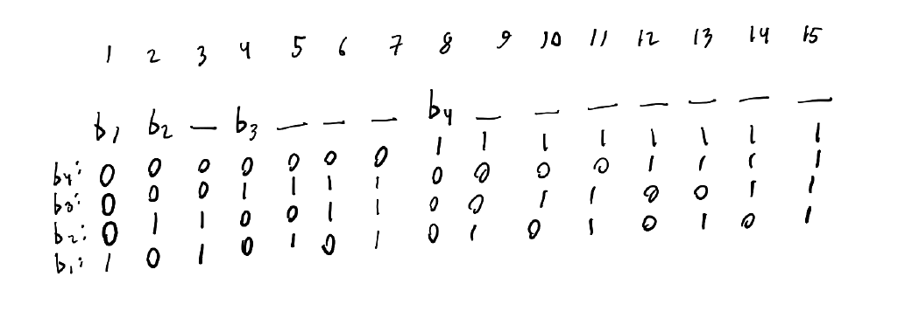
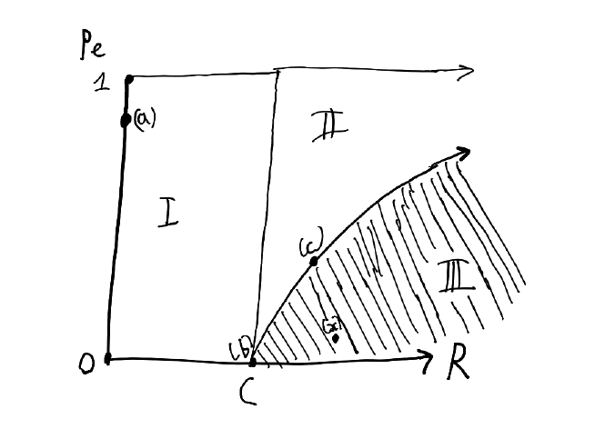
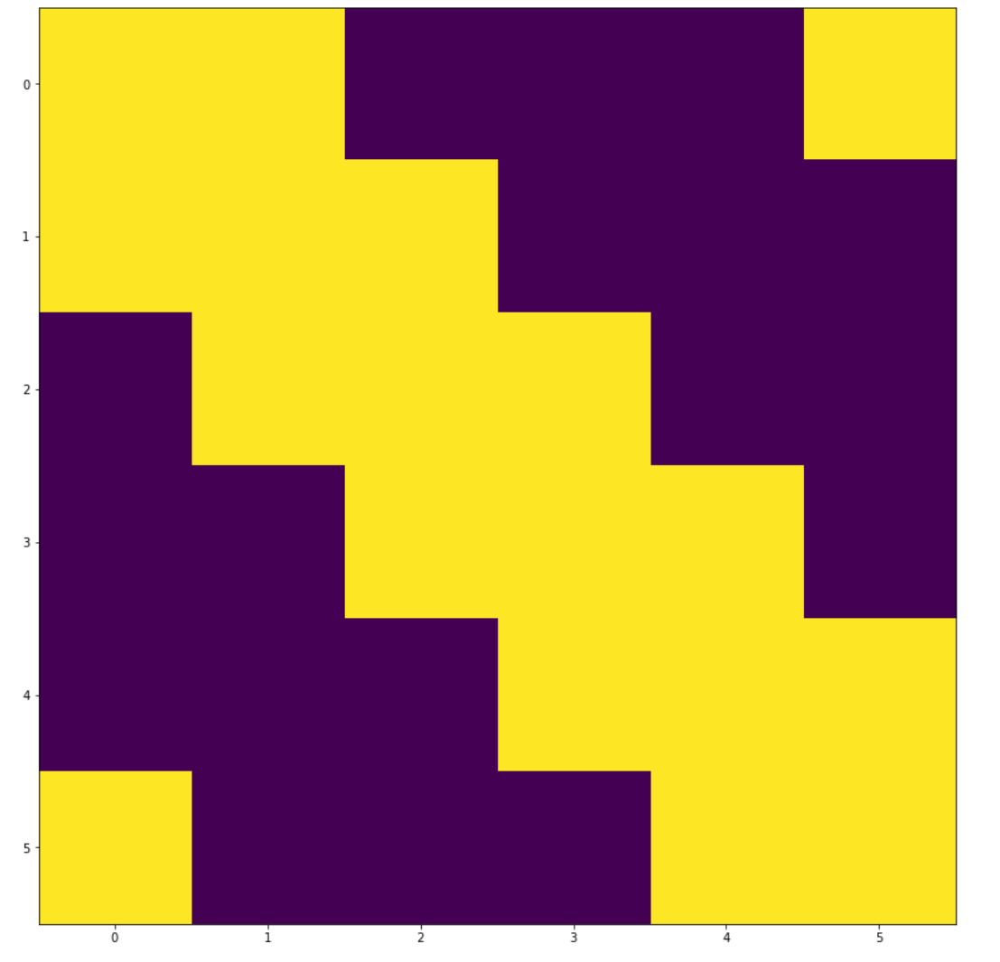
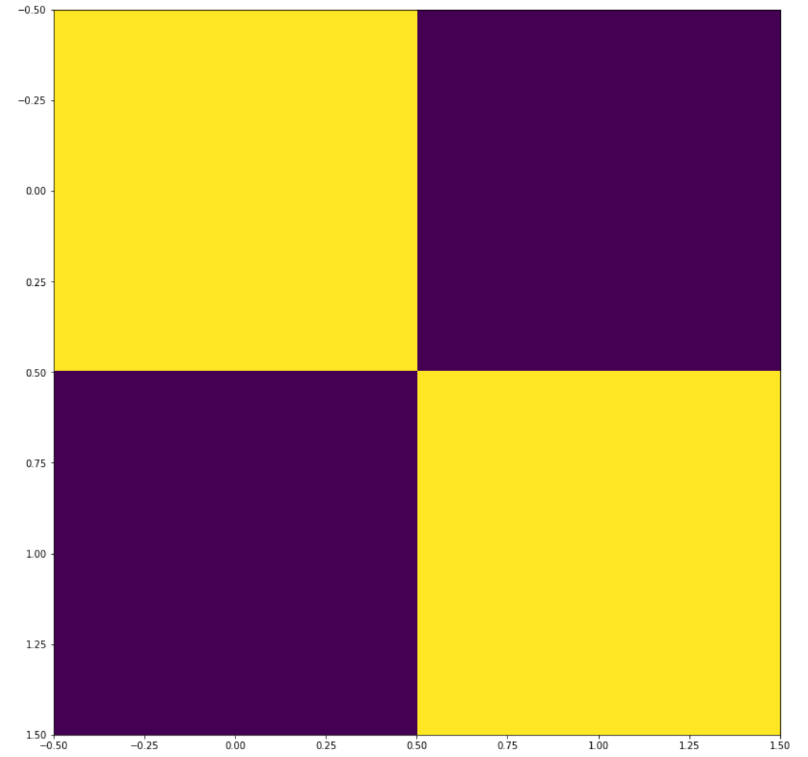
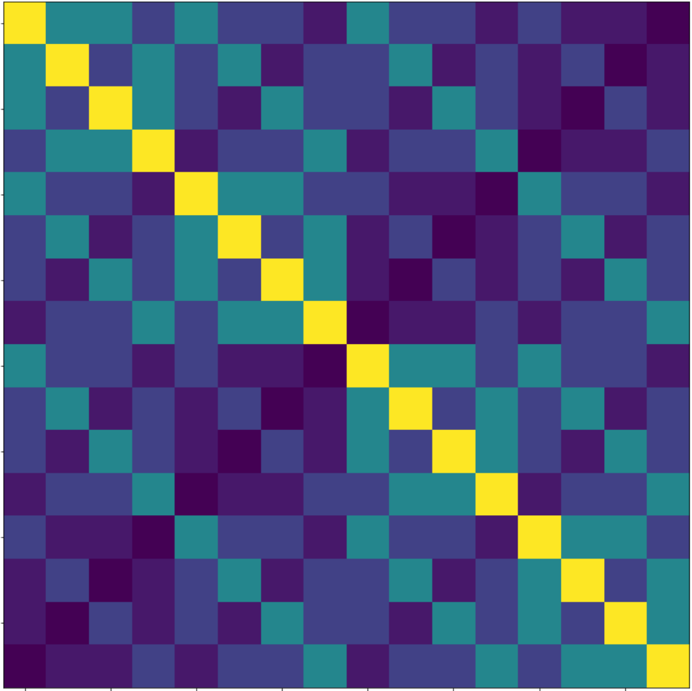
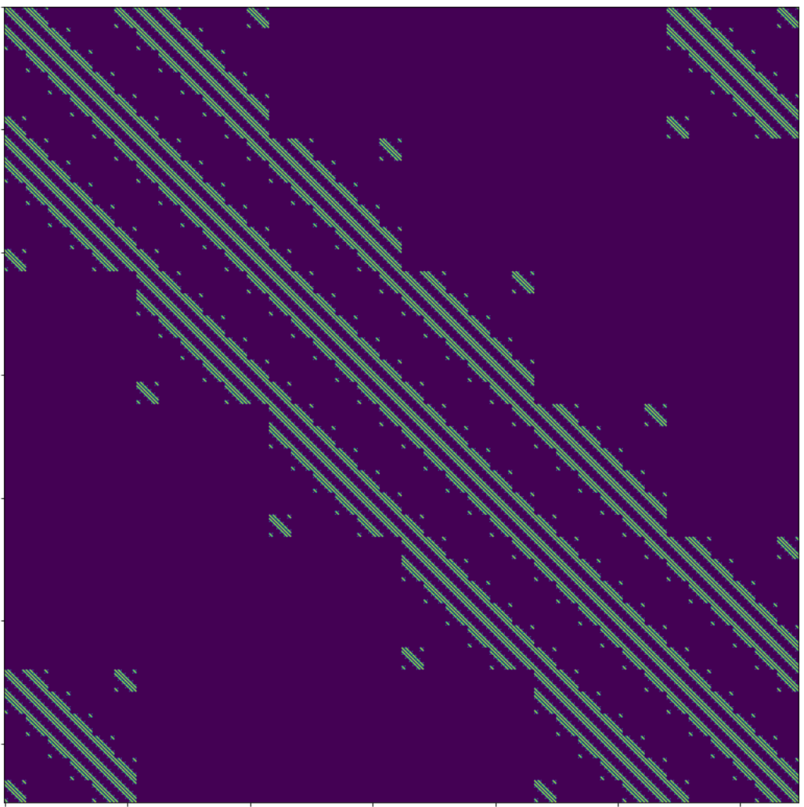
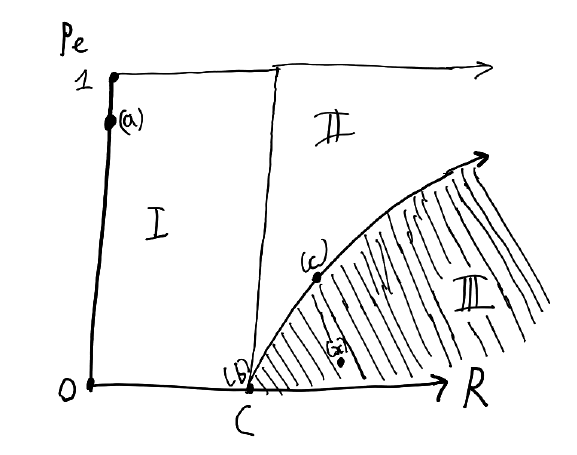
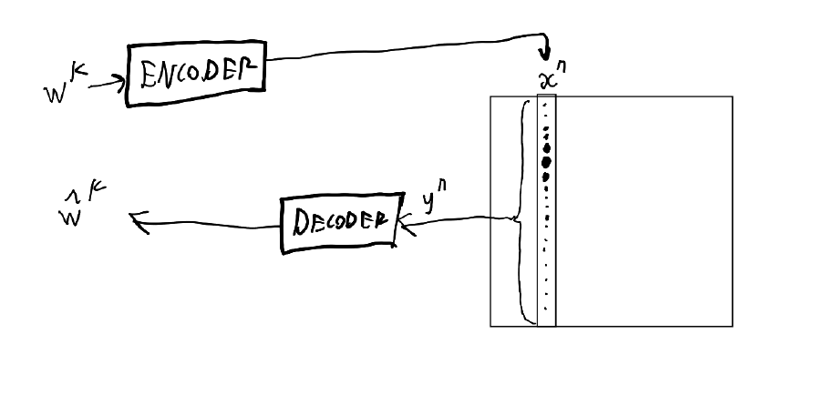
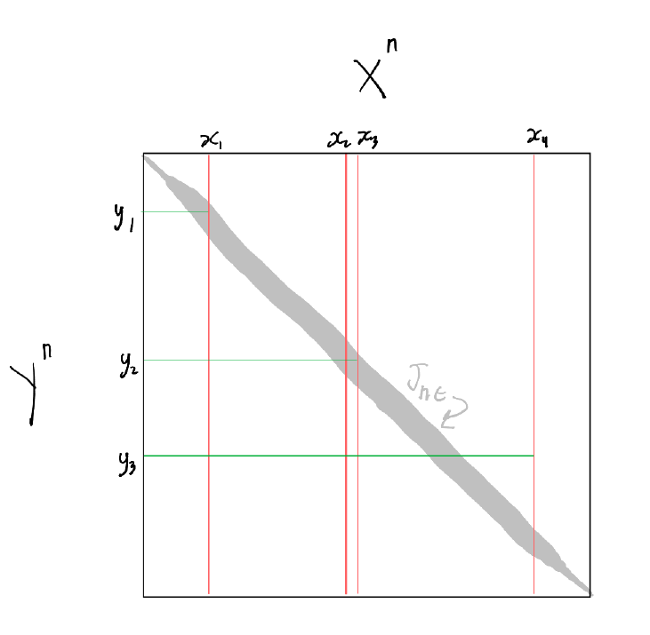

# Information Theory 3: channel coding

We've looked at basic information theory concepts [here](https://www.strataoftheworld.com/2022/06/information-theory-1.html), and at source coding (i.e. compressing data without caring about noise) [here](https://www.strataoftheworld.com/2022/06/information-theory-2-source-coding.html). Now we turn to channel coding.

The purpose of channel coding is to make information robust against any possible noise in the channel.

## Noisy channel model

The noisy channel model looks like the following:

The channel can be anything: electronic signals sent down a wire, messages sent by post, or the passage of time. What's important is that it is discrete (we will look at the continuous case later), and there are some transition probabilities from every symbol that can go into the channel to every symbol that can come out. Often, the set of symbols of the inputs is the same as the set of symbols of the outputs.

The capacity $C$ of a noisy channel is defined as
$$
C = \max_{p_x} I(X;Y) = \max_{p_x} \big(H(Y) - H(Y|X)\big).
$$
It's intuitive that this definition involves the mutual information $I$ (see [the first post for the definition and explanation](https://www.strataoftheworld.com/2022/06/information-theory-1.html)), since we care about how much information $X$ transfers to $Y$, and how much $Y$ tells us about $X$. What might be less obvious is why we take the maximum over possible input probability distributions $p_x$. This is because the mutual information $I(X;Y)$ depends on the probability distributions of $X$ and $Y$.  We can only control what we send - $X$ - so we want to adjust that to maximise the mutual information. Intuitively, if you're typing on a keyboard with all keys working normally except the "i" key results in a random character being inserted, shifting your typing away from using the "i" key is good for information transfer. Better to wr1te l1ke th1s than to not be able to reliably transfer information.

However, the only real way to understand why this definition makes sense is to look at the noisy channel coding theorem. This theorem tells us, among other things, that for any rate (measured in bits per symbol) smaller than the capacity $C$, for a large enough code length we can get a probability of error as small as we like.

With noisy channels, we often work with *block codes*. The idea is that you encode some shorter sequence of bits as a longer sequence of bits, and if you've designed this well, it adds redundancy. An $(n,k)$ block code is one that replaces chunks of $k$ bits with chunks of $n$ bits.

## Hamming coding

Before we look at the noisy channel theorem, here's a simple code that is redundant to error: transmit every bit 3 times. Instead of sending 010, send 000111000. If the receiver receives 010111000, they can tell that bit 2 probably had an error, and should be a zero. The problem is that you triple your message length.

Hamming codes are a method for achieving the same - the ability to detect and correct single-bit errors, and the ability to detect but not properly correct two-bit errors - while sending a number of excess bits that grows only logarithmically with message length. For long enough messages, this is very efficient; if you're sending over 250 bits, it only costs you a 3% longer message to insure them against single-bit errors.

The catch is that the probability of having only one or fewer errors in a message declines exponentially with message length, so this is less impressive than it might sound at first.

The basic idea of most error correction codes is a parity bit. A parity bit $b$ is typically the XOR (exclusive-or) of a bunch of other bits $b_1, b_2, \ldots$, written $b = b_1 + b_2 + \ldots$ (we use $+$ for XOR because doing addition in base-2 while throwing away the carry is the same is taking the XOR). A parity bit over a set of bits $B = \{b_1, b_2, \ldots\}$ is 1 if the set of bits contains an odd number of 1s, and otherwise 0 (hence the word "parity").

Consider sending a 3-bit message where the first two bits are data and the third is a parity bit. If the message is 110, we check that, indeed, there's an even number of 1s among the data bits, so it checks out that the parity bit is 0. If the message were 111, we'd know that something had gone wrong (though we wouldn't be able to fix it, since it could have started out with any of 011, 101, or 110 and suffered a one-bit flip - and note that we can never entirely rule out that 000 flipped to 111, though since error probability is generally small in any case we're interested in, this would be extremely unlikely).

The efficiency of Hamming codes comes from the fact that we have parity bits that check other parity bits.

A $(T, D)$ Hamming code is one that sends $T$ bits in total of which $D$ are data bits and the remaining $T - D$ are parity bits. There exists a $(2^m - 1, 2^m - m - 1)$ Hamming code for positive integer $m$. Note that $m$ is the number of parity bits.

The default way to construct a Hamming code is that the $m$th parity bit is in position $2^m - 1$, and is set such that the parity of bits whose position's binary representation has a 1 in the $m$th last position is zero.

(Above, you see bits 1 through 15, with parity bits in positions 1, 2, 4, and 8. Underneath each bit, for every parity bit there is a 0 if that bit is not included in the parity set of that parity bit, and otherwise a 1. For example, since `b4` is set for bits 8-15, `b4` is a 1 if there's an odd number of 1s in bits 8-15 inclusive and otherwise 0. Note that the columns spell out the numbers 1 through 15 in binary.)

For example, a $(7,4)$ Hamming code for the 4 bits of data 0101 would first become
$$
\texttt{ b1 b2 0 b3 1 0 1}
$$
and then we'd set $b_1 = 0$ to make there be an even number of 1s across the 1st, 3rd, 5th, and 7th positions, set $b_2 = 1$ to do the same over the 2nd, 3rd, 6th, and 7th positions, and then finally set $b_3 = 0$ to do the same over the 4th, 5th, 6th, and 7th positions.

To correct errors, we have the following rule: sum up the positions of the parity bits that do not match. For example, if parity bit 3 is set wrong relative to the rest of the message, you flip that bit; everything will be fine after we clear this false alarm. But if parity bit 2 is also set wrong, then you take their positions, 2 (for bit 2) and 4 (for bit 3) and add them to get 6, and flip the sixth bit to correct the error. This makes sense because the sixth bit is the only bit covered by both parity bits 2 and 3, and only parity bits 2 and 3.

Though the above scheme is elegant and extensible, it's possible to design other Hamming codes. The length requirements remain - the code is a $(2^m - 1, 2^m - m - 1)$ code if we allow $m$ parity bits - but we can assign any "domain" over the bits to each parity bit as long as each bit belongs to the domain a unique set of parity bits.

## Noisy channel coding theorem

We can measure any noisy channel code we choose based on two numbers. The first is its probability of error ($p_e$ above). The second is its rate: how many bits of information are transferred for each symbol sent. The three parts of the theorem combine to divide that space up into a possible and impossible region:

The first part of the theorem says that the region marked "I" is possible. Now there are points of this region that are more interesting than others. Yes, we can make a code that has a capacity of 0 and a very high error rate; just send the same symbol all the time. This is point (a), and we don't care about it.

What's more interesting, and perhaps not even intuitively obvious at all, is that we can get to a point (b): an arbitrarily low error rate, despite the fact that we're sending information. The maximum information rate we can achieve while keeping the error probability very low turns out to be the capacity, $C = \max_{p_X} I(X:Y)$.

The second part of the theorem gives us a lower bound on error rate if we dare try for a rate that is greater than the capacity. It tells us we can make codes that achieve point (c) on the graph.

Finally, the third part of the theorem proves that we can't get to points like (x), that have an error rate that is too low given how much over the channel capacity their rate is.

We started the [proof of the source coding theorem](https://www.strataoftheworld.com/2022/06/information-theory-2-source-coding.html) by considering a simple construction (the $\delta$-sufficient subset) first for a single character and then extending it to blocks. We're going to do something similar now.

### Noisy typewriters

A noisy typewriter over the alphabet $\{0, \ldots, n\}$ is a device where if you press the key for $i$, it inputs one of the following with equal probability:

- $i - 1 \mod n$
- $i \mod n$ 
- $i + 1 \mod n$

With a 6-symbol alphabet, we can illustrate its transition probability matrix as a heatmap:

The colour scale is blue to yellow. The reading order is meant to be that each column represents the probability distribution of output symbols given an input symbol.

First, can we transmit information without error at all? Yes: choose a code where you only send the symbol corresponding to the second and fifth columns. Based on the heatmap, these can map to symbols number 1-3 and 4-6 respectively; there is no possibility of confusion. The cost is that instead of being able to send one of six symbols, or $\log 6$ bits of information per symbol, we can now only send one of two, or $\log 2 = 1$ bits of information per symbol.

The capacity is $\max_{p_X} \big( H(Y) - H(Y|X) \big)$. Now if $p_X$ is the distribution we considered above - assigning half the probability to 2 and half to 5 - then by the transition matrix we see that $H(Y)$ will be uniformly distributed, so it is $\log 6$. $H(Y|X)$ is $\log 3$ in our example code, because we see that if we always send either symbol 2 or 5, then in both cases $Y$ is restricted to a set of 3 values. With some more work you can show that this is in fact an optimal choice of $p_X$. The capacity turns out to be $\log 6 - \log 3 = \log 2$ bits. The error probability is zero. We see that we can indeed transfer information without error even if we have a noisy channel.

But hold on, the noisy typewriter has a very specific type of error: there's an absolute certainty that if we transmit a 2 we can't get symbols 3-6 out, and so on. Intuitively, here we can partition the space of channel outputs in such that there is no overlap in the sets of which channel input each channel output could have come from. It seems like with a messier transition matrix that doesn't have this nice property, this just isn't true. For example, what if we have a binary symmetric channel, with a transition matrix like this:

Unfortunately the blue = lowest, yellow = highest color scheme is not very informative; the transition matrix looks like this, where $p_e$ is the probability of error:
$$
\begin{bmatrix}
1 - p_e & p_e \\
p_e & 1 - p_e
\end{bmatrix}
$$
Here nothing is certain: a 0 can become a 1, and a 1 can become a zero.

However, this is what we get if we use this transition probability matrix on every symbol in a string of length 4, with the strings going in the order 0000, 0001, 0010, 0011, ..., 1111 along both the top and left side of the matrix:

For example, the second column shows the probabilities (blue = low, yellow = high) for what you get in the output channel if 0001 is sent as a message. The highest value is for the second entry, 0001, because we have $p_e < 0.5$ so $p_e < 1 - p_e$ so the single likeliest outcome is for no changes, which has probability $(1-p_e)^4$. The second highest values are for the first (0000), third (0011), fifth (0101), and seventh (1001) entries, since these all involve one flip and have probability $p_e (1-p_e)^3$ individually and probability ${4 \choose 1} p_e (1-p_e)^3 = 4 p_e (1 - p_e)^3$ together.

If we dial up the number, the pattern becomes clearer; here's the equivalent diagram for messages of length 8:

### The Return of the Typical Set 

There are two key points.

The first is that more and more of the probability is concentrated along the diagonal (plus some other diagonals further from the main diagonal. We can technically have any transformation, even 11111111 to 00000000 when we send a message through the channel, but most of these transformations are extremely unlikely. The transition matrix starts looking more and more like the noisy typewriter, where for each message only one subset of received messages has non-tiny likelihood.

The second key point is that it is time for ... the *return of the typical set*. Recall from the [second post in this series](https://www.strataoftheworld.com/2022/06/information-theory-2-source-coding.html) that the $\epsilon$-typical set of length-$n$ strings over an alphabet $A$ is defined as
$$
T_{n\epsilon} = \left\{x^n \in A^n \text{ such that } \left|-\frac{1}{n} \log p(x^n) - H(X)\right| \le \epsilon\right\}.
$$
 $-\frac{1}{n} \log p(x^n)$ is equal to $-\frac{1}{n} \sum_{i=1}^n \log p(x_i)$ by independence, and this in turn is an estimator for $\mathbb{E}[-\log p(X)] = H(X)$. You can therefore read $-\frac{1}{n}\log p(x^n)$ as the "empirical entropy"; it's what we'd guess the (per-symbol) entropy of $X$ to be if we did a slightly weird thing of estimating the entropy while knowing the probability model but only using it to determine the information content $-\log p$, and estimating the $p_i$s in $-\sum_i p_i \log p_i$ instead by only using how often they occur in $x^n$ (rather than the probability model).

Now the big results about typical sets was that as $n \to \infty$, the probability $P(x^n \sim X^n \in T_{n \epsilon}) \to 1$, and therefore for large $n$, most of the probability mass is concentrated in the approximately $2^{nH(X)}$ strings of probability approximately $2^{-nH(X)}$ that lie in the typical set.

We can define a similar notion of jointly $\epsilon$-typical sets, denoted $J_{n\epsilon}$ and defined by analogy with $T_{n\epsilon}$ as
$$
J_{n\epsilon} = \left\{ (x^n, y^n) \in A^n \times A^n
\text{ such that } \left| - \frac{1}{n} \log P(x^n, y^n) - H(X, Y)\right| \le \epsilon
\right\}.
$$
Like typical sets, jointly typical sets give us similar nice properties:

1. If $x^n, y^n$ are drawn from the joint distribution (e.g. you first draw an $x^n$, then apply the transition matrix probabilities to generate a $y^n$ based on it), then the probability that $(x^n, y^n) \in J_{n \epsilon}$ goes to 1 as $n \to \infty$. The proof is almost the same as the corresponding proof for typical sets (hint: law of large numbers).

2. The number $|J_{n\epsilon}|$ of jointly typical sequence pairs $(x^n, y^n)$ is about $2^{nH(X,Y)}$, and specifically is upper-bounded by $2^{n(H(X,Y) + \epsilon)}$. The proof is the same as for the typical set case.

3. If $x^n$ and $y^n$ are *independently drawn* from the distributions $p_X$ and $p_Y$, the probability that they are jointly typical is about $2^{-nI(X;Y)}$. The specific upper bound is $2^{-n(I(X;Y) - 3 \epsilon)}$, and can be shown straightforwardly (remembering some of the identities in [post 1](https://www.strataoftheworld.com/2022/06/information-theory-1.html)) from
   $$
   \begin{align}
   P((x^n, y^n) \in J_{n \epsilon}) &= \sum_{(x^n, y^n) \in J_{n\epsilon}} p(x^n) p(y^n)
   \\ &\le
   |J_{n\epsilon}| 2^{-n(H(X) - \epsilon)} 2^{-n(H(X) - \epsilon)}
   \\ &\le
   2^{n(H(X,Y) + \epsilon)} 2^{-n(H(X) - \epsilon)} 2^{-n(H(X) - \epsilon)}
   \\ &=
   2^{n(H(X,Y)  - H(X) - H(Y) + 3 \epsilon)}
   \\ &=
   2^{-n(I(X,Y) - 3 \epsilon)}
   \end{align}
   $$

Armed with this definition, we can now interpret what was happening in the diagrams above: as we increase the length of the messages, more and more of the probability mass is concentrated in jointly typical sequences, by the first property above. The third property tells us that if we ignore the dependence between $x^n$ and $y^n$ - picking a square roughly at random in the diagrams above - we are, however, extremely unlikely to pick a square corresponding to a jointly typical pair.

Here is the noisy typewriter for 6 symbols, for length-4 messages coming in and out of the channel:

(As a reminder of the interpretation: each column represents the probablity distribution, shaded blue to yelow, for one input message, and the $6^4 = 1296$ possible messages we have with this message length (4) and alphabet size (6) are ranked in alphabetical order along both the top and left side of the grid)

The highest probability is still yellow, but you can barely see it. Most of the probability mass is in the medium-probability sequences (our jointly typical set), forming a small subset of the possible channel outputs for each input.

In the limit, therefore, the transition probability matrix for a block code of an arbitrary symbol transition probability matrix looks a lot like the noisy typewriter. This suggests a decoding method: if we see $y^n$, we decode it as $x^n$ if $(x^n, y^n)$ are in the jointly typical set, and there is no other ${x'}^n$ such that $({x'}^n, y^n)$ are also jointly typical. As with the noisy typewriter example, we have to discard a lot of the $x^n$, so that the set of $x^n$ that a given $y^n$ could've come to hopefully contains only a single element, so we match the second condition in the decoding rule.

### Theorem outline

Now we will state the exact form of the noisy channel coding theorem. It has three parts:

1. A discrete memoryless channel has a non-negative capacity $C$ such that for any $\varepsilon > 0$ and $R < C$, for large enough $n$ there's a block code of length $N$ and rate $\geq R$ and a decoder such that error probability is $< \varepsilon$.

   We will see that this follows from the points about jointly typical sets and the decoding scheme based on them that we discussed above. The only thing really missing is an argument that the error rate of jointly typical coding can be made arbitrarily low as long as $R < C$. We will see that Shannon used perhaps the most insane trick in all of 20th century applied maths to side-step having to actually think of a specific code to prove this.

2. If error probability per bit $p_e$ is acceptable, rates up to
   $$
   R(p_e) = \frac{C}{1 - H_2(p_e)}.
   $$
   are possible. We will prove this by 

3. For any $p_e$, rates $> R(p_e)$ are not possible.

As we saw earlier, these three parts together divide up the space of possible rate-and-error combinations for codes into three parts: 

 

### Proof of Part I: turning noisy channels noiseless

We want to prove that we can get an arbitrarily low error rate if the rate (bits of information per symbol) is smaller than the channel capacity, which we've defined as $C = \max_{p_X} I(X;Y)$.

We could do this by thinking up a code and then calculating the probability of error per length-$n$ block for it. This is hard though.

Here's what Shannon did instead: he started by considering a random block code, and then proved stuff about its average error.

What do we mean by a "random block code"? Recall that an $(n,k)$ block code is one that encodes length-$k$ message as length-$n$ messages. Since the rate $r = \frac{k}{n}$, we can talk about $(n, nr)$ block codes.

What the encoder is doing is mapping length-$k$ strings to length-$n$ strings. In the general case, it has some lookup table, with $2^k = 2^{nr}$ entries, each of length $n$. A "random code" means that we generate the entries of this lookup table from the distribution $P(x^n) = \prod_{i=1}^n p(x_i)$. We will refer to the encoder as $E$.

(In the above diagram, the dots in the column represent probabilities of different outputs given the $x^n$ that is taken as input. Different values of $w^k$ would be mapped by the encoder to different columns $x^n$ in the square.)

Richard Hamming (yes, the Hamming codes person) mentions this trick in his famous talk ["You and Your Research"](https://www.cs.virginia.edu/~robins/YouAndYourResearch.pdf):

> Courage is one of the things that Shannon had supremely. You have only to think of his major theorem. He wants to create a method of coding, but he doesn't know what to do so he makes a random code. Then he is stuck. And then he asks the impossible question, "What would the average random code do?'' He then proves that the average code is arbitrarily good, and that therefore there must be at least one good code. Who but a man of infinite courage could have dared to think those thoughts?

Perhaps it doesn't quite take infinite courage, but it is definitely one hell of a simplifying trick - and the remarkable trick is that it works.

Here's how: let the average probability of error in decoding one of our blocks be $\bar{p_e}$. If we have a message $w^k$, the steps that happen are:

1. We use the (randomly-constructed) encoder $E$ to map it to an $x^{n}$ using $x^n = E(w^k)$. Note that the set of values that $E(w^k)$, can take, $\text{Range}(E)$, is a subset of the set of values of all possible $x^n$.
2. $x^n$ passes through the channel to become a $y^n$, according to the probabilities in a block transition probability matrices like the ones pictured above.
3. We guess that $y^n$ came from the $x'^n \in \text{Range}(E)$ such that the pair $(x'^n, y^n)$ is in the jointly typical set $J_{n\epsilon}$.
   1. If there isn't such an $x'^n$, we fail. In the diagram below, this happens if we get $y_3$, since $\text{Range}(E) = \{x_1, x_2, x_3, x_4\}$ does not contain anything jointly-typical with $y_3$.
   2. If there is at least one wrong $x'^n$, we fail. In the diagram below, this happens if we get $y_2$, since both $x_2$ and $x_3$ are codewords the encoder might use that are jointly typical with $y_2$, so we don't know which one was originally transmitted over the channel.
4. We use the decoder, which is simply the inverse of the encoder, to map to our guess $\bar{w}^k$ of what the original string was. Since $x'^n \in \text{Range}(E)$, the inverse of the encoder, $E^{-1}$, must be defined at $x'^n$. (Note that there is a chance, but a negligibly small one as $n \to \infty$, that in our encoder generation process we created the same codeword for two different strings, in which case the decoder can't be deterministic. We can say either: we don't care about this, because the probability of a collision goes to zero, or we can tweak the generation scheme to regenerate if there's a repeat; $n \ge k$ so we can always construct a repeat-free encoder.)

Therefore the two sources of error that we care about are:

- On step 3, we get a $y^n$ that is not jointly typical with the original $x^n$. Since $P((x^n, y^n) \geq 1 - \delta$ for some $\delta$ that we can make arbitrarily small by increasing $n$, we can upper-bound this probability with $\delta$.

- On step 3, we get a $y^n$ that is jointly typical with at least one wrong $x'^n$. We saw above that one of the properties of the jointly typical set is that if $x^n$ and $y^n$ are selected independently rather than together, the probability that they are jointly typical is only $2^{-n(I(X;Y) - 3 \epsilon)}$. Therefore we can upper-bound this error probability by summing the probability of "accidental" joint-typicality over the $2^k - 1$ possible messages that are not the original message $w^k$. This sum is
  $$
  \begin{align}
  \sum_{w'^k \ne  w^k} 2^{-n(I(X;Y) - 3 \epsilon)}
  &\le (2^{k} - 1) 2^{-n(I(X;Y) - 3 \epsilon)} \\
  &\le 2^{nr}2^{- n (I(X;Y) - 3 \epsilon)} \\
  &= 2^{nr - n(I(X;Y) - 3 \epsilon)}
  \end{align}
  $$

We have the probabilities of two events, so the probability of at least one of them happening is smaller than or equal to their sum:
$$
\bar{p}_e \le \delta + 2^{nr - n(I(X;Y) - 3 \epsilon)}
$$
We know we can make $\delta$ however small we want. We can see that if $r < I(X;Y) - 3 \epsilon$, then the exponent is negative and increasing $n$ can also make the second term negligible. This is almost Part I of the theorem, which was:

> A discrete memoryless channel has a non-negative capacity $C=\max_{p_X} I(X;Y)$ such that for any $\epsilon > 0$ and $R < C$, for large enough $n$ there's a block code of length $n$ and rate $\geq R$ and a decoder such that error probability is $< \varepsilon$.

First, to put a bound involving only one constant on $\bar{p}_e$, let's arbitrarily say that we increase $n$ until $2^{nr - n(I(X;Y) - 3 \epsilon)} \le \delta$. Then we have
$$
\bar{p}_e \le 2 \delta
$$
Second, we don't care about average error probability over codes, we care about the existence of a single code that's good. We can realise that if the average error probability $\le 2 \delta$, there must exist at least one code, call it $C^*$, with average error probability $\le 2 \delta$.

Third,  we don't care about average error probability over messages, but maximal error probability, so that we can get the strict $< \varepsilon$ error probability in the theorem. This is trickier to bound, since $C^*$ might somehow have very low error probability with most messages, but some insane error probability for one particular message.

However, here again Shannon jumps to the rescue with a bold trick: throw out half the codewords, specifically the ones with highest error probability. Since the average error probability is $\le 2 \delta$, every codeword in the best half of codewords must have error probability $\le 4 \delta$, because otherwise the one-half of best codes would contribute more than $\frac{1}{2} \times 4 \delta = 2 \delta$ to the average error on their own.

What about the effect on our rate of throwing out half the codewords? Previously we had $2^k = 2^{nr}$ codewords; after throwing out half we have $2^{nr - 1}$, so our rate has gone from $\frac{k}{n} = r$ to $\frac{nr - 1}{n} = r - \frac{1}{n}$, a negligible decrease if $n$ is large.

What we now have is this: as $n \to \infty$, we can get any rate $R < I(X;Y) - 3 \epsilon$ with maximal error probability $\le 4 \delta$, and both $\delta$ and $\epsilon$ can be decreased arbitrarily close to zero by increasing $n$. Since we can set the distribution of $X$ to whatever we like (this is why it matters that we construct our random encoder by sampling from $X$ repeatedly), we can make $I(X;Y) = \underset{p_X}{\max} I(X;Y)$.

This is the first and most involved part of the theorem. It is also remarkably lazy: at no point do we have to go and construct an actual code, we just sit in our armchairs and philosophise about the average error probability of random codes.

### Proof of Part II: achievable rates if you accept non-zero error

Here's a simple code that achieves a rate higher than the capacity in a noiseless binary channel:

1. The sender maps each length-$nr$ block to a block of length $n$ by cutting off the last $nr - n$ symbols.
2. The receiver reads $n$ symbols with error probability $0$, and then guesses the remaining $nr - n$ with bit error probability $\frac{1}{2}$ for each symbol. (Note; we're concerned with bit error here, unlike block error in the previous proof)

An intuition you should have is that if the probability of anything is concentrated in a small set of outcomes, you're not maximising the entropy (remember: *entropy is maximised by a uniform distribution*) and therefore also not maximising the information transfer. The above scheme concentrates high probability of error to a small number of bits, while transmitting some of them with zero error - we should be able to do better.

It's not obvious how we'd start doing this. We're going to take some wisdom from the old proverb about hammers and nails, and note that the main hammer we've developed so far is a proof that we can send through the channel at a negligible error rate by increasing the size of the message. Let's turn this hammer upside down: we're going to use the decoding process to encode and the encoding process to decode. Specifically, to map from length-$n$ strings to the smaller length-$k$ strings, we use the decoding process from before:

1. Given an $x^n$ to encode, we find the $x'^n \in \text{Range}(E)$ such that the pair $(x^n, x'^n)$ is in the jointly typical set $J_{n\epsilon}$. (Jointly typical with respect to what joint distribution? That of length-$n$ strings before and after being passed through the channel (here we're assuming that the input and output alphabets are equivalent). However, note that nothing actually has to pass through a channel for us to use this.)
2. We use the inverse of the encoder, $E^{-1}$, to map $x'^n$ to a length-$k$ string $w^k$ ($x'^n \in \text{Range}(E)$ so this is defined).

To encode, we use the encoder $E$, to get $\bar{x}^n = E(w^k)$.

We'll find the per-bit error rate, not the per-block error rate, so we want to know how many bits are changed on average under this scheme. We're still working with the assumption of a noiseless channel, so we don't need to worry about the noise in the channel, only the error coming from our lossy compression (which is based on a joint probability distribution coming from assuming some channel, however). 

Assume our channel has error probability $p$ when transmitting a symbol. Fix an $x^n$ and consider pairs $(x^n, y^n)$ in the jointly typical set. Most of the $y^n$ will differ from $x^n$ in approximately $np$ bits. Intuitively, this comes from the fact that for a binomial distribution, most of the probability mass is concentrated around the mean at $np$, and therefore the typical set contains mostly sequences with a number of errors close to this mean. Therefore, on average we should expect $np$ errors between the $x^n$ we put into the encoder and the $x'^n$ that it spits out. Since we assume no noise, the $w^k = E^{-1}(x'^n)$ we send through the channel comes back as the same, and we can do $E(w^k) = E(E^{-1}(x'^n)) = x'^n$ to perfectly recover  $x'^n$. Therefore the only error is the $np$ wrong bits, and therefore our per-bit error rate is $p$.

Assume that, used the right way around, we have a code that can achieve a rate of $R' = k/n$. This rate is 
$$
R' = \max_{p_X} I(X;Y) = \max_{p_X} \big[ H(Y) - H(Y|X) \big] \\
= 1 - H_2(p)
$$
assuming a binary code and a binary symmetric channel, and where $H_2(p)$ is the entropy of a two-outcome random variable with probability $p$ of the first outcome, or
$$
H_2(p) = - p \log p - (1 - p) \log (1 - p).
$$
Now since we're using it backward, we map from $n$ to $k$ bits rather than $k$ to $n$ bits, and this code has rate
$$
\frac{1}{R'} = \frac{n}{k} = \frac{1}{1 - H_2(p)}
$$
What we can now do is make a code that works like the following:

1. Take a length-$n$ block of input.
2. Use the compressor (i.e. the typical set decoder) to map it to a smaller length-$k$ block.
3. Use some noiseless channel code with capacity $C$.
4. Use the decompressor (i.e. the typical set encoder) to map the recovered length-$k$ blocks back to length-$n$ blocks.

In step 4, we will on average see that the recovered input differs in $np$ places, for a bit error probability of $p$. And what is our rate? We assumed the standard noiseless channel code in the middle that transmits our compressed input had the maximum rate $C$. However, it is transmitting strings that have already been compressed by a factor of $\frac{k}{n}$, so the true rate is
$$
R = \frac{C}{1 - H_2(p)} = \frac{C}{1 + p \log p + (1 - p) \log (1 - p)}
$$
This gives us the second part of the theorem: given a certain rate $R$, we can transmit at any probability of error $p$ low enough that $C / (1 - H_2(p)) \le R$.

(Note that effectively $0 \le p < 0.5$, because if $p > 0.5$ we can just flip the labels on the channel and change $p$ to $1 - p$, and if $p = 0.5$ we're transmitting no information.)

### Proof of Part III: unachievable rates

Note that the pipeline is a Markov chain (i.e. each step depends only on the previous step):

Therefore, the data processing inequality applies (for more on that, search for "data" [here](https://www.strataoftheworld.com/2022/06/information-theory-1.html)). With one application we get
$$
I(w^k; \bar{w}^k) \le I(w^k; y^n)
$$
and with another
$$
I(w^k; y^n) \le I(x^n; y^n)
$$
 which combine to give
$$
I(w^k, \bar{w}^k) \le I(x^n; y^n).
$$
By the definition of channel capacity, $I(x^n; y^n) \le nC$ (remember that the definition is about mutual information between $X$ and $Y$, so *per-symbol* information), and so given the above we also have $I(w^k, \bar{w}^k) \le nC$.

With a rate $R$,  we send over $nR$ bits of information, but if the per-bit error probability is $p$, we can only receive $nR (1 - H_2(p))$ of those bits. Therefore $I(w^k, \bar{w}^k) = nR(1 - H_2(p))$  at most, and we have
$$
nR(1-H_2(p)) > nC
$$
is a contradiction, which implies which implies
$$
R > \frac{C}{1 - H_2(p)}
$$
is a contradiction. 

## Gaussian channels

And now, for something completely different.

We've so far talked only about the entropy of discrete random variables. However, there is a very common case of channel coding that deals with continuous random variables: sending a continuous signal, like sound.

So: forget our old boring discrete random variable $X$, and bring in a brand-new continuous random variable that we will call ... $X$. How much information do you get from observing $X$ land on a particular value $x$? You get infinite information, because $x$ is a real number with an endless sequence of digits; alternatively, the Shannon information is $- \log p(x)$, and the probability of $X=x$ is infinitesimally small for a continuous random variable, so the Shannon information is $-\log 0$ which is infinite. Umm.

Consider calculating the entropy for a continuous variable, which we will denote $h(X)$ to make a difference from the discrete case, and define in the obvious way by replacing sums with integrals:
$$
h(X) = -\int_{-\infty}^\infty f(x) \log f(x) d x
$$
where $f$ is the probability density function. If we actually evaluate this integral, we would get a constant term that goes to infinity.

As principled mathematicians, we might be concerned about this. But we can mostly ignore it, especially as the main thing we want is $I(X;Y)$, and
$$
\begin{align}
I(X;Y) &= h(Y) - h(Y|X) & \\
&= -\int f_Y(y) \log f_Y(y) \mathrm{d}y + \iint f_{X,Y}(x,y) \log f_{Y|X=x}(y) \mathrm{d}x \mathrm{d}y
\end{align}
$$

where *mumble mumble* the infinities cancel out *mumble mumble* opposite signs.

###  Signals

With discrete random variables, we generally had some fairly obvious set of values that they could take. With continuous random variables, we usually deal with an unrestricted range - a radio signal could technically be however low or high. However, step down from abstract maths land, and you realise reality isn't as hopeless as it seems at first. Emitting a radio wave, or making noise, takes some input of energy, and the source has only so much power.

For waves (like radio waves and sound waves), power is proportional to the square of the amplitude of a wave. The variance $\mathbb{V}(X) = \mathbb{E}[(x-\mathbb{E}[x])^2] = \int  f(x) (x - \mathbb{E}[X])^2 \mathrm{d}x$  of a continuous random variable $X$ with probability density function $f$ is just the expected squared difference between the value and its mean. Both of these quantities are squaring a difference. It turns out that the power of our source and the variance of the random variable that represents it are proportional.

Our model of a continuous noisy channel is one where there's an input signal $X$, a source of noise $N$, and an output signal $Y = X + N$. As usual, we want to maximise the channel capacity $C = \max_{p_X} I(X;Y)$, which is done by maximising
$$
I(X;Y) = h(Y) - h(Y|X).
$$
Because noise is generally the sum of a bunch of small contributing factors in each directions, the noise follows a normal distribution with variance $\sigma_N^2$.  Because the only source of uncertainty is $N$ and this has the same regardless of $X$, $h(Y|X)$ depends only on $N$ and not at all on $X$, so the only thing we can affect is $h(Y)$.

Therefore, the question of how you maximise channel capacity turns into a question of how to maximise $h(Y)$ given that $Y = X + N$ with $N \sim \mathcal{N}(0, \sigma_N^2)$. If we were working without any power/variance constraints, we'd already know the answer: just make $X$ such that $Y$ is a uniform distribution (which in this case would mean making $Y$ a uniform distribution over all real numbers, something that's clearly a bit wacky). However, we have a constraint on power and therefore the variance of $X$.

If we were to do some algebra involving Lagrangian multipliers, we would eventually find that we want the distribution of $X$ to be a normal distribution. A key property of normal distributions is that if $X \sim \mathcal{N}(0, \sigma_X^2)$   (assume the mean is 0; note you can always shift your scale) and $N \sim \mathcal{N}(0, \sigma_N^2)$, then $X + N \sim \mathcal{N}(0, \sigma_X^2 + \sigma_N^2)$. Therefore the basic principle between efficiently transmitting information using a continuous signal is that you want to transform your input to follow a normal distribution.

If you do, what do you get? Start with
$$
I(X;Y) = h(Y) - h(Y|X)
$$
and now use the "standard" integral that
$$
\int f(z) \log p(z) \mathrm{d}z = -\frac{1}{2} \log (2 \pi e \sigma^2)
$$
if $z$ is drawn from a distribution $\mathcal{N}(0, \sigma^2)$, and therefore
$$
\max I(X;Y) = C =  \frac{1}{2} \log (2 \pi e (\sigma_X^2 + \sigma_N^2)) - \frac{1}{2} \log (2 \pi e \sigma_N^2)
$$
using the fact that $h(Y|X) = h(N)$ since the information content of the noise is all that is unknown about $Y$ if we're given $X$, and the property of normal distributions mentioned above. We can do some algebra to get the above into the form
$$
C = \frac{1}{2} \log \left(\frac{2 \pi e (\sigma_X^2 + \sigma_N^2)}{2 \pi e \sigma_N^2}\right) \\
= \frac{1}{2} \log \left( 1 + \frac{\sigma_X^2}{\sigma_N^2}\right)
$$
The variance is proportional to the power, so this can also be written in terms of power as
$$
C = \frac{1}{2} \log \left( 1 + \frac{S}{N}\right)
$$
if $S$ is the power of the signal and $N$ is the power of the noise. The units of capacity for the discrete case were bits per symbol; here they're bits per second. A sanity check is that if $S = 0$, we transmit $\frac{1}{2} \log (1) = 0$ bits per second, which makes sense: if your signal power is 0, it has no effect, and no one is going to hear you.

An interesting consequence here is that increasing signal power only gives you a logarithmic improvement in how much information you can transmit. If you shout twice as loud, you can detect approximately twice as fine-grained peaks and troughs in the amplitude of your voice. However, this helps surprisingly little.

If you want to communicate at a really high capacity, there are better things you can do than shouting very loudly. You can decompose a signal into frequency components using the Fourier transform. If your signal consists of many different frequency levels, you can effectively transmit a different amplitude on each of them at once. The range of frequencies that your signal can span over is called the bandwidth and is denoted $W$. If you can make use of multiple frequencies, the capacity equation changes to
$$
C = \frac{W}{2} \log \left(1 + \frac{S}{N}\right)
$$
Therefore if you want to transmit information, transmitting across a broad range of frequencies is much more effective than shouting loudly. There's a metaphor here somewhere.