# From Nand to Tetris / The Elements of Computing Systems

## A brief rant about the title

“From Nand to Tetris” (Nand2Tetris for short) is the name of the course, website, and overall project that the book _The Elements of Computing Systems_ is part of. It’s an excellent name – catchy, concise, and expertly captures the content.

However, apparently it’s a law that a textbook must have a stodgy title consisting of a reference to the subject matter (bonus points for ostentatious circumlocution, like writing “computing system” instead of “computer”), perhaps attached to a generic word like “concepts” or “elements” that doesn’t mean much.

For the rest of this post, I will pointedly ignore the name “\_The Elements of Computing Sytems\_” and refer to it as “\_From Nand to Tetris\_” or “Nand2Tetris” instead.

## You’re a wizard

At first glance, computers are basically magic.

Science fiction author Arthur C. Clarke once said: "Any sufficiently advanced technology is indistinguishable from magic".  A more accurate phrase might be “any sufficiently advanced technology _appears to be_ indistinguishable from magic”. Of magic, all you can say is it just works. With technology (or, for that matter, anything in our world), there is always a reason.

The goal of Nand2Tetris is to take computers from the realm of magic into the realm of understanding.

This is a difficult task, since the technological stack connecting the physical world to a desktop operating system is perhaps the highest and most abstract technological stack humans have created. The functioning of computers is also a topic split into many layers, each of them its own broad field, from chip design to compilers to programming languages to operating systems.

What Nand2Tetris does is presents one example of a path from logic gates to chips to a machine language to virtual machines to high-level languages to an operating system. The aim is not so much to explore every nook and cranny of the computational jungle, or even to provide a map, but instead to demonstrate that such a path is even possible.

## A path through the jungle

### Logic gates

#### Boolean logic and basic gates

Most of the function of a computer can be constructed from just two pieces of hardware. The first is the NAND gate.

The only thing we need to know about the NAND gate is that it takes two inputs, each of which takes a binary value (we call the values 0 and 1), and produces a 1 as an output _except_ when both inputs are 1, in which case the output is a 0.

We will not discuss the implementation of the NAND gate, but instead assume that such a device can be implemented by electrical engineers who are clever enough (we have to start somewhere).

In fact, it is barely relevant that the NAND gate is a physical device. We can instead think of it – and other logic gates – as a mathematical function, which maps some set of 0s and 1s to an output value.

In the case of a NAND gate, it takes two inputs and maps it to one output in the manner specified by the following table:

$$
\begin{array}{c|c|c}
A & B & \text{NAND}(A, B) \\
\hline
0 & 0 & 1 \\
0 & 1 & 1 \\
1 & 0 & 1 \\
1 & 1 & 0 \\
\end{array}
$$

(The name “NAND” is an abbreviation of “not and”, since the NAND of A and B is true _except_ when the AND of A and B is true)

Such tables are called truth tables. Nand2Tetris provides a handy list of all 2^4 = 16 two-argument boolean functions:

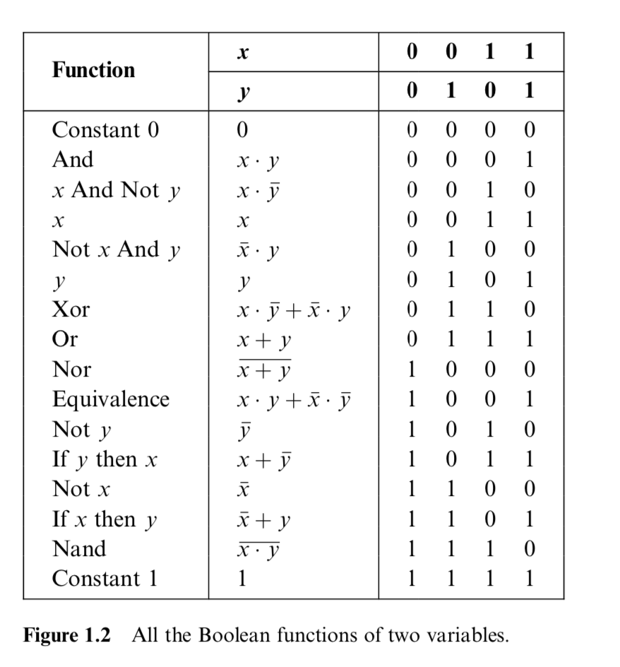

If you have studied boolean logic before, you have doubtlessly spent time manipulating sets of 0s and 1s (or truths and falsities) linked together by AND, OR, and NOT operators. Why these three? In addition to them being straightforward to understand, it turns out that it is possible to specify any boolean function with AND, OR, and NOT operators.

(How? If we have a truth table of the function (if we don’t or can’t make one, then we haven’t properly specified the function!), we can simply take every row for which the value of a function is a 1, build an expression for identifying that row out of ANDs, and then chain together all of these expressions with some ORs. For example, if we want the input sequence a=1, b=0, and c=1 map onto a 1, the expression (a AND ((NOT b) AND c)) will be true for this and only this sequence. If we have a bunch of such expressions, say expressions w, x, y, and z, and we want to figure out if at least one of them is true, we can do so with the expression (w OR (x OR (y OR z))). If we have AND and OR functions/gates that can take more than two arguments, this becomes simpler, since we don’t have to nest ANDs and ORs and can instead write something like OR(AND(a, (NOT b), c), expression2, …).)

It turns out that the NAND function itself is sufficient for defining AND, OR, and NOT (NOR – the negation of OR, in the same way that NAND is the negation of AND – has the same property). This implies that if we have a logic gate that implements the NAND function, we can use it – and it alone – to build chips that implement AND, OR, and NOT functions, and hence any boolean function.

How? (NOT x) can be implemented as (x NAND x). Using this definition, we can write (x AND y) as (NOT (x NAND y)), and (x OR y) as ((NOT x) NAND (NOT y)). Using logic gate symbols, we can represent these gates and some others as follows:

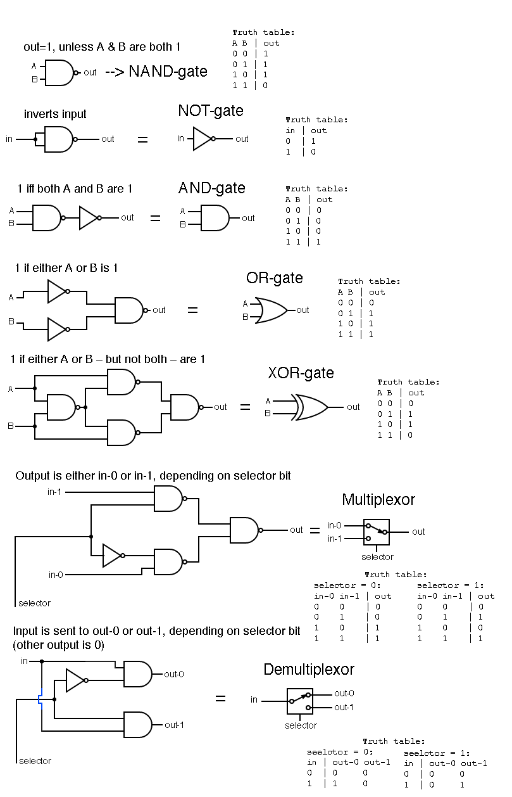

(The book makes you design all of these)

Note that the demultiplexor has two outputs. Hence “demultiplexing” is not a function (a function has only one output), and we call it a chip rather than a logic gate.

Note that the concerns of designing a chip out of NAND gates are not precisely the same as that of specifying the boolean function out of NAND operations. For instance, since we defined (NOT x) as (x NAND x) and (x AND y) as (NOT (x NAND y)), the NAND representation of (x AND y) is ((x NAND y) NAND (x NAND y)). There are three NAND operations, so it looks like we need 3 NAND gates – but no, we can split wires as in the above diagram and do it with two. Similar concerns apply to the implementation of the XOR gate in the above diagram.

There are many subtleties in optimising chips, which we (following the example of Nand2Tetris) will skip in order to get on with our journey.

#### Multi-bit and multi-way chips

A multi-way version of a basic gate allows for applying the function of the gate to many inputs at once. A multi-way AND outputs true if and only if every input is a 1; a multi-way OR outputs true if at least one input is a 1. The implementation is simple: for a 8-bit AND, for instance, take the AND of the first two inputs (call it A), then the AND of A and the third (call it B), then the AND of B and the fourth, and so on.

A multi-bit version of a chip is basically many of those chips in parallel, applying their function to every piece of the input.

For example, a 4-bit AND chip fed 1101 and 0100 as its inputs will output 0100 – the first output is the AND of the first digit of the two inputs, and so on. The implementation is even simpler: send bit 1 of inputs A and B through one AND gate, bit 2 of both through another, and so on.

It gets a bit more complicated when dealing with multiplexors that are both multi-way and multi-bit, but the basic principle is the same: we have a bunch of binary values that we want to group together (perhaps they represent a number), and so we build chips that allow us to deal with them together.

In addition, we don’t want to deal with the wires representing each binary digit of a number individually, so we group them into “buses” that transfer many bits at once from component to component (basically just a clump of wires, as far as I understand). On diagrams, a bus looks like a wire, except with a slash through it.

#### Arithmetic

Now that we have constructed our basic gates, we can begin doing something interesting – at least if addition counts as interesting.

Since our chips are built of gates that deal with binary values – true or false, 1 and 0, whatever – any reasonable low-level implementation of arithmetic will be confined to base-2 rather than our standard base-10 number system.

(To convert binary to decimal, just remember that the value of each digit goes up by a factor of 2 rather than 10 as you move from right to left; for example, 1011 (base 2) = 1 x **1** + 2 x **1** + 4 x **0** + 8 x **1** = 11 (base 10))

This turns out to make things much simpler. The algorithm for addition is the same (add corresponding digits, output a result and a carry, take the carry into account when adding the next two corresponding digits), but we have far fewer cases:

- 0 + 0 -\> 0, carry 0

- 0 + 1 -\> 1, carry 0

- 1 + 0 -\> 1, carry 0

- 1 + 1 -\> 0, carry 1

We can see that the result bit has the same truth table as the XOR function, and the carry bit has the same truth table as the AND function. Hence, for the simple purpose of determining the result digit and carry bit of two binary digits, the following chip (called a half-adder) is sufficient:

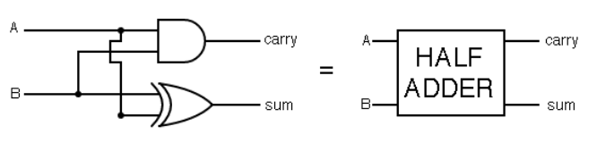

Now we have to figure out how to chain such chips to create a multi-bit adder that can deal with carry bits. Observing that, at most, we will have two input bits and one carry bit to deal with to determine the resulting bit, let’s construct a chip that takes three bits as input and outputs the result and the carry bit. If we add a 0, a 1, and a 1, the corresponding result digit is a 0 and the carry is a 1; if we add a 1, a 1, and a 1, the result bit and the carry bit are both a 1.

The result, called a full-adder, can be constructed like so: 

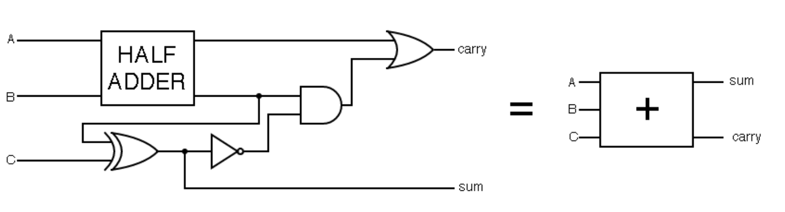

Now that we have a full-adder, we can construct a multi-bit addition chip by simply chaining them together, feeding the carry bit from the previous full-adder as one of the three inputs into the next one. The only complication is that we have to connect a constant-0 input to the first full-adder to fill its third input, and the final carry bit goes nowhere.

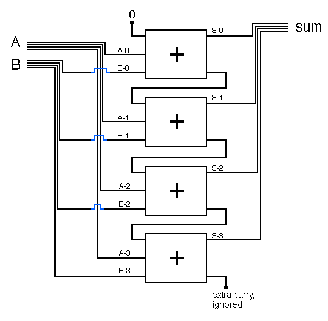

This is pretty cool – after all this messing around with logic and logic gates, we have finally built a piece of hardware that does something real.

We still have to consider some issues. The most important is how we represent negative numbers. If are smart enough about it, this also comes with a bonus: we don’t have to construct a separate chip to handle subtraction, but can instead subtract A from B by converting B to the representation of -B and then adding it to A.

The standard method is called the two’s complement method, and it says: in an n-bit system, represent -x as the binary representation of 2^n - x.

For example, let’s say our system is 8-bit. 0000 0000 is 0 (space inserted for readability), 0000 0001 is 1, 0000 0010 is 2, 0000 0011 is 3, and so on. -0 is 2^8 - 0 = 1 0000 0000, but we keep only 8 bits so this turns into 0000 0000 as well. -1 is 2^8 - 1 = 255 = 1111 1111. -2 is 2^8 - 2 = 254 = 1111 1110. And so on.

Another example: _From Nand to Tetris_ presents the complete table for a base-4 system:

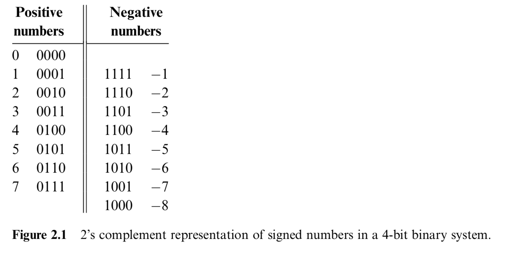

The most important consequence of this is that our addition circuit can properly add negative and positive numbers together. -1 + 1 would be represented as inputting two buses, one containing 1111 1111 and the other 0000 0001, to our addition circuit. Adding these up gives 0000 0000 (since our adder only deals with the first 8 bits), or 0, just as intended. -1 + -1 becomes 1111 1110, which is -2. The reader can verify other examples if they so wish.

Another consequence of this is that the largest number we can represent in our n-bit system is 2^n / 2 - 1, and the most negative number is -(2^n) / 2. Our 8-bit system only gave us the integers -256 to 255 to play with, but the growth is exponential. In a 16-bit system, we can represent the numbers -32768 to 32767; in a 32-bit system, -2 147 483 648 to 2 147 483 647; in a 64-bit system, -9 223 372 036 854 775 808 to 9 223 372 036 854 775 807.

(Of course, when necessary we can implement logic for handling even larger numbers at a higher level in the computer, just as we can implement logic for handling any other data type).

Yet another consequence is that if we add together positive numbers that exceed the limit, the result will be a negative number (large enough negative numbers will also add to a positive). This feature has lead to countless incidents, with some of the more notable ones (ranging from exploding rocketsto to nuke-obsessed Gandhis in the _Civilization_ game series) listed in [this](https://en.wikipedia.org/wiki/Integer_overflow#Examples) Wikipedia article. As always: [beware leaky abstractions](https://www.joelonsoftware.com/2002/11/11/the-law-of-leaky-abstractions/).

#### The Arithmetic Logic Unit

The final piece of our journey that relies on logic gates alone is the construction of an arithmetic logic unit (ALU). Though it has a fancy name, all it does is implements some basic operations we will need: adding, ANDing, negating, and zeroing input buses.

The ALU described in Nand2Tetris operates on two 16-bit buses, and also takes 4 bits to configure the inputs (to determine whether to negate and/or zero the x and y inputs), 1 bit to change the function (switches between ANDing and adding the 16-bit input buses), and 1 bit to determine whether or not to negate the output. In addition to outputting a 16-bit bus with the result of the computation, it also outputs 1 bit saying whether or not the output is zero, and another saying whether or not it’s a negative number.

(Note that “negating” a binary bus means flipping each bit (e.g. 0101 -\> 1010), and is a different process from switching the sign of a number (e.g. 0101 (5) -\> 1011 (-5) with the two’s complement method))

My implementation of such an ALU looks like this (for clarity, I have first defined a separate “ALUPreP” ALU pre-processor chip to perform the negating/zeroing of the x/y inputs):

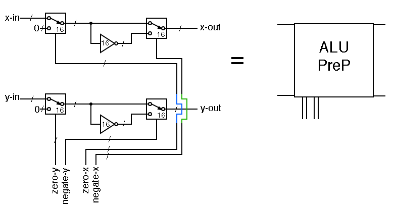

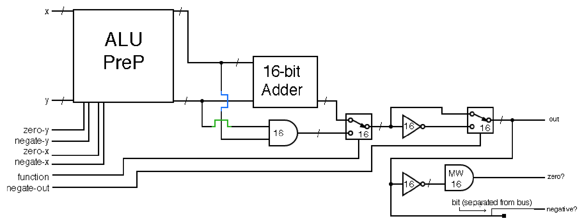

Having a bunch of bits to zero and negate outputs and inputs and whatever may seem pointless. However, such a design allows us to compute many different functions in only one chip, including x + y, x AND y, x OR y, -x, x+1, y-x, and so on. Nand2Tetris provides a table (where the notation & = AND, | = OR, and ! = NOT is used):

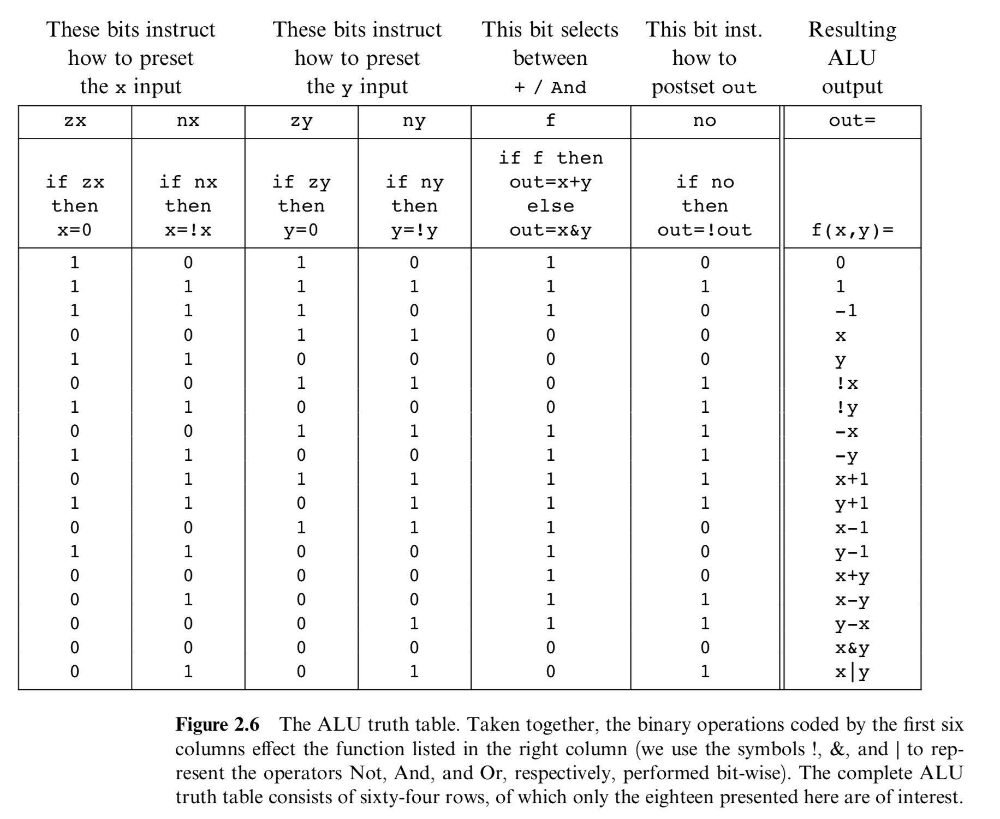

Remember that the only piece of hardware needed to implement all of this is the humble NAND gate.

(To give a sense of scale: by my count, my ALU design above requires 768 NAND gates (768 happens to be 2^9 + 2^8, but this is just a coincidence))

### Flip-flops

I mentioned earlier that only two pieces of hardware are required to implement most of our computer. In the previous section, we examined what we can do with NAND gates; now, we will turn to flip-flops (no, not [_that_](https://en.wikipedia.org/wiki/Flip-flops) type of flip-flop).

NAND gates allow us to perform any feat of (binary) logic that we wish, but they do not allow for memory.

The way in which the Nand2Tetris computer implements memory is with a data flip-flop (DFF). The principle of a DFF, like a NAND gate, is simple: its output at one “tick” of the computer’s central clock is its input at the previous tick.

Thus, to add DFFs to our computer, we need to assume the existence of some type of clock, which broadcasts a signal to all DFFs. This allows us to divide time into discrete chunks.

Real electronics always involves a delay in passing the signal from one component to another. Thus, when we pass inputs to our ALU, there’s a brief moment before the ALU stabilises to the true result. Inputs arriving from different parts of the computer also do not arrive simultaneously. Dividing time into ticks allows us to abstract away all such concerns (as long as the ticks are long enough for everything to stabilise); all we care about is the state of the computer at each tick, not what happens in between two ticks while the state is transitioning.

A DFF and a multiplexor (a logic gate with two inputs and one selector bit, outputting the first input if the selector bit is 0 and the second if the selector bit is 1) can be combined to create a 1-bit register:

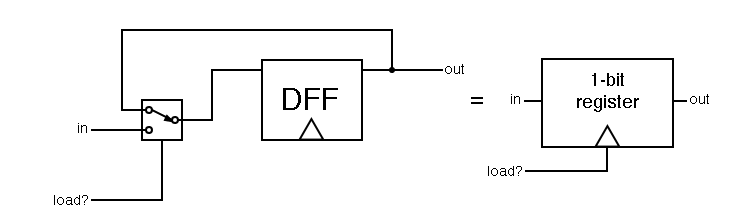

The operation of this register is as follows:

- If the selector bit is 1, the DFF’s output at time _t_ is the input value at time _t-1_.

- If the selector bit is 0, the DFF’s output at time _t_ is its output at time _t-1_.

Hence, we can set a value (either a 0 or a 1) into the 1-bit register, and it will keep outputting that value until we tell it to change to a new value (by sending it the new value and sending a “1” as the input to the multiplexor’s selector bit).

Of course, a storage of 1 bit doesn’t allow for very many funny cat GIFs, so clearly there’s still some work to be done.

The first thing we do is we make the registers bigger, simply by adding many 1-bit registers in parallel. Most useful elements on which we do computations (numbers, letters (which are stored as numbers), etc.) take more than one bit to specify, so it’s useful to split memory into chunks – 16 bit chunks in the case of the Nand2Tetris computer.

Next, let’s take many of these bigger registers, and put them in parallel with each other. The problem now is accessing and setting registers in the memory independently of each other. We can add a series of address bits as inputs to our memory chip and then build some circuitry so that the output will be the contents of the memory with the address specified by the address bits, and if we load a new input, the input will be loaded into the register with the address that is being inputted.

A simple memory unit of four 16-bit registers, each uniquely identified by 2 address bits (00, 01, 10, and 11), and its control logic can be implemented as follows: 

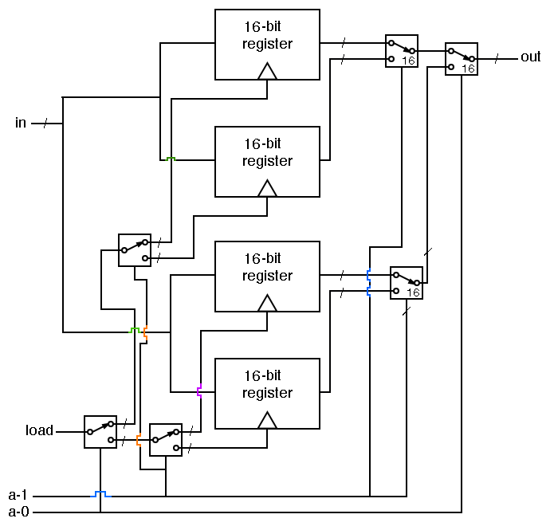

To construct larger memory chips, all we need to do is add registers and expand our address access logic. If we want a memory chip with, say, 64 registers, we need log2(64) = 6 bits to specify which address we are talking about, and hence 6 address bits (n address bits gives you 2^n unique addresses, which is why computer memory sizes are usually powers of 2: 2, 4, 8, 16, 32, 64, 128, 256, 512, 1024, etc.).

Since we can access and set any part of the memory at the same speed and in any order, we call this “random access memory” (RAM). RAM is not permanent memory – maintaining state requires DFFs constantly passing looping signals to each other, which in turn requires power. Turn off power, and you lose memory contents.

(RAM based on DFFs is called static RAM or SRAM, and is faster but more expensive and power-hungry than the alternative capacitor-based DRAM design. Hence SRAM is mainly used for small CPU caches (in the kilobyte or single-digit megabyte range), while the main system memory – what people generally think of when they hear “RAM” – uses DRAM, with capacities in the one or two-digit gigabytes.)

Nand2Tetris does not examine the functioning of hard disk drives (HDDs) or solid state drives (SSDs) or other more permanent data storage devices.

### Instruction sets & machine language

So far, using nothing but NAND gates and DFFs (and, well, wires and buses and clocks and so on), we have figured out how to:

- perform arbitrary logic operations on binary data (and hence also perform basic arithmetic in base-2), and
- store arbitrary binary data in memory of arbitrary size.

All this arbitrariness gives us a lot of power. Let’s put it to use.

The next thing we want to implement is the ability to give our computer instructions. We have already shown that it is possible to build chips that carry out arithmetic on binary numbers, so if we encode instructions as binary strings, we can identify and handle them just fine (though the control logic is complex).

In Nand2Tetris, two basic types of instructions are implemented, each 16 bits long. I list them here to give you an impression of what they’re like:

- If the first bit is a 0, the next 15 bits are interpreted as a memory address (in a memory of size 2^15 = 32768 bits), and the contents in memory at that point (a 16-bit value in our 16-bit system) are loaded into a special address register inside our CPU.
- If the first bit is a 1, then:
	- Bits 2 and 3 do nothing.
	- Bit 4 determines whether the second input we will pass to the ALU is the contents of the address register, or the contents of the memory location that the address register points to (the first input to the ALU is always the contents of a special data register in our CPU).
	- Bits 5-10 are the 6 bits passed to the ALU to determine which function it will compute on its inputs (see ALU table above).
	- Bits 11, 12, and 13 determine whether or not to send the output of the ALU to, respectively: i) the address register, ii) the data register, and/or iii) the memory location that the address register points to.
	- Bits 14, 15, and 16 determine which of 8 (=2^3) possible jump conditions apply. If all three bits are zero, do not jump (the next instruction executed is the next one in the program); the remaining 7 possibilities encode things like “jump if ALU output is negative”, “jump if ALU output is zero”, “jump regardless of ALU output”, and so on. The destination of the jump is always to the instruction in instruction memory\* with the address currently in the address register.

\* For simplicity, the computer design in Nand2Tetris features a separate memory space for the instructions that make up the program and for the data the program operates on. 

The Nand2Tetris CPU instruction set is a rather minimalist one, but even so it allows for real computation.

If you need convincing that this is true, consider a program that adds all numbers from 1 to 100. An annotated instruction sequence which achieves this is given below, interspersed with what the code might look like in a more readable language: 

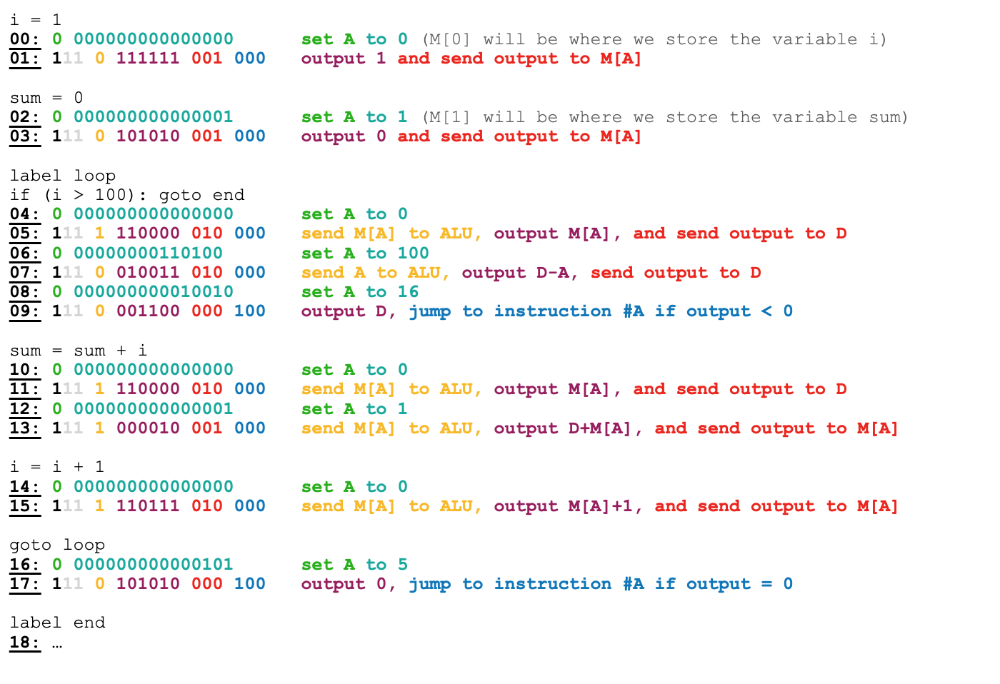

Such a list of instructions is called machine language.

With machine language, we have finally risen from the abyss of hardware to the surface world of software. Having achieved this, all that remains (to [misquote](https://www.goodreads.com/quotes/285-now-at-this-very-moment-i-knew-that-the-united) Winston Churchill) is the proper application of overwhelming abstraction.

### Assemblers & virtual machines

Machine language, though powerful, suffers from a significant flaw: no one wants to write machine language.

Thankfully (these days), practically no one has to.

The first layer we can add on machine language is ditching the ones and zeroes for something marginally more readable, but keeping a one-to-one mapping between statements in our programming language and machine instructions. For example, instead of “0000 0000 0010 1011” to load the contents of memory location 43 into the address register, we write “LOAD 43”, and use a program that converts such statements to the machine language equivalents (if such a program does not exist yet, we have to do it manually).

We can also write programs that let us define variables as stand-ins for memory addresses or data values, and then convert these to the corresponding memory locations for us. A massive benefit for the programmer is also ditching the insistence on one-to-one correspondence between lines and machine instructions. A single statement in a high-level language translates into many machine language instructions.

Programming languages that retain a strong correspondence between statements and the computer’s machine language are termed assembly languages. The program that performs the work of converting an assembly language into machine language is called an assembler.

In general, a program that converts another program written in language A into a version that runs in language B are called compilers. The process of running any program eventually ends with it being compiled, often through many intermediate steps, into machine language.

### Virtual machines

Often, we want our programs to work not just on one processor type and one computer, but on many computers with different processors and hence possibly different underlying instruction sets.

One way to achieve this is to have a specification for a virtual machine (VM). For any language that we want to implement, we write a compiler that converts that language into instructions that the VM can understand. For all computer platforms we need to support, we write a compiler that converts the VM instruction language into the machine language of that computer platform.

This means that whenever we want to add a new programming language, we need to write only one compiler (language -\> VM), rather than having to write separate compilers for every platform (assuming VM -\> platform machine language compilers exist for every platform). The standardised VM specification serves as a station through which all programs on the journey to execution.

(The Java Virtual Machine (JVM) is one famous – or infamous – example of a VM.)

There are two main models for a VM: register-based and stack-based. Nand2Tetris implements a stack-based VM.

A stack is a data structure on which we have two operations: _push_, which adds an element to the top of the stack, and _pop_, which returns and removes the topmost element. We also assume we can implement functions that pop two elements off the stack, add them together, and push the result onto the stack.

The first surprising fact about stacks is that it is possible to compute any arithmetic expression with stacks. _From Nand To Tetris_ gives an example:

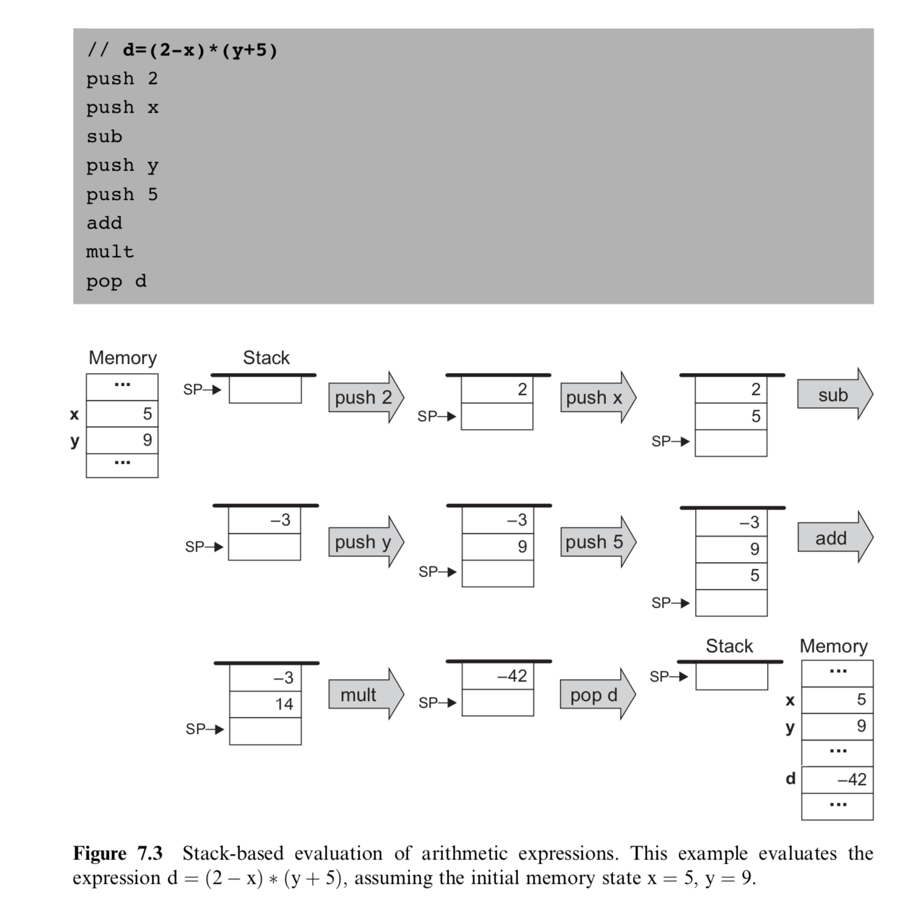

Likewise, we can determine the truth or falsity of logical expressions by implementing, for example, an equal-to function that pops two elements of the stack, pushes “true” to the stack if they’re equal, and pushes “false” otherwise (boolean values may be implemented as false being 0 and true being any other value, for instance).

The second surprising fact about stacks is that it also lends itself naturally to modelling program flow.

Consider what flow control must do. Most simply, the flow must split if we have an if-statement. Even our machine language can handle this with its jump commands.

The trickier part is calling functions. If a program encounters a function call while executing, the program should now switch to running the commands that make up that function, but not before figuring out what the arguments to the function are supposed to be. After the function has finished executing, its value should be returned to the expression that was executing when it was called, and execution should continue where it left off before the function call.

All of this gets more complicated when we consider that the function we call may itself call many different functions and these functions may call the original function yet again, or that some functions may call themselves, and so on. How can we possibly implement such complicated logic with a stack machine?

Consider – what is the natural representation of a nested series of function calls? A stack. We want the ability to add things to the top of the called-function stack when new functions are called (pushing), and removing them from the stack when they finish (popping).

The details of implementing function calling is rather complex. The Nand2Tetris implementation involves maintaining various special memory segments, used for things like function arguments, local variables, and so on, which I will not discuss here.

It should be noted that though VMs are a useful abstraction, they are not strictly necessary and many compilers still work by compiling directly to machine language.

### High-level languages & operating systems

Now that we have our VM, we can start implementing high-level programming languages (ones that are made for humans to write, not computers to execute) on top of it.

The implementation process typically looks like writing a specification for a language and then writing a compiler that translates the new language into VM or machine code that does what the language specification says it should do. Alternatively, we can have an interpreted language, where a lower-level programming language determines the values and effects of statements in the new language on the fly, though this is typically far slower.

Armed with a high-level language, we can now implement an operating system in a reasonable amount of time and without driving the developers crazy (imagine writing 100 000 lines of code for a stack machine, let alone in machine language).

(However, to implement an operating system, it is also important that the programming language is sufficiently low-level that we can deal with hardware with the required finesse.)

The task of an operating system is to provide commonly-needed functions like mathematical operations (in the Nand2Tetris platform, only addition is implemented in hardware, so even multiplication must be implemented in software), string handling, parsing of input from other devices, sending instructions to other devices, and allocating time on the processor. Imagine if the programmer had to specify exactly which pixels on the screen should be black to render the letter ‘a’ – not fun.

We’ve come a long way – and skipped steps here and there for brevity – but now we’re finally ready to implement Tetris.

(Image credit: [xkcd](https://xkcd.com/676/), Randall Munroe)

## Tetris not included

The book’s website has free software for implementing (a software emulation of) [everything](https://www.nand2tetris.org/software) discussed in the book. In theory, this allows the reader to build (an emulation of) the simple computer hierarchy specified in the book, all the way from logic gates to a simple Pong game (in an example of patently criminal false advertising, Tetris is never actually implemented in the book).

In practice, I found the software to be rather slow and finicky to use (it might run better in Windows). Also, if you follow along with the book, you won’t actually build a self-contained computer emulation yourself, but rather go through the implementation level by level, implementing each level yourself but using the pre-built implementation for all levels below. This is a rather trivial difference, but I find it does remove some of the motivation from the project (though I am sure that doing so would still be of enormous educational value).

After deciding to ditch the companion software, I used [Racket](https://racket-lang.org/) (a language in the Lisp family that comes with a very friendly IDE) to write code that emulates logic gates. Once this was no longer sufficient, I followed the book with circuit diagrams for a few more chapters, after which I resorted to just reading (often many times, until things sunk in).

I found the first part of the book to be the most interesting (you may have noticed that my discussion of chips and ALUs was much more in-depth than that of later topics; rest assured that this is my own personal bias rather than the book’s).

The primary value of _From Nand to Tetris_ is that it dispels any sense of magical mystery surrounding the functioning of a computer. After you’ve designed the hardware and implemented a machine language, all that follows is the implementation of ever fancier languages and programs on top of those. If you have decent programming experience, though you may have no idea about the details, it does not require you to suspend much disbelief that such a thing is possible. I read _From Nand to Tetris_ after having already spent a lot of time programming, but having only the most rudimentary understanding of logic gates and no clue what DFFs were; hence the first chapters were eye-opening, and while the later chapters contained a wealth of new information, they weren’t captivating in the same way.

I therefore wholeheartedly recommend _From Nand to Tetris_ for people who have done some programming and want to see how such a miracle can be implemented in hardware in the first place. The first part of the book is remarkably self-contained, assuming no knowledge of electronics (logic gates and DFFs are assumed as primitive objects and the details of their construction not discussed), and though prior exposure to boolean logic is helpful, it is not necessary.

The key point to understand with _From Nand to Tetris_ is that it’s goal is to get you from NAND-gates and DFFs to operating systems and high-level languages as quickly as possible. It almost entirely omits discussion of alternative design decisions, though entirely different architecture possibilities exist on virtually every step of the journey. Optimisation is not discussed. If you want an in-depth understanding of some part of the journey, you are better off reading something else.

If you want to see how some steps are even possible, or to see one complete example of what the entire computer technology stack looks like at a (300-page) glance, then _From Nand to Tetris_ is an impressively complete and concise guide.

If you’re ever stuck on a desert island with nothing but a large supply of NAND-gates and DFFs, electrical wiring, a copy of _From Nand to Tetris_, and a lot of patience, don’t worry – just build a computer and play Tetris to pass the time.

[1]:	https://en.wikipedia.org/wiki/Integer_overflow#Examples
[2]:	https://www.joelonsoftware.com/2002/11/11/the-law-of-leaky-abstractions/
[3]:	https://en.wikipedia.org/wiki/Flip-flops
[4]:	https://www.goodreads.com/quotes/285-now-at-this-very-moment-i-knew-that-the-united
[5]:	https://www.xkcd.com/676/
[6]:	https://www.nand2tetris.org/software
[7]:	https://racket-lang.org/