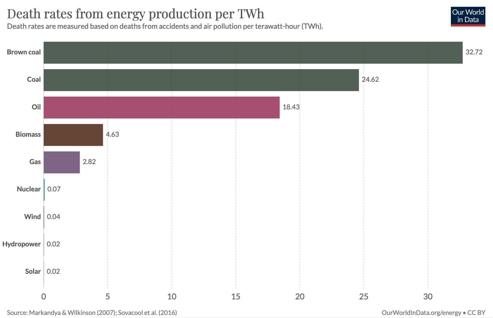
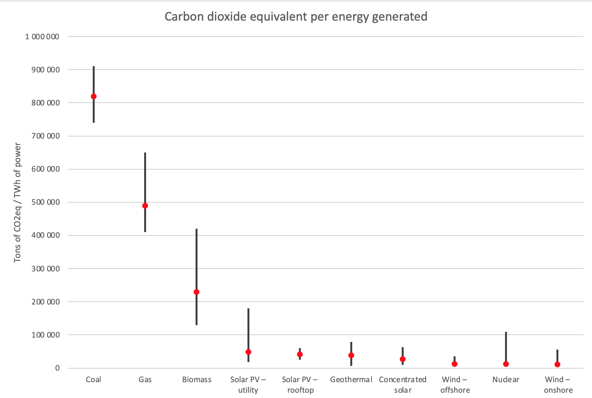
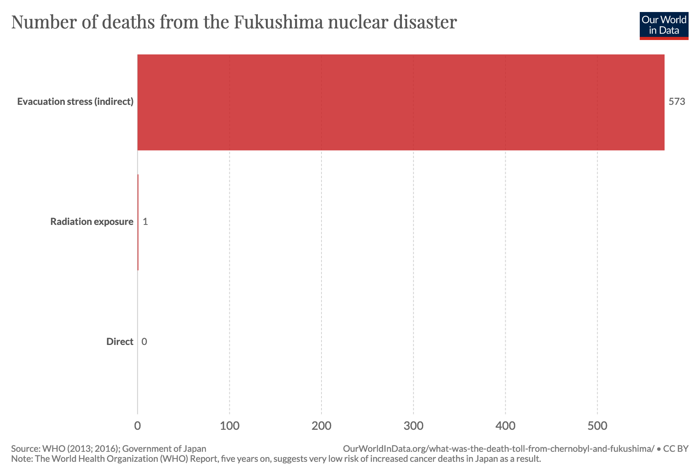
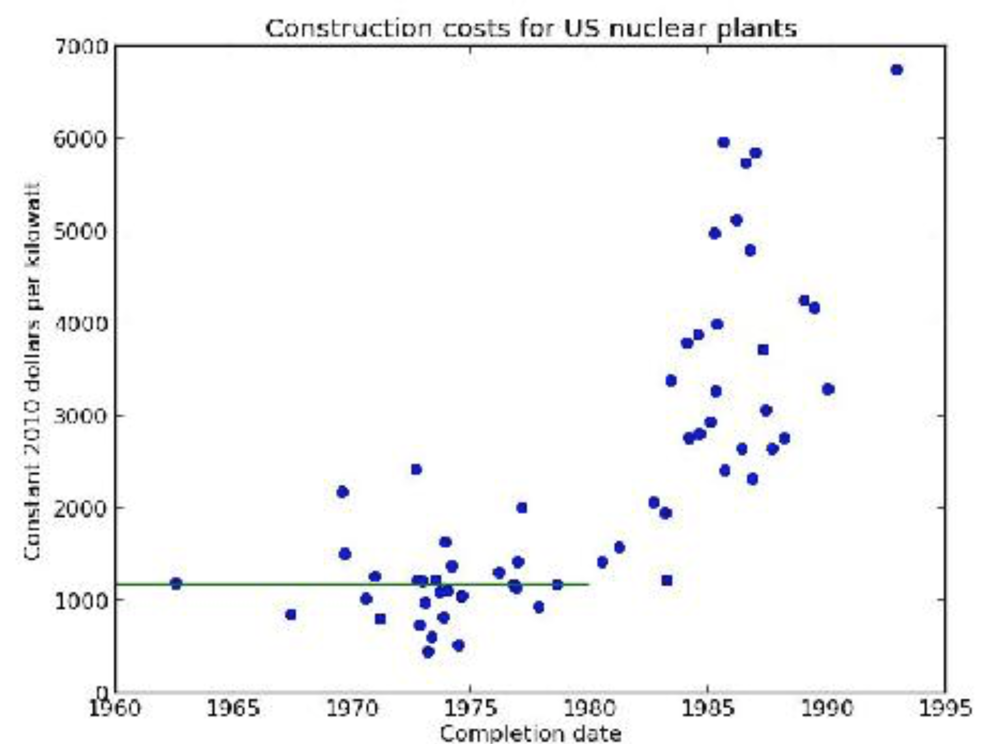

# Nuclear power is good

(Alternative title: burning things is bad)

If you want usable energy, you need to use the forces between particles.

The weakest force is gravity, but if you happen to be near a gigantic amount of material (e.g. the Earth) with an uneven surface that has stuff flowing down it (e.g. water in a river), we can still use it to generate power. This insight gives us hydropower, which delivers about 16% of the world's electricity. The main downside is that because of how weak gravity is, dams have to be large and environmentally disruptive to generate useful power.

Moving to stronger forces, we have chemical interactions between atoms. In the form of burning fossil fuels, rearranging chemical bonds produces 66% of the world's electricity. The main downside is how weak chemical bonds are, and therefore how much matter has to be processed (i.e. burned) to produce energy. A lot of matter means a lot of waste products. Despite decades of work on possible safe waste-management strategies (e.g. carbon capture and storage), we still outrageously keep dumping over thirty billion tons of carbon dioxide into the atmosphere every year, with massive effects on the climate that will potentially last thousands of years, while also producing a long list of other harmful waste products that kill [millions of people](https://ourworldindata.org/air-pollution) per year.

Thankfully, atoms aren't atomic: we can rearrange atoms and get energy densities that blow puny chemistry out of the water. Currently 11% of the world's electricity comes from directly doing this. We're still playing catch up to God, who, in His infinite wisdom, saw it fit to create a universe where just about 100% of energy production is nuclear.

Our nearest God-sanctioned nuclear reactor is the sun. Harnessing the sun's light and heat gives us another 1% of the world's electricity; a slightly more indirect route where we first wait for the sun's heat to stir up the air gives us another 3.5%. An even more indirect route is letting the sun's light fall on plants so that they create chemical bonds that we can burn for power; this gives us another 2%. The most indirect route of all is to use the chemical bonds created by sunlight that fell on extinct plants hundreds of millions of years ago, which is what we're really doing when we burn fossil fuels. So actually it's all nuclear, with the only difference being how many hoops you jump through first.

The current state of nuclear power is that we can harness only fission (splitting atoms) for controlled energy production. Fusion (combining atoms) is potentially an even better technology: it requires less exotic materials, produces less dangerous waste, and is literally star-power. However, it takes extreme energies to get power out of fusion, and the only way we've found how to do that is to blow up a (fission-based) nuclear bomb in a very controlled way that squeezes the stuff we want to fuse to create an even bigger bang. Technically we could use this for power – say, we build a massive underground chamber where we set off hydrogen bombs (the common name for a bomb that uses nuclear fusion) every once in a while to vaporise vast amounts of water into steam and then drive a generator – but let's just say there would be some difficulties. (Though, surprisingly, mostly economic and political ones rather than technical ones – this idea was seriously studied in the 1970s as [Project Pacer.](https://en.wikipedia.org/wiki/Project_PACER))

Controlled fusion power is in the works, but it's the poster child for technologies that are always twenty years away. At the moment scientists are playing around with [lasers that have 25 times the power of the entire world's electricity generation](https://en.wikipedia.org/wiki/National_Ignition_Facility) (though only for a few picoseconds at a time) and [magnets almost strong enough to levitate a frog](https://en.wikipedia.org/wiki/ITER)* to bring it about, but don't expect commercial fusion power in the next decade at least.

(*Levitating a frog takes a field of about 16 Teslas, according to research that won an [Ig Nobel Prize in 2000](https://www.improbable.com/ig-about/winners/#ig2000), compared to ITER's 13 Tesla field.)

Fusion is definitely a technology that we should develop. However, as J. Storrs Hall writes in *Where is my flying car?* (my review [here](https://strataoftheworld.blogspot.com/2021/03/review-where-is-my-flying-car.html)):

> "As a science fiction and technology fan, for most of my life I had been squarely in the “just you wait until we get fusion” camp. Then I was forced to compare the expected advantages fusion would bring to the ones we already had with fission. Fuel costs are already negligible. The process is already clean, with no emissions. Even though the national [US] waste repository at Yucca Mountain has been blocked by activists since it was designated in 1987 and never opened, fission produces so little waste that all our power plants have operated the entire period by basically sweeping it into the back closet."

We have already invented a miracle clean power source. And, surprise surprise, we should really use it.

## The moral case for nuclear power

Every year, [there are almost five million deaths attributable to air pollution](https://ourworldindata.org/grapher/number-of-deaths-by-risk-factor?tab=chart&stackMode=absolute&region=World), a bit less than 1 in 10 of all deaths in the world, or one every six seconds. Since it's a bit tricky to know what counts as an "attributable death" in the case of some risk factor, here's another measure: [almost 150 million years of health-weighted life are lost every year because of air pollution](https://ourworldindata.org/grapher/disease-burden-by-risk-factor). The health effects of air pollution are right up there with the other biggest killers like high blood pressure, smoking, and obesity.

The biggest causes of air pollution are energy generation, traffic, and (especially in poor countries) heating. Getting global averages for power generation deadliness is hard, but doing some very rough estimation, more than one-tenth but less than one-third of air pollution deaths are directly related to power generation, for a total number in the hundreds of thousands per year. Imagine one Chernobyl-scale disaster every day, and you're in the right ballpark.

(There is major disagreement over the actual Chernobyl death toll. When making comparisons in this post, I use the number 4000. About 30 people died directly during the disaster; several thousand may die in the long run according to the best consensus estimates, though if you assume the contested [linear no-threshold model](https://en.wikipedia.org/wiki/Linear_no-threshold_model) (which seems to be the main crux of the debate) you can get numbers in the tens of thousands. If you want to be maximally pessimistic, you can multiply Chernobyl impact comparisons by 10, but you'll find this doesn't materially change the conclusions.)

Which power sources cause these deaths? There's some disagreement over the exact numbers, but [here's](https://ourworldindata.org/grapher/death-rates-from-energy-production-per-twh?tab=chart&time=earliest..latest&region=World) a chart for European energy production from Our World in Data:

(One terawatt-hour (3.6 petajoules) is roughly the annual energy consumption of 20 000 Europeans.)

The chart above has European numbers. In particular for fossil fuel sources, there's a lot of country-specific variation due to environmental regulations and population density: the [paper](https://www.sciencedirect.com/science/article/pii/S0140673607612537?casa_token=r5LmpCZ6G8YAAAAA:aW4wjfZ3PENq0mvbNTLXF27WEkLRuAsE0wGTXSrC1R3OgNLg9a7RdoedMRKZ20sBoUwuClxm#bib32) that the above chart is largely based on mentions 77 deaths/TWh as a reasonable figure for a regulation-compliant Chinese coal plant, while [this article](http://www.forbes.com/sites/jamesconca/2012/06/10/energys-deathprint-a-price-always-paid/) says that 280 deaths/TWh is possible for coal.

Why do solar and wind produce any deaths at all? Both occasionally involve dangerous construction work (rooftop solar / tall wind turbines). In fact, if you look at recent decades (i.e., not including Chernobyl) and use the low-end estimates, solar and wind are deadlier than nuclear.

The estimates for hydropower can also swing a bit depending on whether or not you include the deadliest electricity generation disaster in history: the [1975 Banqiao Dam failure](https://en.wikipedia.org/wiki/1975_Banqiao_Dam_failure), which may have killed hundreds of thousands of people. Since 1965, hydropower has produced about 130 000 TWh; depending on which death toll estimate you believe, Banqiao single-handedly raises the deaths per TWh for hydropower by between 0.2 and 2. Compare this with nuclear power, which has produced about 92 000 TWh over the same timeframe; the long-term death estimates for Chernobyl add 0.04 to the deaths/TWh count for nuclear.

(The total generation numbers are based on the raw data behind [this](https://ourworldindata.org/grapher/modern-renewable-energy-consumption?time=earliest..latest) and [this](https://ourworldindata.org/grapher/nuclear-energy-generation?tab=chart&stackMode=absolute&time=earliest..latest&country=~OWID_WRL&region=World) graph, which you can download from the links. The nuclear number in the above chart is based on [this paper](https://www.sciencedirect.com/science/article/pii/S0140673607612537?casa_token=r5LmpCZ6G8YAAAAA:aW4wjfZ3PENq0mvbNTLXF27WEkLRuAsE0wGTXSrC1R3OgNLg9a7RdoedMRKZ20sBoUwuClxm), which Our World in Data says already includes Chernobyl, though I can't see where they add that in.)

The bottom line is that hydropower accidents are [more common, more deadly, and higher variance](https://en.wikipedia.org/wiki/List_of_hydroelectric_power_station_failures) than nuclear accidents, even though both power sources have produced comparable amounts of energy in recent decades.

Okay, actually that isn't the real bottom line. The real bottom line is this: *when it comes to the human impacts of electricity generation, there are things that involve burning (fossil fuels & biomass), and then there is everything else, and the latter category is much much better*. Also, if you absolutely must burn something, *do not burn coal*.

What has nuclear specifically done so far? [One study](https://pubs.acs.org/doi/abs/10.1021/es3051197?source=cen&) finds that it has saved 1.8 million lives by reducing air pollution, or about 4 years of the world's current malaria death rate.

What could it have done? Until the mid-1970s, the adoption of nuclear power was accelerating. Assume this trend had continued until today, and nuclear had replaced fossil fuels only (an optimistic assumption, but one that doesn't change the numbers much because renewables are a pretty small percentage). Under these assumptions, [one study](https://www.mdpi.com/1996-1073/10/12/2169/htm) estimates that nuclear would now account for over half of the world's energy production, and a total of 9.5 million deaths would have been avoided – as much as if you saved everyone who would otherwise have died of cancer in the past year. Even if nuclear adoption had only been linear, 4.2 million deaths could have been avoided, the same number as saving everyone who has died in war since 1970 (the war deaths number is from the raw data behind [this chart](https://ourworldindata.org/grapher/battle-related-deaths-in-state-based-conflicts-since-1946-by-world-region)).

Therefore: *in terms of the number of lives saved, keeping the nuclear power industry growing would have very likely been at least as good as achieving world peace in 1970.*

Since these numbers are enormous, and involve difficult-to-estimate unknowns, here's something more concrete: Germany's decision in 2011 to get rid of nuclear is costing an average of 1100 lives per year ([working paper](https://www.nber.org/system/files/working_papers/w26598/w26598.pdf); [article](https://grist.org/energy/the-cost-of-germany-going-off-nuclear-power-thousands-of-lives/)).

## The environmental case for nuclear power

Climate change is a big problem, but the scale of it as an environmental problem is better known than the scale of air pollution as a health problem, so I won't go into the statistics on its impact.

Nuclear power is obviously good for the climate. Here's a chart, based on [this](https://www.ipcc.ch/site/assets/uploads/2018/02/ipcc_wg3_ar5_annex-iii.pdf#page=7), which is summarised in a more readable format [here](https://en.wikipedia.org/wiki/Life-cycle_greenhouse_gas_emissions_of_energy_sources#2014_IPCC,_Global_warming_potential_of_selected_electricity_sources):

 

The black bars span the range between the minimum and maximum numbers. The red dot is the median.

I've converted the numbers from the traditional grams of CO2 equivalent per kWh to tons of CO2 equivalent per TWh, to be consistent with the death rates graph above, and for easier conversion to national/international CO2 statistics (which are generally expressed in tons of CO2 – unless its tons of carbon, in which case you divide by the ratio of carbon's mass in CO2, which is 12/44 or about 0.27).

(If you're wondering where hydropower is: it's median is right around concentrated solar, but in some cases, especially in tropical climates, the [reservoirs created by dams can release a lot of methane](https://en.wikipedia.org/wiki/Environmental_impact_of_reservoirs#Greenhouse_gases), making the maximum CO2-equivalent emissions for hydropower over twice as bad as coal and, more importantly, completely ruining my pretty chart.)

So far, the use of nuclear power is estimated to have [reduced cumulative CO2 emissions to date by 64 billion tons](https://blogs.scientificamerican.com/the-curious-wavefunction/nuclear-power-may-have-saved-1-8-million-lives-otherwise-lost-to-fossil-fuels-may-save-up-to-7-million-more/), a bit less than two years of the world's *total* CO2 emissions at current rates. The [same study](https://www.mdpi.com/1996-1073/10/12/2169/htm) linked in the previous section estimates that, had nuclear power grown at a steady linear rate, this number would be doubled, and if the accelerating trend in nuclear power adoption had continued, there would be 174 billion tons less CO2 in the atmosphere. We would have saved more emissions than we would have if we had made every car in the world emission free since 1990.

## The problems

In *Enlightenment Now* (my review [here](http://strataoftheworld.blogspot.com/2018/08/review-enlightenment-now-steven-pinker.html)), Steven Pinker writes:

> "It’s often said that with climate change, those who know the most are the most frightened, but with nuclear power, those who know the most are the least frightened."

So why aren't the arguments against nuclear power enough to frighten those who know about it?

The short version: more nuclear power would save millions of lives from air pollution and be a big help in solving climate change. When these are the benefit, you need a hell of a drawback before the scales start tilting the other way.

The long version:

### Radiation & accidents

(Radiation units are confusing. Activity, straightforwardly defined as the number of atoms that undergo decay per second, is measured in becquerels (Bq). The amount of radiation energy absorbed per kilogram of matter is measured in grays (Gy), which therefore have units of joules per kilogram. Measuring biological effects is harder, because the type of radiation and what tissue it hits both matter. If you adjust for the type of radiation by multiplying the absorbed dose in grays by some factor (scaled so that gamma rays have a factor 1), you get something called [equivalent dose](https://en.wikipedia.org/wiki/Equivalent_dose), which is measured in sieverts (Sv). If you also adjust for which tissue type was hit by multiplying by more estimated factors, you get [effective dose](https://en.wikipedia.org/wiki/Effective_dose_(radiation)), which is also measured in sieverts. If you want to get a sense of scale for radiation dose numbers, [here's a good chart](https://xkcd.com/radiation/) and [here's a good table](https://en.wikipedia.org/wiki/Sievert#Dose_examples).)

In normal operation, a [nuclear power plant produces significantly less radiation than a coal power plant](https://www.scientificamerican.com/article/coal-ash-is-more-radioactive-than-nuclear-waste/) (this is because everything radioactive is contained in a nuclear power plant, while coal power plants pump [fly ash](https://en.wikipedia.org/wiki/Fly_ash) into the air). Neither is a significant dose.

In accidents, nuclear power plants can release insane amounts of radioactivity. Insane amounts of radiation are dangerous. However, the reaction to radiation risks is often out of proportion to the true risk – the Fukushima evacuations are considered excessive in hindsight, as argued in [this study](https://www.sciencedaily.com/releases/2017/11/171120085453.htm), though you probably don't need to make a study to guess it from [this chart](https://ourworldindata.org/grapher/estimated-mortality-from-fukushima-nuclear-disaster):

(In the long run, some more cancer deaths are expected to trickle in.)

It is critically important to remember the above statistics on health effects, and not let yourself be biased by [vivid stories](https://en.wikipedia.org/wiki/Chernobyl_(miniseries)) about horrible individual events. The fear of nuclear accidents is similar to the fear of flying rather than driving: statistically one is much safer, but one is much easier to fear because when things go wrong, it comes in more story-worthy packages.

In particular: it is *not* the case that nuclear power is safer only because accidents are rare and therefore get left out of statistics; nuclear power would be overwhelmingly safer than fossil fuels even if there were a Chernobyl going off every year. As I said above, [hydropower accidents](https://en.wikipedia.org/wiki/List_of_hydroelectric_power_station_failures) are more common, more deadly, and higher variance, so any argument based on disaster risk that bans nuclear would also ban hydropower.

### Nuclear proliferation

Nuclear power is good, but [nuclear weapons are bad](https://strataoftheworld.blogspot.com/2020/04/review-doomsday-machine.html). It would be bad if the spread of civilian nuclear power technology lead to nuclear proliferation. There is some overlap in technology, but neither civilian materials nor technologies automatically lead to weapons. The uranium used in power plants is typically only enriched to 3-5%, compared to more than 85% for weapons-grade uranium and 0.7% in natural uranium (though if you have uranium enrichment infrastructure, you can run it for more cycles than usual and let the enrichment levels slowly creep up – Iran has done this). There are also international agreements that prevent enrichment, and alternative nuclear technologies, like using thorium instead of uranium, with less weapon potential. Finally, a country trying to build nuclear weapons probably won't be stopped by a lack of a civilian industry; consider North Korea.

### Terrorism and war risks

Another risk to consider is that nuclear power plants might be targeted by terrorists, or even by hostile nations, potentially leading to Chernobyl-scale disasters. This is a risk, but it's an acceptable one. Consider what it would mean if "hundreds or thousands of people could be killed if a determined and resourceful hostile actor targeted this piece of infrastructure" were a reason to not build some piece of infrastructure – we'd have to ban skyscrapers, airplanes, dams, water treatment plants, and so forth. Also considering the security that's (rightfully) present at nuclear power plants, it would probably take a 9/11-level of execution to do it, and the observed rate for 9/11-level events over a time interval of length T is, well, 1/T if the interval includes 9/11 and otherwise 0.

It is true that a complex civilisation has a lot of fragile points and someone should be thinking hard about minimising this kind of risk, and that nuclear power plants are a good example because the effects are expensive and long-lasting if an attack is successful. But as an argument against nuclear power, [it proves too much](https://slatestarcodex.com/2013/04/13/proving-too-much/).

### Nuclear waste

Nuclear waste is awkward to deal with, but it's far from the worst sort of industrial waste we deal with – consider the over thirty billion tons of carbon dioxide we've dumped into the atmosphere over the past year, or the various horrible things that coal plants spew out that cause tens to hundreds of Chernobyl-equivalents per year.

Nuclear waste is not some miracle substance that effortlessly seeps everywhere and kills whatever it touches. Until 1993, countries (mostly the USSR and UK), were dumping nuclear waste into the ocean. This is rightly banned these days, but you can observe that we still have oceans; in fact, the [the environmental impacts](https://en.wikipedia.org/wiki/Ocean_disposal_of_radioactive_waste#Environmental_impact) have so far been negligible except for somewhat higher concentrations of some nasty isotopes exactly at the site.

In general, nuclear waste is a serious problem that has to be solved somehow, but solutions exist (currently, Finland's [Onkalo repository](https://en.wikipedia.org/wiki/Onkalo_spent_nuclear_fuel_repository) is the closest to being operational). Though the timescale is long, it is not different in principle from some existing disposal methods for nasty things like mercury and arsenic.

Is it responsible to leave behind dangerous waste for future generations? It's far more responsible than leaving them with the almost astronomical amounts of CO2 emissions that a single kilogram of uranium prevents.

Future people looking back at our century won't despair about a few warm rocks deep underground. They'll despair at all the silent air pollution deaths, at how far we let climate change get, and at how much sooner we could've reached their living standards had we made better use of our technology. Then they'll travel on nuclear-powered airplanes to distant hiking grounds, and tell scare stories around an (artificial!) campfire about the barbarian past when we burned things for energy and piped the waste products straight into the atmosphere.

### Uranium is limited

First, we have [200 years worth of economically accessible uranium reserves](https://www.scientificamerican.com/article/how-long-will-global-uranium-deposits-last/). This is [more than for fossil fuels](https://ourworldindata.org/grapher/years-of-fossil-fuel-reserves-left), with the additional benefit that burning through the remaining uranium won't wreck the climate and kill millions.

Second, we have alternatives to uranium, like thorium.

Thirdly, there are hundreds of times more uranium dissolved in the oceans than there is on land (and this uranium exists in equilibrium, so if you take it out, more will leach out of the seabed to replace it, a fact that might lead a pedant to call nuclear power renewable). Even though the concentrations are tiny, because of the energy density of uranium, at modern reactor efficiencies there's still half a megajoule of usable nuclear energy in the uranium in a single cubic metre of seawater, enough to power the lightbulb in my room for over five hours. As a result, extracting it is a project that is [taken surprisingly seriously, and is surprisingly close to being economically viable](https://www.forbes.com/sites/jamesconca/2016/07/01/uranium-seawater-extraction-makes-nuclear-power-completely-renewable/?sh=1b4b0f19159a), though [some people are very skeptical](http://large.stanford.edu/courses/2017/ph241/jones-j2/docs/epjn150059.pdf).

### Nuclear power is unnatural

Wrong: a few billion years ago [a spontaneous natural nuclear reactor](https://www.scientificamerican.com/article/ancient-nuclear-reactor/) ran for a few hundred thousand years under what is now Gabon.

Using the best estimates for its running time and power output, even if this is the only natural reactor that ever formed, the energy it produced is several times higher than that of all human civilian nuclear power to date (both numbers are in the hundreds of petajoules range). Of sustained nuclear fission energy in our planet's history, more has been natural than artificial.

## Nuclear is overpowered, so where is it?

Nuclear power is an almost overpowered technology. The reason why comes down to physics: an energy source based on nuclear reactions has extreme power density, and, all else being equal, the higher your power density, the less fuel you need, the less waste products you produce, and the cleaner your power plant is overall. Not surprisingly, nuclear power turns out to be – along with solar and wind – the cleanest and safest power source we have.

In [*Where is My Flying Car?*](https://strataoftheworld.blogspot.com/2021/03/review-where-is-my-flying-car.html), J. Storrs Hall gives some vivid facts to demonstrate the power and efficiency of nuclear: a turbine uses more lubricating oil than a nuclear power plant uses uranium, and while the 7.5 TJ of energy a Boeing 747 flight weighs 200 tons and costs a third of a million dollars when delivered as chemical fuel, getting the equivalent energy from nuclear takes 100 *grams* of reactor-grade uranium and costs 10 dollars.

So where is it? The simple reason is that it's either illegal (like in Italy), being phased out (like in Germany), or highly regulated and/or expensive. It wasn't always so:

(Source: *Where is my Flying Car?*, by J. Storrs Hall.)

The above graph shows the price per kilowatt of US nuclear power plants. The green line is the trend line before the Department of Energy was established in 1977. Note also that the Three Mile Island accident was in 1979, and, despite no one being hurt, this was a turning point for the US nuclear industry.

When the price of a technology starts increasing, it's not the natural learning curve of the technology at work. It's a regulatory choice. And while you obviously should regulate nuclear power, we're not doing it right.

J. Storrs Hall explains the cost increases:

> "Nuclear power is probably the clearest case where regulation clobbered the learning curve. Innovation is strongly suppressed when you’re betting a few billion dollars on your ability to get a license to operate the plant. Besides the obvious cost increases due to direct imposition of rules, there was a major side effect of forcing the size of plants up (fewer licenses); fewer plants were built and fewer ideas tried. That also meant a greater cost for transmission (about half the total, according to my itemized bill), since plants are further from the average customer."

There is some hope that the tide is turning. New startups like [NuScale](https://en.wikipedia.org/wiki/NuScale_Power) are working on small modular reactors that might greatly reduce prices. Of course, in addition to difficulties with funding, and, well, the not-so-easy task of building a literal nuclear reactor, they've spent years jumping through regulatory hurdles and are not expected to produce power until 2029. So-called fourth-generation reactors are also being worked on, and there's always the hope we eventually get fusion.

But we're not going to get the benefits of cheap and plentiful nuclear power unless we stop treating it like it's the Antichrist.

Hall, never one to pass up the opportunity for a dramatic touch, quotes John Steinbeck's *The Grapes of Wrath* to sum up the sadness of our attitude to nuclear power:

> “And men with hoses squirt kerosene on the oranges, and they are angry at the crime, angry at the people who have come to take the fruit. A million people hungry, needing the fruit—and kerosene sprayed over the golden mountains.
>
> [...]
>
> There is a crime here that goes beyond denunciation. There is a sorrow here that weeping cannot symbolize. There is a failure here that topples all our success. The fertile earth, the straight tree rows, the sturdy trunks, and the ripe fruit. And children dying of pellagra must die because a profit cannot be taken from an orange. And coroners must fill in the certificate—died of malnutrition—because the food must rot, must be forced to rot.”

More generally, [human civilisation need to get better at making decisions about technology](https://strataoftheworld.blogspot.com/2021/03/technological-progress.html). We shouldn't deny ourselves safe clean energy, but we should start working on mitigating the harms from actually scary technologies, like nuclear weapons, and make sure that new technologies like biotech and AI are used safely. Oh, and have I mentioned that burning things is bad for climate and health, and we should stop doing it?

## A metaphor

I mentioned earlier that nuclear power and fossil fuels are like flying and driving. One of them is obviously safer, but the other seems scarier because the lizard-derived part of our brains can't multiply. Objecting to nuclear power on safety grounds but tolerating fossil fuels is like texting about how scared you are to board a plane while driving yourself to the airport. Let's make this metaphor more concrete, and hopefully create a memorable image.

The world consumes about 20 000 TWh per year as electricity (about one-eight of total energy use – lots is used directly for transportation and heat). Let's compare this to making a drive across Europe that starts in Lisbon and ends in Tallinn. Each kilometre we travel represents a bit less than 5 TWh of energy towards our 20 000 TWh goal. Let's say walking is wind/solar/geothermal, biking is hydropower, flying is nuclear, and driving is fossil fuels.

(The numbers for fossil fuel related deaths below are significant underestimates of the global average, because, like the chart above, they're based on the European data in [this study](https://www.sciencedirect.com/science/article/pii/S0140673607612537?casa_token=r5LmpCZ6G8YAAAAA:aW4wjfZ3PENq0mvbNTLXF27WEkLRuAsE0wGTXSrC1R3OgNLg9a7RdoedMRKZ20sBoUwuClxm#bib32). Regulations are looser and population densities higher in many developing countries that make up most of the world's air pollution deaths. I was not able to find a good estimate of the global average, and besides, these numbers are terrifying enough as they are.)

First we walk some 450 km, ending north-west of Madrid, and then bike 650 km, just barely taking us into France. We're a bit careless and somehow we've manage to shove a hundred people off wind turbines along the way. Oops.

By this point we're getting tired of walking and biking, but thankfully there's a flight to Paris. The pilot has a bad day and lands on top of a crowd, flattening another hundred people.

We really hate flying, so we refuse all the other offers that the airline companies try to sell us. Instead we step out of the Paris airport, rent a car, and start carelessly careening down the remaining 2600 km.

Gas takes us approximately to Berlin, a distance of about 1000 km. During this entire distance we run over a pedestrian at every block (roughly 1 per 80 metres), killing some 10 000 people in total.

We're in a real hurry to get to Poland, where the traffic rules get even more lenient and we can start [burning coal](https://www.independent.co.uk/climate-change/news/climate-change-poland-cop24-coal-air-pollution-global-warming-fossil-fuels-a8672481.html). The final leg of the journey from Berlin to the Polish border is powered by oil and isn't long, but still results in as many lethal hit-and-runs as the entire journey before it.

At the Polish border, we reach coal. From this point on, we text about the dangers of nuclear waste as we mow down one pedestrian every 8 metres for the entire rest of the [coal-powered trip to Estonia](https://en.wikipedia.org/wiki/Narva_Power_Plants). Driving at a reckless 120 km/h whatever road we're on, we go through about four a second – you'll hear a rapid thwack-thwack-thwack-thwack noise as the bodies hit the windshield and bounce off – but it still takes 13 hours to make the trip. By the time we reach the Lithuanian border, the bodies of our victims, packed as tightly as possible, fill four Olympic swimming pools. Each of the three Baltic countries we drive through before reaching Tallinn fills another one.

Oh, and also every kilometre driven in our car had fifty times the environmental impact of flying.

Thank god we didn't fly: imagine how horrible it would be if another pilot had had a bad day.

The world makes this trip every year to meet our growing energy needs. We're getting fitter and walking a bit longer every year, as we should. But whenever someone suggests flying instead of driving, our collective response is: "What?! But that's so risky!"

Let's fly.

