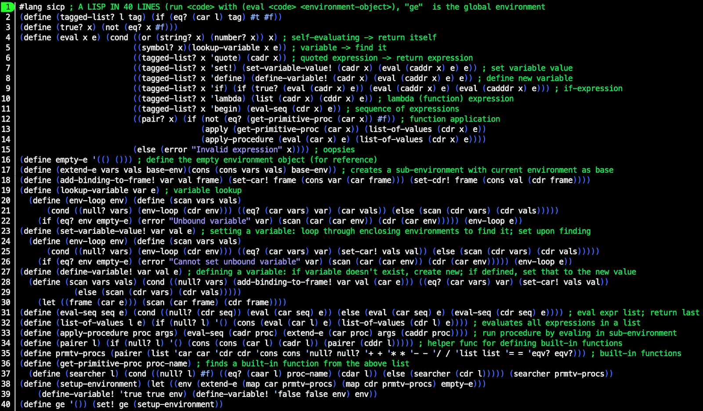

# Structure and Interpretation of Computer Programs

Spend enough time searching for good programming books on the internet, and you are bound to run into _Structure and Interpretation of Computer Programs_. Many regard it as the bible of programming. For good reason, as it turns out.

## Beware the wizards

Above: The Wizard Book. Credit: MIT Press

SICP is sometimes called the “Wizard Book”, because there’s a wizard on the cover (if your job is making an interesting cover for a programming book, what would _you_ do?). However, this does not mean that the book has anything to do with –

> “[L]earning to program is considerably less dangerous than learning sorcery, because the spirits we deal with are conveniently contained in a secure way.”

Um. Okay, I rest my case. Proceed with caution.

## Contrarian SICP

For most subjects there is a standard way to present it that most books, lectures, etc. will follow.

For programming, the standard way seems to be to take some “mainstream” language, show how to print “Hello, World!” onto the screen, then start introducing things like assigning values to variables, conditionals, and so on. Pretty soon you can be doing some pretty impressive things.

SICP does not follow this route.

## Why Lisp?

The first thing that might strike you about SICP is that the programming language of choice is Scheme, a dialect of Lisp (short for “LISt Processor”), which is commonly known as that obscure language invented in 1958 that wears down the parentheses keys on your keyboard.

Above: comic by Randall Munroe of xkcd. Original can be found [here](https://xkcd.com/297/)

However, the authors are not just being contrarian here; there are many good arguments for using Lisp in a book like this.

First, Lisp is the closest a programming language can get to having no syntax. You don’t have to learn where curly brackets are used, or which operators/functions follow which type of syntax, or a multitude of special characters that perform arcane pointer logic (I’m looking at you, C++).

If you have an expression in parentheses, the first thing inside the parentheses is the name of the function that is being called. Everything after it is an argument to be passed to that function. Something not in parentheses represents either just itself (e.g. a string, number, or boolean), or is the name of a variable that in turn represents something.

For example: `(+ 1 (* 2 3) var)` evaluates to the sum of the  numbers 1, the product of 2 and 3, and whichever number the variable `var` has been set to.

Now you know approximately 90% of Lisp syntax (there’s also a few other things, like a special syntax that stands in for an unnamed function, and some shortcuts for things you’d otherwise have to type out repeatedly).

If you follow along with SICP, Lisp is self-explanatory.

The second point in favour of Lisp follows immediately from the first: the near-absence of syntax means you don’t have to think about it. Once you get used to it, writing in Lisp feels almost like transcribing pure thought into code.

When a language implements various special syntaxes, it generally privileges certain design patterns and ways of thinking; if for-loops are unavoidable, the programmer will think in for-loops. A near-absence of syntax means neutrality. Some might call it blandness; fair enough, but Lisp’s blandness is very powerful when used right. It makes it a very useful language for a book like SICP, which tries to teach you (for example) many different ways of abstracting data, rather than the one that is made most convenient by a language’s syntax.

The third point in favour of Lisp is that what little syntax it has was chosen carefully, namely in such a way that Lisp code is also Lisp data. The example function call `(+ 1 (* 2 3) var)` given above is just a list of the elements `+`, `1`, the list of the elements 2 and 3, and `var`. This means that it’s very easy to write Lisp code that operates on Lisp code, something that comes in handy when SICP walks through the operation of a Lisp interpreter (in more practical situations, it also enables Lisp’s powerful macro system). To put it another way, introspection is easier in Lisp than other languages.

Finally, as the (perhaps biased) authors write: “Above and beyond these considerations, programming in Lisp is great fun.”

## Executable math

Once you’ve gotten over all the parentheses, the second thing you’ll notice about SICP is the order in which topics are presented.

The first chapter is entirely devoted to creating abstractions by defining functions. Only function (and variable) definition and function calling are used – no mention is made of data structures or changing the values of variables.

If you think it’s impossible to do anything interesting by just calling functions, you are wrong, and SICP will prove it.

The chapter runs through the very basics of function application, variable definitions, and the substitution model of how to apply functions (this last point will latter be amended). It discusses iterative and recursive processes, and how iterative processes can be described by recursive functions.

A lot of the things you can do by just calling function are quite math-y. SICP does not shy away from this: Newton’s method for square roots, numerical integration, and finding fixed points of (mathematical) functions are prominent examples. No prior knowledge about the math is assumed, but this may still put off many readers because it’s abstract and not directly relevant to most real-world problems. “Executable math” is a pretty good summary of what most of this chapter is about.

However, the chapter really is striking. Using just one type of abstraction (defining functions) and not too many pages, SICP scales from the very basics to solving fairly involved problems with techniques, like extensive use of higher-order functions, that would be left for much later in a more conventional work.

## Finally: data!

Only in the second chapter does SICP turn to data structures. Once again the format is the same: introduce exactly one type of abstraction, and systematically introduce examples of how it’s useful and what can be done with it.

The basic Lisp data structure is creating cells that link together two values. The primitive function for this is `cons`. If we want to chain together many values, for instance to create a list of the elements 1, 2, and 3, we can do this with `(cons 1 (cons 2 (cons 3 null)))` (of course, there’s also a function – `list` – that creates lists like this automatically ). 

Additionally, Lisp provides primitive functions for accessing the first and second element in a `cons` cell. For historical reasons, these functions are called `car` (returns the first element) and `cdr` (returns the second element). This means that the `cdr` of a list defined in the same way as above would be all but the first element of the list.

But what is data? Or do we even care? After all, all that interests us about `cons`,`car`, and `cdr` is that if we define, say, `x` as `(cons 1 2)`, then `(car x)` should be 1 and `(cdr x)` should be 2.

One clever way of implementing this – and one that will likely seem both weird and ingenious the first time you see it – is the following:

	(define (cons x1 x2) ; define cons as a function on two inputs
	  (define (dispatch n) ; define a function inside cons
	    (if (= n 1)
	      x1  ; return x1 if n = 1
	      x2)) ; else, return x2
	  dispatch) ; the cons function returns the dispatch function

	(define (car x)
	  (x 1))

	(define (cdr x)
	  (x 2))

What’s happening is this: `cons` returns the function `dispatch`. Let’s say `x` is a `cons` cell that we have made with `cons`, consisting of the elements `x1` and `x2`.

Now we’ve defined the `car` of `x` to be whatever you get when you call the function `x` with 1 as the argument. `x` is what the `cons` function returned, in other words the `dispatch` function, and when we call that with 1 as the argument, it will return `x1`. Likewise, when we call `x` with the argument 2, the `dispatch` function that `x` represents will return `x2`. We have satisfied all the properties that we wanted `cons`, `car`, and `cdr` to have.

Is this how any reasonable Lisp implementation actually works? No.

(If you’re confused about the previous example: note that we’ve snuck in an assumption about how variable scoping works in functions. When the `dispatch` function is created inside the `cons` function, the variables `x1` and `x2` are obviously bound to whatever values we inputted into `cons`. What’s not obvious is that `dispatch` can access these values when it’s called later – after all, `x1` and `x2` were local variables for a function call that will have ended by then (and the `cons` function might have been called many times, meaning many `x1`s and `x2`s). However, in Lisp the environment at the time a function is called is bound to that function. When that function is called again, any local variables like `x1` and `x2` present in a parent function in which that function was defined will remain accessible. This type of thing is called a closure.)

Mutability (changing variable values after they’ve been defined) is only introduced in the third chapter; up until then, the book focuses purely on functional programming.

The third chapter is the culmination of the first half of the book: now that functions, data abstraction, and mutability have all been discussed, the authors introduce many examples of the structures that are now possible.

## The _what_ evaluator?

SICP walks the reader through the process of writing a Lisp evaluator in Lisp, something that is called a “metacircular evaluator”. 

Writing a Lisp evaluator in Lisp might seem pointless, but remember that a programming language, especially one like Lisp, is just as much a language for setting down our thoughts about procedures as it is something to be executed by computers. A Lisp-to-Lisp interpreter has the advantage that it is one of the simplest interpreters that it is possible to write. Interpreters for Lisp benefit greatly from the simplicity of Lisp’s syntax, while interpreters written in Lisp benefit from the expressiveness and flexibility of the language. Thus, with our Lisp-to-Lisp interpreter, the essence of an evaluator is laid about as barely before our eyes as it can be.

Above: If you’re willing to forget about code readability and leave out some syntactic sugar like `cond` expressions, you can literally behold the metacircular evaluator at a glance. (Note the `#lang sicp` line  – DrRacket has a package that implements the exact version of Scheme (a dialect of Lisp) used in SICP.)

The authors write:

> “It is no exaggeration to regard this as the most fundamental idea in programming: 

> ‘The evaluator, which determines the meaning of expressions in a programming language, is just another program.’ 

> To appreciate this point is to change our images of ourselves as programmers. We come to see ourselves as designers of languages, rather than only users of languages designed by others.” 

After presenting the metacircular evaluator (and an optimisation), the authors go on to discuss three “variations on a *Scheme*” (haha …):

1. Making the evaluator lazier. More precisely, delaying the evaluation of an expression until it is needed (“lazy evaluation”). This allows, for example, the convenient representation of infinite lists (“streams”), and more flexibility in creating new conditionals.

2. Non-deterministic computing, in which the language has built-in capabilities to handle statements like “pick one of these three items”, or “search through these options until some permutation matches this condition”. With such a language, some logic puzzles can be solved by simply stating the requirements and pressing enter.

3. A logic programming language, which can process queries about data.

Programming often involves wanting to do something, and then taking that task and “building down” to the demands of whatever programming language is used. A powerful alternative method is to also build up the language to customise it for the needs of the task at hand. The boundary between language and program blurs.

It’s almost as if … 

> “The evaluator, which determines the meaning of expressions in a programming language, is just another program.”

## What do we say to compilers? Not today

There’s a fifth chapter to SICP, in which a register machine simulator is constructed, and then used to implement – surprise surprise – a Lisp compiler.

In a way, this completes the loop: the first three chapters show what kinds of things various programming abstractions allow, the fourth shows how these abstractions can be used to implement themselves, and the fifth looks “under the hood” of Lisp itself to consider how it can be implemented with elements simpler than itself. Of course, the question of how the simpler register machine itself can be implemented is left unanswered, but this is already starting to brings us into the realm of hardware, for which another book (ADD LINK: NAND2TETRIS REVIEW) might be better suited.

For the first four chapters I did perhaps half of the exercises; for the last, I just read the main text. The chapter feels more theoretical than the previous ones. Even though the Lisp-to-Lisp evaluator of the fourth chapter is purely academic, I found it more interesting (and also more practical, since I recently wrote an interpreter for a project) than the construction of a compiler from simulated versions of very restrictive components. Hopefully I will return to the chapter at a later point, but for now a more thorough reading will have to wait.

## First Principles of Computer Programming

SICP is a rather unconventional programming book. I think this is largely because the authors seem to have started from first principles and asked “what should a good book on deep principles in high-level programming languages look like?”, rather than making all the safest choices.

Therefore, Lisp.

Therefore, presenting one element at a time (functions, data abstraction, mutability) with care and depth, rather than the (admittedly faster and more practical) approach of introducing all the simplest things first.

Therefore, spending a lot of time hammering in the point that what evaluates and/or compiles your program is just another program.
SICP is not about showing you the fastest route to making an app. Unless you’re of a theoretical bent, it might not even be a particularly good introduction to programming in general (on the other hand, on several occasions I was slowed down by prior misconceptions; those with a fresher perspective may avoid some difficulties).
However, it excels as a deep dive into the principles of programming. Especially if you have experience with programming but haven't yet read a systematic treatment of the topic, SICP will be invaluable in straightening out and unifying many concepts.

## Links & resources

- SICP is available for free online in a variety of formats:
	- [MIT’s official web version and other SICP stuff](https://mitpress.mit.edu/sites/default/files/sicp/index.html)
	- PDF and EPUB conversions are available [here](https://github.com/sarabander/sicp)
- The SICP lectures are also available for free on YouTube [here](https://www.youtube.com/watch?v=-J_xL4IGhJA&list=PLE18841CABEA24090)

I’m not aware of an official SICP solution set, but you will find many on the internet. [This](http://community.schemewiki.org/?sicp-solutions) seems to be the most complete, often featuring many solutions to a given exercise. 

### How to Design Programs: an alternative book

A similar, first-principles-driven, Lisp-based book on programming called _How to Design Programs_ (HTDP) also exists (though I have not read it). This book was consciously designed to emulate SICP in the good while fixing the bad, particularly in the context of being used as an introduction to programming (the authors of HTDP have written an article called _The Structure and Interpretation of the Computer Science Curriculum_ in which they summarise their case [here](https://www2.ccs.neu.edu/racket/pubs/jfp2004-fffk.pdf)).

Incredibly, HTDP is also available available for free online [here](https://htdp.org/2003-09-26/). Either MIT Press has been overrun by communists, or the people who write good programming books are far more charitable than the average textbook writer.

[1]:	https://mitpress.mit.edu/sites/default/files/sicp/index.html
[2]:	https://github.com/sarabander/sicp
[3]:	https://www.youtube.com/watch?v=-J_xL4IGhJA&list=PLE18841CABEA24090
[4]:	http://community.schemewiki.org/?sicp-solutions
[5]:	https://www2.ccs.neu.edu/racket/pubs/jfp2004-fffk.pdf
[6]:	https://htdp.org/2003-09-26/