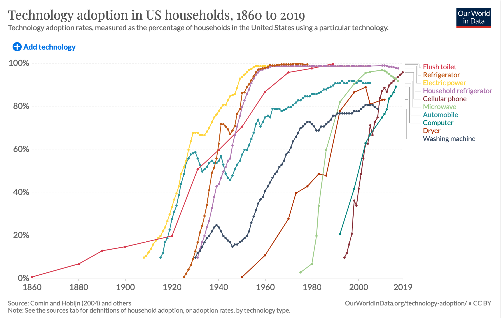
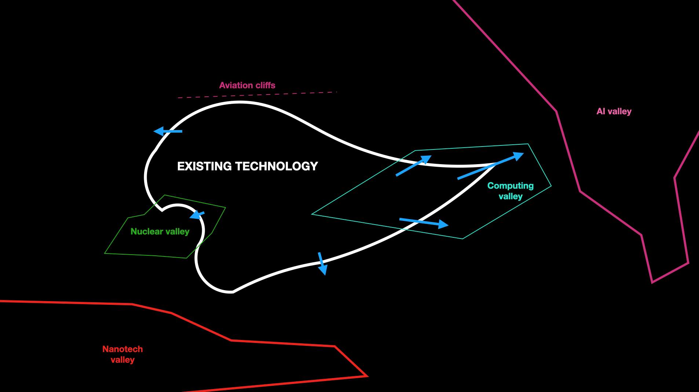
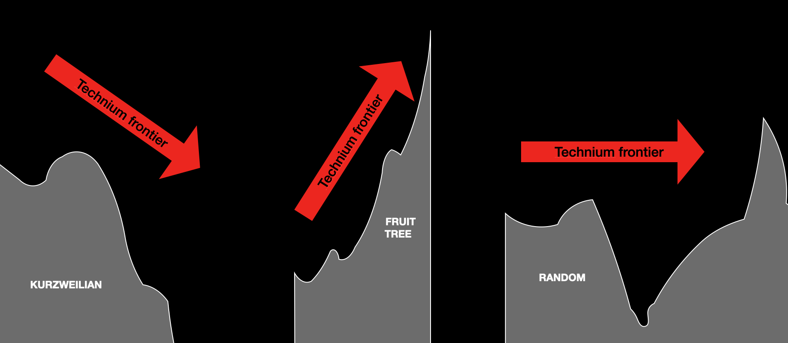
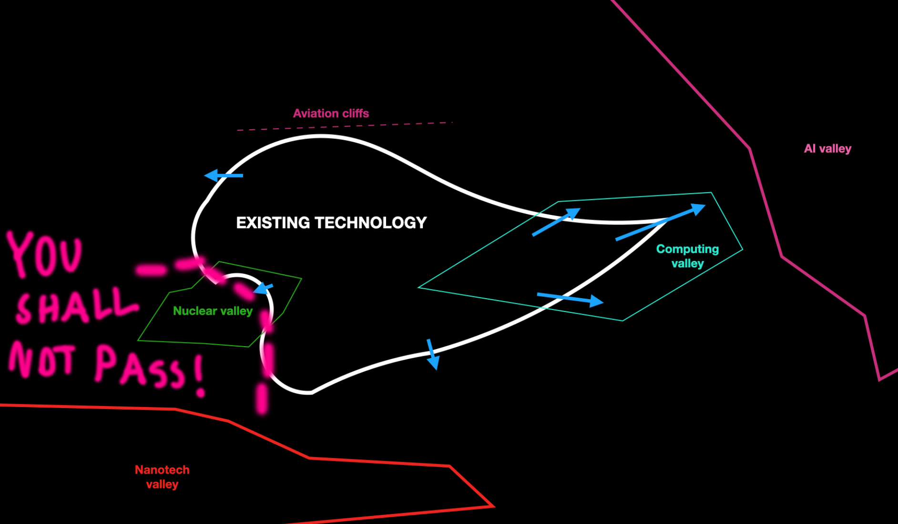

# Technological progress

In this post, I've collected some thoughts on:

- why technological progress probably matters more than you'd immediately expect;
- what models we might try to fit to technological progress;
- whether technological progress is stagnating; and
- what we should hope future technological progress to look like.

## Technological progress matters

The most obvious reason why technological progress matters is that it is the cause for the increase in human welfare after the industrial revolution, which, in moral terms at least, is the most important thing that's ever happened. ["Everything was awful for a long time, and then the industrial revolution happened"](http://lukemuehlhauser.com/three-wild-speculations-from-amateur-quantitative-macrohistory/) isn't a bad summary of history. It's tempting to think that technology was just one factor working with many others, like changing politics and moral values, but there are strong cases to be made that a changed technological environment, and [the economic growth it enabled](https://strataoftheworld.blogspot.com/2019/09/growth-and-civilisation.html), were [the reasons for political and moral changes in the industrial era](http://strataoftheworld.blogspot.com/2020/12/review-foragers-farmers-and-fossil-fuels.html). Given this history, we should expect that more technological progress will be important for increasing human welfare in the future too (though not enough on its own – see below). This applies both to people in developed countries – we are not at [utopia](https://nickbostrom.com/utopia.html) yet, after all – as well as those in developing countries, who are already seeing vast benefits from information technology making development cheaper, and would especially benefit from decreases in the price of sustainable energy generation.

Then there are more subtle reasons to think that technological progress doesn't get the attention it deserves.

First, it works over long time horizons, so it is especially subject to all the kinds of short-termism that plague human decision-making.

Secondly, lost progress isn't visible: if the Internet hadn't been invented, very few would realise what they're missing out on, but try taking it away now and you might well spark a war. This means that stopping technological progress is politically cheap, because likely no one will realise the cost of what you've done.

Finally, making the right decisions about technology is going to decide whether or not the future is good. Debates about technology often become debates about whether we should be pessimistic or optimistic about the impacts of future technology. This is rarely a useful framing, because the only direct impact of technology is to let us make more changes to the world. Technology shouldn't be understood as a force automatically pulling the distribution of future outcomes in a good or bad direction, but as a force that *blows up the distribution* so that it spans all the way from an engineered super-pandemic that kills off humanity ten years from now to an interstellar civilisation of trillions of happy people that lasts until the stars burn down. Where on this distribution we end up on depends in large part on the decisions we collectively make about technology. So, how about we get those decisions right?

But first, how should we even think about technological progress?

## Modelling technological progress

Some people think [that technological progress is stagnating relative to historical trends, and that, for example, we should have flying cars by now](https://strataoftheworld.blogspot.com/2021/03/review-where-is-my-flying-car.html). To be able to answer this question, we need some model of what technological progress should be like. I can think of three general ones.

The first one I'll name the Kurzweilian model, after futurist [Ray Kurzweil](https://en.wikipedia.org/wiki/Ray_Kurzweil#The_Law_of_Accelerating_Returns), who's made a big deal about how [the intuitive linear model of technological progress is wrong, and history instead shows technological progress is exponential](https://www.kurzweilai.net/the-law-of-accelerating-returns) – the larger your technological base, the easier it is to invent new technologies, and hence a graph of anything tech-related should be a hockey-stick curve shooting into the sky.

The second I'll call the fruit tree model, after the metaphor that once the "low-hanging fruit" are picked off, progress gets harder. The strongest case for this model is in science; the physics discoveries you can make by watching apples fall down have (very likely) long since been picked off. However, it's not clear similar arguments should apply to technology. Perhaps we can model inventing a technology as finding a clever way to combine a number of already known parts into a new thing, and hence the number of possible inventions as would be an increasing function of the number of things already invented, since this gives more combinations. For example, even if progress in pure aviation is slow, when we invent new things like lightweight computers we can combine the two to get drones. I haven't seen anyone propose a model to explain why the fruit tree model makes sense for technology in particular.

The third model is that technological change is mostly random. Any particular technological base satisfies the prerequisites for some set of inventions. Once invented, a new technology goes through an S-curve of increasing adoption and development, before reaching widespread adoption and a mature form. Sometimes there are many inventions just within reach, and you get an innovation burst, like the mid-20th century one when television, cars, passenger aircraft, nuclear weapons, birth control pills, and rocketry are all simultaneously going through the rapid improvement and adoption phase. Sometimes there are no plausible big inventions for very long periods of time, for example in medieval times. 

Here's an Our World in Data graph ([source and interactive version here](https://ourworldindata.org/grapher/technology-adoption-by-households-in-the-united-states?tab=chart&stackMode=absolute&country=Automobile~Cellular%20phone~Computer~Dryer~Electric%20power~Flush%20toilet~Household%20refrigerator~Microwave~Refrigerator~Washing%20machine&region=World)) showing more-or-less-S-curves for the adoption of a bunch of technologies:

(One can try to imagine an even more general model to unify the three models above, though we're getting to fairly extreme abstraction levels. Nevertheless, for the fun of it: let's model each technology as a set of prerequisite technologies, and assume there's a subset of technology-space that makes up the sensible technologies, and some cost function that describes how hard it is to go from a set of technologies to a given new technology (so infinity if all prerequisites of the new one aren't contained in the known set). Then slow progress would be modelled as the set of sensible ideas and the cost function being such that from any particular set of known technologies, there are only a few sensible ideas with prerequisites only in the known set, and these have high costs. Fast progress is the opposite. In the Kurzweilian model, the subspace of sensible ideas is in some sense uniform, so that the fraction of the $2^{|K|}$ possible prerequisite combinations for a known technology set $K$ that are contained within the sensible set does not go down with the cardinality of $K$, and also we require the cost function to not increase too rapidly as the complexity of the technologies grow. In the fruit tree model, the cost function increases, and possibly the frequency of sensible technologies becomes sparser as you get into the more complex parts of technology-space. In the random model, the cost function has no trend, and a lot of the advancements happen when a "key technology" is discovered that is the last unknown prerequisite for a lot of sensible technologies in technology-space.)

(Question: has anyone drawn up a dependency tree of technologies across many industries (or even one large one), or some other database where each technology is linked to a set of prerequisites? That would be an incredible dataset to explore.)

In [*Where is my Flying Car?*](https://strataoftheworld.blogspot.com/2021/03/review-where-is-my-flying-car.html), J. Storrs Hall introduces his own abstraction of a civilisation's technology base that he calls the "technium": imagine some high-dimensional space representing possible technologies, and imagine a blob in this space representing existing technology. This blob expands as our technological base expands, but not uniformly: imagine some gradient in this space representing how hard it is to make progress in a given direction from a particular point, which you can visualise as a "terrain" which the technium has to move along as it expands. Some parts of the terrain are steep: for example, given technology that lets you make economical passenger airplanes moving at near the speed of sound, it takes a lot to progress beyond that because crossing the speed of sound is difficult. Hence the "aviation cliffs" in the image below; the technium is pressing against it, but progress will be slow:

In other cases, there are valleys, where once the technium gets a toehold in it, progress is fast and the boundaries of what's possible gush forwards like a river breaking a dam. The best example is probably computing: figure out how to make transistors smaller and smaller, and suddenly a lot of possibilities open up.

We can visualise the three models above in terms of what we'd expect the terrain to look like as the technium expands further and further:

In the Kurzweilian model, the terrain gets easier and easier the further out you go; in the fruit tree it's the opposite; if there is no pattern, then we should expect cliffs and valleys and everything in between, with no predictable trend.

Hall comes out in favour of what I've called the random model, even going as far as to speculate that the valleys might follow a [Zipf's law](https://en.wikipedia.org/wiki/Zipf%27s_law) distribution. He concisely summarises the major valleys of the past and future:

> "The three main phases of technology that drove the Industrial Revolution were first low-pressure steam engines, then machine tools, and then high-pressure engines enabled by the precision that the machine tools made possible. High-pressure steam had the power-to-weight ratios that allowed for engines in vehicles, notably locomotives and steamships. The three major, interacting, and mutually accelerating technologies in the twenty-first century are likely to be nuclear, nanotech (biotech is the “low-pressure steam” of nanotech), and AI, coming together in a synergy I have taken to calling the Second Atomic Age."

Personally, my views have shifted away from somewhat Kurzweilian ones and towards the random model, with the main factors being that the technological stagnation debate has made me less certain that the historical data fits a Kurzweilian trend, and that since there are no clear answers to whether there is a general pattern, it's sensible to shift the distribution of my beliefs towards the model that doesn't require assuming the truth of a general pattern. However, given some huge valleys that seem to be out there – AI is the obvious one, but also nanotechnology, which might bring physical technology to Moore's law -like growth rates – it is possible that the difference between the Kurzweilian and random model looks largely academic in the next century.

## Is technology stagnating?

Now that we have some idea of how to think about technological progress, we are better placed to answer the question of whether it has stagnated: if the fruit tree model is true we should expect a slowdown, whereas if the extreme Kurzweilian model is true, a single trend line that's not going to break past the top of the figure in the next decade is a failure. Even so, this question is very confusing; economists debate about total factor productivity (a debate I will stay out of), and in general it's hard to know what could have been.

However, it does seem true that compared to the mid-20th century, the post-1970 era has seen breakthroughs in fewer categories of innovation. Consider:

- 1920-1970:
  - cars
  - radio
  - television
  - antibiotics
  - the green revolution
  - nuclear power
  - passenger aviation
  - chemical space travel
  - effective birth control
  - radar
  - lasers
- 1970-2020:
  - personal computers
  - mobile phones
  - GPS
  - DNA sequencing
  - CRISPR
  - mRNA vaccines

Of course, it's hard to compare inventions and put them in categories – is lumping everything computing-related as largely the same thing really fair? – but [some people are persuaded by such arguments](https://rootsofprogress.org/technological-stagnation), and a general lack of big breakthroughs in big physical technologies does seem true. (Though might soon change, since the clean energy, biotech, and space industries are making rapid progress.)

Why is this? If we accept the fruit tree model, there's nothing to be explained. If we accept the random one, we can explain it as a fluke of the shape of the idea space terrain that the technium is currently pressing into. To quote Hall again:

>  "The default [explanation for technological stagnation] seems to have been that the technium has, since the 70s, been expanding across a barren high desert, except for the fertile valley of information technology. I began this investigation believing that to be a likely explanation."

This, I think, is a pretty common view, and is a sensible null hypothesis for the lack of other evidence. We can also imagine variations, like the existence of a huge valley in the form of computing drawing all the talent that would otherwise have gone into pushing the technium forwards in other places. However, Hall rather dramatically concludes that this

> "[...] is wrong. As the technium expanded, we have passed many fertile Gardens of Eden, but there has always been an angel with a flaming sword guarding against our access in the name of some religion or social movement, or simply bureaucracies barring entry in the name of safety or, most insanely, not allowing people to make money."

Is this ever actually the case? I think there is a case where a feasible (and economic, environmental, and health-improving) technology has been blocked: nuclear power. We should therefore amend our model of the technium: not only does it have to contend with the cliffs inherent in the terrain, but sometimes someone comes along and builds a big fat wall on the border, preventing either development, deployment, or both.

In diagram form:

Are there other cases? Yes – GMOs, as I discuss in [this review](http://strataoftheworld.blogspot.com/2018/12/review-seeds-of-science-why-we-got-it.html). There have also been some harmful technologies that have been controlled; for example biological and chemical weapons of mass destruction are more-or-less kept under control by two treaties (the [Biological Weapons Convention](https://en.wikipedia.org/wiki/Biological_Weapons_Convention) and the [Chemical Weapons Convention](https://en.wikipedia.org/wiki/Chemical_Weapons_Convention)). However, such cases seem to be the exception, since the overall history is one of technology adoption steamrolling the luddites, from the literal [Luddites](https://en.wikipedia.org/wiki/Luddite) to George W. Bush's attempts to [limit stem cell research](https://en.wikipedia.org/wiki/Stem_cell_laws_and_policy_in_the_United_States#Timeline).

There are also cases where we put a lot of effort into expanding the technium in a specific direction (German subsidies for solar power are one successful example). We might think of this as adding stairs to make it easier to climb a hill.

How much of the technium's progress (or lack thereof) is determined by the terrain's inherent shape, and how much by the walls and stairs that we slap onto it? I don't know. The examples above show that as a civilisation we sometimes do build important walls in the technium terrain, but arguments like those Hall presents in *Where is my Flying Car?* are not strong enough to make me update my beliefs to thinking that this is the main factor determining how the technium expands. If I had to make a very rough guess, I'd say that though there is variation based on area (e.g. nuclear and renewable energy have a lot of walls and stairs respectively; computing has neither), overall the inherent terrain has at least several times the effect size on the decadal timescale. The power balance seems heavily dependent on the timescale too – George W. Bush can hold back stem cells for a few years, but imagine the sort of measures it would have taken to delay steam engines for the past few hundred years.

## How should we guide technological progress?

How much should we try to guide technological progress?

A first step might be to look at how good we've been at it in the past, so that we get a reasonable baseline for likely future performance. Our track record is clearly mixed. On one hand, chemical and biological weapons of mass destruction have so far been largely kept under control, though under a rather shoestring system (Toby Ord likes to point out that [the Biological Weapons Convention has a smaller budget than an average McDonald's](https://www.bbc.com/future/article/20200923-the-hinge-of-history-long-termism-and-existential-risk)), and subsidies have helped solar and wind to become mature technologies. On the other hand, there are [over ten thousand nuclear weapons in the world](https://en.wikipedia.org/wiki/List_of_states_with_nuclear_weapons#Statistics_and_force_configuration) and they don't seem likely to go away anytime soon (in particular, while [New START](https://en.wikipedia.org/wiki/New_START) was recently extended, Russia has a [new ICBM](https://en.wikipedia.org/wiki/RS-28_Sarmat) coming into service this year and the US is probably going to go ahead with their [next-generation ICBM project](https://en.wikipedia.org/wiki/Ground_Based_Strategic_Deterrent), almost ensuring that ICBMs – the most strategically volatile nuclear weapons – continue existing for decades more). We've mostly stopped ourselves benefiting from safe and powerful technologies like nuclear power and GMOs for no good reason. More recently, we've failed to allow [human challenge trials](https://en.wikipedia.org/wiki/Human_challenge_study) for covid vaccines, despite massive net benefits (vaccine safety could be confirmed months faster, and the risk to healthy participants is lower than [a year at some jobs](https://www.bls.gov/charts/census-of-fatal-occupational-injuries/civilian-occupations-with-high-fatal-work-injury-rates.htm)), [an army of volunteers](https://www.1daysooner.org/), and [broad public support](https://pubmed.ncbi.nlm.nih.gov/33334616/).

Imagine your friend was really into picking stocks, and sure, they once bought some AAPL, but often they've managed to pick the Enrons and Lehman Brothers of the world. Would your advice to them be more like "stay actively involved in trading" or "you're better off investing in an index fund and not making stock-picking decisions"?

Would things be better if we had tried to steer technology less? We'd probably be saving money and the environment (and [third-world children](https://en.wikipedia.org/wiki/Golden_rice)) by eating far more genetically engineered food, and air pollution would've claimed [millions fewer lives](https://www.mdpi.com/1996-1073/10/12/2169/htm) because nuclear power would've done more to displace coal. Then again, we'd probably have significantly less solar power. And maybe without the Biological Weapons Convention becoming effective in 1975, the Cold War arms race would've escalated to developing even more bioweapons than the [Soviets already did](https://en.wikipedia.org/wiki/Soviet_biological_weapons_program) (for more depth, read [this](https://www.amazon.com/Dead-Hand-Untold-Dangerous-Legacy/dp/0307387844)), and an accidental leak might've released a civilisation-ending super-anthrax.

So though we haven't been particularly good at it so far, can we survive without steering technological progress in the future? I made the point above that technology increases the variance of future outcomes, and this very much includes in the negative direction. Maybe [hypersonic glide vehicles](https://en.wikipedia.org/wiki/Boost-glide) make the nuclear arms race more unstable and eventually result in war. Maybe technology lets Xi Jinping achieve his dream of permanent dictatorship, and this model turns out to be easily exportable and usable by authoritarians in every country. Maybe we don't solve the AI alignment problem before someone goes ahead and builds one, and the result is straight from Nick Bostrom's nightmares. And what exactly is the stable equilibrium in a world where a 150€ device that Amazon will drone-deliver to anyone in the world within 24 hours can take a genome and print out bacteria and viruses that have it?

This fragility is highlighted in a [2002 paper by Nick Bostrom](https://www.nickbostrom.com/existential/risks.html), who shares the view that the technium can't be reliably held back, at least to the extent that some dangerous technologies might require:

> "If a feasible technology has large commercial potential, it is probably impossible to prevent it from being developed. At least in today’s world, with lots of autonomous powers and relatively limited surveillance, and at least with technologies that do not rely on rare materials or large manufacturing plants, it would be exceedingly difficult to make a ban 100% watertight. For some technologies (say, ozone-destroying chemicals), imperfectly enforceable regulation may be all we need. But with other technologies, such as destructive nanobots that self-replicate in the natural environment, even a single breach could be terminal."

The solution is what he calls differential development:

> "[We can affect] the *rate* of development of various technologies and potentially the *sequence* in which feasible technologies are developed and implemented. Our focus       should be on what I want to call *differential technological development*: trying to retard the implementation of dangerous technologies and accelerate implementation of beneficial technologies, especially those that ameliorate the hazards posed by other technologies." [Emphasis in original]

(See [here](https://forum.effectivealtruism.org/posts/XCwNigouP88qhhei2/differential-progress-intellectual-progress-technological) for more elaboration on the concept.)

For example:

> "In the case of nanotechnology, the desirable sequence would be that defense systems are deployed before offensive capabilities become available to many independent powers; for once a secret or a technology is shared by many, it becomes extremely hard to prevent further proliferation. In the case of biotechnology, we should seek to promote research into vaccines, anti-bacterial and anti-viral drugs, protective gear, sensors and diagnostics, and to delay as much as possible the development (and proliferation) of biological warfare agents and their vectors. Developments that advance offense and defense equally are neutral from a security perspective, unless done by countries we identify as responsible,       in which case they are advantageous to the extent that they increase our technological superiority over our potential enemies. Such “neutral” developments can also be helpful in reducing the threat from natural hazards and they may of course also have benefits that are not directly related to global security."

One point to emphasise is that the dangerous technology probably can't be held back indefinitely. One day, if humanity continues advancing (as it should), it will be easy to create deadly diseases, build self-replicating nanobots, or spin up a superintelligent computer program in the way that you'd spin up a Heroku server today. The only thing that will save us if the defensive technology (and infrastructure, and institutions) are in place by then. In *The Diamond Age*, Neal Stephenson imagines a future where there are defensive nanobots in the air and inside people that are constantly on patrol against hostile nanobots. I can't help but think that this is where we're heading. (It's also the strategy our bodies have already adopted to fight off organic nanobots like viruses.)

This is not how we've done technology harm mitigation in the past. Guns are kept in check through regulation, not by everyone wearing body armour. Sufficiently tight rules on, say, what gene sequences you can put into viruses or what you can order your nanotech universal fabricator to produce will almost certainly be part of the solution and go a long way on their own. However, a gun can't spin out of control and end humanity; an engineered virus or self-replicating nanobot might. And as we've seen, our ability to regulate technology isn't perfect, so maybe we should have a backup plan.

The overall picture therefore seems to be that our civilisation's track record at tech regulation is far from perfect, but the future of humanity may soon depend on it. Given this, perhaps it's better that we err on the side of too much regulation – not because it's probably going to be beneficial, but because it's a useful training ground to build up the institutional competence we're going to need to tackle the actually difficult tech choices that are heading our way. Better to mess up regulating Facebook and – critically – learn from it, than to make the wrong choices about AI.

It won't be easy to make the leap from a civilisation that isn't building much nuclear power despite being in the middle of a climate crisis to one that can reliably ensure we survive even when everyone and their dog plays with nanobots. However, an increase in humanity's collective competence at making complex choices about technology is something we desperately need.