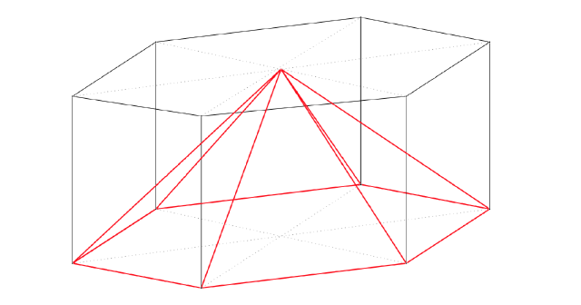
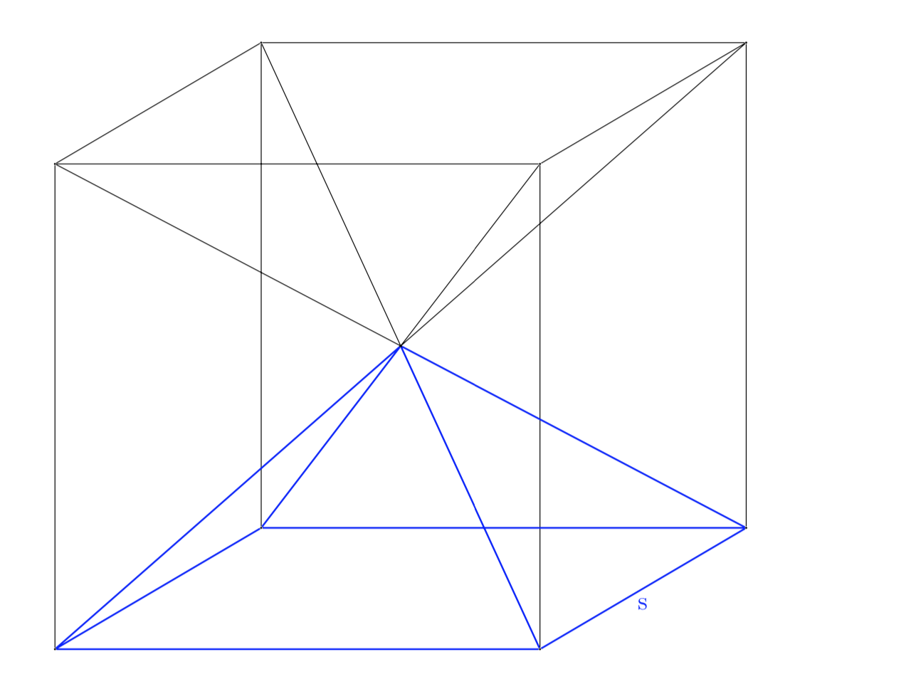
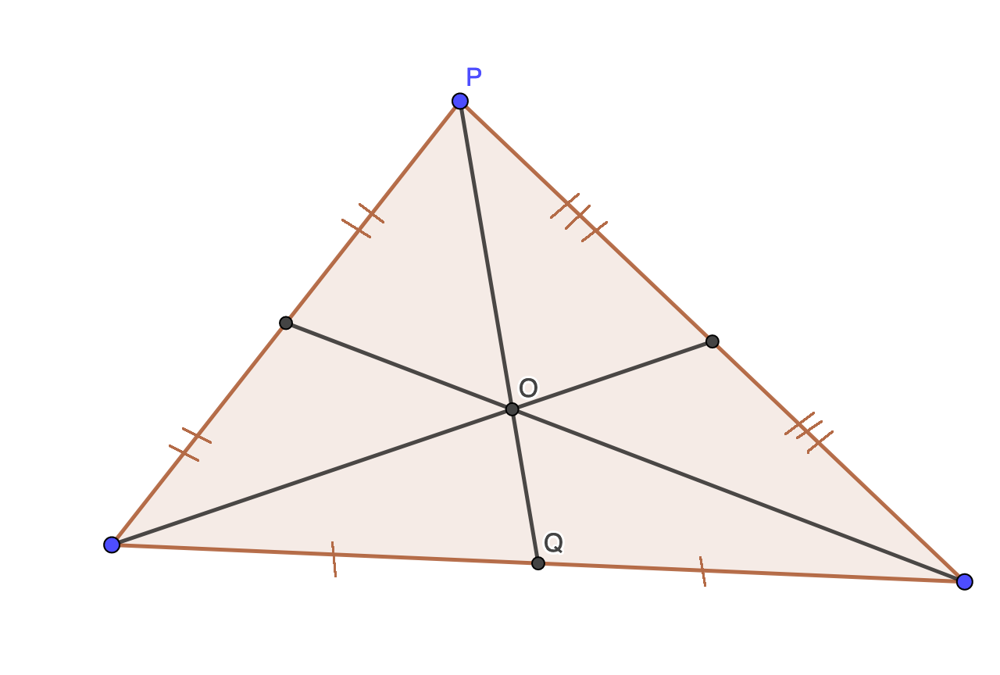
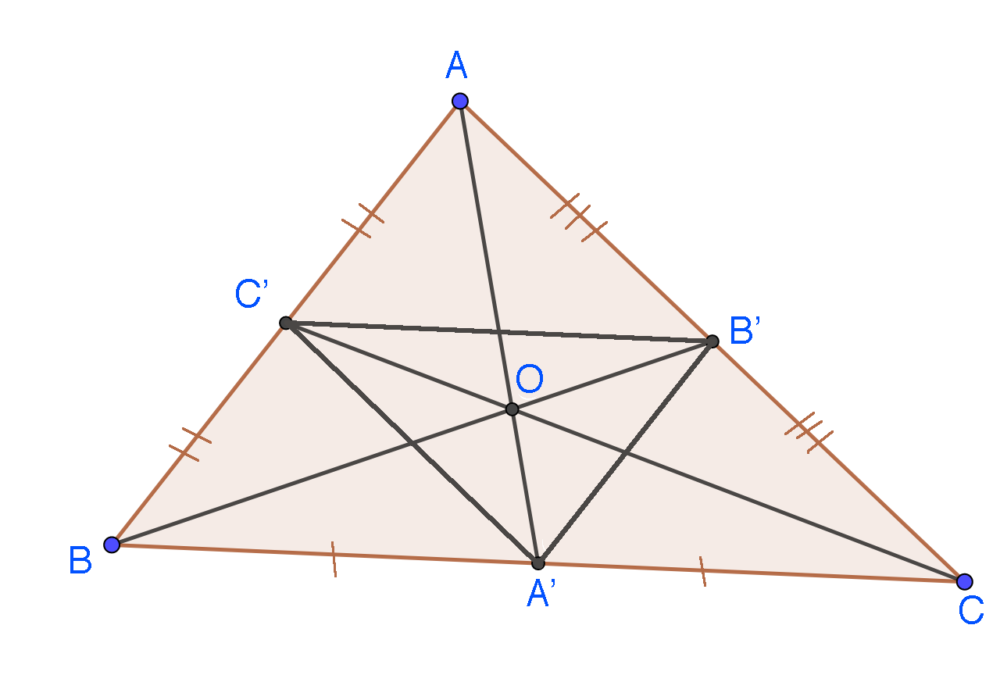
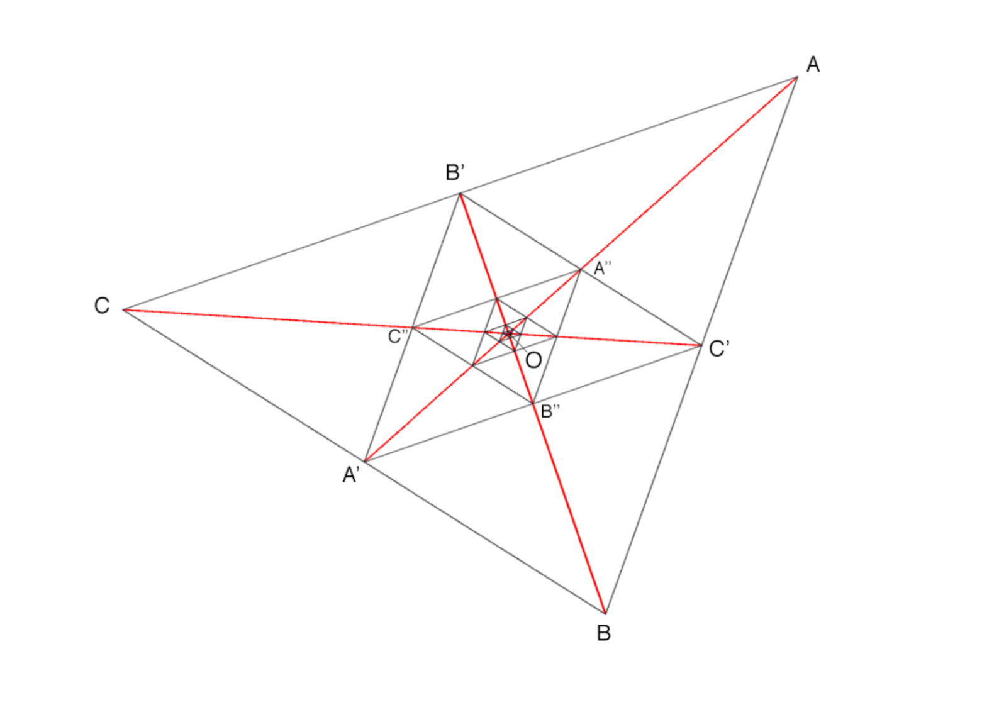
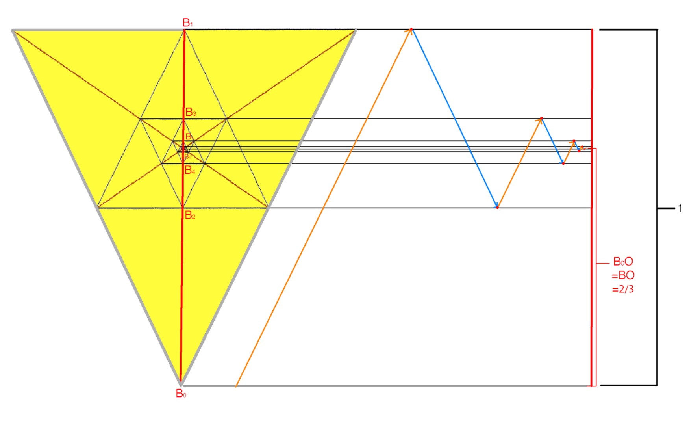

### **I. Why is the volume of any pyramid $V = \frac{1}{3}Bh$, where $B$ is the base area and $h$ is the height?**

In other words, why does a pyramid with an $n$-sided base take up
one third of the volume of an $n$-sided prism in which it is
inscribed?

  ---------------------------------------------------------------------------------------------------------------------------------------------------------------------------------------------------------------------------------------------------------------------------------------------------------------------------------------------------------------------------------------------------------------------------------------------------------------------------------------------------------------------------------------------------------------------------------------------------------------------------------------------------------------------
   
                                                                                                                                                                                                                                                             A hexagonal pyramid inscribed in a hexagonal prism. (Image made with TikZ, and helpfully pixelated by Blogger's image compression algorithm.)

Consider first a square pyramid with a base with sides of length
$s$ and a height of $s/2$. Using six such pyramids, it is
possible to construct a cube of side length $s$:

  ---------------------------------------------------------------------------------------------------------------------------------------------------------------------------------------------------------------------------------------------------------------------------------------------------------------------------------------------------------------------------------------------------------------------------------------------------------------------------------------------------------------------------------------------------------------------------------------------------------------------------------------------------------------------
   
                                                                                                                                                                                                                                                              If you don't see it: each face of the cube is the base of a pyramid, and the tips of all pyramids meet at the center. (Image made with TikZ)
  ---------------------------------------------------------------------------------------------------------------------------------------------------------------------------------------------------------------------------------------------------------------------------------------------------------------------------------------------------------------------------------------------------------------------------------------------------------------------------------------------------------------------------------------------------------------------------------------------------------------------------------------------------------------------

From this we see that six times the volume of this pyramid is the
cube's volume. The lower half of the cube is the rectangular prism in
which the pyramid outlined in blue is inscribed, and this rectangular
prism has 3 times the volume of the pyramid itself.

Alright, we've proved it for one specific case. But we don't want to
confine ourselves to square pyramids with a 1:2 ratio of (height) :
(base side length). If we stretch the pyramid, for instance into one
with a 1:3 (height) : (base side length) ratio, the cube would become a
rectangular prism and we can no longer assemble it from 6 of the same
pyramid; the same tactic does not work.

To show that the volume of any pyramid is one-third the volume of the
volume of the circumscribing prism in general, we will show that we can
apply transformations to our pyramid and prism that do not change the
ratio of their volumes while allowing us to transform the initial square
pyramid & cube into any pyramid and its prism.

The first transformation is stretching (vertically, horizontally,
whatever). The volume of the pyramid and the circumscribing rectangular
prism increase in the same proportion; therefore, the 1:3 ratio of
(pyramid volume) : (rectangular prism) volume still holds. This allows
us to generalize to all rectangular pyramids.

What if our base is not a rectangle? For this, we introduce a second
transformation we can apply: change the number of sides of both the
pyramid and the prism.

How? Consider splitting the pyramid-in-prism figure into a series of
slabs of a small height $dh$. If the base of the prism has area
$A$, then the volume of the prism contained in this small slab is
$A \times dh$. Say that the area of the pyramid when sliced at
this point is $A f(h)$, where $f(h)$ is the fraction of the
prism's base area that the pyramid takes up in a horizontal slice of
the prism-pyramid figure at a height $h$ (so $0 \leq f(h)
\leq 1$, with $f(h\_{max})$ at the maximum height
$h\_{max}$ of the pyramid being 0, since only the pyramid's tip
is on this slice, and $f(0) = 1$, since the base of the pyramid
entirely covers the base of the prism). Since $dh$ is as small as
we like, the slope of the pyramid's walls doesn't matter, and we can
say that the volume of the pyramid within the slab is $A f(h) dh$.
For each of the slabs that make up the prism, we change the shape of the
slab's face, and do likewise for the slabs of the pyramid.

There are many ways in which we can specify how to convert a slab to one
with a different number of sides. The details don't matter. All we need
to know is the factor, call it $g$, by which the area of a slice
of the pyramid grows when we switch out all the rectangles for hexagons
or whatever ($g$ does not vary with height above the base of the
pyramid; if it did, the sides of the pyramid would be curved instead of
straight).

Now here is the key part: if the slices of our pyramid grow $g$
times when we convert them from rectangles to, say, hexagons, the slices
of the prism must also grow by a factor $g$ (if they did not, the
base of the prism and pyramid would no longer be of the same size, and
the prism would not circumscribe the pyramid). The area of these slices
grows from $A$ to $g A$ while the pyramid slices grow from
$A f(h)$ to $g A f(h)$, and the volumes of each
infinitesimal slab are of course just these areas times $dh$. The
volume of the entire pyramid or prism is just a sum of the volumes of
these infinitesimal slabs, and thus changes in volume of both are
proportional to $g$, and thus the ratio of the volume of one to
the other does not change.

To sum up: we can see by looking that in our initial square pyramid
setup, the pyramid is inscribed in half the cube, and the volume of half
the cube is thrice that of the pyramid. We can stretch the pyramid and
its prism however we want while maintaining this ratio. Finally, we can
change the shape of the pyramid's base, and the circumscribing prism
will change shape in tandem, preserving the original ratio of volumes.

And *that* is why volume is one-third base times height for any
pyramid.

Alternatively, from the fact that the lines connecting the pyramid's
tip to the vertices of its base are straight, you can conclude that the
area of a slice of the pyramid grows with the square of the distance
from the tip as you move towards the base. Calling the base area
$B$, and noting that the entire volume must be proportional to the
height $h$, it follows that the volume is

$$B h \int_0^1 x^2 dx = \frac{Bh}{3},$$

which is the same result. However, we observe that the first proof,
though longer, is at least 20% cooler.

                                                                                                                                                                                                                                                                                                     (Image made in Geogebra, because TikZ was being uncooperative)

###  II. Why is the ratio of OP to OQ 2:1, regardless of how you move the points of the triangle?

Take any triangle with points $A$, $B$, and $C$, and
label the midpoints of the sides opposite each point $A'$,
$B'$, and $C'$. Draw lines $AA'$, $BB'$, and
$CC'$, and mark their intersection $O$. It turns out that
if we take any of these lines, say $AA'$, the distance from
$A$ to $O$ is twice the distance from $O$ to
$A'$ (see next image).

But wait -- do all three lines intersect even intersect in the same
point? It turns out that they do, and there is a neat way to show that
this is the case. Note that if we form a triangle from the midpoints of
the line segments of the original ($A'$, $B'$, and
$C'$), the new triangle $\bigtriangleup A'B'C'$ is
similar to our original $\bigtriangleup ABC$.

  ---------------------------------------------------------------------------------------------------------------------------------------------------------------------------------------------------------------------------------------------------------------------------------------------------------------------------------------------------------------------------------------------------------------------------------------------------------------------------------------------------------------------------------------------------------------------------------------------------------------------------------
   
                                                                                                                                                                                                                                                                                      (Image made by editing screenshot of the previous image)
  ---------------------------------------------------------------------------------------------------------------------------------------------------------------------------------------------------------------------------------------------------------------------------------------------------------------------------------------------------------------------------------------------------------------------------------------------------------------------------------------------------------------------------------------------------------------------------------------------------------------------------------

But why stop here? We can construct another similar triangle by taking
the midpoints of the line segments of $\bigtriangleup A'B'C'$,
call them $A''$, $B''$, and $C''$ in the same
way as before, and connecting them to get yet another similar triangle
$\bigtriangleup A''B''C''$. And so on, to infinity.

  ----------------------------------------------------------------------------------------------------------------------------------------------------------------------------------------------------------------------------------------------------------------------------------------------------------------------------------------------------------------------------------------------------------------------------------------------------------------------------------------------------------------------------------------------------------------------------------------------------------------------------------------------------------------------
   
                                                                                                                                              (Image made by editing the screenshot of the output of a Racket program running the 2htdp/image graphics library, which is actually meant as a companion for a programming textbook rather than an actual graphics drawing tool, but which I used nevertheless because it was the fastest way of having a program draw something for me without having to touch HTML Canvas.)
  ----------------------------------------------------------------------------------------------------------------------------------------------------------------------------------------------------------------------------------------------------------------------------------------------------------------------------------------------------------------------------------------------------------------------------------------------------------------------------------------------------------------------------------------------------------------------------------------------------------------------------------------------------------------------

Each triangle we construct fits within the previous one, while being
smaller in area (by a factor of $\frac{1}{4}$, because we can
tile $\bigtriangleup ABC$ with four of $\bigtriangleup
A'B'C'$; note that a decrease in area of a factor of 4 implies
each successive triangle is twice smaller than the previous). When we
construct $\bigtriangleup A'B'C'$, $O$ is inside the
triangle (this is true regardless of the starting triangle, but [a proof
is left as an exercise for the
reader](http://strataoftheworld.blogspot.com/2018/09/powerful-proof-techniques.html)).
But how do we know that, as we make successively smaller triangles, they
don't "drift" away from $O$ such that, some number of levels
down, $O$ is outside a triangle? Simple: if we take
$\bigtriangleup A'B'C'$, and scale it up while rotating it
just right, we can get $\bigtriangleup ABC$ again. And now
$\bigtriangleup A''B''C''$ is where $\bigtriangleup
A'B'C'$ was before, and since the situation is exactly analogous
to the original case, $O$ must still be inside the inner triangle.
Hence we can continue building triangles indefinitely, always assured
that $O$ will remain inside the smallest one, thus consigning
point $O$ to an area that we can make as close to a point as we
like.

Now we've proved that the lines intersect, and we've got this neat
recursive triangle diagram as a bonus. What we set out to prove was the
ratio of $AO$ to $OA'$ (which, by symmetry, is the same as
$BO$:$OB'$ and $CO$:$OC'$). Perhaps this
diagram will be of some help?

Let's consider one of the lines ($AA'$ is the obvious one to
pick, so just for fun we'll choose $BB'$ instead). We can
arbitrarily define the length $BB'$ to be 1. We don't know the
length of $BO$ or $OB'$ (if we did, we'd be done).
However, we can read off the length of $B'B''$ from the
diagram: the triangles $\bigtriangleup A'B'C'$ and
$\bigtriangleup BA'C'$ are both similar and of the same size,
so it follows that $B'B'' = BB''$. Since we defined the sum
of these lengths, $BB'$, to be 1, it follows that $B'B'' =
BB'' = \frac{1}{2}$.

The prime notation is getting confusing, so let's say $B$ is
$B_0$, $B'$ is $B_1$, $B''$ is $B_2$,
and so on.

Now imagine locating point $O$ as follows:

-   Starting at $B_0$, move all the way to $B_1$. We've
    moved a distance of 1.
-   Now we're at $B_1$, which is too far. We know the length
    $B_1 B_2$, so let's move backwards by that much (half a
    unit), to end up at $B_2$, a distance of $1 - 1/2 = 1/2$
    from our starting point at $B_0$.
-   We're not far enough, so move forwards again from $B_2$ to
    $B_3$, a distance of $\frac{1}{4}$. We end at
    $B_4$, $1 - 1/2 + 1/4 = 3/4$ths along the way from
    $B_0$ to $B_1$.
-   We keep moving back and forth by diminishing distances

      This image is supposed to make things clearer. However, there's a good chance it doesn't, in which case feel free to move on. Note that the triangle does not have to be isosceles, or have one side perpendicular to the $B_0$ to $B_1$ line for this to work -- these features are purely artistic. (Image made through a long process of scaling, rotating, and editing the previous image. As you might suspect by now, I'm still trying to figure out a good process for drawing diagrams.)
  ---------------------------------------------------------------------------------------------------------------------------------------------------------------------------------------------------------------------------------------------------------------------------------------------------------------------------------------------------------------------------------------------------------------------------------------------------------------------------------------------------------------------------------------------------------------------------------------------------------------------------------------------------------------------

Note that as $n$ increases, $B_n$ gets closer and closer to
$O$. If we follow this sequence of back and forth movements for
infinite time, we end up at $O$, and our distance from the
starting point at $B_0$ is $B_0 O$, exactly the distance we
wanted to find.

Luckily, we don't need to spend an infinite amount of time calculating
this distance, since the sequence of distances we move starts from 1 and
changes by a factor of $-\frac{1}{2}$ each time. The sum of a
geometric sequence with ratio $r = -\frac{1}{2}$ and starting
term $u_1 = 1$ is:

$$S\_{\infty} = \frac{u_1}{1 - r} =  \frac{1}{1-(-1/2)} =
\frac{2}{3}$$

Thus (in our system of measurement where $BB' = 1$), $BO =
2/3$, $OB' = 1 - 2/3 = 1/3$, and the ratio $OB'$ to
$OB$ is $1:2$, which is what we set out to prove. The same
reasoning applies to $AA'$ and $CC'$.
