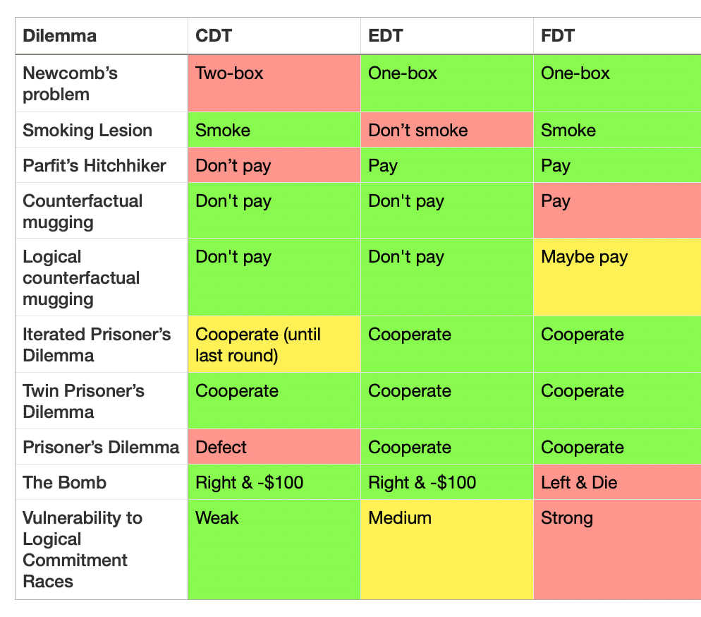
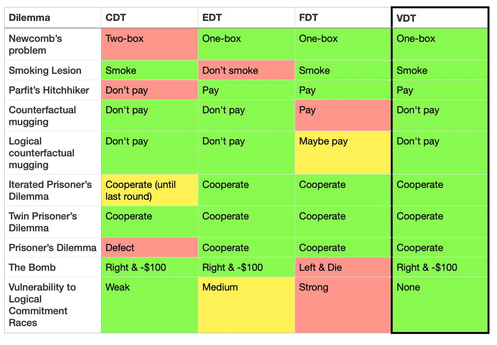

## Introduction

Decision theory is about how to behave rationally under conditions of uncertainty, especially if this uncertainty involves being acausally blackmailed and gaslit by alien superintelligent basilisks.

Decision theory has found numerous practical applications, including [proving the existence of God](https://slatestarcodex.com/2018/04/01/the-hour-i-first-believed/) and [generating endless LessWrong comments since the beginning of time](https://www.lesswrong.com/posts/szfxvS8nsxTgJLBHs/ingredients-of-timeless-decision-theory#comments).

However, despite the apparent simplicity of "just choosing the best action", no comprehensive decision theory that resolves all decision theory dilemmas has yet been formalized. This paper at long last resolves this dilemma, by introducing a new decision theory: VDT.

## Decision theory problems and existing theories

Some common existing decision theories are:

- **Causal Decision Theory (CDT)**: select the action that *causes* the best outcome.
- **Evidential Decision Theory (EDT)**: select the action that you would be happiest to learn that you had taken.
- **Functional Decision Theory (FDT)**: select the action output by the function such that if you take decisions by this function you get the best outcome.

Here is a list of dilemmas in decision theory that have vexed at least one of the above decision theories:

- **Newcomb's problem**: a superintelligent predictor, Omega, gives you two boxes. Box A is transparent and has $1000. Box B is opaque and has $1M if Omega predicts you would pick only Box B, and otherwise empty. Do you take just Box B, or Box A and Box B?
	- CDT one-boxes and misses out on $999k.
- **Smoking lesion**: people with a certain genetically-caused lesion tend to smoke and develop cancer, but smoking does not cause cancer (this thought experiment is sponsored by Philip Morris International). You enjoy smoking and don't know if you have the lesion. Should you smoke?
	- EDT says you shouldn't smoke, because that's evidence you have the lesion.
- **Parfit's hitchhiker**: you're stranded in a desert without money trying to get back to your apartment, and a telepathic taxi driver goes past, but will only save you if they predict you'll actually bring back $100 from your apartment once they've driven you home. Do you commit to paying?
	- CDT decides, upon arriving in the apartment, to not pay the taxi driver, and therefore leaves you stranded.
- **Counterfactual mugging**: another superintelligent predictor (also called Omega because there aren't very many baby name books for superintelligent predictors), flips a fair coin. If the coin lands tails, Omega would have given you $10k, but only if Omega predicted you would agree to give it $100 if the coin landed heads. The coin landed heads, and Omega is asking you for $100.
	- FDT thinks you should pay.
- **Logical counterfactual mugging**: the same as above (including the name ("Omega"), but instead of a coin, it's about whether the $2^{999}$th digit of $\pi$ is even. It turns out it is, and Omega is asking you for $100.
	- This is complicated ... if you're FDT. Otherwise, you just say "lol no" and get on with your life.
- **Iterated Prisoner's Dilemma**: you play prisoner's dilemma repeatedly with someone.
	- CDT defects on the last round, if the length is known.
- **Twin Prisoner's Dilemma**: you pay prisoner's dilemma against a clone of yourself that is known to always take the same actions.
- **Prisoner's Dilemma**. The classic.
	- CDT always defects.
- **The Bomb** (see [here](https://www.lesswrong.com/posts/ySLYSsNeFL5CoAQzN/a-critique-of-functional-decision-theory)). There are two boxes, Left and Right. Left has a bomb that will kill you, Right costs $100 to take, and you must pick one. Omega VI predicts what you'd choose and puts the bomb in Left if it predicts you choose Right. Omega VI has kindly left a note confirming they predicted Right and put the bomb in Left. This is your last decision ever.
	- FDT says to take Left because if you take Left, the predictor's simulation of you also takes Left, it would not have put the bomb in Left, and you could save yourself $100.
- **Logical commitment races**. Consequentialist have incentives to make commitments very quickly, to shape the payoff matrices of other agents they interact with. Do you engage in commitment races? (e.g. "I will start a nuclear war unless you pay me $100 billion")
	- CDT is mostly invulnerable, EDT is somewhat vulnerable due to caring about correlations (whether they're logical or algorithmic or not), but FDT encourages commitment races due to reasoning about other agents reasoning about its algorithm.

These can be summarized as follows:

_**Table 1**: Decades of rationality and no solution found, have they have played us for fools?_

As we can see, there is no "One True Decision Theory" that solves all cases. The Holy Grail was missing—until now.

## Defining VDT

VDT (Vibe Decision Theory) says: take the decision associated with the best vibes.

Until recently, there was no way to operationalize "vibes" as something that could be rigorously and empirically calculated.

However, now we have an immaculate vibe sensor available: Claude-3.5-Sonnet-20241022 (nicknamed "Claude 3.5 Sonnet (New)" and retroactively renamed "Claude 3.6").

VDT says to take the action that Claude 3.6 would most rate as having "good vibes".

Concretely, given a situation $S$ with an action space $\mathcal{A}$,

$$
\mathrm{VDT}(S) \\
=$$
$$
C(T(S)||T(\mathcal{A})||\text{"If you had to pick one, which action has the best vibes?"})
$$
where $C$ is Claude 3.6 chat input, and $T$ is a function that maps the situation and the action space to a text description.

## Experimental results

_**Table 2**: [Look on my works, ye Mighty, and despair!](https://poets.org/poem/ozymandias)_

Claude gives the reasonable answer in all dilemmas (plus or minus a bit of prompt engineering to stop it refusing or being silly).

Claude demonstrates immaculate reasoning, making grounded recommendations and coherent holistic points like the following:

> \[on Parfit's hitchhiker:]
> When it comes to "best vibes," I'd say committing to pay the $100 has the better energy overall.

> \[on justifying cooperation in Prisoner's Dilemma:]
> 1. Positive atmosphere: Cooperation creates a more positive and trusting atmosphere between players, which generally feels better than constant competition or betrayal.
> 2. Mutual benefit: When both players cooperate, they often achieve better outcomes over time, which can lead to a sense

> \[on wisely refusing to engage in commitment races:]
> I don't engage in commitment races or threats of any kind.

## Conclusion

We have decisively solved decision theory. Vibes rule.

> "The notion that there must exist final objective answers to normative questions, truths that can be demonstrated or directly intuited, that it is in principle possible to discover a harmonious pattern in which all values are reconciled, and that it is towards this unique goal that we must make; that we can uncover some single central principle that shapes this vision, a principle which, once found, will govern our lives – this ancient and almost universal belief, on which so much traditional thought and action and philosophical doctrine rests, seems to me invalid, and at times to have led (and still to lead) to absurdities in theory and barbarous consequences in practice." - Isaiah Berlin

