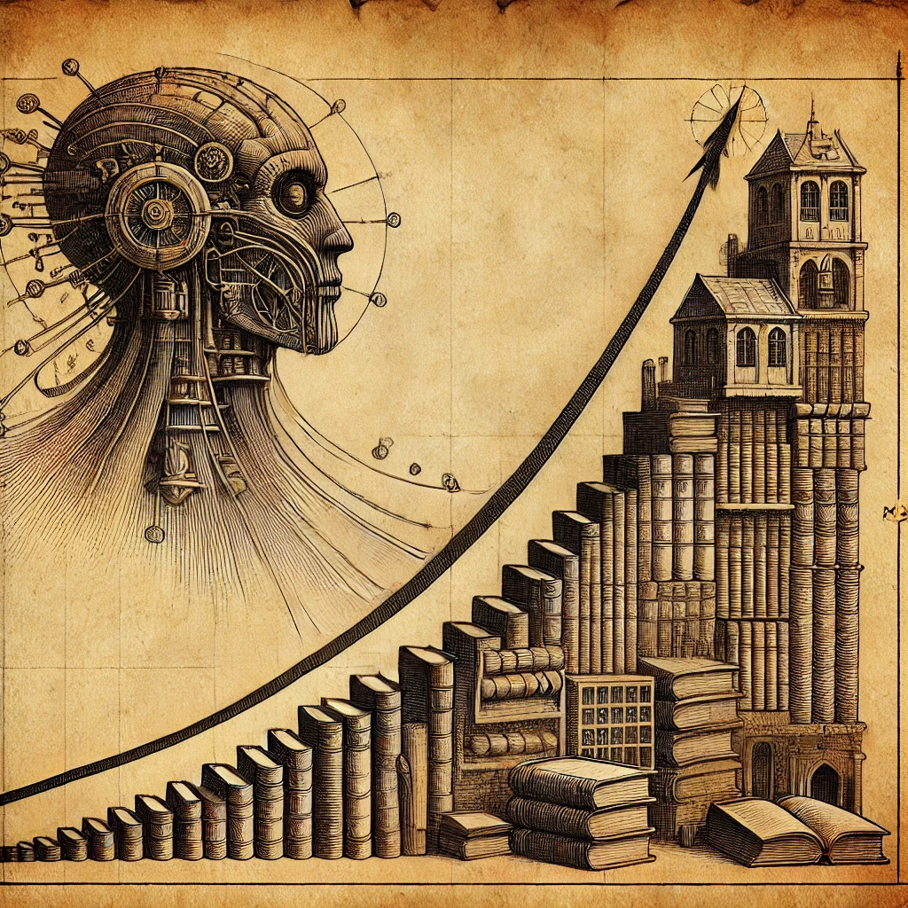
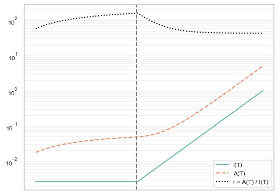
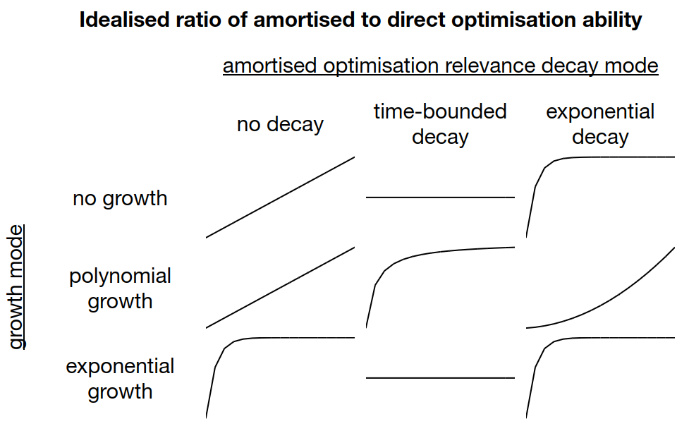

*Written for the [AI Impacts essay competition on the automation of wisdom and philosophy](https://blog.aiimpacts.org/p/essay-competition-on-the-automation)*

## Growth modes and direct v amortised optimisation

Amortised optimisation is more important when relevant histories are long and growth is slow. If growth suddenly picks up, the flexibility of optimising on the fly with direct optimisation becomes more important.

For example, the role of previously-accumulated wisdom went down after the industrial revolution. In the pre-industrial world, change was slow, and you would do well to follow cultural traditions, old books, and grandparents, all of whom have collected and distilled a large amount of useful knowledge. With faster technological progress, change accelerated, and on-the-fly intelligence became more important and culturally valued. Historically, it was the young who asked the old for advice; the situation of today, where parents ask children for tech advice, is unusual. Current developed-world culture places more weight on intelligence and less on wisdom than most past cultures.

If AI accelerates the rate of change and growth, both the importance of direct optimisation, and the cultural weighting of it, may get more extreme. This will happen regardless of what sort of optimisation the AI itself is doing.

*(The following has some maths - for the key takeaways, it's enough to look at the last figure, with the 3x3 grid of line graphs.)*

We can try to roughly model this. Let $I(T)$ represent the amount of "intelligence" - direct attempts at optimisation by actors in the world - at some time $T$. Historically, $I(T)$ has probably tracked population trends, though would also have effects from education, human capital, and productivity. Let $A(T)$ be the stock of results available for amortised optimisation - civilisation's total track record of accumulated knowledge, experience, and solutions. A simple relation would be that $A(T)$ is the sum of all prior direct optimisation - $A(T) = \int_0^T I(t) \mathrm{d}t$.

However, some knowledge becomes less relevant with time. We'll incorporate this by changing our model to $A(T) = \int_0^T I(t) f_T(t) \mathrm{d}t$, where $f_T(t)$ is a number between 0 and 1 measuring what fraction of the results $I(t)$ generated at time $t$ are still relevant at current time $T$. For example, here are some settings:
- no decay: $f_T(t) = 1$ (to recover the case where results of direct optimisation never become irrelevant)
- time-bounded: $f_T(t) = \mathbb{1}_{T - t < B}$ (that nothing from more than $B$ time ago is still relevant)
- exponential decay: $f_T(t) = e^{-D(T - t)}$ (exponentially-declining relevance with some constant $D$).

(In addition to someone somewhere doing direct optimisation, the random course of events can add to the stockpile of knowledge and results. This includes data about natural phenomenon, chance discoveries, and chance controlled trials. However, such things are likely either constant, or then increasing in proportion with more direct efforts - since the more attempted optimisation is going on in the world, the more interesting chance data there is to observe - so this should not change the fundamental dynamics, and we'll ignore this.)

Changes in the ratio $r = A(T) / I(T)$ will tell us something about whether direct or amortised optimisation is becoming more important. The higher $r$ is, the more cases there are where you're better off doing amortised optimisation that relies on civilisation's accumulated wisdom. The lower $r$ is, the better a bet direct optimisation is. (Note that specific values of the ratio $r$ don't mean anything; for example there's nothing special about $r=1$, all we care about are changes in $r$)

The graph below shows an example of how $r$ (dotted black) changes after $I(T)$ (green) switches from no growth to exponential growth, assuming the relevance of built-up optimisation results slowly but exponentially fades over time, with all units and scales arbitrary:

(note the log scale on the y-axis)

A similar effect is seen with many other settings, including switching from exponential growth to even faster exponential growth. Given constant, polynomial, or exponential growth modes, and any of the three different relevance decay settings above, almost all combinations result in $r$ settling to a constant:

**The order of $T$-terms in the ratio $r = A(T) / I(T)$ in the limit for different growth modes and decay modes:**
$$
\array{& \text{no decay} & \text{time-bounded} & \text{exponential decay} \\
\text{no growth} & \mathcal{O}(T) & \mathcal{O}(1) & \mathcal{O}(1) \\
\text{polynomial growth} & \mathcal{O}(T) & \mathcal{O}(1) & \mathcal{O}(T^n) \\
\text{exponential growth} & \mathcal{O}(1) & \mathcal{O}(1) & \mathcal{O}(1) \\
}
$$

**In more detail: the dominant term (and the order of any convergence speed term) in the $T \to \infty$ limit of $r = A(T)/I(T)$:
$$
\array{& \text{decay 1} & \text{decay } \mathbb{1}_{T-t<B} & \text{decay } e^{-D(T-t)} \\
\text{growth } C & T & B & \frac{1}{D} - \mathcal{O} \left(e^{-DT}\right) \\
\text{growth } t^n & \frac{T}{n+1} & \frac{B}{n+1} - \mathcal{O}\left(\frac{1}{T}\right) & \frac{T^n}{D} \\
\text{growth } e^{\lambda t} & \frac{1}{\lambda}  - \mathcal{O} \left(e^{-\lambda T} \right)& \frac{1}{\lambda} & \frac{1}{\lambda + D} - \mathcal{O} \left( e^{-(D+\lambda)T} \right) \\
}
$$

The only exceptions to the ratio settling to a constant are that we get polynomial growth in the ratio with a polynomial growth mode and exponential relevance decay, and linear growth in the ratio when there is no relevance decay in accumulated amortised results, and either a constant or polynomial growth mode.

 (Some of these results may be counter-intuitive. For polynomial growth + exponential decay, consider: the relevance decay weighting is essentially 0 for anything far enough back, and therefore in the limit as $T \to \infty$ we're mostly just weighting the recent value of the growth function. For the exponential growth results: remember that a key property of exponentials is that the past integral is proportional to current value. Hence exponential growth never allows amortised optimisation to dominate.)

Visually (the line going up mean amortised optimisation getting more important over time):

This means that in this vastly-simplified model, it's very hard for direct optimisation to make amortised optimisation irrelevant (there are no lines that go down). However, it also requires fairly specific conditions for amortised optimisation to dominate in the limit (most scenarios level off).

This may suggest that even with fairly radical AI-enabled growth, civilisation in general and AIs in particular will continue to rely on and build on the accumulating wisdom of civilisation (though the growth rate being higher will generally slightly increase the importance of direct optimisation to amortised optimisation). However, this mostly applies in the case of [slow or continuous takeoffs](https://takeoffspeeds.com/description.html), and in the limit - in the near-term aftermath of a very fast AI takeoff, the above model is less useful.

### But there is more than one actor in the world

However, we're making a crucial simplification above: we're treating both global direct and amortised optimisation as uniform blobs. Many actors will only have a small fraction of the compute available in society, but access to most amortised knowledge. For example, a given country only has so many people in it, but most fruits of amortised optimisation are probably available to it, since they're embodied in any leading tech, or observable in the actions of others. If all successful countries have a central bank, that's probably because countries kept finding they need to have one after analysing the options, and others can copy that innovation without either explicitly reasoning through the benefits, or going through a trial-and-error process. 

The ratio of the power of amortised to the direct optimisation *available to a given actor* at time $T$ is $A(T)/(fI(T))$, where $f$ is the fraction of the world's direct optimisation resources that the actor controls. If actors are equally-sized, this is $N(T)A(T)/I(T)$, where $N(T)$ is the number of such actors at a given time. If changes in direct optimisation power are mostly changes in the number of people, then $I(T)$ is proportional to $N(T)$ and for individuals this *ratio* is just $A(T)$. And this quantity is strictly increasing. This is one way to motivate, for example, why access to the stock of existing results (e.g. through education) is increasingly important for individuals over history.

At face value, this suggests that larger actors are better able to directly optimise for their goals, given that they control a greater fraction of global optimisation efforts. However, in practice large actors like government or large companies are especially ineffective at direct optimisation. Powerful novel thinking tends to come not from big bureaucracies, but instead it's individuals (e.g. scientists, writers) and small groups (e.g. startups) who tend to out-think the rest of society. This is likely due to the limitations of human coordination and communication bandwidth: you can put a hundred people in an org, but the bandwidth between different human minds is limited, so this does not actually assemble into a single thing with anything like the equivalent of the sum of its members' direct optimisation powers. In fact, we can imagine a lot of human organisational structure as small groups not burdened by membership in some large bureaucracy going around and doing novel thinking, creating things from America to Apple. The large population of new organisations fights for survival, and the selection processes in the world reward the best ones with growth. Growth comes with stasis and bureaucracy, and the once-fluid organisation cools into a rigid shape. Most of its function now is not to do further direct optimisation (at least in the space of organisational designs), but to propagate the results of the optimisation forces that went into it.

## How AI will change this

AI might not face such limitations in aggregating direct optimisation power; in fact, it seems reasonable to assume that the AIs with the most direct optimisation power may be creating the most novel results. In particular, this seems very hard to avoid if either train-time or inference-time compute scaling continue to be how AIs create more and more powerful optimised artefacts (to use the terminology of the previous post).

Therefore, it may be that with AIs, we shift from a world where large institutions are repositories of existing knowledge and small groups create the groundbreaking novel products, to one where the largest actors are responsible for breakthroughs. Right now, [scrappy](https://exa.ai/search) [startups](https://www.perplexity.ai/) are out-thinking the lumbering Google, because the most significant optimised artefacts in the world are created by humans, which are hard to stack at scale into effective, fast-moving organisations. But if the good ideas are snapped up by smarter-than-human AIs, and those AIs benefit vastly from scale, then a future Google might use its [massive TPU fleet](https://epochai.org/data/notable-ai-models#computing-capacity) to out-think the startups instead.

Of course, Google is constrained in its innovation by other things as well: a large set of competing stakeholders, having more downside risk due to its size, and so on. But some shift towards more of the out-thinking of the status quo being done by large organisations seems likely in a world where large AIs are the most powerful intelligences. Small groups, in such a world, might need to lean even more than they currently do on their other advantages, like being contrarian and willing to take risks.

### Out-thinking the world and takeoff speeds

Sometimes, if you're smart enough, you don't need to refer to precedent or accumulated wisdom. A maths prodigy might occasionally ignore textbooks and reinvent what they need on the fly. Startup founders sometimes get away with ignoring the lessons in a field and instead deriving them from scratch (and then benefiting from realising some dated assumption in the conventional wisdom).

Phrased differently, sufficient direct optimisation power on part of some actor can remove the reliance on amortised optimisation that others in the domain face. The archetypical fast-takeoff AI scenario is one where some AI has such stupendous direct optimisation abilities that it doesn't need to rely on civilisation's accumulated knowledge to cognitively crush everything that exists. Yudkowsky once made reference to the [very doubtful idea](https://www.lesswrong.com/posts/ALsuxpdqeTXwgEJeZ/could-a-superintelligence-deduce-general-relativity-from-a) that a superintelligence could very quickly guess general relativity from just seeing an apple fall - this would be an example of an intelligence that strongly out-thinks the world in the domain of physics.

However, there are several different levels of an entity out-thinking the rest of the world in some domain:

- Total dominance. Fictional example: Yudkowsky's overpowered physics superintelligence, mentioned above. Real-world example: [AlphaZero](https://en.wikipedia.org/wiki/AlphaZero), which required only 24 hours to surpass the total achievements of human civilisation in Go, without any reference to them.
- The majority of civilisation's progress in the domain is due to it, but (perhaps only due to comparative advantage) other efforts have some impact. For example, this might be the collective efforts of the Manhattan Project in nuclear science in 1944 and 1945.
- Narrow but reliable out-thinking. Imagine equally-sized armies repeatedly clashing, but one side has slightly better strategy, and therefore wins every time, or high-frequency trading companies with very similar strategies, but one always beats the other to the trades by a millisecond. This is different from the total out-thinking domain, because while the division of gains/accomplishments may be the same, the relative skill difference can be low.

There's also the question of how the optimised artefacts produced by the out-thinker feed into the rest of the world. If AIs start driving the majority of progress in science, but write science papers that are (at least) as legible as human scientists, that seems very possible for humanity to keep on top of and benefit from. But if the AI science looks more like [AlphaGo move 37](https://en.wikipedia.org/wiki/AlphaGo_versus_Lee_Sedol#Game_2), which we can analyse but have trouble fully understanding or replicating, or becomes something totally ineffable, the AI results may be harder for humans to take part in or make use of. Above we were modelling the effects of AI on the amortised/direct optimisation balance mainly through the change in growth rates, but not as feeding into a fundamentally different "stack" of progress. But if the AI stuff is sufficiently fast or weird, the better model might be to model human and AI amortised/direct optimisation differently. However, I don't expect this by default: AI progress so far is fairly continuous, and very much based on distilling human collective knowledge, and current AI seems good at creating human-legible outputs.